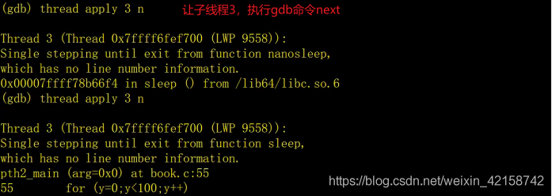
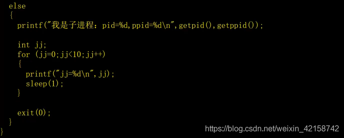

[TOC]


# GDB

## GDB多线程调试

(一)多线程调试命令
shell的命令：

(1)查看当前运行的进程：ps aux | grep book

(2)查看当前运行的轻量级进程：ps -aL | grep book

(3)查看主线程和子线程的关系：pstree -p 主线程id

 gdb的命令：

(1)查看可切换调试的线程：info threads

(2)切换调试的线程：thread 线程id

(3)只运行当前线程：set scheduler-locking on

(4)运行全部的线程：set scheduler-locking off

(5)指定某线程执行某gdb命令：thread apply 线程id gdb_cmd

(6)全部的线程执行某gdb命令：thread apply all gdb_cmd

(二)多线程调试演示
以调试book.c为例，内容如下：

```
#include <stdio.h>
#include <unistd.h>
#include <pthread.h>

int x=0,y=0;


pthread_t pthid1,pthid2;


void *pth1_main(void *arg)
{
for(x=0;x<100;x++)
{
printf("x=%d\n",x);
sleep(1);
}
pthread_exit(NULL);
}


void *pth2_main(void *args)
{
for(y=0;y<100;y++)
{
printf("y=%d\n",y);
sleep(1);
}
pthread_exit(NULL);
}

int main()
{
if(pthread_create(&pthid1, NULL, pth1_main,(void*)0)!=0)
{
printf("pthread_create pthid1 failed.\n");
return -1;
}

if(pthread_create(&pthid2, NULL, pth2_main,(void*)0)!=0)
{
printf("pthread_create pthid2 failed.\n");
return -1;
}

printf("111\n");
pthread_join(pthid1,NULL);
printf("222\n");
pthread_join(pthid2, NULL);

printf("333\n");
return 0;

}

```


编译，生成可执行文件

$ gcc -g -o book book.c -lpthread

开始调试命令

$ gdb book


1.查看/切换调试的线程
开始调试


2.只运行当前线程


3.指定某线程执行gdb命令





## GDB多进程调试

(一)多线程调试命令
(1)调试父进程：set follow-fork-mode parent （缺省值，即默认）

(2)调试子进程：set follow-fork-mode child

(3)设置调试模式：set detach-on-fork [on | off] （缺省值on）

on：调试当前进程的时候，其它的进程继续运行。

off：调试当前进程的时候，其它的进程被gbd挂起。

(4)查看可调试的进程：info inferiors

(5)切换调试的进程：inferior 进程id

(二)多线程调试演示
以调试book.c为例，内容如下：




编译，生成可执行文件

$ gcc -g -o book book.c

开始调试命令

$ gdb book


1.调试父进程（缺省）
开始调试


2.调试子进程
开始调试


3.查看/切换调试的进程
开始调试


