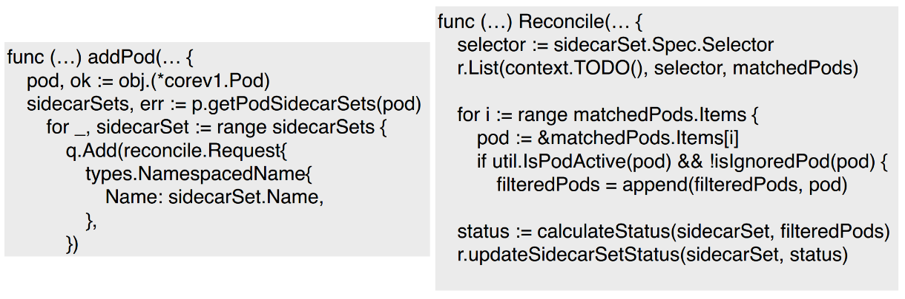
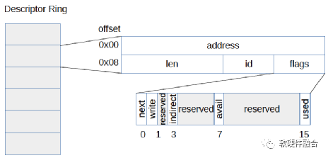

<div style="color:#16b0ff;font-size:50px;font-weight: 900;text-shadow: 5px 5px 10px var(--theme-color);font-family: 'Comic Sans MS';">Cloud</div>

<span style="color:#16b0ff;font-size:20px;font-weight: 900;font-family: 'Comic Sans MS';">Introduction</span>：收纳技术相关的 云原生相关技术和 总结！

[TOC]

# 容器

## 容器底层技术

### cfgroup：实现资源限额

通过cgroup设置进程使用CPU、内存和IO资源的限额。我们可以在`/sys/fs/cgroup/cpu/docker`下查看。

我们都知道容器是通过cgroup技术来限制资源的使用的，cgroup定义了很多的子系统，常用的用于限制资源的有以下的几个：

cpu子系统，主要限制进程的CPU使用率。

cpuset 子系统，可以为 cgroup 中的进程分配单独的CPU节点或者内存节点。

memory 子系统，可以限制进程的 Memory 使用量。

blkio 子系统，可以限制进程的块设备IO。

net_cls 子系统，可以标记 cgroup 中进程的网络数据包，然后可以使用 TC模块（Traffic Control）对数据包进行控制。

其中对于CPU和内存的cgroup的限制可通过下面的图对应。


### namespace：实现资源隔离

mount namespace：让容器看上去拥有整个文件系统，容器有自己的/目录，可以执行mount和umount操作。
UTS namespace：让容器拥有自己的hostname，默认情况下hostname是短id
IPC namespace：让容器拥有自己的共享内存和信号量来实现进程通信，而不会与host的其他容器的ipc混在一起
PID namespace：容器在host上是以进程的形式进行的。可以通过ps axf来查看容器进程。可以看到所有容器进程都是挂载在dockerd进程下，同时也可以看到容器自己的子进程。当我们进入到某一个容器中，可以看到它自己的进程。容器里进程的pid不同于host中进程的pid，也就是说容器有自己的一套独立的pid。
network namespace：让容器拥有独立的网卡、ip、路由等配置。
user namespace：让容器能够管理自己的用户，host不能看到容器中创建的用户。即你在容器中创建了一个用户，在host上是查询不到的。

### containerd

containerd 的架构图如图


其中，grpc 模块向上层提供服务接口，metrics 则提供监控数据(cgroup 相关数据)，两者均向上层提供服务。containerd 包含一个守护进程，该进程通过本地 UNIX 套接字暴露 grpc 接口。

storage 部分负责镜像的存储、管理、拉取等 metadata 管理容器及镜像的元数据，通过bootio存储在磁盘上 task -- 管理容器的逻辑结构，与 low-level 交互 event -- 对容器操作的事件，上层通过订阅可以知道发生了什么事情 Runtimes -- low-level runtime（对接 runc）

containerd 主要流程如下：


图中的 containerEngine 在 docker 中就是 docker-containerd 组件，创建容器记录的metadata，并请求 containerd 的 task 模块，task 模块会在 runtime 中创建 task 实例，分别会加入 task list， 监控 cgroup 等操作，每个 task 实例则调用 shim 去创建container。

### containerd-shim

containerd-shim 是 containerd 的一个组件，主要是用于剥离 containerd 守护进程与容器进程。containerd 通过 shim 调用 runc 的包函数来启动容器。当我们执行 `pstree` 命令时，可以看到如下的进程关系：


引入shim，允许runc 在创建和运行容器之后退出，并将 shim 作为容器的父进程，而不是 containerd 作为父进程，这样做的目的是当 containerd 进程挂掉，由于 shim 还正常运行，因此可以保证容器不受影响。

此外，shim 也可以收集和报告容器的退出状态，不需要 containerd 来 wait 容器进程。

当我们有需求去替换 runc 运行时工具库时，例如替换为安全容器 kata container 或 Google 研发的 gViser，则需要增加对应的shim(kata-shim等)，以上两者均有自己实现的 shim。

## 容器/Docker

### 计算

容器运行时顾名思义就是要掌控容器运行的整个生命周期，以 docker 为例，其作为一个整体的系统，主要提供的功能如下：

- 制定容器镜像格式
- 构建容器镜像 `docker build`
- 管理容器镜像 `docker images`
- 管理容器实例 `docker ps`
- 运行容器 `docker run`
- 实现容器镜像共享 `docker pull/push`

然而这些功能均可由小的组件单独实现，且没有相互依赖。而后 Docker 公司与 CoreOS 和 Google 共同创建了 OCI (Open Container Initial)，并提供了两种规范：

- 运行时规范([https://github.com/opencontainers/runtime-spec](https://link.zhihu.com/?target=https%3A//github.com/opencontainers/runtime-spec))
  描述如何运行`filesystem bundle`
- 镜像规范([https://github.com/opencontainers/image-spec](https://link.zhihu.com/?target=https%3A//github.com/opencontainers/image-spec))
  制定镜像格式、操作等

> filesystem bundle(文件系统束): 定义了一种将容器编码为文件系统束的格式，即以某种方式组织的一组文件，并包含所有符合要求的运行时对其执行所有标准操作的必要数据和元数据，即config.json 与 根文件系统。

而后，Docker、Google等开源了用于运行容器的工具和库 runc，作为 OCI 的一种实现参考。在此之后，各种运行时工具和库也慢慢出现，例如 rkt、containerd、cri-o 等，然而这些工具所拥有的功能却不尽相同，有的只有运行容器(runc、lxc)，而有的除此之外也可以对镜像进行管理(containerd、cri-o)

容器运行时engine是一个守护进程，位于容器调度和容器创建的二进制文件的实际实现之间。这个守护进程不一定需要作为根用户运行，它监听来自调度程序的请求。它通过容器标准（OCI），使用外部二进制文件来实际创建或删除容器

例如，在Kubernetes中，容器运行时可以是cri-o或cri-containerd，它监听来自kubelet的请求，kubelet是通过cri接口从位于每个节点的调度程序发出的代理，容器运行时通过OCI标准方式，包括OCI-Image和OCI-Runtime，调用runc（实现OCI运行时规范的二进制文件，或者如：kata-runtime）来创建容器，调用flannel（实现CNI的二进制文件，或者如：calico等）来配置网络。上述过程,

容器运行时需要执行以下操作才能真正创建可用的容器：

- 创建rootfs文件系统。
- 创建容器（在命名空间中独立运行并受cgroups限制的进程集）。
- 将容器连接到网络。
- 启动用户进程。


如下图：

[


就网络部分而言，最重要的是容器运行时要求OCI运行时二进制文件将容器进程放入新的网络命名空间（Net namespace）。然后容器运行时将使用新的网络名称空间作为运行时环境变量调用CNI插件。CNI插件应该拥有所有的信息，以便实现网络配置。


k8s调用containerd结构


### 网络

Docker的网络部分是支持插件，默认带了几个插件驱动。

- bridge: 默认网络驱动，通过linux bridge桥接容器网络。

- host: 容器和host共用网络

- container模式:与另外一个容器共享网络

- overlay: 容器数据发送给一个网关，由上层打通网关网络。主流跨host容器通信技术。vxlan,gre等实现跨host通信。

- ipvlan: 允许用户完全控制IP地址，L2 tagging和 L3路由。

- macvlan:允许用户指定MAC地址给容器，这样容器可以直接接入物理网络。

- none:禁用网络

- 第三方网络插件：由第三方提供网络驱动。

  

#### bridge 模式

相当于Vmware中的Nat模式，容器使用独立network Namespace，并连接到docker0虚拟网卡（默认模式）。通过docker0网桥以及Iptables nat表配置与宿主机通信；bridge模式是Docker默认的网络设置，此模式会为每一个容器分配Network Namespace、设置IP等，并将一个主机上的Docker容器连接到一个虚拟网桥上。下面着重介绍一下此模式


#### host 模式

众所周知，Docker使用了Linux的Namespaces技术来进行资源隔离，如PID Namespace隔离进程，Mount Namespace隔离文件系统，Network Namespace隔离网络等。

一个Network Namespace提供了一份独立的网络环境，包括网卡、路由、Iptable规则等都与其他的Network Namespace隔离。一个Docker容器一般会分配一个独立的Network Namespace。但如果启动容器的时候使用host模式，那么这个容器将不会获得一个独立的Network Namespace，而是和宿主机共用一个Network Namespace。容器将不会虚拟出自己的网卡，配置自己的IP等，而是使用宿主机的IP和端口。


#### container模式

在理解了host模式后，这个模式也就好理解了。这个模式指定新创建的容器和已经存在的一个容器共享一个Network Namespace，而不是和宿主机共享。新创建的容器不会创建自己的网卡，配置自己的IP，而是和一个指定的容器共享IP、端口范围等。同样，两个容器除了网络方面，其他的如文件系统、进程列表等还是隔离的。两个容器的进程可以通过lo网卡设备通信。


#### overlay

内置跨主机的网络通信一直是Docker备受期待的功能，在1.9版本之前，社区中就已经有许多第三方的工具或方法尝试解决这个问题，例如Macvlan、Pipework、Flannel、Weave等。

虽然这些方案在实现细节上存在很多差异，但其思路无非分为两种： 二层VLAN网络和Overlay网络

简单来说，二层VLAN网络解决跨主机通信的思路是把原先的网络架构改造为互通的大二层网络，通过特定网络设备直接路由，实现容器点到点的之间通信。这种方案在传输效率上比Overlay网络占优，然而它也存在一些固有的问题。

这种方法需要二层网络设备支持，通用性和灵活性不如后者。

由于通常交换机可用的VLAN数量都在4000个左右，这会对容器集群规模造成限制，远远不能满足公有云或大型私有云的部署需求； 大型数据中心部署VLAN，会导致任何一个VLAN的广播数据会在整个数据中心内泛滥，大量消耗网络带宽，带来维护的困难。

相比之下，Overlay网络是指在不改变现有网络基础设施的前提下，通过某种约定通信协议，把二层报文封装在IP报文之上的新的数据格式。这样不但能够充分利用成熟的IP路由协议进程数据分发；而且在Overlay技术中采用扩展的隔离标识位数，能够突破VLAN的4000数量限制支持高达16M的用户，并在必要时可将广播流量转化为组播流量，避免广播数据泛滥。

因此，Overlay网络实际上是目前最主流的容器跨节点数据传输和路由方案。

容器在两个跨主机进行通信的时候，是使用overlay network这个网络模式进行通信；如果使用host也可以实现跨主机进行通信，直接使用这个物理的ip地址就可以进行通信。overlay它会虚拟出一个网络比如10.0.2.3这个ip地址。在这个overlay网络模式里面，有一个类似于服务网关的地址，然后把这个包转发到物理服务器这个地址，最终通过路由和交换，到达另一个服务器的ip地址。

[


要实现overlay网络，我们会有一个服务发现。比如说consul，会定义一个ip地址池，比如10.0.2.0/24之类的。上面会有容器，容器的ip地址会从上面去获取。获取完了后，会通过ens33来进行通信，这样就实现跨主机的通信。

[

#### ipvlan

**Ipvlan L2模式**

和macvlan原理类似，参考下边的介绍。唯一区别macvlan每一个容器mac地址不同，Ipvlan L2模式MAC地址相同。


**Ipvlan L3 模式**

驱动负责创建容器网络，各个network的子网不相同，并挂载容器端点到容器网路，但是不会创建网络之间的路由。需要手动在host上创建各个网络路由，不同network才能通信。


```
 docker network  create  -d ipvlan \
    --subnet=192.168.214.0/24 \
    --subnet=10.1.214.0/24 \
     -o ipvlan_mode=l3 ipnet210
     
 docker run --net=ipnet210 --ip=192.168.214.10 -itd alpine /bin/sh
 docker run --net=ipnet210 --ip=10.1.214.10 -itd alpine /bin/sh
```


> **IPVLAN和MAC VLAN区别**
>
> ***VLAN***
>
> *VLAN 技术主要就是在二层数据包的包头加上tag 标签，表示当前数据包归属的vlan 号。VLAN的主要优点: (1)广播域被限制在一个VLAN内,节省了带宽,提高了网络处理能力。 (2)增强局域网的安全性:VLAN间不能直接通信,即一个VLAN内的用户不能和其它VLAN内的用户直接通信,而需要通过路由器或三层交换机等三层设备。 (3)灵活构建虚拟工作组:用VLAN可以划分不同的用户到不同的工作组,同一工作组的用户也不必局限于某一固定的物理范围,网络构建和维护更方便灵活。*
>
> ***MACVLAN***
>
> *MACVLAN ， IPVLAN 名字和VLAN 相近，但是机制有很大不同。*
>
> *MACVLAN技术是一种将一块以太网卡虚拟成多块以太网卡的极简单的方案。一块以太网卡需要有一个MAC地址，这就是以太网卡的核心中的核心。*
>
>    *以往，我们只能为一块以太网卡添加多个IP地址，却不能添加多个MAC地址，因为MAC地址正是通过其全球唯一性来标识一块以太网卡的，即便你使用了创建ethx:y这样的方式，你会发现所有这些“网卡”的MAC地址和ethx都是一样的，本质上，它们还是一块网卡，这将限制你做很多二层的操作。有了MACVLAN技术，你可以这么做了。*
>
> 
>
> ***IPVLAN***
>
> *ipvlan类似于macvlan，区别在于端点具有相同的mac地址。 ipvlan支持L2和L3模式。 在ipvlan l2模式下，每个端点获得相同的mac地址但不同的ip地址。 在ipvlan l3模式下，数据包在端点之间路由，因此这提供了更好的可伸缩性。*
>
> *ipvlan 有两种不同的模式：L2 和 L3。一个父接口只能选择一种模式，依附于它的所有虚拟接口都运行在这个模式下，不能混用模式。*
>
> ***L2 模式***
>
> *ipvlan L2 模式和 macvlan bridge 模式工作原理很相似，父接口作为交换机来转发子接口的数据。同一个网络的子接口可以通过父接口来转发数据，而如果想发送到其他网络，报文则会通过父接口的路由转发出去。*
>
> ***L3 模式***
>
> *L3 模式下，ipvlan 有点像路由器的功能，它在各个虚拟网络和主机网络之间进行不同网络报文的路由转发工作。只要父接口相同，即使虚拟机/容器不在同一个网络，也可以互相 ping 通对方，因为 ipvlan 会在中间做报文的转发工作。*
>
> 
>
> *IPVLAN和MACVLAN的区别在于它在IP层进行流量分离而不是基于MAC地址，因此，你可以看到，同属于一块宿主以太网卡的所有IPVLAN虚拟网卡的MAC地址都是一样的，因为宿主以太网卡根本不是用MAC地址来分流IPVLAN虚拟网卡的流量的。*
>
> 
>
> *ipvlan 和 macvlan 两个虚拟网络模型提供的功能，看起来差距并不大，那么什么时候需要用到 ipvlan 呢？要回答这个问题，我们先来看看 macvlan 存在的不足：*
>
> - *需要大量 mac 地址。每个虚拟接口都有自己的 mac 地址，而网络接口和交换机支持的 mac 地址有支持的上限*
>
> - 无法和 802.11(wireless) 网络一起工作
>
>   
>
>   对应的，如果你遇到一下的情况，请考虑使用 ipvlan：
>
> - *父接口对 mac 地址数目有限制，或者在 mac 地址过多的情况下会造成严重的性能损失*
> - 工作在无线网络中
> - 希望搭建比较复杂的网络拓扑（不是简单的二层网络和 VLAN），比如要和 BGP 网络一起工作

#### macvlan

**1, macvlan 桥接模式**

Macvlan Bridge模式每个容器都有唯一的MAC地址，用于跟踪Docker主机的MAC到端口映射。 Macvlan驱动程序网络连接到父Docker主机接口。示例是物理接口，例如eth0，用于802.1q VLAN标记的子接口eth0.10（.10代表VLAN 10）或甚至绑定的主机适配器，将两个以太网接口捆绑为单个逻辑接口。 指定的网关由网络基础设施提供的主机外部。 每个Macvlan Bridge模式的Docker网络彼此隔离，一次只能有一个网络连接到父节点。每个主机适配器有一个理论限制，每个主机适配器可以连接一个Docker网络。 同一子网内的任何容器都可以与没有网关的同一网络中的任何其他容器进行通信macvlan bridge。 相同的docker network命令适用于vlan驱动程序。 在Macvlan模式下，在两个网络/子网之间没有外部进程路由的情况下，单独网络上的容器无法互相访问。这也适用于同一码头网络内的多个子网。

在以下示例中，eth0在docker主机网络上具有IP地址172.16.86.0/24，默认网关为172.16.86.1，网关地址为外部路由器172.16.86.1。


注意对于Macvlan桥接模式，子网值需要与Docker主机的NIC的接口相匹配。例如，使用由该-o parent=选项指定的Docker主机以太网接口的相同子网和网关。

此示例中使用的父接口位于eth0子网上172.16.86.0/24，这些容器中的容器docker network也需要和父级同一个子网-o parent=。网关是网络上的外部路由器，不是任何ip伪装或任何其他本地代理。

驱动程序用-d driver_name选项指定，在这种情况下-d macvlan。

创建macvlan网络并运行附加的几个容器：

```
# Macvlan  (-o macvlan_mode= Defaults to Bridge mode if not specified)
docker network create -d macvlan \
    --subnet=172.16.86.0/24 \
    --gateway=172.16.86.1  \
    -o parent=eth0 pub_net
 
# Run a container on the new network specifying the --ip address.
docker  run --net=pub_net --ip=172.16.86.10 -itd alpine /bin/sh
 
# Start a second container and ping the first
docker  run --net=pub_net -it --rm alpine /bin/sh
ping -c 4 172.16.86.10
```


**2， Macvlan 802.1q Trunk Bridge模式示例用法**

VLAN（虚拟局域网）长期以来一直是虚拟化数据中心网络的主要手段，目前仍在几乎所有现有的网络中隔离广播的主要手段。

常用的VLAN划分方式是通过端口进行划分，尽管这种划分VLAN的方式设置比较很简单，但仅适用于终端设备物理位置比较固定的组网环境。随着移动办公的普及，终端设备可能不再通过固定端口接入交换机，这就会增加网络管理的工作量。比如，一个用户可能本次接入交换机的端口1，而下一次接入交换机的端口2，由于端口1和端口2属于不同的VLAN，若用户想要接入原来的VLAN中，网管就必须重新对交换机进行配置。显然，这种划分方式不适合那些需要频繁改变拓扑结构的网络。而MAC VLAN可以有效解决这个问题，它根据终端设备的MAC地址来划分VLAN。这样，即使用户改变了接入端口，也仍然处在原VLAN中。

Mac vlan不是以交换机端口来划分vlan。因此，一个交换机端口可以接受来自多个mac地址的数据。一个交换机端口要处理多个vlan的数据，则要设置trunk模式。

在主机上同时运行多个虚拟网络的要求是非常常见的。Linux网络长期以来一直支持VLAN标记，也称为标准802.1q，用于维护网络之间的数据路由隔离。连接到Docker主机的以太网链路可以配置为支持802.1q VLAN ID，方法是创建Linux子接口，每个子接口专用于唯一的VLAN ID。


创建Macvlan网络

VLAN ID 10

```
$ docker network create --driver macvlan --subnet=10.10.0.0/24 --gateway=10.10.0.253 -o parent=eth0.10 macvlan10
```

开启一个桥接Macvlan的容器：

```
$ docker run --net=macvlan10 -it --name macvlan_test1 --rm alpine /bin/sh
$ docker run --net=macvlan10 -it --name macvlan_test2 --rm alpine /bin/sh
$ docker run --net=macvlan10 -it --name macvlan_test3 --ip=10.10.0.189 --rm alpine /bin/sh
```

两个容器之间相互ping，是可以ping通的。

VLAN ID 20

接着可以创建由Docker主机标记和隔离的第二个VLAN网络，该macvlan_mode默认是macvlan_mode=bridge，如下：

```
$ docker network create --driver macvlan --subnet=192.10.0.0/24 --gateway=192.10.0.253 -o parent=eth0.20 -o macvlan_mode=bridge macvlan20
```

#### none

该模式将容器放置在它自己的网络栈中，但是并不进行任何配置。实际上，该模式关闭了容器的网络功能，在以下两种情况下是有用的：容器并不需要网络（例如只需要写磁盘卷的批处理任务）。

#### 第三方插件

如Pipework、Flannel、Weave登录，详细参考K8s网络插件。


### 存储

**Docker存储之Storage Driver和Data Volume**

在使用 Docker 的过程中，势必需要查看容器内应用产生的数据，或

者需要将容器内数据进行备份，甚至多个容器之间进行数据共享，这就必然

会涉及到容器的**数据管理**

Docker 为容器提供了两种存放数据的资源：

A、由 **Storage Driver** 管理的镜像层和容器层

B、**Data Volume**


**1、无状态容器**

直接将数据放在由 Storage Driver 维护的层中是很好的选择，

无状态意味着容器没有需要持久化的数据，随时可从镜像直接创建

例如： busybox，是一个工具箱，启动 busybox 是为执行诸如 wget，ping 之类命令，不需要保存数据供以后使用，使用完直接退出，容器删除时存放在容器层中的工作数据也一起被删除，下次再启动新容器即可

**2、有状态容器**

有持久化数据的需求，容器启动时需要加载已有的数据，容器销毁时希望保留产生的新数据

这时需要使用，Docker 另一种存储机制：Data Volume


数据层（镜像层和容器层）和 volume 都可以用来存放数据，应如何选择？

A、Database 软件  vs   Database 数据

B、Web 应用       vs   应用产生的日志

C、数据分析软件   vs   input/output 数据

D、Apache Server  vs   静态 HTML 文件

前者放在数据层，因为这部分内容是无状态的，应该作为镜像的一部分

后者放在 Data Volume ，这是需要持久化的数据，并且应该与镜像分开存放


#### Storage Driver

容器 = 1个最上层的可写容器层 + N干只读镜像层组成

容器的数据 就存放在这些层中

分层结构的特性是 Copy-on-Write：

A、新数据 直接存放在最上层的容器层

B、修改现有数据 先从镜像层将数据复制到容器层，修改后的数据 直接保存在容器层，镜像层保持不变

C、如果N个层中有命名相同的文件，用户只能看到最上面那层中的文件

 

Docker Storage Driver 实现了多层数据的堆叠并为用户提供一个单一的合并之后的统一视图

Docker 支持多种 Storage Driver，有 AUFS、Device Mapper、Btrfs、OverlayFS、VFS 和 ZFS 它们都能实现分层的架构，同时又有各自的特性


#### Data Volume

Data Volume 是 Docker Host 文件系统中的目录或文件，能够直接被 mount 到容器的文件系统中

Data Volume 有以下特点：

A、Data Volume 是目录或文件，不是没有格式化的磁盘(块设备)

B、容器可读写 volume 中的数据

C、volume 数据可被永久保存，即使使用它的容器已经销毁


#### volume 关键特性--数据共享

**1、容器与 host 共享数据**

两种类型的 data volume，可在容器与 host 之间共享数据

A、bind mount 方式：

直接将要共享的目录 mount 到容器

B、docker managed volume 方式：

volume 位于 host 中的目录，是容器启动时生成的，需将共享数据拷到 volume 中


**(1)  容器和 host 之间拷贝数据**

docker  cp  ~/htdocs/index.html  c03f4ae8f062:/usr/local/apache2/htdocs

curl  127.0.0.1:80


**(2)  Linux 的 cp 命令复制**

ll  /var/lib/docker/volumes/xxx


**2、容器之间共享数据**

**方法1：**

将共享数据放在 bind mount 中，然后将其 mount 到多个容器

docker  run  --name web0  -d  -p 8080:80  -v ~/htdocs:/usr/local/apache2/htdocs  httpd

docker  run  --name web1  -d  -p 8081:80  -v ~/htdocs:/usr/local/apache2/htdocs  httpd

docker  run  --name web2  -d  -p 8082:80  -v ~/htdocs:/usr/local/apache2/htdocs  httpd


**方法2**

使用 volume container

volume container 是专门为其他容器提供 volume 的容器。它提供的卷可以是 bind mount，也可以是 docker managed volume


创建1个volume container

docker  create  --name=vc-data  -v  ~/htdocs:/usr/local/apache2/htdocs  -v  /other/useful/tools  busybox


3个容器共享

docker  run  --name web3  -d  -p 8083:80  --volumes-from  vc-data  httpd

docker  run  --name web4  -d  -p 8084:80  --volumes-from  vc-data  httpd

docker  run  --name web5  -d  -p 8085:80  --volumes-from  vc-data  httpd


***volume container 的特点：***

A、与 bind mount 相比，无需为每一个容器指定 host path，所有 path 都在 volume container 中定义好了，容器只需与 volume container 关联，容器与 host 是解耦的

B、使用 volume container 的容器其 mount point 是一致的，有利于配置的规范和标准化，同时也带来一定的局限，使用时需要综合考虑

C、volume container 的数据归根到底还是在 host 里


**方法3：**

使用data-packed volume container

将数据完全放到 volume container 中，同时又能与其他容器共享

容器 data-packed volume container 原理：

将数据打包到镜像中，然后通过 docker managed volume 共享

实例演示：

**A、编辑Dockfile 构建镜像**

```
FROM busybox
#MAINTAINER
MAINTAINER zola
#ENV
#ADD
ADD  htdocs  /usr/local/apache2/htdocs
VOLUME  /usr/local/apache2/htdocs
#RUN
#WORKDIR
#EXPOSE
#CMD
```

文件解析：

ADD 将静态文件添加到容器目录 /usr/local/apache2/htdocs

VOLUME 的作用与 -v 等效，用来创建 docker managed volume，mount point 为 /usr/local/apache2/htdocs，因为这个目录就是 ADD 添加的目录，所以会将已有数据拷贝到 volume 中

**B、build 新镜像 datapacked**

docker  build  -t  datapacked  .

列出各个层（layer）的创建信息:

docker history  datapacked

**C、用新镜像 datapacked 创建 data-packed volume container**

docker  create  --name  vc_data  datapacked

**\*应用场景：\***

data-packed volume container 是自包含的，不依赖 host 提供数据，具有很强的移植性，非常适合 只使用 静态数据的场景，比如应用的配置信息、web server 的静态文件等


#### 自定义docker volume driver

一、  背景介绍

  为了满足扩展性需求，Docker （1.7 及以后版本）提供了插件支持

 用户能够根据自己的需要编写自定义插件来增强 Docker 的功能

  一般而言，各类插件与 docker daemon 守护进程的交互原理都是一样的

  为了减轻开发者负担，docker 官方提供了 go-plugins-helpers 基础工具包

  借助该工具包，我们只需关注实际的业务逻辑，按照接口规范（需要实现哪些方法）编写插件实体即可

二、  开发步骤

2.1    环境准备

          操作系统：ubuntu 16.04 LTS
    
          Go：1.9.2
    
          Docker：1.12.6

2.2    在 $GOPATH/src 目录下新建一个文件夹，如 docker-volume-plugin-example

2.3    在 $GOPATH/src/docker-volume-plugin-example 目录下创建 driver.go 源文件

```go
package main

import (
	"os"
	"path/filepath"
	"sync"
	"errors"
	"strings"

	"github.com/Sirupsen/logrus"
	"github.com/docker/go-plugins-helpers/volume"

)

type ExampleDriver struct {
	volumes    map[string]string
	mutex      *sync.Mutex
	mountPoint string
}

func NewExampleDriver(mount string) volume.Driver {
	var d = ExampleDriver{
		volumes:    make(map[string]string),
		mutex:      &sync.Mutex{},
		mountPoint: mount,
	}
	

	filepath.Walk(mount, func(path string, f os.FileInfo, err error) error {
	            if ( f == nil ) {return err}
		if (strings.Compare(path,mount) == 0){ return nil}
	            if f.IsDir() {d.volumes[f.Name()] = path}
	            return nil
	    })
	
	return d

}

func (d ExampleDriver) Create(r *volume.CreateRequest) error {
	logrus.Infof("Create volume: %s", r.Name)
	d.mutex.Lock()
	defer d.mutex.Unlock()

	if _, ok := d.volumes[r.Name]; ok {
		return nil
	}
	
	volumePath := filepath.Join(d.mountPoint, r.Name)
	
	os.MkdirAll(volumePath, os.ModePerm)
	
	_, err := os.Lstat(volumePath)
	if err != nil {
		logrus.Errorf("Error %s %v", volumePath, err.Error())
		return err
	}
	
	d.volumes[r.Name] = volumePath
	
	return nil

}

func (d ExampleDriver) List() (*volume.ListResponse,error) {
	logrus.Info("Volumes list... ")
	logrus.Info(d.volumes)

	var res = &volume.ListResponse{}
	
	volumes := make([]*volume.Volume,0)
	
	for name, path := range d.volumes {
		volumes = append(volumes, &volume.Volume{
			Name:       name,
			Mountpoint: path,
		})
	}
	
	res.Volumes = volumes
	return res, nil

}

func (d ExampleDriver) Get(r *volume.GetRequest) (*volume.GetResponse,error) {
	logrus.Infof("Get volume: %s", r.Name)
	

	var res = &volume.GetResponse{}
	
	if path, ok := d.volumes[r.Name]; ok {
		res.Volume = &volume.Volume{
			Name:       r.Name,
			Mountpoint: path,
		}
		return res, nil
	}
	return &volume.GetResponse{}, errors.New(r.Name + " not exists")

}

func (d ExampleDriver) Remove(r *volume.RemoveRequest) error {
	logrus.Info("Remove volume ", r.Name)

	d.mutex.Lock()
	defer d.mutex.Unlock()
	
	if _, ok := d.volumes[r.Name]; ok {
		os.RemoveAll(filepath.Join(d.mountPoint, r.Name))
		delete(d.volumes, r.Name)
		return nil
	}
	
	return errors.New(r.Name + " not exists")

}

func (d ExampleDriver) Path(r *volume.PathRequest) (*volume.PathResponse,error) {
	logrus.Info("Get volume path ", r.Name)

	var res = &volume.PathResponse{}
	
	if path, ok := d.volumes[r.Name]; ok {
		res.Mountpoint = path
		return res,nil
	}
	return &volume.PathResponse{},errors.New(r.Name + " not exists")

}

func (d ExampleDriver) Mount(r *volume.MountRequest) (*volume.MountResponse,error) {
	logrus.Info("Mount volume ", r.Name)

	var res = &volume.MountResponse{}
	
	if path, ok := d.volumes[r.Name]; ok {
		res.Mountpoint = path
		return res,nil
	}
	
	return &volume.MountResponse{},errors.New(r.Name + " not exists")

}

func (d ExampleDriver) Unmount(r *volume.UnmountRequest) error {
	logrus.Info("Unmount ", r.Name)
	if _, ok := d.volumes[r.Name]; ok {
		return nil
	}
	return errors.New(r.Name + " not exists")
}

func (d ExampleDriver) Capabilities() *volume.CapabilitiesResponse {
	logrus.Info("Capabilities. ")
	return &volume.CapabilitiesResponse{}
}
```

2.4    在 $GOPATH/src/docker-volume-plugin-example 目录下创建 main.go 源文件

```go
package main

import (
	"log"

	"github.com/docker/go-plugins-helpers/volume"

)

func main() {
	driver := NewExampleDriver("/tmp/example-volume-mount-root")
	handler := volume.NewHandler(driver)
	if err := handler.ServeUnix("example-driver",0); err != nil {
		log.Fatalf("Error %v", err)
	}

	for {
	
	}

}
```

2.5    编译插件源码

```
# cd $GOPATH/src/docker-volume-plugin-example

# go build
```

2.6    启动插件

```
# cd $GOPATH/src/docker-volume-plugin-example

# ./docker-volume-plugin-example
```

2.7    测试插件
```
docker run -it -v c1:/data --volume-driver=example-driver ubuntu:14.04 /bin/bash
```

   执行该命令后，插件会自动在 /tmp/example-volume-mount-root 目录下创建一个名称为 c1 的文件夹，并挂载到容器中（映射为 /data 路径）  

代码地址【https://github.com/SataQiu/docker-volume-plugin】


# K8S

## 基础


Kubernetes主要由以下几个核心组件组成：

- etcd保存了整个集群的状态；
- apiserver提供了资源操作的唯一入口，并提供认证、授权、访问控制、API注册和发现等机制；
- controller manager负责维护集群的状态，比如故障检测、自动扩展、滚动更新等；
- scheduler负责资源的调度，按照预定的调度策略将Pod调度到相应的机器上；
- kubelet负责维持容器的生命周期，同时也负责Volume（CVI）和网络（CNI）的管理；
- Container runtime负责镜像管理以及Pod和容器的真正运行（CRI）；
- kube-proxy负责为Service提供cluster内部的服务发现和负载均衡；

除了核心组件，还有一些推荐的Add-ons：

- kube-dns负责为整个集群提供DNS服务
- Ingress Controller为服务提供外网入口
- Heapster提供资源监控
- Dashboard提供GUI
- Federation提供跨可用区的集群
- Fluentd-elasticsearch提供集群日志采集、存储与查询

### 高可用部署


#### etcd使用外部集群


#### etcd集群使用master自身


### Kubelet启动流程

参考[Kubelet启动流程](./refs/kubelet.md)

###  三种网络层级


- 节点网络：所有主机自身所处的网络（Master、Node、ETCD）
- Pod网络：（常用flannel插件实现）
  1. 是虚拟网络（在创建集群时指定）
  2. 用于为各个Pod对象设定IP地址，即为PodIP！！！！！！
  3. 配置于Pod内部的容器的网络接口上
  4. 需要借助kubelet插件或CNI插件实现
  5. 插件可部署在集群之外，也可托管于集群之上
- Service网络：由集群指定
  1. 是虚拟网络（在创建集群时指定）
     注意：创建集群时指定Service网络，创建Service对象时动态分配Service地址，即为ClusterIP！！！！！
  2. 用于为集群中的Service对象设定IP地址
  3. 此地址并不会配置于任何接口之上，而是通过Node上的kube-proxy配置为iptables或ipvs规则，
     从而将发往此地址的流量调度到后端各个Pod之上

### K8S Service和Ingress

service是pod的一个逻辑分组，是pod服务的对外入口抽象。service同样也通过pod的标签来选择pod，与控制器一致。


service提供pod的负载均衡的能力，但是只提供4层负载均衡的能力，而没有7层功能，只能到ip层面。

#### service的几种类型

- ClusterIP： 默认类型，自动分配一个仅可在内部访问的虚拟IP。应用方式：内部服务访问

```yaml
apiVersion: v1
kind: Service
metadata:
  name: service-clusterip
  namespace: test
spec:
  type: ClusterIP
  selector:
    # 选择app=nginx标签的pod
    app: nginx
  ports:
    - protocol: TCP
      # service对外提供的端口
      port: 80
      # 代理的容器的端口 
      targetPort: 80
```


```shell
[root@ master ~]# kubectl get  svc -n test
NAME                TYPE           CLUSTER-IP      EXTERNAL-IP   PORT(S)        AGE
service-clusterip   ClusterIP      172.21.5.140    <none>        80/TCP         3m
```

- NodePort：在ClusterIP的基础之上，为集群内的每台物理机绑定一个端口，外网通过`任意节点的物理机IP:端口`来访问服务。应用方式：外服访问服务


```yaml
apiVersion: v1
kind: Service
metadata:
  name: service-nodeport
  namespace: test
spec:
  type: NodePort
  selector:
    app: nginx
  ports:
    - protocol: TCP
      # service对外提供的端口
      port: 80
      # 代理的容器的端口 
      targetPort: 80
      # 在物理机上开辟的端口，从30000开始
      nodePort: 32138
```


```shell
[root@ master ~]# kubectl get  svc -n test
NAME                TYPE           CLUSTER-IP      EXTERNAL-IP   PORT(S)        AGE
service-nodeport    NodePort       172.21.12.122   <none>        80:32138/TCP   4m
```

- LoadBalance：在NodePort基础之上，提供外部负载均衡器与外网统一IP，此IP可以将请求转发到对应服务上。这个是各个云厂商提供的服务。应用方式：外服访问服务


```yaml
apiVersion: v1
kind: Service
metadata:
  name: loadbalance-test
spec:
  ports:
  - name: loadbalance-port
    #service对外提供的端口
    port: 80
    # 代理的容器的端口 
    targetPort: 80
    # 在物理机上开辟的端口，从30000开始
    nodePort: 32138
  selector:
    app: nginx
  type: LoadBalancer
status:
  loadBalancer:
    ingress:
    - ip:  云厂商LoadbalanceIP
```


```shell
[root@ master ~]# kubectl get  svc -n test
NAME                TYPE           CLUSTER-IP      EXTERNAL-IP   PORT(S)        AGE
loadbalance-test    LoadBalancer   172.21.10.152   LoadbalanceIP 80:32138/TCP   4m
```

- ExternalName: 引入集群外服的服务，可以在集群内部通过别名方式访问（通过 serviceName.namespaceName.svc.cluster.local访问）


```yaml
apiVersion: v1
kind: Service
metadata:
  name: service-ext
  namespace: test
spec:
  type: ExternalName
  # 引入外部服务
  externalName: baidu.com
```


```shell
[root@ master ~]# kubectl get  svc -n test
NAME                TYPE           CLUSTER-IP      EXTERNAL-IP   PORT(S)        AGE
service-ext         ExternalName   <none>          baidu.com     <none>         2m
```

任意找个pod来访问服务，通过`kubectl exec -it podname sh` 来对pod执行sh命令，这样可以进入容器内部


```shell
[root@ master ~]# kubectl exec -it deploy-test-67ccb67d99-2l5wx sh -n test
# ping service-ext.test.svc.cluster.local
PING baidu.com (39.156.69.79): 56 data bytes
64 bytes from 39.156.69.79: icmp_seq=0 ttl=48 time=39.853 ms
64 bytes from 39.156.69.79: icmp_seq=1 ttl=48 time=39.835 ms
^C--- baidu.com ping statistics ---
2 packets transmitted, 2 packets received, 0% packet loss
round-trip min/avg/max/stddev = 39.835/39.844/39.853/0.000 ms
```

#### ingress是干嘛的？

前面聊过，service只能提供4层负载均衡的能力，虽然service可以通过NodePort的方式来服务，但是随着服务的增多，会在物理机上开辟太多端口，管理起来混乱。

那么我们换一种思路来暴露服务，创建一个具有N个副本的nginx服务，在nginx服务内配置各个服务的域名与集群内部的服务的IP，这些nginx服务再通过NodePort的方式来暴露。外部服务通过`域名:Nginx NodePort端口`来访问nginx，nginx再通过域名反向代理到真实服务。

上面的这个流程就是ingress做的事，ingress分为ingress controller与ingress配置。ingress controller是反向代理服务器，对外通过NodePort（或者其他方式）来暴露，ingress配置是抽象出来的域名代理配置。


服务请求流程

#### 一个简单的ingress配置


```yaml
apiVersion: extensions/v1beta1
kind: Ingress
metadata:
  name: ingress-test
  namespace: test
spec:
  rules:
  - host: my.ingress.com
    http:
      paths:
      - path:
        backend:
          serviceName: service-clusterip
          servicePort: 80
```

#### Ingress  controller的暴露方式

如果采用NodePort的方式，存在Ingress  controller单点问题，需要在外层再定义一个HPA，由HPA负载均衡各个Ingress  controller节点，域名再解析到HPA的IP。

除了上面的方式，还可以把ingress controller通过LoadBalance方式暴露，LoadBalance在上文中提到过，是service的一种类型，云厂商提供唯一的外网访问IP，域名解析到LoadBalance的IP上。

### 扩展应用

通过修改Deployment中副本的数量（replicas），可以动态扩展或收缩应用：

```
$ kubectl scale --replicas=3 deployment/nginx-app
```

自动扩展

```yaml
apiVersion: autoscaling/v1
kind: HorizontalPodAutoscaler
metadata:
  name: php-apache
  namespace: default
spec:
  scaleTargetRef:
    apiVersion: apps/v1
    kind: Deployment
    name: php-apache
  minReplicas: 1
  maxReplicas: 10
  targetCPUUtilizationPercentage: 50
```

### StatefulSet

**1、介绍**
RC、Deployment、DaemonSet都是面向无状态的服务，它们所管理的Pod的IP、名字，启停顺序等都是随机的，而StatefulSet是什么？顾名思义，有状态的集合，管理所有有状态的服务，比如MySQL、MongoDB集群等。
StatefulSet本质上是Deployment的一种变体，在v1.9版本中已成为GA版本，它为了解决有状态服务的问题，它所管理的Pod拥有固定的Pod名称，启停顺序，在StatefulSet中，Pod名字称为网络标识(hostname)，还必须要用到共享存储。
在Deployment中，与之对应的服务是service，而在StatefulSet中与之对应的headless service，headless service，即无头服务，与service的区别就是它没有Cluster IP，解析它的名称时将返回该Headless Service对应的全部Pod的Endpoint列表。
除此之外，StatefulSet在Headless Service的基础上又为StatefulSet控制的每个Pod副本创建了一个DNS域名，这个域名的格式为：
$(podname).(headless server name)
FQDN：$(podname).(headless server name).namespace.svc.cluster.local

**2、特点**
Pod一致性：包含次序（启动、停止次序）、网络一致性。此一致性与Pod相关，与被调度到哪个node节点无关；
稳定的次序：对于N个副本的StatefulSet，每个Pod都在[0，N)的范围内分配一个数字序号，且是唯一的；
稳定的网络：Pod的hostname模式为( s t a t e f u l s e t 名 称 ) − (statefulset名称)-(statefulset名称)−(序号)；
稳定的存储：通过VolumeClaimTemplate为每个Pod创建一个PV。删除、减少副本，不会删除相关的卷。

**3、组成部分**
Headless Service：用来定义Pod网络标识( DNS domain)；
volumeClaimTemplates ：存储卷申请模板，创建PVC，指定pvc名称大小，将自动创建pvc，且pvc必须由存储类供应；
StatefulSet ：定义具体应用，名为Nginx，有三个Pod副本，并为每个Pod定义了一个域名部署statefulset。

为什么需要 headless service 无头服务？
在用Deployment时，每一个Pod名称是没有顺序的，是随机字符串，因此是Pod名称是无序的，但是在statefulset中要求必须是有序 ，每一个pod不能被随意取代，pod重建后pod名称还是一样的。而pod IP是变化的，所以是以Pod名称来识别。pod名称是pod唯一性的标识符，必须持久稳定有效。这时候要用到无头服务，它可以给每个Pod一个唯一的名称 。

为什么需要volumeClaimTemplate？
对于有状态的副本集都会用到持久存储，对于分布式系统来讲，它的最大特点是数据是不一样的，所以各个节点不能使用同一存储卷，每个节点有自已的专用存储，但是如果在Deployment中的Pod template里定义的存储卷，是所有副本集共用一个存储卷，数据是相同的，因为是基于模板来的 ，而statefulset中每个Pod都要自已的专有存储卷，所以statefulset的存储卷就不能再用Pod模板来创建了，于是statefulSet使用volumeClaimTemplate，称为卷申请模板，它会为每个Pod生成不同的pvc，并绑定pv，从而实现各pod有专用存储。这就是为什么要用volumeClaimTemplate的原因。

**4、StatefulSet详解**
kubectl explain sts.spec ：主要字段解释
replicas ：副本数
selector：那个pod是由自己管理的
serviceName：必须关联到一个无头服务商
template：定义pod模板（其中定义关联那个存储卷）
volumeClaimTemplates ：生成PVC

```yaml
cat << EOF > nginx-ns.yaml
apiVersion: v1
kind: Namespace
metadata:
  name: nginx-ss
EOF

cat << EOF > nginx-sc.yaml
apiVersion: storage.k8s.io/v1
kind: StorageClass
metadata:
  name: nginx-nfs-storage
provisioner: fuseim.pri/ifs # or choose another name, must match deployment's env PROVISIONER_NAME'
parameters:
  archiveOnDelete: "false" # # When set to "false" your PVs will not be archived
                           # by the provisioner upon deletion of the PVC.
EOF

cat << EOF > nginx-ss.yaml
apiVersion: apps/v1
kind: StatefulSet
metadata:
  name: web
  namespace: nginx-ss
spec:
  selector:
    matchLabels:
      app: nginx #必须匹配 .spec.template.metadata.labels
  serviceName: "nginx"  #声明它属于哪个Headless Service.
  replicas: 3 #副本数
  template:
    metadata:
      labels:
        app: nginx # 必须配置 .spec.selector.matchLabels
    spec:
      terminationGracePeriodSeconds: 10
      containers:
      - name: nginx
        image: www.my.com/web/nginx:v1
        ports:
        - containerPort: 80
          name: web
        volumeMounts:
        - name: nginx-pvc
          mountPath: /usr/share/nginx/html

  volumeClaimTemplates:   #可看作pvc的模板
  - metadata:
      name: nginx-pvc
    spec:
      accessModes: [ "ReadWriteOnce" ]
      storageClassName: "nginx-nfs-storage"  #存储类名，改为集群中已存在的
      resources:
        requests:
          storage: 1Gi
EOF

cat << EOF > nginx-svc.yaml
apiVersion: v1
kind: Service
metadata:
  name: nginx
  namespace: nginx-ss
  labels:
    app: nginx
spec:
  ports:
  - port: 80
    name: web
  clusterIP: None
  selector:
    app: nginx
EOF

```

扩容缩容

```
kubectl scale sts web --replicas=4 -n nginx-ss   #扩容
kubectl scale sts web --replicas=2 -n nginx-ss   #缩容
```

或者

```
kubectl patch sts web -p '{"spec":{"replicas":4}}' -n nginx-ss  #扩容
kubectl patch sts web -p '{"spec":{"replicas":2}}' -n nginx-ss  #缩容
```

### 滚动升级

对于多实例服务，滚动更新采用对各个实例逐批次进行单独更新而非同一时刻对所有实例进行全部更新，来达到不中断服务的更新升级方式。

对于Kubernetes集群来说，一个service可能有多个pod，滚动升级（Rolling update）就是指每次更新部分Pod，而不是在同一时刻将该Service下面的所有Pod shutdown，然后去更新（例如replace --force方案），逐个更新可以避免将业务中断，

**关键代码**
在spec项中增加几个参数

    spec:
      minReadySeconds: 5
      strategy:
        type: RollingUpdate
        rollingUpdate:
          maxSurge: 1
          maxUnavailable: 1

**字段解释**
**minReadySeconds**
Kubernetes在等待设置的时间后才进行升级
如果没有设置该值，Kubernetes会假设该容器启动起来后就提供服务了，所以这个可以设置的保守一些，比如我们的服务启动从3-20秒不等，我可以设置成30秒，这样防止pod启动了但是服务还没准备好导致系统不可用。

**maxSurge**
升级过程中最多可以比原先设置多出的POD数量
例如：maxSurage=1，replicas=5,则表示Kubernetes会先启动1一个新的Pod后才删掉一个旧的POD，整个升级过程中最多会有5+1个POD。

**maxUnavaible**
升级过程中最多有多少个POD处于无法提供服务的状态，当maxSurge不为0时，该值也不能为0，最好和maxSurge保持一致。
例如：maxUnavaible=1，则表示Kubernetes整个升级过程中最多会有1个POD处于无法服务的状态，可以保证有足够的pod（或者认为是足够的性能）提供服务。

**示例**

```yaml
apiVersion: apps/v1
kind: Deployment
metadata:
  name: dev-api
  labels:
    name: dev-api
spec:
  replicas: 2
  minReadySeconds: 5
  strategy:
    type: RollingUpdate
    rollingUpdate:
      maxSurge: 1
      maxUnavailable: 1
  selector:
    matchLabels:
      name: dev-api
  template:
    metadata:
      labels:
       name: dev-api
    spec:
      containers:
      - name: dev-api
        image: vinterhe/n-p-xh:1.1
        imagePullPolicy: Never
        ports:
        - containerPort: 80
        command: ["/bin/sh","-c"]
        args:
          - |
            rm -f /etc/nginx/sites-enabled/default.conf
            chmod -R 777 /data/
            php-fpm -y /usr/local/etc/php-fpm.d/www.conf -D
            /usr/sbin/nginx -g 'daemon off;'
```

滚动升级（Rolling Update）通过逐个容器替代升级的方式来实现无中断的服务升级：

```
kubectl patch deployment update-deployment \
--patch '{"spec": {"template": {"spec": {"containers": [{"name": "nginx","image":"registry.cn-beijing.aliyuncs.com/mrvolleyball/nginx:v2"}]}}}}' \
&& kubectl rollout pause deployment update-deployment

kubectl rollout resume deployment update-deployment
```

在滚动升级的过程中，如果发现了失败或者配置错误，还可以随时回滚：

```
kubectl rolling-update frontend-v1 frontend-v2 --rollback
```

**Deployment经典常用场景**

1.创建一个Deployment对象来生成对应的Replica Set并完成Pod副本的创建过程

2.检查Deployment的状态来看部署动作是否完成(Pod副本的数量是否达到预期的值)

3.通过更新Deployment的PodTemplateSpec字段来声明Pod的新状态。这会创建一个新的ReplicaSet，Deployment会按照控制的速率将pod从旧的ReplicaSet移动到新的ReplicaSet中。更新Deployment以创建新的Pod (比如镜像升级)

4.如果当前状态不稳定，回滚到之前的Deployment revision。每次回滚都会更新Deployment的revision。

5.暂停Deployment以便于一次性修改多个PodTemplateSpec的配置项,之后再恢复Deployment,进行新的发布

6.扩展Deployment以应对高负载

7.查看Deployment的状态，判断上线是否hang住了,以此作为发布是否成功的指标。

8.清理不再需要的旧版本ReplicaSets

**RC主要功能**

确保Pod数量: 它会确保Kubernetes中有指定数量的Pod在运行，如果少于指定数量的Pod，RC就会创建新的，反之会删除多余的，保证Pod的副本数量不变
确保Pod健康: 当Pod不健康，RC会杀死不健康的Pod，重新创建新的
弹性伸缩: 在业务高峰或者低峰的时候，可以用RC来动态调整Pod数量来提供资源的利用率吧，当然也可以使用HPA来实现
滚动升级: 滚动升级是一种平滑的升级方式，通过逐步替换的策略，保证整体系统的稳定性

**Deployment主要功能** 

Deployment主要职责和RC是一样的，保证Pod的数量和健康，二者大部分功能都是完全一致的，可以看成是一个升级版的RC控制器

事件和状态查看: 可以查看deployment的升级详细进度和状态
回滚: 当升级Pod的时候出现问题，可以使用回滚操作回滚到之前的任一版本
版本记录: 每一次对Deployment的擦破自拍，都可以保存下来，这也是保证可以回滚到任一版本的基础
暂停和启动: 对于每一次升级都能够随时暂停和启动


### 集群联邦


## 核心

### CRI

容器运行时接口，提供计算资源


### CNI

CNI(Container Network Interface, 容器网络接口)是K8S定义的进行容器网络配置的接口标准。CNI插件是指符合CNI标准的网络配置工具。

CNI插件是K8S插件系统中数量最多、实现花样最多的插件类型。

**K8S如何调用CNI插件？**
**用户配置**

1. 在节点的/etc/cni/net.d/xxnet.conf中写上CNI插件的配置信息
2. 将CNI插件配置工具（可执行文件）放入节点的/opt/cni/bin/xxnet中
3. 启动CNI插件后台程序

**K8S调用**

1. 用户创建了Pod，这个Pod被K8S调度到了当前节点
2. Kubelet创建了Pod中要求的容器
3. Kubelet按照/etc/cni/net.d/xxnet.conf中的配置信息和CNI标准定义的方式执行CNI插件（输入“你应该把网络配置成什么样”）
4. CNI插件执行网络配置过程

**CNI插件如何运行？**
**给Pod“插网线”：CNI插件配置工具配置Pod的网卡和IP**

1. 创建虚拟网卡
   1. 通常使用veth-pair，一端在Pod的Network namespace中，一端在根namespace中（相关介绍见Network namespace）
2. 给Pod分配集群中唯一的IP地址
   1. 通常把Pod网段按Node分段，每个Pod再从Node网段中分配IP
3. 给Pod配置上分配的IP和路由
   1. 将分配到的IP配置到Pod的网卡上
   2. 再Pod的网卡上配置集群网段的路由表
   3. Node上Pod的对端网卡配置IP地址路由表
4. 将Pod和分配的IP反馈给K8S


**给Pod“连网络”：CNI插件后台程序维护集群内部的转发规则**

1. CNI Daemon进程获取到集群中所有的Pod和Node的IP地址
   1. 监听K8S APIServer获取Pod和Node的网络信息
2. CNI Daemon进程配置网络打通Pod间的IP访问
   1. 创建到所有Node的通道，有三种方法：
      1. 靠隧道进行通信，即控制Node组建Overlay
         1. 所有流量都通过隧道到达其他Node
         2. 不依赖底层网络
         3. 协议转换很耗时，效率低
      2. 靠路由进行通信（例：VPC路由表）
         1. CNI插件直接控制网络中的路由器写路由表实现Node间的连通
         2. 部分依赖底层网络，要求CNI插件有直接控制网络中路由器的能力
         3. 标准的TCP/IP协议实现，速度中等
      3. 靠底层网络进行通信（例：BGP路由）
         1. CNI插件直接控制底层网络的转发规则实现Node间的连通
         2. 完全依赖底层网络
         3. 底层协议甚至可以是定制的协议，效率最高
   2. 根据上一步获取的Pod和Node的网络信息将Pod的IP与通道相关联
      1. Linux路由（最常见）、FDB转发表、OVS流表等

### CSI

CSI(Container Storage Interface, 容器存储接口)是K8S定义的进行容器存储配置的接口标准。CSI插件是指符合CSI标准的存储配置工具。

CSI支持目前主流的大多数存储方案，包括Local等各种本地存储方案和NFS等网络存储方案


## 常见K8S网络插件原理和分析

### kube-proxy

#### iptables

#### ipvs

#### climium

### Flannel

Flannel的设计目的就是为集群中的所有节点重新规划IP地址的使用规则，从而使得不同节点上的容器能够获得“同属一个内网”且”不重复的”IP地址，并让属于不同节点上的容器能够直接通过内网IP通信。

Flannel实质上是一种“覆盖网络(overlaynetwork)”，也就是将TCP数据包装在另一种网络包里面进行路由转发和通信，目前已经支持udp、vxlan、host-gw、aws-vpc、gce和alloc路由等数据转发方式，默认的节点间数据通信方式是UDP转发。


1. 数据从源容器中发出后，经由所在主机的docker0虚拟网卡转发到flannel0虚拟网卡，这是个P2P的虚拟网卡，flanneld服务监听在网卡的另外一端。
2. Flannel通过Etcd服务维护了一张节点间的路由表。
3. 源主机的flanneld服务将原本的数据内容UDP封装后根据自己的路由表投递给目的节点的flanneld服务，数据到达以后被解包，然后直 接进入目的节点的flannel0虚拟网卡，然后被转发到目的主机的docker0虚拟网卡，最后就像本机容器通信一下的有docker0路由到达目标容 器。

**不同的后端封装**

#### host-gw

hostgw是最简单的backend，它的原理非常简单，直接添加路由，将目的主机当做网关，直接路由原始封包。

例如，我们从etcd中监听到一个EventAdded事件subnet为10.1.15.0/24被分配给主机Public IP 192.168.0.100，hostgw要做的工作就是在本主机上添加一条目的地址为10.1.15.0/24，网关地址为192.168.0.100，输出设备为上文中选择的集群间交互的网卡即可。

优点：简单，直接，效率高

缺点：要求所有的pod都在一个子网中，如果跨网段就无法通信。

#### UDP

如何应对Pod不在一个子网里的场景呢？将Pod的网络包作为一个应用层的数据包，使用UDP封装之后在集群里传输。即overlay。

封装格式就是使用udp完成overlay的格式

[

 

当容器10.1.15.2/24要和容器10.1.20.2/24通信时，

1.因为该封包的目的地不在本主机subnet内，因此封包会首先通过网桥转发到主机中。

2.在主机上经过路由匹配，进入网卡flannel.1。(需要注意的是flannel.1是一个tun设备，它是一种工作在三层的虚拟网络设备，而flanneld是一个proxy，它会监听flannel.1并转发流量。)

3.当封包进入flannel.1时，flanneld就可以从flanne.1中将封包读出，由于flanne.1是三层设备，所以读出的封包仅仅包含IP层的报头及其负载。

4.最后flanneld会将获取的封包作为负载数据，通过udp socket发往目的主机。

5.在目的主机的flanneld会监听Public IP所在的设备，从中读取udp封包的负载，并将其放入flannel.1设备内。

6.容器网络封包到达目的主机，之后就可以通过网桥转发到目的容器了。

优点：Pod能够跨网段访问

缺点：隔离性不够，udp不能隔离两个网段。

#### Vxlan

vxlan和上文提到的udp backend的封包结构是非常类似的，不同之处是多了一个vxlan header，以及原始报文中多了个二层的报头。

[](https://img2018.cnblogs.com/blog/1060878/201904/1060878-20190420145758804-1550036759.png)

当初始化集群里，vxlan网络的初始化工作：

主机B加入flannel网络时,它会将自己的三个信息写入etcd中，分别是：subnet 10.1.16.0/24、Public IP 192.168.0.101、vtep设备flannel.1的mac地址 MAC B。之后，主机A会得到EventAdded事件，并从中获取上文中B添加至etcd的各种信息。这个时候，它会在本机上添加三条信息：

1) 路由信息：所有通往目的地址10.1.16.0/24的封包都通过vtep设备flannel.1设备发出，发往的网关地址为10.1.16.0，即主机B中的flannel.1设备。

2) fdb信息：MAC地址为MAC B的封包，都将通过vxlan发往目的地址192.168.0.101，即主机B
3) arp信息：网关地址10.1.16.0的地址为MAC B

#### aws-vpc

#### gce

#### ali-vpc


### Calico


Calico 是一种容器之间互通的网络方案。在虚拟化平台中，比如 OpenStack、Docker 等都需要实现 workloads 之间互连，但同时也需要对容器做隔离控制，就像在 Internet 中的服务仅开放80端口、公有云的多租户一样，提供隔离和管控机制。而在多数的虚拟化平台实现中，通常都使用二层隔离技术来实现容器的网络，这些二层的技术有一些弊端，比如需要依赖 VLAN、bridge 和隧道等技术，其中 bridge 带来了复杂性，vlan 隔离和 tunnel 隧道则消耗更多的资源并对物理环境有要求，随着网络规模的增大，整体会变得越加复杂。我们尝试把 Host 当作 Internet 中的路由器，同样使用 BGP 同步路由，并使用 iptables 来做安全访问策略，最终设计出了 Calico 方案。

**适用场景**：k8s环境中的pod之间需要隔离

**设计思想**：Calico 不使用隧道或 NAT 来实现转发，而是巧妙的把所有二三层流量转换成三层流量，并通过 host 上路由配置完成跨 Host 转发。

**设计优势**：

1.更优的资源利用

二层网络通讯需要依赖广播消息机制，广播消息的开销与 host 的数量呈指数级增长，Calico 使用的三层路由方法，则完全抑制了二层广播，减少了资源开销。

另外，二层网络使用 VLAN 隔离技术，天生有 4096 个规格限制，即便可以使用 vxlan 解决，但 vxlan 又带来了隧道开销的新问题。而 Calico 不使用 vlan 或 vxlan 技术，使资源利用率更高。

2.可扩展性

Calico 使用与 Internet 类似的方案，Internet 的网络比任何数据中心都大，Calico 同样天然具有可扩展性。

3.简单而更容易 debug

因为没有隧道，意味着 workloads 之间路径更短更简单，配置更少，在 host 上更容易进行 debug 调试。

4.更少的依赖

Calico 仅依赖三层路由可达。

5.可适配性

Calico 较少的依赖性使它能适配所有 VM、Container、白盒或者混合环境场景。


Calico网络模型主要工作组件：

1.Felix：运行在每一台 Host 的 agent 进程，主要负责网络接口管理和监听、路由、ARP 管理、ACL 管理和同步、状态上报等。

2.etcd：分布式键值存储，主要负责网络元数据一致性，确保Calico网络状态的准确性，可以与kubernetes共用；

3.BGP Client（BIRD）：Calico 为每一台 Host 部署一个 BGP Client，使用 BIRD 实现，BIRD 是一个单独的持续发展的项目，实现了众多动态路由协议比如 BGP、OSPF、RIP 等。在 Calico 的角色是监听 Host 上由 Felix 注入的路由信息，然后通过 BGP 协议广播告诉剩余 Host 节点，从而实现网络互通。

4.BGP Route Reflector：在大型网络规模中，如果仅仅使用 BGP client 形成 mesh 全网互联的方案就会导致规模限制，因为所有节点之间俩俩互联，需要 N^2 个连接，为了解决这个规模问题，可以采用 BGP 的 Router Reflector 的方法，使所有 BGP Client 仅与特定 RR 节点互联并做路由同步，从而大大减少连接数。

 

**Felix**

Felix会监听ECTD中心的存储，从它获取事件，比如说用户在这台机器上加了一个IP，或者是创建了一个容器等。用户创建pod后，Felix负责将其网卡、IP、MAC都设置好，然后在内核的路由表里面写一条，注明这个IP应该到这张网卡。同样如果用户制定了隔离策略，Felix同样会将该策略创建到ACL中，以实现隔离。

 

**BIRD**

BIRD是一个标准的路由程序，它会从内核里面获取哪一些IP的路由发生了变化，然后通过标准BGP的路由协议扩散到整个其他的宿主机上，让外界都知道这个IP在这里，你们路由的时候得到这里来。

 

**架构特点**

由于Calico是一种纯三层的实现，因此可以避免与二层方案相关的数据包封装的操作，中间没有任何的NAT，没有任何的overlay，所以它的转发效率可能是所有方案中最高的，因为它的包直接走原生TCP/IP的协议栈，它的隔离也因为这个栈而变得好做。因为TCP/IP的协议栈提供了一整套的防火墙的规则，所以它可以通过IPTABLES的规则达到比较复杂的隔离逻辑。


#### IPIP后端模式

从字面来理解，就是把一个IP数据包又套在一个IP包里，即把 IP 层封装到 IP 层的一个 tunnel。它的作用其实基本上就相当于一个基于IP层的网桥！一般来说，普通的网桥是基于mac层的，根本不需 IP，而这个 ipip 则是通过两端的路由做一个 tunnel，把两个本来不通的网络通过点对点连接起来。


tunl0报文封装格式


#### BGP后端模式

边界网关协议（Border Gateway Protocol, BGP）是互联网上一个核心的去中心化自治路由协议。它通过维护IP路由表或‘前缀’表来实现自治系统（AS）之间的可达性，属于矢量路由协议。BGP不使用传统的内部网关协议（IGP）的指标，而使用基于路径、网络策略或规则集来决定路由。因此，它更适合被称为矢量性协议，而不是路由协议。BGP，通俗的讲就是讲接入到机房的多条线路（如电信、联通、移动等）融合为一体，实现多线单IP，BGP 机房的优点：服务器只需要设置一个IP地址，最佳访问路由是由网络上的骨干路由器根据路由跳数与其它技术指标来确定的，不会占用服务器的任何系统。


#### 两种模式对比

**IPIP网络**：

流量：tunlo设备封装数据，形成隧道，承载流量。

适用网络类型：适用于互相访问的pod不在同一个网段中，跨网段访问的场景。外层封装的ip能够解决跨网段的路由问题。

效率：流量需要tunl0设备封装，效率略低

**BGP网络**：

流量：使用路由信息导向流量

适用网络类型：适用于互相访问的pod在同一个网段，适用于大型网络。

效率：原生hostGW，效率高

#### 存在问题

Calico模式要求底层网络必须能够支持BGP，另外就是跨网段问题，也即接入Calico网络的物理机必须在同一个网段下面，中间不能再跨路由器，否则中间的路由器如果不配合将Calico的BGP网络信息进行转发，则网络就会割裂。

但是往往中间的路由器不在Kubernetes和Calico的控制之下，一种折中的办法是物理机A和物理机B之间打一个隧道，这个隧道有两个端点，在端点上进行封装，将容器的IP作为乘客协议放在隧道里面，而物理主机的IP放在外面作为承载协议。这样不管外层的IP通过传统的物理网络，走多少跳到达目标物理机，从隧道两端看起来，物理机A的下一跳就是物理机B，这样前面的逻辑才能成立。这就是Calico的IPIP模式。由此可见，Calico的IPIP模式也是Overlay的，也是存在性能损耗的。


(1) 缺点租户隔离问题

Calico 的三层方案是直接在 host 上进行路由寻址，那么对于多租户如果使用同一个 CIDR 网络就面临着地址冲突的问题（解法VRF）。

(2) 路由规模问题

通过路由规则可以看出，路由规模和 pod 分布有关，如果 pod离散分布在 host 集群中，势必会产生较多的路由项。

(3) iptables 规则规模问题

1台 Host 上可能虚拟化十几或几十个容器实例，过多的 iptables 规则造成复杂性和不可调试性，同时也存在性能损耗。

(4) 跨子网时的网关路由问题

当对端网络不为二层可达时，需要通过三层路由机时，需要网关支持自定义路由配置，即 pod 的目的地址为本网段的网关地址，再由网关进行跨三层转发。

### Weave

Weave Net是一个多主机容器网络方案，支持去中心化的控制平面，各个host上的wRouter间通过建立Full Mesh的TCP链接，并通过Gossip来同步控制信息。这种方式省去了集中式的K/V Store，能够在一定程度上减低部署的复杂性，Weave将其称为“data centric”，而非RAFT或者Paxos的“algorithm centric”。

数据平面上，Weave通过UDP封装实现L2 Overlay，封装支持两种模式：

- 运行在user space的sleeve mode：通过pcap设备在Linux bridge上截获数据包并由wRouter完成UDP封装，支持对L2 traffic进行加密，还支持Partial Connection，但是性能损失明显。
- 运行在kernal space的 fastpath mode：即通过OVS的odp封装VxLAN并完成转发，wRouter不直接参与转发，而是通过下发odp 流表的方式控制转发，这种方式可以明显地提升吞吐量，但是不支持加密等高级功能。

Sleeve Mode:


Fastpath Mode:


关于Service的发布，weave做的也比较完整。首先，wRouter集成了DNS功能，能够动态地进行服务发现和负载均衡，另外，与libnetwork 的overlay driver类似，weave要求每个POD有两个网卡，一个就连在lb/ovs上处理L2 流量，另一个则连在docker0上处理Service流量，docker0后面仍然是iptables作NAT。


## API Operator扩展

### operator 概述

**基本概念**
首先介绍一下本节所涉及到的基本概念。

- CRD (Custom Resource Definition)：允许用户自定义 Kubernetes 资源，是一个类型；
- CR (Custom Resourse)：CRD 的一个具体实例；
- webhook：它本质上是一种 HTTP 回调，会注册到 apiserver 上。在 apiserver 特定事件发生时，会查询已注册的 webhook，并把相应的消息转发过去。

按照处理类型的不同，一般可以将其分为两类：一类可能会修改传入对象，称为 mutating webhook；一类则会只读传入对象，称为 validating webhook。

- 工作队列：controller 的核心组件。它会监控集群内的资源变化，并把相关的对象，包括它的动作与 key，例如 Pod 的一个 Create 动作，作为一个事件存储于该队列中；
- controller：它会循环地处理上述工作队列，按照各自的逻辑把集群状态向预期状态推动。不同的 controller 处理的类型不同，比如 replicaset controller 关注的是副本数，会处理一些 Pod 相关的事件；
- operator：operator 是描述、部署和管理 kubernetes 应用的一套机制，从实现上来说，可以将其理解为 CRD 配合可选的 webhook 与 controller 来实现用户业务逻辑，即 operator = CRD + webhook + controller。


**常见的 operator 工作模式**


工作流程：

1. 用户创建一个自定义资源 (CRD)；
2. apiserver 根据自己注册的一个 pass 列表，把该 CRD 的请求转发给 webhook；
3. webhook 一般会完成该 CRD 的缺省值设定和参数检验。webhook 处理完之后，相应的 CR 会被写入数据库，返回给用户；
4. 与此同时，controller 会在后台监测该自定义资源，按照业务逻辑，处理与该自定义资源相关联的特殊操作；
5. 上述处理一般会引起集群内的状态变化，controller 会监测这些关联的变化，把这些变化记录到 CRD 的状态中。

这里是从 High-Level 大概介绍一下，后面会结合案例重新梳理。

### operator framework 实战

#### operator framework 概述

在开始之前，首先介绍一下 operator framework。它实际上给用户提供了 webhook 和 controller 的框架，它的主要意义在于帮助开发者屏蔽了一些通用的底层细节，不需要开发者再去实现消息通知触发、失败重新入队等，只需关注被管理应用的运维逻辑实现即可。

主流的 operator framework 主要有两个：kubebuilder 和 operator-sdk。

两者实际上并没有本质的区别，它们的核心都是使用官方的 controller-tools 和 controller-runtime。不过细节上稍有不同，比如 kubebuilder 有着更为完善的测试与部署以及代码生成的脚手架等；而 operator-sdk 对 ansible operator 这类上层操作的支持更好一些。

#### kuberbuildere 实战

这里的实战选用的是 kuberbuilder。案例选用的是阿里云对外开放的 kruise 项目下的 SidercarSet。

SidercarSet 的功能就是负责给 Pod 插入 sidecar 容器（也称为辅助容器），例如可以插入一些监控，日志采集来丰富这个 Pod 的功能，然后根据插入的状态、Pod 的状态反过来更新 SidercarSet 以记录这些辅助容器的状态。

**Step 1：初始化**
**操作：**

新建一个 GitLab 项目，运行

kubebuilder init --domain=kruise.io
**参数解读：**

domain 指定了后续注册 CRD 对象的 Group 域名。

效果解读：

拉取依赖代码库、生成代码框架、生成 Makefile/Dockerfile 等工具文件。

**Step 2：创建 API**
**操作：**

运行

kubebuilder create api --group apps --version v1alpha1 --kind SidecarSet --namespace=false
实际上不仅会创建 API，也就是 CRD，还会生成 Controller 的框架。

**参数解读：**

group 加上之前的 domian 即此 CRD 的 Group: apps.kruise.io；
version 一般分三种，按社区标准：

- v1alpha1：此 API 不稳定，CRD 可能废弃、字段可能随时调整，不要依赖；
- v1beta1：API 已稳定，会保证向后兼容，特性可能会调整；
- v1：API 和特性都已稳定；

kind：此 CRD 的类型，类似于社区原生的 Service 的概念；
namespaced：此 CRD 是全局唯一还是 namespace 唯一，类似 node 和 Pod。
它的参数基本可以分为两类。group、version、kind 基本上对应了 CRD 元信息的三个重要组成部分。这里给出了一些常见的标准，大家实际使用的时候可以参考一下。namespaced 则用于指定我们刚刚创建的 CRD 时全局唯一的（如 node）还是 namespace 唯一的（如 Pod）。这里用了 false，即指定 SidecarSet 为全局唯一的。

**效果解读：**

生成了 CRD 和 controller 的框架，后面需要手工填充代码。

**Step 3：填充 CRD**

1. 生成的 CRD 位于 pkg/apis/apps/v1alpha1/sidecarset_types.go，通常需要进行如下两个操作：

(1) 调整注释

code generator 依赖注释生成代码，因此有时需要调整注释。以下列出了本次实战中 SidecarSet 需要调整的注释：

+genclient:nonNamespaced：生成非 namespace 对象；
+kubebuilder:subresource:status：生成 status 子资源；
+kubebuilder:printcolumn:name="MATCHED",type='integer',JSONPath=".status.matchedPods",description="xxx": kubectl get sidecarset：后续展示相关。
(2) 填充字段

填充字段是令用户的 CRD 实际生效、实际有意义的重要部分。

SidecarSetSpec：填充 CRD 描述信息；
SidecarSetStatus：填充 CRD 状态信息。
2. 填充完运行 make 重新生成代码即可

需要注意的是，研发人员无需参与 CRD 的 grpc 接口、编解码等 controller 的底层实现。

实际的填充如下图所示：


SidecarSet 的功能是给 Pod 注入 Sidecar，为了完成该功能，我们在 SidecarSetSpec（左图） 定义了两个主要信息：一个是用于选择哪些 Pod 需要被注入的 Selector；一个是定义 Sidecar 容器的 Containers。

在 SidecarSetStatus（右图）中定义了状态信息，MatchedPods 反映的是该 SidecarSet 实际匹配了多少 Pod，UpdatedPods 反映的是已经注入了多少，ReadyPods 反映的则是有多少 Pod 已经正常工作了。

完整的内容可以参考 (https://github.com/openkruise/kruise)。

**Step 4：生成 webhook 框架**

1. 生成 mutating webhook，运行：

kubebuilder alpha webhook --group apps --version v1alpha1 --kind SidecarSet --type=mutating --operations=create
kubebuilder alpha webhook --group core --version v1 --kind Pod --type=mutating --operations=create
2. 生成 validating webhook，运行：

kubebuilder alpha webhook --group apps --version v1alpha1 --kind SidecarSet --type=validating --operations=create,update
**参数解读：**

group/kind 描述需要处理的资源对象；
type 描述需要生成哪种类型的框架；
operations 描述关注资源对象的哪些操作。
**效果解读：**

生成了 webhook 框架，后面需要手工填充代码。


**Step 5：填充 webhook**
生成的 webhook handler 分别位于：

- pkg/webhook/defaultserver/sidecarset/mutating/xxxhandler.go
- pkg/webhook/defaultserver/sidecarset/validating/xxxhandler.go
- pkg/webhook/defaultserver/pod/mutating/xxxhandler.go
需要改写、填充的一般包括以下两个部分：

是否需要注入 K8s client：取决于除了传入的 CRD 以外是否还需要其它资源。在本实战中，不仅要关注 SidecarSet，同时还要注入 Pod，因此需要注入 K8s client；
填充 webhook 的关键方法：即 mutatingSidecarSetFn 或 validatingSidecarSetFn。由于待操作资源对象指针已经传入，因此直接调整该对象属性即可完成 hook 的工作。
我们来看一下实际的填充结果。


因为第四步我们定义了三个：sidecarset mutating、sidecarset mutaing、pod mutating。

先来看上图左侧的 sidecarset mutating，首先是 setDefaultSidecarSet 把默认值设置好，这也是 mutaing 最常做的事情。

上图右侧 validating 也是非常的标准，也是对 SidecarSet 一些字段进行校验。

关于 pod mutaing 这里没有做展示，这里面有些不同，这里面的 mutaingSidecarSetFn 不是进行默认值设置，而是获取 setDefaultSidecarSet 的数值，然后注入到 Pod 里面。

**Step 6：填充 controller**
生成的 controller 框架位于 pkg/controller/sidecarset/sidecarset_controller.go。主要有三点需要进行修改：

- **修改权限注释**。框架会自动生成形如 //+kuberbuilder:rbac;groups=apps,resources=deployments/status,verbs=get;update;path 的注释，我们可以按照自己的需求修改，该注释最终会生成 rbac 规则；

- **增加入队逻辑**。缺省的代码框架会填充 CRD 本身的入队逻辑（如 SidecarSet 对象的增删改都会加入工作队列），如果需要关联资源对象的触发机制（如 SidecarSet 也需关注 Pod 的变化），则需手工新增它的入队逻辑；

- **填充业务逻辑**。修改 Reconcile 函数，循环处理工作队列。Reconcile 函数主要完成「根据 Spec 完成业务逻辑」和「将业务逻辑结果反馈回 status」两部分。需要注意的是，如果 Reconcile 函数出错返回 err，默认会重新入队。

  


我们来看一下 SidecarSet 的 Controller 的填充结果：



addPod 中先取回该 Pod 对应的 SidecarSet 并将其加入队列以便 Reconcile 进行处理。

Reconcile 将 SidercarSet 取出之后，根据 Selector 选择匹配的 Pod，最后根据 Pod 当前的状态信息计算出集群的状态，然后回填到 CRD 的状态中。

**SidecarSet 的工作流程**
最后我们再来重新梳理一下 SidecarSet 的工作流程以便我们理解 operator 是如何工作的。


1. 用户创建一个 SidecarSet；
2. webhook 收到该 SidecarSet 之后，会进行缺省值设置和配置项校验。这两个操作完成之后，会完成真正的入库，并返回给用户；
3. 用户创建一个 Pod；
4. webhook 会拿回对应的 SidecarSet，并从中取出 container 注入 Pod 中，因此 Pod 在实际入库时就已带有了刚刚的 sidecar；
5. controller 在后台不停地轮询，查看集群的状态变化。第 4 步中的注入会触发 SidecarSet 的入队，controller 就会令 SidecarSet 的 UpdatedPods 加 1。

## 其它

### kubervirt

### virtual kubelet

# Openstack

## 大规模部署优化之一：并发业务优化

OpenStack在架构设计上是松耦合[解耦](https://so.csdn.net/so/search?q=解耦&spm=1001.2101.3001.7020)架构，天生支持横向扩展；但真正在大规模部署过程中，仍有好多因素决定其部署规模。本文从业务并发方面总结分享原生OpenStack支撑大规模(千节点量级)部署的优化思路；
在大规模[并发](https://so.csdn.net/so/search?q=并发&spm=1001.2101.3001.7020)业务过程中，主要是去除红绿灯（数据库行级锁）解决锁抢占问题，以及修多条高速公路(调整各组件进程数)最终提升各组件的处理能力

1、调整haproxy进程数，提升Loadbalance能力
问题描述：
在openstack部署过程中，通常采用haproxy作为前端负载均衡器，在大规模并发过程中，需要观察haproxy的CPU使用率，如果到达了100%，则需要进行优化 
解决思路：
调整haproxy的进程数，支撑大规模并发，参数如下
global
nbproc 16 #进程个数 

2、调整OpenStack各组件进程数，提升组件处理能力
问题描述:
在大规模业务并发过程中，各组件处理能力不足（可以观察进程对应cpu使用率，如果已经到100%，说明处理能力不足） 
解决思路:
可以通过横向扩展组件或调整组件worker数来解决

3、数据库、MQ分库处理，提升性能
问题描述：
大规模并发过程中，业务处理会对数据库和MQ，造成比较大的压力，导致业务下发失败 
解决思路：
对MQ和数据库进行分库处理，不同服务采用不同的库进行优化

4、优化数据库连接数，减少数据库连接总数
问题描述：
并发业务处理，需要连接数据库，并发度高的时候，提示数据库连接超过了上限 
解决思路：
调整各组件的数据库连接数配置，取决于max_pool_size（连接池大小）和max_overflow（最大允许超出的连接数）

[database]
\# Maximum number of SQL connections to keep open in a pool. (integer value) 
max_pool_size=10

\# If set, use this value for max_overflow with SQLAlchemy. (integer value) 
max_overflow=10

5、采用缓存调度器驱动，提升虚拟机调度时间
问题描述：并发调度过程中，调度前都会去数据库读取主机信息，耗时长导致调度时间长 
解决思路：采用缓存调度器，缓存主机信息，提升调度时间
\#caching_scheduler which aggressively（有闯进地） caches the system state for better 
scheduler_driver=caching_scheduler

6、基于存储内部快速复制能力，缩短镜像创建卷的时间
问题描述:
单个虚拟机创建耗时长的点主要集中在镜像创建卷，在创建过程中，需要下载镜像，所以创建时间跟镜像大小以及网络带宽强相关 
解决思路:
可以基于存储内部快速复制卷的能力，解决系统卷创建慢的问题，有以下三种方式 
方式1：在cinder上对镜像卷进行缓存，openstack社区提供了缓存镜像卷的能力，核心思想，第一次创建卷的时候，在存储后端缓存对应的镜像卷，后续创建都是基于这个镜像卷复制一个新的卷。
方式2：glance后端对接cinder，镜像直接以卷的形式存在cinder上，这种方式，在镜像上传的过程中，直接以卷的形式存放，在从镜像创建的卷的过程中，直接走卷复制卷的能力。
这种方式可以解决首次发放慢的问题
方式3：基于存储的差分卷能力实现卷的快速创建，这一功能需要实现cinder volume中的clone_image方法，在这个方法里面，可以先缓存镜像快照，然后基于快照创建差分卷

7、采用rootwrap daemon方式运行命令，缩短nova/neutron等组件调用系统命令的时间
问题描述:
rootwrap 主要用来做权限控制。在openstack中，非root用户想执行需要root权限相关的命令时，用rootwrap来控制。 
启动虚拟机过程中，会多次调用系统命令；调用命令时，会经过rootwrap命令进行封装，这个命令在每次允许过程中，都会加载命令白名单（允许nova组件执行命令的列表配置文件），
最终再调用实际命令运行，额外耗时100ms左右。 
解决思路:
通过rootwrap daemon机制来解决，启动一个rootwrap daemon专门接受执行命令的请求，节省每次加载白名单的时间 nova-compute对应的rootwrap配置项：

[DEFAULT]
use_rootwrap_daemon=True

8、Qutoa无锁化优化，减少操作Quota时的耗时
问题描述：
openstack在Quota处理过程中，采用了数据库行级锁来解决并发更新问题，但在并发场景下，这个锁会导致耗时增加 
解决思路：
由于在处理Quota过程中，先select再update，所以需要加锁（悲观锁）。针对这一点，可以通过带有where的update操作来实现更新，然后根据更新行数，判断是否更新成功（乐观锁）

9、调整nova-compute并发创建任务上限，提升组件的并发能力
问题描述：
nova-compute在并发创建虚拟机过程中，有并发任务限制（M版本默认值为10） 
解决思路：
增大并发任务个数上限，对应参数为max_concurrent_builds

10、keystone采用PKI机制替换UUID方式，减少keystone压力
问题描述：
openstack api server在处理请求前会校验token是否合法，如果采用UUID token，则每次都会去keystone做校验 
解决思路：
采用PKI方式，各api在本地通过证书来校验token是否合法

11、适当增大各组件token失效列表的缓存时间，可以减少keystone的压力
问题描述：
openstack api server在处理请求前会校验token是否合法，除了校验token是否过期，同时还校验token是否在token失效列表里面；
这个token失效列表会在本地缓存，如果过期，则会去keystone重新获取，在并发的时候，keystone会成为瓶颈点 
解决思路：
适当增大各组件token失效列表的缓存时间
revocation_cache_time

## 大规模部署优化之二：稳态优化

本文从稳态方面总结分享原生OpenStack支撑大规模(千节点量级)部署的优化思路 
OpenStack随着计算节点规模增大，计算节点上的各服务的agent个数会随之增加，比如nova-compute、neutron-agent、ceilometer-agent等。
在稳态下，由于agent存在周期性任务，随着这些agent的增加，主要是周期任务会对系统造成压力，优化点如下:

1、调整MQ连接数，降低MQ压力
问题描述：
OpenStack各服务内部通信都是通过RPC来交互，各agent都需要去连接MQ；
随着各服务agent增多，MQ的连接数会随之增多，最终可能会到达上限，成为瓶颈 
解决思路1：
调整各Agent的RPC连接池大小；连接池默认大小为30，假如有1000个计算节点，nova-compute所需的MQ连接数上限总数就是3W，
所以在真正部署过程中，需要对此值进行权衡优化；对应参数如下：

解决思路2：
提升MQ连接数上限；MQ的连接数取决于ulimit文件描述符的限制，一般缺省值为1024，对于MQ服务器来说此值偏小，
所以需要重新设置linux系统中文件描述符的最大值，设置方法具体如下：
（1）通过rabbitmqctl命令，查看rabbitmq当前支持的最大连接数

（2）通过ulimit查看当前系统中文件描述符的最大值

（3）调整最大值 
方式1：在rabbitmq启动脚本中增加ulimit -n 10240，修改rabbitmq进程的文件描述符最大值 
方式2：修改/etc/security/limits.conf文件中的如下配置
user soft nofile 10240
user hard nofile 10240
方式3：修改/etc/sysctl.conf文件，增加如下配置项
fs.file-max=10240

2、优化周期任务，减少MQ压力
问题描述：
稳态下各agent存在一些周期任务周期性调用RPC，随着agent增多，RPC的次数会增多，MQ压力会增大 
解决思路1：
优化周期性任务，对周期性任务的周期进行审视，在允许的情况下，可适当增大周期，减少MQ压力；
比如心跳上报周期，nova-compute默认10s上报一次心跳；nova对服务判断是否存活的时间，默认60s（取决于service_down_time）;
在大规模场景下，可以调整report_interval为20s；在1000节点规模下，nova-compute心跳优化前为100次/s，优化后50次/s；对应参数如下

解决思路2：对MQ进行分库处理，不同服务采用不同的MQ

3、优化周期任务，减少数据库压力
问题描述：
稳态下各agent存在一些周期性任务周期调用数据库操作，nova-compute数据库操作是通过RPC到nova-conductor进行，
随着计算节点增多，数据库以及nova-conductor压力会随之增大 
解决思路1：
优化周期任务周期，同上；当然上报心跳的周期也可以采用memcache存储后端，直接减少不必要的数据库调用，配置项如下

解决思路2：
调整nova-conductor对应的worker数目，支撑大规模场景

## I/O设备虚拟化

I/O虚拟化是计算机虚拟化最复杂的部分，因为涉及到CPU、操作系统、Hypervisor以及I/O设备的相互配合。I/O虚拟化也经历了从软件模拟虚拟化、类虚拟化向完全硬件虚拟化的转变。

### a. I/O软件模拟虚拟化和类虚拟化

I/O设备虚拟化场景，既要关注I/O设备模拟，也要关注vCPU和虚拟I/O设备的交互，许多条件交织在一起，使得整个问题变的非常复杂。I/O虚拟化性能代价主要体现在三个方面：驱动访问设备寄存器的代价；设备通过中断和DMA访问驱动的代价；设备模拟本身的代价。因此，I/O虚拟化性能优化主要是通过五个角度：

- 减少I/O访问寄存器的代价：一方面是把部分I/O的访问变成MMIO访问，这样就不需要陷入Hypervisor；另一方面是优化VM-exit/VM-entry切换的代价。
- 减少I/O访问的次数：比如简化通知机制，简化虚拟化设备功能等。
- 优化中断：主要有如APIC的中断硬件虚拟化或者不需要中断的轮询驱动
- 减少DMA访问的代价：通过IOMMU等实现Pass Through模式。
- 减少设备模拟的代价：则主要是通过硬件SR-IOV机制实现硬件设备。

如图1(a)，虚拟机中看到的设备，一般是由Hypervisor模拟出来的。虚拟设备的功能，可以少于也可以多于物理的设备，甚至可以模拟出一些不存在的特性，模拟出不存在的硬件设备。通过I/O软件模拟的方式，我们称之为I/O设备软件模拟虚拟化。在I/O软件模拟虚拟化的解决方案中，客户机VM要使用底层的硬件资源，需要Hypervisor来截获每一条请求指令，然后模拟出这些指令的行为。我们都知道Hypervisor截获指令的动作就是从VM-exit，处理完模拟然后再VM-entry的过程，这个过程的代价很高，每条指令都要如此，带来的性能开销必然是非常庞大的。

如图1(b)所示，Virtio提供的类虚拟化方式，客户机完成设备的前端驱动程序，Hypervisor配合客户机完成相应的后端驱动程序，这样两者之间通过交互机制就可以实现高效的虚拟化过程。


图1 I/O设备虚拟化

Virtio框架如图2所示，使用Virtqueue来实现其I/O机制，每个Virtqueue就是一个承载大量数据的Queue。VRing是Virtqueue的具体实现方式，针对VRing会有相应的描述符表格进行描述。Virtio是一个通用的驱动和设备接口框架，基于Virtio分别实现了Virtio-net、Virtio-blk、Virtio-scsi等很多不同类型的模拟设备及设备驱动。


图2 Virtio框架

Virtio类虚拟化比传统的I/O设备软件模拟的性能优势体现在：很多控制和状态信息不需要通过寄存器读写操作来交互的，而是通过写入Virtqueue的相关数据结构来让驱动（Driver）和设备（Device）双方交互。并且在数据交互的时候，只需要在一定批量数据变化需要对方处理的时候才会通知对方，驱动通知设备是通过写Kick寄存器，设备通知驱动是通过中断。

### b. I/O完全硬件虚拟化

评价I/O虚拟化技术的两个指标——性能和通用性。性能，当然是越接近无虚拟化环境下的I/O性能最好；而通用性，则是I/O虚拟化对客户操作系统越透明越好。要想要高性能，最直接的方法就是让客户机直接使用真实的硬件设备；要想要通用性，则是要用想办法让客户机操作系统自带的驱动程序能够发现设备并操作设备。

客户机直接操作设备面临两个问题：第一，如何让客户机直接访问到设备真实的I/O地址空间（包括I/O和MMIO）；第二，如何让设备的DMA直接访问客户机的内存空间。内存硬件虚拟化的EPT技术可以解决第一个问题。而VT-d技术则用来解决第二个问题。VT-d技术主要是引入地址重映射（IOMMU+IOTLB），负责提供重映射和设备直接分配。从设备端的DMA访问，都会进入地址重映射进行地址转换，使得设备可以访问到对应客户机特定的内存区域。

VT-d技术虽然可以将物理的I/O设备直接透传给虚拟机，但是一台计算机系统受限于接口，可以连的物理设备毕竟有限。因此，PCIe SR-IOV技术应运而生。通过PCIe SR-IOV技术，一个物理I/O设备可以虚拟出多个虚拟设备，分配给虚拟机使用。

如图1(c)所示，SR-IOV引入了两个PCIe的功能类型：

- PFs（Physical Functions）：包括管理SR-IOV功能在内的所有PCIe设备。
- VFs（Virtual Functions）：轻量级的PCIe设备，只能进行必要的配置和数据传输。

Hypervisor把VF分配给虚拟机，通过IOMMU等硬件辅助技术提供的DMA数据映射，直接在虚拟机和硬件设备之间传输数据。

### c. I/O虚拟化总结

通过兼容性、性能、成本、扩展性四个方面对I/O虚拟化技术进行总结，详见表1：

表1 不同I/O虚拟化方式对比


## Qemu-kvm


**qemu虚拟网卡收发报文流程**

**TX：**

guest内核将tx报文内容写入skb
guest内核将tx报文信息（例如数据的dma地址、长度等）写入descriptor ring
guest内核修改网卡的tx队列寄存器，通知网卡处理tx报文
触发VM Exit，KVM处理VM Exit事件
KVM发现是IO操作，返回用户态QEMU进程（qemu进程从ioctl中返回）
QEMU处理IO操作，根据descriptor内容将报文转发
QEMU更新虚拟网卡的状态和DMA内存
QEMU重新通过KVM接口恢复guest执行（VM Entry）

**RX：**

QEMU收到rx报文
QEMU将rx报文内容写入guest指定的DMA地址空间
QEMU将rx报文信息写入descriptor ring
QEMU更新rx队列寄存器（虚拟）
QEMU向guest注入中断
guest处理中断，更新descriptor ring和寄存器，这里又会陷入QEMU

## virtio

Virtio旨在提供一套高效的、良好维护的通用的Linux驱动，实现虚拟机应用和不同Hypervisor实现的模拟设备之间标准化的接口。Virtio作为类虚拟化的I/O设备接口，广泛应用于云计算虚拟化场景，某种程度上，Virtio已经成为事实上的I/O设备的接口标准。有兴趣可以阅读想法提出者 Rusty Russell 的论文 [https://ozlabs.org/~rusty/virtio-spec/virtio-paper.pdf](https://links.jianshu.com/go?to=https%3A%2F%2Fozlabs.org%2F~rusty%2Fvirtio-spec%2Fvirtio-paper.pdf)

在上一节介绍I/O虚拟化时，Virtio作为I/O类虚拟化技术做过介绍。本节会略去虚拟化相关的内容，把Virtio作为一个标准的接口进行详细的阐述。


### 2.1 Virtio寄存器

Virtio寄存器有三种类型：设备状态字、功能特征位以及PCIe配置空间。

**a. 设备状态字**

如表2所示，设备状态字（Device Status Field）标识了初始化序列步骤的完成情况。

表2 设备状态字描述


基于设备状态字，Virtio协议定义并约束了驱动程序必须按照以下顺序初始化设备：

- （1）重置设备。
- （2）设置ACKNOWLEDGE状态位，表示OS已发现此设备。
- （3）设置DRIVER状态位，表示OS知道如何驱动此设备。
- （4）读取设备功能位，并将操作系统和驱动程序可以理解的功能位子集写入设备。
- （5）设置FEATURES\_OK状态位。
- （6）重新读取设备状态，如果FEATURES\_OK读取结果依然为1，则表示设备接受了驱动的功能位子集；否则，如果为0，则表示该设备不支持驱动的功能子集，该设备不可用。
- （7）执行设备特定的设置，包括发现设备的虚拟队列、读取和可能写入设备的virtio配置空间以及填充虚拟队列等。
- （8）将DRIVER\_OK状态位设置为1。此时，设备初始化完成，设备处于活动状态。
- （9）如果上述这些步骤中的任何一个发生不可恢复的错误，驱动程序会将FAILED状态位设置为1。

**b. 功能特征位**

每个Virtio设备均提供其支持的所有功能对应的功能特征位。在设备初始化期间，驱动程序将读取此信息并告知设备它接受的子集。

通过这种方式可以实现向前和向后兼容：如果设备增加了新功能位，则较旧的驱动程序就不会将该功能位写回到设备中（意味着此功能不会被开启）。同样，如果驱动程序增加了新的功能，而设备未提供此功能，则同样此功能不会被写回到设备（意味着此功能不会被开启）。

Virtio1.1协议中的功能位分配如下：

- 比特位0 – 23：特定设备类型的功能位；
- 比特位24 – 37：保留用于扩展队列和功能协商机制的功能位；
- 比特位38以上：保留功能位以供将来扩展。

**c. 配置空间**

Virtio over PCI使用的配置空间与标准的PCI配置空间相比，特殊的地方在于其Vendor ID和Device ID。Virtio的Vendor ID为0x1AF4，其Device ID编号从0x1040-0x107F。

为了跟PCI Capabilities格式兼容，Virtio定义的virtio\_pci\_cap格式如表3所示。

表3 Virtio的PCI capability结构


其中cfg\_type标识virtio\_pci\_cap类型，共有五种，代表了映射在BAR空间的五组寄存器。virtio\_pci\_cap类型如表4所示。

表4 Virtio PCI capability类型


### 2.2 Virtqueue交互队列

Virtio 1.1引入了Packed Virtqueue的概念，对应的Virtio 1.0的Virtqueue被称为Split Virtqueue。

如图3所示，为Virtio1.0的Split Virtqueue结构。Virtqueue由三部分组成：

- 描述符表
- 可用的描述符环
- 已使用的描述符环
- Virtio 1.0的Split Virtqueue具有一些缺点：
- 如果是虚拟化场景软件模拟Virtio设备的话，因为分散的数据结构，导致Cache利用率较低，每次请求都会有很多Cache不命中；
- 如果是硬件实现的话，每次描述符需要多次设备DMA访问。


图3 Virtio 1.0中的Split Virtqueue

如图4所示，Virtio 1.1引入了Packed Virtqueue的概念。整个描述符只有一个数据结构。这样，如果软件实现Virtio设备模拟的话，可以提升描述符交互的Cache命中率。如果硬件实现的，可以降低设备DMA的访问次数。


图4 Virtio1.1的Packed Virtqueue

### 2.3 Virtio交互

驱动和设备的交互，符合生产者消费者模型的数据及通知（Notification）的交互行为。驱动把共享队列的队列项准备好，通过写寄存器的方式通知设备。设备收到驱动发送的通知则处理队列项以及相应的数据搬运工作，结束后更新队列状态并通知（设备通知驱动是通过中断）驱动。驱动接收到中断通知时候，把已经使用的队列项释放，并更新队列状态。

一个典型的通用的驱动和设备的交互流程如图5所示。Virtio场景的驱动和设备交互，驱动给设备的通知（Notification）称为Kick，设备给驱动的通知称为Interrupt（中断）。Kick和Interrupt操作是Virtio接口的一部分，在虚拟化场景，Kick和Interrupt需要非常大的CPU切换代价。驱动希望在Kick之前产生尽可能多的待处理缓冲项（一个缓冲项对应一个描述符和描述符指向的数据块）；同样的，设备希望处理尽可能多的缓冲项然后再发送一个中断。通过尽量处理更多的缓冲项的方式，来摊薄通知的代价。

这种策略是一种理想状态，因为大多数时候驱动并不知道下一组缓冲项何时带来，因此不得不每一组缓冲项准备好之后就必须要Kick设备。同样的，设备在处理完相应的缓冲项之后，就尽快的发送中断给驱动，以达到尽可能小的延迟。


图5 Virtio驱动和设备交互示意图

如图6所示，在设备模拟的虚拟化场景下，驱动可以暂时禁用中断，设备也可以暂时禁用Kick。通过这样的机制，可以最大限度的减少通知的代价，并且不影响性能和延迟。Virtio 1.1支持两种通知抑制机制，因此共有三种模式：

- 使能通知模式：完全无抑制，使能通知；
- 禁用通知模式：如图6所示，可以完全禁止对方发通知给自己；
- 使能特定的描述符通知模式：告知对方一个特定的描述符，当对方顺序处理到此描述符处理完成时产生通知。


图6 通过前后端禁用抑制通知的Virtio驱动和设备交互

### 2.4 总结

如图7，Virtio基于分层的设计思想，定义了三层Virtio设备架构：

- 最下层的总线接口。PCI是最常用的Virtio场景使用的总线，但Virtio协议不仅仅支持PCI，也支持MMIO和Channel IO等。
- 通用的Virtio交互接口。包括Virtqueue、功能特征位、配置空间等。Virtio交互接口是Virtio最核心的功能，通过Virtio交互接口实现了不同类型设备的标准化。
- 上层的特定设备接口。在Virtio协议里，定义网络、块、控制台、SCSI、GPU等各种不同类型的设备。


图7 分层的Virtio框架图

Virtio的优点体现在：

- Virtio实现了尽可能多的设计共享。这样，在开发的时候就可以复用很多软件和硬件资源，达到快速开发的目的。
- Virtio实现了接口的标准化。标准化体现在两个方面：
- (1)一个是通用的Virtio交互接口，统一了不同的设备类型软硬件交互；
- (2)另一个是基于Virtio的Virtio-net、Virtio-block等广泛应用于云计算虚拟化场景，Virtio已经成为事实上的标准I/O接口。

而Virtio的缺点，则同样因为Virtio实现了接口的标准化，而忽略了不同设备类型数据传输的特点。因此，在一些大数据量传输的场景，效率比较低下。如果是在类似HPC这样的性能和延迟非常敏感的场景，Virtio就不是一个很好的选择。

## 虚拟化卸载

虚拟化卸载指的是计算机虚拟化中消耗CPU资源较多的接口设备模拟、热迁移、虚拟化管理等任务的卸载。

**a. 接口设备的卸载**

前面我们介绍了网络、远程存储等IO工作任务的卸载，而虚拟化卸载主要指的是跟IO相关的接口设备的卸载，例如网络、存储等接口设备的卸载。IO接口设备的卸载本身上也是IO硬件虚拟化的过程，比如我们通过VT-d技术实现从VM中pass though访问硬件设备，某种程度上也可以认为是把运行在Hypervisor中的模拟设备 “卸载”到了硬件。因此，IO接口设备的卸载本质上和IO设备硬件虚拟化是一件事情。

如图8，为了实现设备接口的标准化、加速IO处理的性能以及潜在的充分利用现有的虚拟化生态（例如更好的支持设备热迁移）等原因，阿里云在神龙芯片里实现了硬件的Virtio接口设备，通过Virtio接口设备支持Virtio-net网络驱动和Virtio-blk存储驱动等，实现了类虚拟化IO设备Virtio的硬件“卸载”。


图8 阿里云神龙芯片网络和存储接口示意图

AWS的NITRO系统支持网络、本地存储和远程存储，NITRO实现了网络接口设备ENA/EFA（AWS自定义接口）的硬件“卸载”以及存储接口设备NVMe（远程存储EBS使用的是NVMe接口，本地存储也是NVMe接口）的卸载。

**b. 接口设备卸载后的迁移问题**

当把设备“卸载”到硬件，让VM直接访问硬件设备，这使得VM的设备热迁移变的非常有挑战。vDPA（vhost Data Path Acceleration，vhost数据路径加速，其中vhost是Virtio后端设备模拟的轮询方式实现）实现了一种折中的解决方案，如图9所示，vDPA把Virtio分为了控制面和数据面：

- 控制面。vDPA控制面依然是通过要经过Hypervisor的处理，用于设备和VM之间的配置更改和功能协商，用于建立和终止数据面。
- 数据面。vDPA数据面包括共享队列以及相应的通知机制，用于在设备和VM之间传输实际的数据。


图9 vDPA框架示意图

使用vDPA一个重要原因是，在热迁移的时候可以很方便的把Virtio数据面的处理切换回传统的Virtio/Vhost后端设备模拟。这样，可以充分利用现有的基于KVM/Qemu对Virtio设备迁移的解决方案来完成设备的迁移。

**c. 虚拟化管理的卸载**

从软件虚拟化进化到硬件虚拟化的过程，本身就可以看作是一个硬件加速以及硬件卸载的过程。我们逐步的剥离了Hypervisor的功能，比如通过VT-x技术“卸载”了Hypervisor的CPU/内存等的软件模拟，以及通过VT-d以及vDPA等技术“卸载”了设备软件模拟。这些剥离，使得Hypervisor越来越轻量，整个系统的虚拟化开销也越来越少。进一步的，我们可以把虚拟化的管理（例如Linux平台主流的管理程序Libvirt）卸载到硬件中的嵌入式软件运行。

如图10， 我们通过桥接的方式，实现主机软件和硬件中嵌入式软件通信机制。把虚拟化管理等软件任务从主机卸载到嵌入式系统（依然有很小一部分任务无法卸载，如虚拟机资源分配、vCPU调度等）。这样，可以把几乎100%的主机资源提供给用户，使用户虚拟机得到近乎物理机的性能。


图10 虚拟化管理卸载图

通过虚拟化管理卸载到硬件中的嵌入式CPU软件，我们可以做到物理上的业务和管理分离，整个业务主机跟云计算管理网络安全的隔离，只能通过特定的接口访问到Lite Hypervisor，除此之外，不能访问主机的任何资源。这样，即使有潜在的运维操作失误，也无法对业务主机造成影响。

## DPDK

### UIO

DPDK的官方文档[http://doc.dpdk.org/guides/linux_gsg/linux_drivers.html#UIO](https://links.jianshu.com/go?to=http%3A%2F%2Fdoc.dpdk.org%2Fguides%2Flinux_gsg%2Flinux_drivers.html%23UIO)说的比较清楚，摘录如下：

A small kernel module to set up the device, map device memory to user-space and register interrupts. In many cases, the standard uio_pci_generic module included in the Linux kernel can provide the uio capability.

For some devices which lack support for legacy interrupts, e.g. virtual function (VF) devices, the igb_uio module may be needed in place of uio_pci_generic.

包括两部分：

**UIO Driver**

\- The device tree node for the device can use whatever you want in the compatible property as it only has to match what is used in the kernel space driver as with any platform device driver

**UIO Platform Device Driver**

\- The device tree node for the device needs to use "generic - uio" in it's compatible property

基本框架如下：


UIO框架

**用户态驱动工作流程:**

\1. 在启动用户态驱动前装载内核态UIO设备驱动；

\2. 启动用户态应用，开启对应UIO设备（/dev/uioX)，从用户空间看，UIO设备向其他设备一样是文件系统中的一个设备节点；

\3. 通过UIO大小（如/sys/class/uio/uio0/maps/map0/size）在相应的sysfs文件目录下找到设备内存地址信息；

\4. 通过调用UIO驱动的mmap()函数将设备内存映射到进程地址空间；

\5. 应用访问设备硬件来控制设备；

\6. 通过调用mynmap()来移除设备内存的映射；

\7. 关闭UIO设备文件；


### VFIO

向用户态开放了IOMMU接口，通过IOCTL配置IOMMU将DMA地址空间映射并将其限制在进程虚拟地址空间。可参考：

1）[https://www.kernel.org/doc/Documentation/vfio.txt](https://links.jianshu.com/go?to=https%3A%2F%2Fwww.kernel.org%2Fdoc%2FDocumentation%2Fvfio.txt) 

2）[https://www.ibm.com/developerworks/community/blogs/5144904d-5d75-45ed-9d2b-cf1754ee936a/entry/vfio?lang=en_us](https://links.jianshu.com/go?to=https%3A%2F%2Fwww.ibm.com%2Fdeveloperworks%2Fcommunity%2Fblogs%2F5144904d-5d75-45ed-9d2b-cf1754ee936a%2Fentry%2Fvfio%3Flang%3Den_us)

需要BIOS和内核的支持，并配置使能IO virtualization（Intel® VT-d）

### IOMMU:

参考[https://nanxiao.me/iommu-introduction/](https://links.jianshu.com/go?to=https%3A%2F%2Fnanxiao.me%2Fiommu-introduction%2F)，IOMMU提供了IO设备访问实际物理内存的一套机制。在虚拟化领域，内部实现了guest虚机内存地址和host内存地址的转换。


typical physical view


compare to MMU


summary from AMD

## PCI BAR （base address register）：

参见简单说就是PCI配置机制，包括寄存器配置帧头，设备编号（B/D/F）及对应的软硬件实现，最终实现PCI设备的寻址。

摘录于[https://en.wikipedia.org/wiki/PCI_configuration_space](https://links.jianshu.com/go?to=https%3A%2F%2Fen.wikipedia.org%2Fwiki%2FPCI_configuration_space)的一段话，简要说明了BDF的划分和寻址。

One of the major improvements the [PCI Local Bus](https://links.jianshu.com/go?to=https%3A%2F%2Fen.wikipedia.org%2Fwiki%2FPCI_Local_Bus) had over other I/O architectures was its configuration mechanism. In addition to the normal memory-mapped and I/O port spaces, each device function on the bus has a *configuration space*, which is 256 bytes long, addressable by knowing the eight-bit PCI [bus](https://links.jianshu.com/go?to=https%3A%2F%2Fen.wikipedia.org%2Fwiki%2FComputer_bus), five-bit device, and three-bit function numbers for the device (commonly referred to as the *BDF* or *B/D/F*, as abbreviated from *bus/device/function*). This allows up to 256 buses, each with up to 32 devices, each supporting eight functions. A single PCI expansion card can respond as a device and must implement at least function number zero. The first 64 bytes of configuration space are standardized; the remainder are available for vendor-defined purposes.

以下是SPDK自带的脚本工具显示的系统信息，目前SPDK支持的驱动包括NVMe，I/OAT（Intel的I/O加速技术）和virtio（半虚拟化的设备抽象接口规范，其规定的实现接口有PCI，MMIO和Channel I/O方式）

NVMe devices

BDF       Numa Node    Driver name       Device name

I/OAT DMA

BDF       Numa Node    Driver Name

0000:00:04.0  0        vfio-pci

0000:80:04.0  1        vfio-pci

...

virtio

BDF       Numa Node    Driver Name       Device Name

## MMIO（memory-mapped I/O）

MMIO和PMIO（port-mapped I/O）作为互补的解决方案实现了CPU和外围设备的IO互通。IO和内存使用相同的地址空间，即CPU指令中的地址既可以指向内存，也可以指向特定的IO设备。每个IO设备监控CPU的地址总线并对CPU对该地址的访问进行回应，同时连接数据总线至指定设备的硬件寄存器，使得CPU指令可以像访问内存一样访问IO设备，类比于DMA的memory-to-device，MMIO是一种cpu-to-device的技术。

参考[https://en.wikipedia.org/wiki/Memory-mapped_I/O](https://links.jianshu.com/go?to=https%3A%2F%2Fen.wikipedia.org%2Fwiki%2FMemory-mapped_I%2FO)

## NVMe（non-volatile memory express）

优化的高性能可扩展的主机控制器接口，利用基于PCIE的SSD来实现企业和客户系统的需要。参见[www.nvmexpress.org](https://links.jianshu.com/go?to=https%3A%2F%2Fwww.nvmexpress.org)


支持64K队列及每队列64K命令

官方推荐的一个线程模型，即CPU：thread：NVMe queue=1：1：1

threading model for an application using SPDK is to spawn a fixed number of threads in a pool and dedicate a single NVMe queue pair to each thread. A further improvement would be to pin each thread to a separate CPU core, and often the SPDK documentation will use "CPU core" and "thread" interchangeably because we have this threading model in mind.

### SPDK基本框架


#### 存储协议层：

iSCSI target: Implementation of the established specification for block traffic over Ethernet; about twice as efficient as kernel LIO. Current version uses the kernel TCP/IP stack by default.

NVMe-oF target: Implements the [new NVMe-oF specification](https://links.jianshu.com/go?to=http%3A%2F%2Fwww.nvmexpress.org%2Fspecifications%2F). Though it depends on RDMA hardware, the NVMe-oF target can serve up to 40 Gbps of traffic per CPU core.

vhost-scsi target （在上图未体现出来，当前版本18.04已发布）: A feature for KVM/QEMU that utilizes the SPDK NVMe driver, giving guest VMs lower latency access to the storage media and reducing the overall CPU load for I/O intensive workloads.

#### 存储服务层： 

Block device abstraction layer (bdev): This generic block device abstraction is the glue that connects the storage protocols to the various device drivers and block devices. Also provides flexible APIs for additional customer functionality (RAID, compression, dedup, and so on) in the block layer.

Blobstore: Implements a highly streamlined file-like semantic (non-POSIX*) for SPDK. This can provide high-performance underpinnings for databases, containers, virtual machines (VMs), or other workloads that do not depend on much of a POSIX file system’s feature set, such as user access control.

#### 硬件驱动层：

NVMe driver: The foundational component for SPDK, this highly optimized, lockless driver provides unparalleled scalability, efficiency, and performance.

Intel® QuickData Technology: Also known as Intel® I/O Acceleration Technology (Intel® IOAT), this is a copy offload engine built into the Intel® Xeon® processor-based platform. By providing user space access, the threshold for DMA data movement is reduced, allowing greater utilization for small-size I/Os or NTB.

#### 安装编译（参考[https://github.com/spdk/spdk](https://links.jianshu.com/go?to=https%3A%2F%2Fgithub.com%2Fspdk%2Fspdk)）

## virtio网络

作为一个开放的标准接口，virtio一直在云计算与虚拟化中扮演着重要的角色。而virtio网络接口，作为virtio标准支持下最复杂的接口之一，在虚拟机/容器网络加速、混合云加速中一直扮演着重要角色。本文将在读者对virtio标准与虚拟化有一定了解的前提下，介绍virtio网络架构从创造之初到如今的演化之路。

### 1.virtio-net驱动与设备:最原始的virtio网络

Virtio网络设备是一种虚拟的以太网卡，支持多队列的网络包收发。熟悉virtio的读者应该知道，在virtio的架构中有前后端之分。在virtio 网络中，所谓的前端即是虚拟机中的virtio-net网卡驱动。而后端的实现多种多样，后端的变化往往标志着virtio网络的演化。图一中的后端即是QEMU的实现版本，也是最原始的virtio-net后端（设备）。virtio标准将其对于队列的抽象称为Virtqueue。Vring即是对Virtqueue的具体实现。一个Virtqueue由一个Available Ring和Used Ring组成。前者用于前端向后端发送数据，而后者反之。而在virtio网络中的TX/RX Queue均由一个Virtqueue实现。所有的I/O通信架构都有数据平面与控制平面之分。

而对于virtio来说，通过PCI传输协议实现的virtio控制平面正是为了确保Vring能够用于前后端正常通信，并且配置好自定义的设备特性。而数据平面正是使用这些通过共享内存实现的Vring来实现虚拟机与主机之间的通信。举例来说，当virtio-net驱动发送网络数据包时，会将数据放置于Available Ring中之后，会触发一次通知（Notification）。这时QEMU会接管控制，将此网络包传递到TAP设备。接着QEMU将数据放于Used Ring中，并发出一次通知，这次通知会触发虚拟中断的注入。虚拟机收到这个中断后，就会到Used Ring中取得后端已经放置的数据。至此一次发送操作就完成了。接收网络数据包的行为也是类似，只不过这次virtio-net驱动是将空的buffer放置于队列之中，以便后端将收到的数据填充完成而已。

[](https://img1.sdnlab.com/wp-content/uploads/2020/09/27/001.png)

图 1 virtio驱动与设备


### 2.vhost-net：处于内核态的后端

QEMU实现的virtio网络后端带来的网络性能并不如意，究其原因是因为频繁的上下文切换，低效的数据拷贝、线程间同步等。于是，内核实现了一个新的virtio网络后端驱动，名为vhost-net。

与之而来的是一套新的vhost协议。vhost协议可以将允许VMM将virtio的数据面offload到另一个组件上，而这个组件正是vhost-net。在这套实现中，QEMU和vhost-net内核驱动使用ioctl来交换vhost消息，并且用eventfd来实现前后端的通知。当vhost-net内核驱动加载后，它会暴露一个字符设备在/dev/vhost-net。而QEMU会打开并初始化这个字符设备，并调用ioctl来与vhost-net进行控制面通信，其内容包含virtio的特性协商，将虚拟机内存映射传递给vhost-net等。对比最原始的virtio网络实现，控制平面在原有的基础上转变为vhost协议定义的ioctl操作（对于前端而言仍是通过PCI传输层协议暴露的接口），基于共享内存实现的Vring转变为virtio-net与vhost-net共享，数据平面的另一方转变为vhost-net，并且前后端通知方式也转为基于eventfd的实现。

如图2所示，可以注意到，vhost-net仍然通过读写TAP设备来与外界进行数据包交换。而读到这里的读者不禁要问，那虚拟机是如何与本机上的其他虚拟机与外界的主机通信的呢？答案就是通过类似Open vSwitch (OVS)之类的软件交换机实现的。OVS相关的介绍这里就不再赘述。

[](https://img1.sdnlab.com/wp-content/uploads/2020/09/27/002.jpg)

图 2 Vhost-net为后端的virtio网络架构


### 3.vhost-user:使用DPDK加速的后端

DPDK社区一直致力于加速数据中心的网络数据平面，而virtio网络作为当今云环境下数据平面必不可少的一环，自然是DPDK优化的方向。而vhost-user就是结合DPDK的各方面优化技术得到的用户态virtio网络后端。这些优化技术包括：处理器亲和性，巨页的使用，轮询模式驱动等。除了vhost-user，DPDK还有自己的virtio PMD作为高性能的前端，本文将以vhost-user作为重点介绍。

基于vhost协议，DPDK设计了一套新的用户态协议，名为vhost-user协议，这套协议允许qemu将virtio设备的网络包处理offload到任何DPDK应用中（例如OVS-DPDK）。vhost-user协议和vhost协议最大的区别其实就是通信信道的区别。Vhost协议通过对vhost-net字符设备进行ioctl实现，而vhost-user协议则通过unix socket进行实现。通过这个unix socket，vhost-user协议允许QEMU通过以下重要的操作来配置数据平面的offload：

\1. 特性协商：virtio的特性与vhost-user新定义的特性都可以通过类似的方式协商，而所谓协商的具体实现就是QEMU接收vhost-user的特性，与自己支持的特性取交集。
\2. 内存区域配置：QEMU配置好内存映射区域，vhost-user使用mmap接口来映射它们。
\3. Vring配置：QEMU将Virtqueue的个数与地址发送给vhost-user，以便vhost-user访问。
\4. 通知配置：vhost-user仍然使用eventfd来实现前后端通知。

基于DPDK的Open vSwitch(OVS-DPDK)一直以来就对vhost-user提供了支持，读者可以通过在OVS-DPDK上创建vhost-user端口来使用这种高效的用户态后端。

[](https://img1.sdnlab.com/wp-content/uploads/2020/09/27/003.png)

图 3 DPDK vhost-user架构


### 4.vDPA:使用硬件加速数据面

Virtio作为一种半虚拟化的解决方案，其性能一直不如设备的pass-through，即将物理设备（通常是网卡的VF）直接分配给虚拟机，其优点在于数据平面是在虚拟机与硬件之间直通的，几乎不需要主机的干预。而virtio的发展，虽然带来了性能的提升，可终究无法达到pass-through的I/O性能，始终需要主机（主要是软件交换机）的干预。

vDPA(vhost Data Path Acceleration)即是让virtio数据平面不需主机干预的解决方案。从图中可以看到virtio的控制平面仍需要vDPA driver进行传递，也就是说QEMU，或者虚拟机仍然使用原先的控制平面协议作为接口，而这些控制信息被传递到硬件中，硬件会通过这些信息配置好数据平面。而数据平面上，经过配置后的数据平面可以在虚拟机和网卡之间直通。鉴于现在后端的数据处理其实完全在硬件中，原先的前后端通知方式也可以几乎完全规避主机的干预，以中断为例，原先中断必须由主机处理，主机通过软件交换机得知中断的目的地之后，将虚拟中断注入到虚拟机中，而在vDPA中，网卡可以直接将中断发送到虚拟机中。总体来看，vDPA的数据平面与SR-IOV设备直通的数据平面非常接近，并且在性能数据上也能达到后者的水准。更重要的是vDPA框架保有virtio这套标准的接口，使云服务提供商在不改变virtio接口的前提下，得到更高的性能。

需要注意的是，vDPA框架中利用到的硬件必须至少支持virtio ring的标准，否则可想而知，硬件是无法与前端进行正确通信的。另外，原先软件交换机提供的交换功能，也转而在硬件中实现。

[](https://img1.sdnlab.com/wp-content/uploads/2020/09/27/004.jpg)

图 4 vDPA架构

### 4++ vduse

vduse是字节跳动向linux内核社区开源的用户态vDPA设备实现框架，将出现在linux 5.15内核中。


### 5.总结

纵观virtio网络的发展，控制平面由最原始的virtio到vhost-net协议，再到vhost-user协议，逐步得到了完善与扩充。而数据平面上，从原先集成在QEMU中或内核模块的中，到集成了DPDK数据平面优化技术的vhost-user，最终到使用硬件加速数据平面。在保留virtio这种标准接口的前提下，达到了SR-IOV设备直通的网络性能。

## virtio存储

### virtio-scsi

virtio-scsi作为新型的para-virtualized SCSI控制器设备，性能和virtio-blk相当，但是提供了以下增强功能:

提高了可伸缩性 - 虚拟机可以连接更多存储设备(通过虚拟化SCSI设备可以处理更多块设备)
标准化的命令集 - virtio-scsi使用标准sCSI指令集，简化了新功能添加
标准化的设备命名 - virtual-scsi磁盘使用和裸金属系统相同的设备路径，这样可以简化 物理机到虚拟机 (physical-to-virtual) 和 虚拟机到虚拟机 (virtual-to-virtual) 迁移
SCSI设备直通 - virtio-scsi可以对guest系统使用物理磁盘设备直通
virto-scsi提供了直接连接SCSI LUN的能力，并且比virtio-blk提供了显著的伸缩性增强(支持数百设备连接)。

### virtio-blk

### VHost

### Vhost-SCSI

vhost-scsi和vhost-blk由于性能不理想，没有被何如社区版本。

### Vhost-Blk


### Vhost-Nvme


### VHOST-USER

### SPDK VHost-User

**使用SPDK原因**
固态硬盘SSD正在迅速扩展它在数据中心中的份额，相较于传统存储介质，相较于传统机械硬盘性能耗电等优势明显。随着更新的闪存介质投入市场(如3D NAND)，这些优势还在不断扩大。

这些新的设备目前大都基于NVMe：NVMe准确的说是目前最新的存储设备通信协议。现在一块基于NVMe的SSD硬盘的性能比一个企业级磁盘阵列还要好。

用户在集成新一代的NVMe设备，会碰到很大的挑战。因为NVMe硬盘的吞吐量和时延表现太好了就IOPS而言，比传统SAS或SATA温氏磁盘快上千倍，也比之前的SATA SSD快5~10倍。一般存储软件的表现，相对于NVMe来说，在整个IO事务中消耗的时间百分比就显得太多了。

nvme（硬件）已经快到一定程度了，尤其是软件已经赶不上他了，此时软件反而成为了系统IO的瓶颈。换句话说，存储软件栈的性能和效率在整个存储系统中越来越重要。

**SPDK关键技术**
相对于传统IO方式，SPDK运用了以下关键技术实现其高性能方案。

1.用户态（空间）
定义：什么是用户空间：Kernel space 是 Linux 内核的运行空间，User space 是用户程序的运行空间。为了安全系统稳定性，它们是隔离的，即使用户的程序崩溃了，内核也不受影响。
Kernel space 可以执行任意命令，调用系统的一切资源；User space 只能执行简单的运算，不能直接调用系统资源，必须通过系统接口（又称 system call），才能向内核发出指令也叫系统调用。

SPDK运行在用户态的实现
第一：驱动是一个直接连接并控制计算机硬件的软件。
第二：操作系统将根据权限级别将系统虚拟内存分为两类：用户空间和内核空间。
通常情况，驱动运行在内核空间，我们应用程序访问磁盘，读取网卡的数据，新建一个线程都需要通过系统调用接口，完成从用户态到内存态的切换。
但是SPDK包含的驱动运行在用户空间，但是这些驱动仍旧直接和硬件设备相连。也就是直接绕过内核空间。

SPDK为了控制硬件设备，他先指示操作系统放弃对该硬件的控制，这样就不会走内核空间了。比如在Linux上解除NvMe设备的绑定，则对应的/dev/nvme1就会消失。然后通过驱动直接控制硬件设备这样更快。

SPDK选择用户态的好处
传统IO是在用户态和内核态频繁切换，这会造成大量开销。而我们的设备驱动代码运行在用户态意味着，在定义上驱动代码不会运行在内核中。减少系统调用，避免内核上下文切换和中断的处理开销，从而节省了大量的CPU负担。允许更多的时间被用来做实际的数据存储。

2. 轮询模式
采用轮询模式改变了传统I/O的基本模型。

传统方式IO方式
一般来说读写数据的运作方式是这样的：
OS kernel请求一组数据，硬盘回应“嗯，没问题”，但是磁盘IO较慢，所以需要一点时间来准备数据，准备好了就会告诉OS kernel准备好了。假设现在已经准备好了，就会给CPU发送一个中断信号，通知OS说我的数据准备好了，可以来取数据了。这就是中断的方式。

有IO需要处理时就请求一个中断，CPU先去处理其他事务，等收到中断后才进行资源调度来处理IO。

但是注意中断是有开销的，需要切换资源。

轮询工作
当磁盘速度远慢于CPU时，CPU中断处理资源充沛，中断机制是能对这些IO任务应对自如的。

但是当硬盘设备速度很快，马上就可以把数据准备好，也就是磁盘IO几乎不需要等待了，再使用中断，本来硬盘IO数据立刻都准备好了，而CPU切换到其他地方执行去了，然后再中断回来取数据，这就会造成没必要的开销并且对性能造成影响。

在低速设备中，中断开销只占整个I/O时间的一个很小的百分比。然而，在固态设备的时代，持续引入更低延迟的持久化设备，中断开销成为了整个I/O时间中不能被忽视的部分。继续使用中断的方式会大大浪费硬盘性能。

所以解决方案：对于超高速设备（比如这里的nvme磁盘，基于RAM的缓存盘）以一种叫做“轮询”的模式运作。

所以我们采用轮询的工作方式：我们提交完io 请求之后，就一直通过轮询的方式来判断io 请求是否完成。SPDK架构中也是通过这样的方式，而不是依靠中断，在高速设备上用于取代中断的访问方式。这样会一直占用CPU，但是由于硬盘IO很快，这样带来的好处是降低总延迟和延迟抖动。通俗的来讲spdk运行时会占用满指定的CPU core，其本质就是一个大的while死循环，占满一个cpu core。去连续的跑用户指定的poller，轮询队列。

注意：是中断驱动处理还是轮询驱动处理，取决于系统硬件的搭配方式，不同的条件会匹配不同的优化策略。我们使用轮询是因为使用高速存储设备存储IO速度极快。

3. 线程无锁
spdk设计的主要目标之一就随着使用硬件（e.g. SSD，NIC，CPU）的增多而获得性能的线性提升，为了达到这目的，spdk的设计者就必须消除使用更多的系统资源带来的过载，如：更多的线程、进程间通信，访问更多的存储硬件、网卡带来的性能损耗。

spdk引入了无锁队列，使用lock-free编程，从而避免锁带来的性能损耗。

spdk的无锁队列主要依赖的dpdk的实现，其本质是使用CAS（compare and swap）实现了多生产者多消费者FIFO队列。

SPDK运行在用户空间：比如和应用绑定，因为线程是应用本身自己创建的这些线程，这样创建的线程就可以很方便被维护（比如数量）。SPDK驱动会将硬件队列直接暴露给应用（因为驱动在用户空间），应用被要求每次只能从一个线程访问一个硬件队列。这保证了：每个线程提交请求的时候不需要和其他线程协调（比如通过锁协调）因为每个线程控制一个硬件队列，这样避免了冲突。实现无锁。

4. 异步
SDPK提供的了大量的异步接口
spdk_bs_init(bs_dev, NULL, bs_init_complete, hello_context);
使用异步好处：是不会阻塞当前程序的执行，并且在操作完成之后调用回调函数。
通过轮询实现


### SPDK Virtio


**SPDK virtio 用户模式**


**virtio PCI模式**


## virtio PCI

## virtio-GPU

## virtio-user

采用vhost后，virtio设备实现是否还依赖于qemu的功能？可否在没有qemu，甚至非虚拟化场景下使用virtio/vhost架构？

在虚拟化场景下，目前的virtio设备仍然依赖qemu实现控制面的协商和vhost-net的配置。但从理论上说qemu并不是必须的，在非虚拟化场景下可以由其他组件来完成virtio虚拟设备的配置。例如DPDK中就支持了virtio-user模式，可以在host用户态进程中直接完成virtio设备配置，并与vhost-net或vhost-user交互，并不需要qemu和kvm来虚拟出一个virtio pci设备。这个模式主要用于在容器网络中使用DPDK，以及让DPDK与内核通信的场景。

## SRIOV

SR-IOV是让PCIE设备扩展支持硬件虚拟化的规范，具体规范可见https://composter.com.ua/documents/sr-iov1_1_20Jan10_cb.pdf


在虚拟机中使用网卡VF也产生了一个问题，就是虚拟机必须使用VF对应的驱动，这就导致虚拟机在不同物理机间的迁移受到了限制。如果两台物理机使用了不同厂商型号的网卡，由于VF驱动不同，热迁移是不可能实现的，冷迁移也要求guest系统有很好的设备自适应和配置能力。此外，如果网卡的固件和功能升级，guest中的VF驱动版本可能也需要升级，这对虚拟机的部署运维来说也是个很麻烦的问题。

vDPA技术，这种技术让SR-IOV网卡的VF提供标准的virtqueue数据面接口，同时保留在驱动中自定义控制面功能的灵活性。从而解决虚拟机对特定网卡和驱动的依赖，同时保留网卡功能的多样性和可扩展性。


# Ceph

Ceph是一个统一的分布式存储系统，设计初衷是提供较好的性能、可靠性和可扩展性。

Ceph项目最早起源于Sage就读博士期间的工作（最早的成果于2004年发表），并随后贡献给开源社区。在经过了数年的发展之后，目前已得到众多云计算厂商的支持并被广泛应用。RedHat及OpenStack都可与Ceph整合以支持虚拟机镜像的后端存储。

## Ceph特点

- **高性能**
  a. 摒弃了传统的集中式存储元数据寻址的方案，采用CRUSH算法，数据分布均衡，并行度高。
  b.考虑了容灾域的隔离，能够实现各类负载的副本放置规则，例如跨机房、机架感知等。
  c. 能够支持上千个存储节点的规模，支持TB到PB级的数据。

- **高可用性**
  a. 副本数可以灵活控制。
  b. 支持故障域分隔，数据强一致性。
  c. 多种故障场景自动进行修复自愈。
  d. 没有单点故障，自动管理。

- **高可扩展性**
  a. 去中心化。
  b. 扩展灵活。
  c. 随着节点增加而线性增长。

- **特性丰富**
  a. 支持三种存储接口：块存储、文件存储、对象存储。
  b. 支持自定义接口，支持多种语言驱动。

## Ceph架构

- Object：有原生的API，而且也兼容Swift和S3的API。

- Block：支持精简配置、快照、克隆。

- File：Posix接口，支持快照。

  


**RADOS：**Reliable Autonomic Distributed Object Store（可靠的，自主的，分布式的对象存储）。在 ceph 中这个名词经常出现，有时会以 R 表示 RADOS。实际上这个词仅仅是对 ceph 的一个修饰词，并不代表 ceph 的组件什么的。粗暴的认为， RADOS = ceph 对象存储集群 即可。
**LIBRADOS:**Librados是Rados提供库，主要提供API接口，因为RADOS是协议很难直接访问，因此上层的RBD、RGW和CephFS都是通过librados访问的，目前提供PHP、Ruby、Java、Python、C和C++支持。
**RGW、RBD、CEPH FS：** 这三个就是 ceph clients。
**RGW：**对象存储网关，也就是对象存储接口。
**RBD：**块设备，也就是块存储接口。
**CEPH FS：**ceph 文件系统，也就是文件级存储接口。

## ceph操作

### 一、Ceph集群管理

每次用命令启动、重启、停止Ceph守护进程（或整个集群）时,必须指定至少一个选项和一个命令,还可能要指定守护进程类型或具体例程。

**命令格式如**

```
{commandline} [options] [commands] [daemons]
```

**常用的commandline为"ceph",对应的options如下表:**


**对应的commands如下表:**


能指定的daemons(守护进程)类型包括mon,osd及mds。

**使用SysVinit管理Ceph守护进程的语法如下:**

```
[root@ceph ~] sudo /etc/init.d/ceph [options] [start|restart] [daemonType|daemonID]
```

**1. 管理Ceph集群内所有类型的守护进程：**
通过缺省[daemonType|daemonID],并添加"-a" options,就可以达到同时对集群内所有类型的守护进程进行启动、关闭、重启等操作目的。

- 启动默认集群(ceph)所有守护进程:

  ```
  [root@ceph ~] sudo /etc/init.d/ceph -a start
  ```

- 停止默认集群(ceph)所有守护进程:

  ```
  [root@ceph ~] sudo /etc/init.d/ceph -a stop
  ```

- 如果未使用"-a"选项,以上命令只会对当前节点内的守护进程生效。

**2. 管理Ceph集群内指定类型的守护进程：**
根据命令语法,要启动当前节点上某一类的守护进程,只需指定对应类型及ID即可。

- 启动进程,以OSD进程为例：

  ```
  #启动当前节点内所有OSD进程
  [root@ceph ~] sudo /etc/init.d/ceph start osd
  #启动当前节点内某一个OSD进程,以osd.0为例
  [root@ceph ~] sudo /etc/init.d/ceph start osd.0  
  ```

- 
  重启及关闭进程,以OSD进程为例:
  

  ```
  #关闭当前节点内所有OSD进程
  [root@ceph ~] sudo /etc/init.d/ceph stop osd
  #关闭当前节点内某一个OSD进程,以osd.0为例
  [root@ceph ~] sudo /etc/init.d/ceph stop osd.0
  #重启当前节点内所有OSD进程
  [root@ceph ~] sudo /etc/init.d/ceph restart osd
  #重启当前节点内某一个OSD进程,以osd.0为例
  [root@ceph ~] sudo /etc/init.d/ceph restart osd.0
  ```

### 二、Ceph集群状态监控

**1. 检查集群健康状况** 

- 检查Ceph集群状态

  ```
  [root@ceph ~] ceph health [detail]
  ```

如果集群处于健康状态,会输出HEALTH_OK,如果输出HEALTH_WARN甚至HEALTH_ERR,表明Ceph处于一个不正常状态,可以加上"detail"选项帮助排查问题。

- 快速了解Ceph集群概况:

  ```
  [root@ceph ~] sudo ceph -s
  #输出的内容大致如下:
  cluster b370a29d-xxxx-xxxx-xxxx-3d824f65e339
  health HEALTH_OK
  monmap e1: 1 mons at {ceph1=10.x.x.8:6789/0}, election epoch 2, quorum  0 ceph1
  osdmap e63: 2 osds: 2 up, 2 in
  pgmap v41338: 952 pgs, 20 pools, 17130 MB data, 2199 objects
    115 GB used, 167 GB / 297 GB avail
            952 active+clean
  ```

通过以上命令,可以快速了解Ceph集群的clusterID,health状况,以及monitor、OSD、PG的map概况。

如果需要实时观察Ceph集群状态变化，可使用如下命令：

```
[root@ceph ~] sudo ceph -w 
```

**2. 检查集群容量使用情况**

```
[root@ceph ~] sudo ceph df
#输出的内容大致如下
GLOBAL:
     SIZE      AVAIL     RAW USED     %RAW USED
     1356G     1284G       73943M          5.32
POOLS:
     NAME        ID     USED       %USED     MAX AVAIL     OBJECTS
     images      1      24983M      1.80          421G        3158
     volumes     2      32768k         0          421G          20
     vms         3       3251M      0.23          421G         434
```

输出的GLOBAL段显示了数据所占用集群存储空间概况。

- SIZE: 集群的总容量
- AVAIL: 集群的总空闲容量
- RAW USED: 已用存储空间总量
- %RAW USED: 已用存储空间百分比

输出的POOLS段展示了存储池列表及各存储池的大致使用率。本段没有展示副本、克隆品和快照占用情况。 例如,把1MB的数据存储为对象,理论使用量将是1MB,但考虑到副本数、克隆数、和快照数,实际使用量可能是2MB或更多。

- NAME: 存储池名
- ID: 存储池唯一标识符
- USED: 使用量,单位可为KB、MB或GB,以输出结果为准
- %USED: 存储池的使用率
- MAX AVAIL: 存储池的最大可用空间
- OBJECTS: 存储池内的object个数

注：POOLS 段内的数字是理论值,它们不包含副本、快照或克隆。因此,它与USED和%USED数量之和不会达到GLOBAL段中的RAW USED和 %RAW USED数量。

### 三、PG管理操作

PG(归置组)是多个object的逻辑存储集合,每个PG会根据副本级别而被复制多份。一个POOL的PG个数可以在创建时指定,也可以在之后进行扩大。**但是需要注意的是，目前Ceph尚不支持减少POOL中的PG个数。**

**1. 预定义PG个数**
Ceph对于集群内PG的总个数有如下公式:

```
（OSD个数*100）/ 副本数 = PGs
```

以上公式计算得出结果后,再取一个与之较大的2的幂的值,便可作为集群的总PG数。例如,一个配置了200个OSD且副本数为3的集群,计算过程如下:

```
(200*100)/3 = 6667. Nearest power of 2 : 8192
```

得到8192后,可以根据集群内所需建立的POOL的个数及用途等要素,进行PG划分。具体划分细则请参考官 方计算工具 PGcalc: http://ceph.com/pgcalc/

**2. 设置PG数量**
要设置某个POOL的PG数量(pg_num),必须在创建POOL时便指定,命令如下:

```
[root@ceph ~] sudo ceph osd pool create "pool-name" pg_num [pgp_num]
[root@ceph ~] sudo ceph osd pool create image 256 256
```

需要注意的是,在后续增加PG数量时,还必须增加用于归置PG的PGP数量(pgp_num),PGP的数量应该与PG的数量相等。但在新增POOL时可以不指定pgp_num,默认会与pg_num保持一致。

新增PG数量:

```
[root@ceph ~] sudo ceph osd pool set "pool-name" pg_num [pgp_num]
[root@ceph ~] sudo ceph osd pool set image 512 512
```

**3. 查看PG信息**
若需要获取某个POOL的PG数量或PGP数量,可以使用如下命令:

```
[root@ceph ~] sudo ceph osd pool get "pool-name" pg_num/pgp_num
[root@ceph ~] sudo ceph osd pool get image pg_num
pg_num : 512
[root@ceph ~] sudo ceph osd pool get image pgp_num
pgp_num : 512
```

若要获取集群里PG的统计信息,可以使用如下命令,并指定输出格式:

```
#不指定输出格式的情况下,会输出纯文本内容,可指定格式为json
[root@ceph ~] sudo ceph pg dump [--format json]
```

若要获取状态不正常的PG的状态,可以使用如下命令:

```
[root@ceph ~] sudo ceph pg dump_stuck  inactive|unclean|stale|undersized|degraded [--format <format>]
```

**4. PG状态概述**
一个PG在它的生命周期的不同时刻可能会处于以下几种状态中:

Creating (创建中)
在创建POOL时,需要指定PG的数量,此时PG的状态便处于creating,意思是Ceph正在创建PG。

Peering (互联中)
peering的作用主要是在PG及其副本所在的OSD之间建立互联,并使得OSD之间就这些PG中的object及其元数据达成一致。

Active (活跃的)
处于该状态意味着数据已经完好的保存到了主PG及副本PG中,并且Ceph已经完成了peering工作。

Clean (整洁的)
当某个PG处于clean状态时,则说明对应的主OSD及副本OSD已经成功互联,并且没有偏离的PG。也意味着Ceph已经将该PG中的对象按照规定的副本数进行了复制操作。

Degraded (降级的)
当某个PG的副本数未达到规定个数时,该PG便处于degraded状态,例如:

在客户端向主OSD写入object的过程,object的副本是由主OSD负责向副本OSD写入的,直到副本OSD在创建object副本完成,并向主OSD发出完成信息前,该PG的状态都会一直处于degraded状态。又或者是某个OSD的状态变成了down,那么该OSD上的所有PG都会被标记为degraded。
当Ceph因为某些原因无法找到某个PG内的一个或多个object时,该PG也会被标记为degraded状态。此时客户端不能读写找不到的对象,但是仍然能访问位于该PG内的其他object。

Recovering (恢复中)
当某个OSD因为某些原因down了,该OSD内PG的object会落后于它所对应的PG副本。而在该OSD重新up之后,该OSD中的内容必须更新到当前状态,处于此过程中的PG状态便是recovering。

Backfilling (回填)
当有新的OSD加入集群时,CRUSH会把现有集群内的部分PG分配给它。这些被重新分配到新OSD的PG状态便处于backfilling。

Remapped (重映射)
当负责维护某个PG的acting set变更时,PG需要从原来的acting set迁移至新的acting set。这个过程需要一段时间,所以在此期间,相关PG的状态便会标记为remapped。

Stale (陈旧的)
默认情况下,OSD守护进程每半秒钟便会向Monitor报告其PG等相关状态,如果某个PG的主OSD所在acting set没能向Monitor发送报告,或者其他的Monitor已经报告该OSD为down时,该PG便会被标记为stale。

### 四、Monitor管理操作

**1. 检查集群内Monitor状态**


如果你有多个监视器(很可能),你启动集群后、读写数据前应该检查监视器法定人数状态。运行着多个监视器时必须形成法定人数,最好周期性地检查监视器状态来确定它们在运行。


要查看monmap,可以执行如下命令:

```
[root@ceph ~] sudo ceph mon stat
#输出内容大致如下:
e3: 3 mons at {controller-21=172.x.x.21:6789/0,controller-22=172.x.x.22:6789/0,
controller-23=172.x.x.23:6789/0}, election epoch 48710,
quorum 0,1,2 controller-21,controller-22,controller-23
```

通过以上信息可以了解到集群内monmap版本为3,共有3个Monitor守护进程,分别处于哪些主机( 主机名、IP地址、端口号)上,当前的Monitor选举版本为48710,Monitor集群内的法定监视器共有3个(显示的qourumID个数总和),以及它们的MonitorID。

如果希望进一步了解monmap,可以通过如下命令查看:

```
[root@ceph ~] sudo ceph mon dump
#输出内容大致如下:
dumped monmap epoch 3
epoch 3
fsid 86673d4c-xxxx-xxxx-xxxx-b61e6681305d
last_changed 2016-09-02 16:05:02.120629
created 2016-09-02 16:03:39.311083
0: 172.16.130.21:6789/0 mon.controller-21
1: 172.16.130.22:6789/0 mon.controller-22
2: 172.16.130.23:6789/0 mon.controller-23
```

通过以上信息可以额外了解到monmap创建时间及最近一次修改时间。

要获知Ceph集群内Monitor集群法定监视器的情况,可以使用如下命令查看:

```
[root@ceph ~] sudo ceph quorum_status
#输出内容大致如下:
{"election_epoch":48710,"quorum":[0,1,2],
     "quorum_names":["controller-21","controller-22","controller-23"],
     "quorum_leader_name":"controller-22",
     "monmap":{"epoch":3,
     "fsid":"86673d4c-xxx-xxxx-xxxxx-b61e6681305d",
     "modified":"2016-09-02 16:05:02.120629",
     "created":"2016-09-0216:03:39.311083",
     "mons":[{"rank":0,"name":"controller-21","addr":"172.16.130.21:6789 /   0"},
     {"rank":1,"name":"controller-22","addr":"172.16.130.22:6789/0"},
     {"rank":2,"name":"controller-23","addr":"172.16.130.23:6789/0"}]}}
```

通过以上信息,可以了解到Monitor集群法定监视器的个数,以及监视器leader。

**2. 实际业务场景**

**场景一、使用ceph-deploy新增mon节点**
需求：产品标准部署完成时，ceph mon一般会部署在某些OSD节点上，需要将mon拆到其他节点上。

**操作步骤：**
-> 使用ceph-deploy新建mon

```
[root@host-name ~]#ceph-deploy mon create {host-name [host-name]...}
[root@host-name ~]#ceph-deploy mon create newhostname
```

注意事项：

- 使用ceph-deploy命令的节点上必须有相应权限，可以使用ceph-deploy gatherkeys命令分配权限
- 使用ceph-deploy新增的monitor默认会使用ceph public网络

-> 停止原本在计算节点上的mon进程，验证集群是否正常，如果正常则进行下一步。

```
[root@host-name ~]# /etc/init.d/ceph stop mon
```

-> 删除原本在计算节点上的monitor。

```
[root@host-name ~]# ceph-deploy mon destroy {host-name [host-name]...}
[root@host-name ~]# ceph-deploy mon destroy oldhostname
```

-> 修改配置文件中关于mon的配置，不要使用主机名，应直接使用IP（public网络），之后同步到所有ceph节点上并重启所有mon进程。

注意事项：
由于默认情况下，主机名和IP的对应关系是使用的管理网络，而使用ceph-deploy新增的monitor默认会使用ceph public网络所以需要修改配置文件中"mon_intial_members"及"mon_host"中的主机名为ip地址。

**场景二、从一个monitor状态异常的Ceph集群中获取monmap**
需求：当一个Ceph集群的monitor集群状态出现异常时，集群的基本命令都无法使用，这个时候可以尝试提取出monmap，帮助排查问题。

**操作步骤：**
-> 导出集群monmap

```
[root@host-name ~]# ceph-mon -i mon-host-name --extract-monmap /tmp/monmap-file
```

注意：以上命令在mon状态正常的节点上无法使用。会报如下错误：

```
IO error: lock /var/lib/ceph/mon/ceph-cont01/store.db/LOCK: Resource temporarily unavailable
```

-> 使用monmaptool查看

```
[root@host-name ~]# monmaptool --print /tmp/monmap-file
monmaptool: monmap file /tmp/monmap
epoch 3
fsid 86673d4c-xxxx-xxxx-xxxx-b61e6681305d
last_changed 2016-10-13 16:17:33.590245
created 2016-10-13 16:16:33.801453
0: 172.16.50.136:6789/0 mon.cont01
1: 172.16.50.137:6789/0 mon.cont02
2: 172.16.50.138:6789/0 mon.cont03
```

### 五、OSD管理操作

**1. OSD状态**
单个OSD有两组状态需要关注,其中一组使用in/out标记该OSD是否在集群内,另一组使用up/down标记该OSD是否处于运行中状态。两组状态之间并不互斥,换句话说,当一个OSD处于“in”状态时,它仍然可以处于up或down的状态。

OSD状态为in且up
这是一个OSD正常的状态,说明该OSD处于集群内,并且运行正常。

OSD状态为in且down
此时该OSD尚处于集群中,但是守护进程状态已经不正常,默认在300秒后会被踢出集群,状态进而变为out且down,之后处于该OSD上的PG会迁移至其它OSD。

OSD状态为out且up
这种状态一般会出现在新增OSD时,意味着该OSD守护进程正常,但是尚未加入集群。

OSD状态为out且down
在该状态下的OSD不在集群内,并且守护进程运行不正常,CRUSH不会再分配PG到该OSD上。

**2. 检查OSD状态**
在执行ceph health、ceph -s或ceph -w等命令时,也许会发现集群并未处于HEALTH状态,就OSD而言,应该关注它是否处于集群内,以及是否处于运行中状态。我们可以通过以下命令查看集群内所有OSD的状态:

```
[root@ceph ~] sudo ceph osd stat
#输出内容大致如下：
osdmap e3921: 5 osds: 5 up, 5 in;
```

命令的结果显示,当前osdmap的版本号为e3921,集群内共有5个OSD,其中处于“up”状态的OSD为5个,处于“in”状态的OSD也为5个。这说明集群中OSD的状态处于正常情况。

如果要启动一个OSD守护进程,请参考前文"集群管理操作"内容

**3. 查看集群OSD配置**
要了解集群OSD的配置情况,可以使用下列命令进行查看。

查看OSD容量的使用情况

```
[root@ceph ~] sudo ceph osd df
#输出内容大致如下：
ID WEIGHT  REWEIGHT SIZE  USE    AVAIL %USE VAR
0 0.25999  1.00000  269G 21378M  248G 7.75 1.38
3 0.25999  1.00000  269G 19027M  250G 6.90 1.23
4 0.25999  1.00000  269G 14207M  255G 5.15 0.92
1 0.53999  1.00000  548G 23328M  525G 4.15 0.74
     TOTAL 1356G 77942M 1280G 5.61
MIN/MAX VAR: 0/1.38  STDDEV: 1.47
```

从输出结果可以看到每个OSD的总容量、当前使用量以及可用容量等信息。

查看OSD在集群布局中的设计分布

```
[root@ceph ~] sudo ceph osd tree
#输出内容大致如下：
ID WEIGHT  TYPE NAME       UP/DOWN REWEIGHT PRIMARY-AFFINITY
-1 0.08995 root default
-2 0.02998     host ceph01
 0 0.00999         osd.0        up  1.00000          1.00000
 1 0.00999         osd.1        up  1.00000          1.00000
 2 0.00999         osd.2        up  1.00000          1.00000
-3 0.02998     host ceph02
 3 0.00999         osd.3        up  1.00000          1.00000
 4 0.00999         osd.4        up  1.00000          1.00000
 5 0.00999         osd.5        up  1.00000          1.00000
-4 0.02998     host ceph03
 6 0.00999         osd.6        up  1.00000          1.00000
 7 0.00999         osd.7        up  1.00000          1.00000
 8 0.00999         osd.8        up  1.00000          1.00000
```

从输出结果可以看到每个OSD的位置分布情况,默认的CRUSHMAP中,OSD按照所在的主机节点分布,可以通过修改CRUSHMAP进行定制化分布设计。同时可以看到每个OSD的WEIGHT值,WEIGHT值与OSD的容量相关,1TB容量换算WEIGHT值为1.0。

查看OSD的dump概况

```
[root@ceph ~] sudo ceph osd dump
```

OSD dump输出的条目较多,基本可以分为三个部分：
输出OSDmap信息,包括版本号、集群ID以及map相关的时间;
POOL的相关信息,包括POOL ID、POOL名称、副本数、最小副本数、ruleset ID等信息;
列出所有OSD的状态等信息,包括OSD ID、状态、状态版本记录以及被监听的IP地址及端口等信息。

**4. 实际业务场景**

**场景一、使用ceph-deploy新增OSD节点**
需求：由于某些原因无法使用salt进行扩容Ceph集群时，可以考虑使用ceph-deploy工具扩容Ceph集群。

**操作步骤：**
-> 任选一个monitor节点，安装ceph-deploy。

```
[root@host-name ~]# yum install ceph-deploy
```

-> 切换至Ceph集群配置文件所在目录,如使用默认名称ceph,则切换至如下目录。

```
[root@host-name ~]# cd /etc/ceph
```

-> 编辑/etc/hosts目录，将新增节点的主机名及IP加入该文件中。

```
[root@host-name ~]# vim /etc/hosts
```

-> 在新增节点上安装ceph软件，并解决依赖关系，也许需要安装redhat-lsb。

```
[root@new-node ~]# yum install ceph
[root@new-node ~]# yum install redhat-lsb
```

-> 推送相关密钥及配置文件至新增节点。

```
[root@host-name ceph]# ceph-deploy admin new-node
```

-> 创建集群关系key。

```
[root@host-name ceph]# ceph-deploy gatherkeys 当前节点
[root@host-name ceph]# ceph-deploy gatherkeys new-node
```

-> 检查新增OSD节点的磁盘。

```
[root@host-name ceph]# ceph-deploy disk list new-node
```

-> 创建所要新增OSD节点上的osd。

```
[root@host-name ceph]# ceph-deploy osd create new-node:new-disk
```

-> 少数情况下，需要手动激活新增的osd后，集群才能正常识别新增的osd。

```
[root@new-node ~]# ceph-disk activate-all
```

**场景二、完全删除osd**
需求：需要删除Ceph集群中一个或多个osd时，可以参考以下做法实现。

**操作步骤：**
-> 停止需要删除的osd进程。

```
[root@host-name ~]# /etc/init.d/ceph stop osd.x
```

-> 将该osd的集群标记为out。

```
[root@host-name ~]# ceph osd out osd.x
```

-> 将该osd从Ceph crush中移除。

```
[root@host-name ~]# ceph osd crush remove osd.x
```

-> 从集群中完全删除该osd的记录。

```
[root@host-name ~]# ceph osd rm osd.x
```

-> 删除该osd的认证信息，否则该osd的编号不会释放。

```
[root@host-name ~]# ceph auth del osd.x
```

### 六、POOL管理操作

**1. 获取POOL概况**
在部署一个Ceph集群时,会创建一个默认名为rbd的POOL,使用以下命令,可以获取集群内所有POOL的概况信息。

```
[root@ceph ~] sudo ceph osd pool ls detail
```

使用该命令你可以了解到集群内POOL的个数、对应的POOL id、POOL名称、副本数、最小副本数，ruleset及POOL snap等信息。

**2. 创建POOL**
在创建一个新的POOL前,可先查看配置文件中是否有关于POOL的默认参数,同时了解集群内CRUSHMAP的设计，之后再新建POOL。

例如,配置文件中有关于pg_num,pgp_num等默认参数,那么在使用ceph-deploy自动化部署工具,便会以此参数创建指定POOL。

要手动创建一个POOL的命令语法如下:

```
#创建一个副本类型的POOL
[root@ceph ~] sudo ceph osd pool create {pool-name} {pg-num} [{pgp-num}] [replicated] 
              [ruleset]
#创建一个纠删码类型的POOL
[root@ceph ~] sudo ceph osd pool create {pool-name} {pg-num} {pgp-num} erasure 
              [erasure-code-profile] [ruleset]
```

在{}内的参数为必选项,[]内的参数均设有默认值,如果没有更改设计,可以不添加。
参数的含义如下:

- pool-name: POOL的名字；必须添加。
- pg-num: POOL拥有的PG总数；必须添加。具体内容可参考前文:PG管理操作
- pgp-num: POOL拥有的PGP总数；非必须添加。默认与pg-num相同。
- replicated|erasure: POOL类型；非必须添加。如不指定为erasure,则默认为replicated类型。
- ruleset: POOL所用的CRUSH规则ID。非必须添加。默认为0,若需指定其他ruleset,需确保ruleset必须存在。
- erasure-code-profile: 仅用于纠删码类型的POOL。指定纠删码配置框架,此配置必须已由osd erasure-code-profile set 定义

**3. 重命名POOL**
如果需要重命名存储池,可以使用以下命令:

```
[root@ceph ~] sudo ceph osd pool rename {current-pool-name}    {new-pool-name}
```

需要注意的是,在POOL被重命名后,需要用新的POOL名更新对应的认证用户权限。此部分内容请参考:用户管理操作

**4. 删除POOL**
删除存储池,可以使用以下命令:

```
[root@ceph ~] sudo ceph osd pool delete {pool-name} [{pool-name} --yes-i-really-really-mean-it]
```

如果有某个认证用户拥有该池的某些权限,那么你应该确认该认证用户是否还有其他作用,确认完毕后,或更 新,或将该用户删除。
此部分内容请参考:用户管理操作

**5. 设置POOL的配置**
可以为每个POOL进行配额,可以设置最大字节数及最大object数,命令如下:

```
[root@ceph ~] sudo ceph osd pool set-quota {pool-name} [max_objects {obj-count}] [max_bytes {bytes}]

例如:
[root@ceph ~] sudo ceph osd pool set-quota data max_objects 10000
[root@ceph ~] sudo ceph osd pool set-quota data max_bytes 10240
```

如果要取消配额,只需要将值设置为0即可。

**6. 查看POOL的统计信息**
查看集群内POOL的使用情况,可以使用以下命令:

```
[root@ceph ~] sudo rados df
```

**7. POOL快照操作**
要拍下某个POOL的快照,可以使用以下命令:

```
[root@ceph ~] sudo ceph osd pool mksnap {pool-name} {snap-name}

例如：
[root@ceph ~] sudo ceph osd pool mksnap snappool snap1
```

要删除某个POOL的快照,可以使用以下命令:

```
[root@ceph ~] sudo ceph osd pool rmsnap {pool-name} {snap-name}

例如:
[root@ceph ~] sudo ceph osd pool rmsnap snappool snap1
```

要查看集群中POOL的快照信息,暂时未提供ls-snap相关的命令,但可以借助前文提到的命令查看:

```
[root@ceph ~] sudo ceph osd pool ls detail
```

**8. 置object副本数量**
要设置副本类型POOL的对象副本数,可以使用以下命令:

```
[root@ceph ~] sudo ceph osd pool set {pool-name} size {num-replicas}

例如:
[root@ceph ~] sudo ceph osd pool set replpool size 3
```

当一个object的副本数小于规定值时,仍然可以接受I/O请求。为了保证I/O正常,可以为POOL设置最低副本数,如:

```
[root@ceph ~] sudo ceph osd pool set replpool min_size 3
```

这确保了该POOL内任何副本数小于min_size的对象都不会再进行I/O。

### Ceph常见故障排除方法

**1. 修改 OSD CRUSH weight**
1.1 问题描述
部署完成后，集群处于 PG Degraded 状态，经查 ceph health detail，发现 PG 的 acting OSD 只有 [0]，而不是两个。查 osd tree，osd 日志等，看不出明显问题。

1.2 原因分析
我的 Ceph 集群的 OSD 的 weight 都是 0！！

```
[root@ceph1]# /etc/ceph# ceph osd tree
# id    weight  type name       up/down reweight
-1      0       root default
-2      0               host ceph1
0       0                       osd.0   up      1
2       0                       osd.2   up      1
-3      0               host ceph2
1       0                       osd.1   up      1
3       0                       osd.3   up      1
```

从上面 ceph osd tree 的结果里面可以看到这里有两个weight：weight 和 reweight。简单来说：

- weight：即 osd crush weight，表示设备(device) 容量的相对值，比如如果1TB对应1.00，那么 500MB 对应 0.50。bucket weight 是所有 item weight 之和，item weight 的变化会影响 bucket weight 的变化，也就是 osd.X 会影响host。 对于 straw bucket，如果 item weight 为0，则 item straw 也为0，当CRUSH 算法在 bucket 选择 item 时，也就不太可能选中该 item。
- reweight：取值为0~1。osd reweight 并不会影响 host。当 osd 被踢出集群（out）时，osd weight 被设置0，加入集群时，设置为1。它会参与 CRUSH 创建 PG 的过程。CRUSH在选择 OSD 时，如果发现 weight 为0，就跳过该 OSD。

因此，问题的症结就在于 osd crush weight 为0。至于为什么会这样，以及该值对 PG 分配的影响，有待进一步查明。

1.3）解决办法：修改 osd crush weight

```
ceph osd crush reweight osd.0 1
ceph osd crush reweight osd.1 1
ceph osd crush reweight osd.2 1
ceph osd crush reweight osd.3 1
```

修改后，集群就回到了 HEALTH_OK 状态。

**注意：**修改 OSD 的 crush weight 会带来部分 PG 之间的数据移动，这可能会影响集群的性能，因此在生产环境中使用要小心。你可以参考 [这篇文章 ](https://ceph.com/planet/ceph-osd-reweight/)来看数据移动的情况。

**2. 修改 CRUSH tunables（可调参数）**
2.1 问题描述
将 osd.1 设置为 out 后，集群并没有开始做 recovery，部分 PG 保持在 remapped 状态：

```
[root@ceph1]# ceph -s
    cluster 5ccdcb2d-961d-4dcb-a9ed-e8034c56cf71
     health HEALTH_WARN 88 pgs stuck unclean
     monmap e2: 1 mons at {ceph1=192.168.56.102:6789/0}, election epoch 1, quorum 0 ceph1
     osdmap e71: 4 osds: 4 up, 3 in
      pgmap v442: 256 pgs, 4 pools, 285 MB data, 8 objects
            690 MB used, 14636 MB / 15326 MB avail
                  88 active+remapped
                 168 active+clean
```

2.2 原因分析
-> 查看 ceph health detail

```
[root@ceph1]# ceph health detail
HEALTH_WARN 88 pgs stuck unclean
pg 1.23 is stuck unclean for 337.342290, current state active+remapped, last acting [0,1]
pg 0.1f is stuck unclean for 336.838743, current state active+remapped, last acting [0,1]
pg 1.1f is stuck unclean for 337.355851, current state active+remapped, last acting [0,1]
```

Remapped（重映射）：当 PG 的 acting set 变化后，数据将会从旧 acting set 迁移到新 action set。新主 OSD 需要过一段时间后才能提供服务。因此，它会让老的主 OSD 继续提供服务，直到 PG 迁移完成。数据迁移完成后，PG map 将使用新 acting set 中的主OSD。

以 PG 为例，比较在 osd.1 out 前后的 PG map：

```
state           state_stamp                     v       reported        up      up_primary      acting      acting_primary
active+clean    2016-06-03 00:31:44.220896      0'0     57:74           [0,1]    0              [0,1]       0               #osd.1 out 之前
active+remapped 2016-06-03 00:47:12.703537      0'0     71:109          [0]      0              [0,1]       0               #osd.1 out 之后
```

2.3 解决办法
办法一：将 cursh tunables 设置为 optimal

-> 从[这篇文章](http://bbs.ceph.org.cn/question/125)中获得线索，这可能和 crush tunables 有关系。它的默认值应该是 legacy，运行下面的命令将其修改为 optimal 后，集群状态回到正常。

```
ceph osd crush tunables optimal
```

-> 继续找原因，Red Hat [这篇文章](https://access.redhat.com/documentation/en/red-hat-ceph-storage/1.3/storage-strategies/chapter-9-crush-tunables) 给出了一些线索。

在新版本的Ceph 集群中使用 legacy 值可能会有一些问题，包括：

- 当叶子bucket（往往是 host）所拥有的设备数目很小时，一些 PG 被映射到的 OSD 数目少于存储池的size。这在 host 节点的 OSD 数目为 1-3 时较为常见。
- 大型集群中，小部分的 PG 被映射到的 OSD 数目小于规定的数目。这在 CRUSH 层级结构中好几层（比如 row，rack，host，osd 等）时比较常见。
- 当一些 OSD 被标记为 out 时，重新分布的数据会更多地在附近的 OSD 上而不是整个层级结构中。

而第一种情况正是我的测试集群所遇到的情况，每个 host 拥有的 OSD 数目在3个以内，然后部分 PG 所在的 OSD 数目较 replica 少一些。

办法二：将 OSD 的 reweight 修改为 0 而不是使用 out 命令
Ceph 官方的[这篇文章](http://docs.ceph.com/docs/jewel/rados/operations/add-or-rm-osds/) 给出了另一个思路。它认为在主机数目很小的集群中，当一个 OSD 被 out 后，部分 PG 限于 active+remapped 状态是经常出现的。解决办法是先运行 ceph osd in {osd-num} 将集群状态恢复到初始状态，然后运行 ceph osd crush reweight osd.{osd-num} 0 来将这个 osd 的 crush weight 修改为 0，然后集群会开始数据迁移。对小集群来说，reweight 命令甚至更好些。

当集群中 PG 限于 active + remapped 状态时，可以通过 reweight 命令来使得集群恢复正常。当往集群中新加入 OSD 时，为了减少数据移动对集群性能的影响，Ceph 官方建议逐渐地增加 OSD 的 crush weight，比如起始值为0，先设置为 0.2，等数据迁移结束，再设置为 0.4，依此类推，逐渐增加为 0.6,0.8 和 1 甚至更高。在要停用一个 OSD 时，建议采用相反操作，逐渐减少 OSD 的 crush weight 直至 0.

**3. 修改 CRUSH ruleset**
3.1 问题描述
继续将跟 osd.1 在同一个host 上的 osd.3 out，看看 Ceph 集群能不能继续恢复。Ceph 集群中部分 PG 再次进入 remapped 状态：

```
[root@ceph1:~]# ceph -s
    cluster 5ccdcb2d-961d-4dcb-a9ed-e8034c56cf71
     health HEALTH_WARN 256 pgs stuck unclean
     monmap e2: 1 mons at {ceph1=192.168.56.102:6789/0}, election epoch 1, quorum 0 ceph1
     osdmap e77: 4 osds: 4 up, 2 in
      pgmap v480: 256 pgs, 4 pools, 285 MB data, 8 objects
            625 MB used, 9592 MB / 10217 MB avail
                 256 active+remapped
```

运行 ceph pg 1.0 query 查看 PG 1.0 的状态：

```
"recovery_state": [
        { "name": "Started/Primary/Active",
          "enter_time": "2016-06-03 01:31:22.045434",
          "might_have_unfound": [],
          "recovery_progress": { "backfill_targets": [],
              "waiting_on_backfill": [],
              "last_backfill_started": "0//0//-1",
              "backfill_info": { "begin": "0//0//-1",
                  "end": "0//0//-1",
                  "objects": []},
              "peer_backfill_info": [],
              "backfills_in_flight": [],
              "recovering": [],
              "pg_backend": { "pull_from_peer": [],
                  "pushing": []}},
          "scrub": { "scrubber.epoch_start": "0",
              "scrubber.active": 0,
              "scrubber.block_writes": 0,
              "scrubber.finalizing": 0,
              "scrubber.waiting_on": 0,
              "scrubber.waiting_on_whom": []}},
        { "name": "Started",
          "enter_time": "2016-06-03 01:31:20.976290"}],
```

可见它已经开始 recovery 了，但是没完成。

3.2 原因分析
PG 的分布和 CRUSH ruleset 有关。我的集群当前只有一个默认的 ruleset：

```
[root@ceph1:~]# ceph osd crush rule dump
[
    { "rule_id": 0,
      "rule_name": "replicated_ruleset",
      "ruleset": 0,
      "type": 1,
      "min_size": 1,
      "max_size": 10,
      "steps": [
            { "op": "take",
              "item": -1,
              "item_name": "default"},
            { "op": "chooseleaf_firstn",
              "num": 0,
              "type": "host"},
            { "op": "emit"}]}]
```

注意其 type 为 “host”，也就是说 CRUSH 不会为一个 PG 选择在同一个 host 上的两个 OSD。而我的环境中，目前只有 ceph1 上的两个 OSD 是in 的，因此，CRUSH 无法为所有的 PG 重新选择一个新的 OSD 来替代 osd.3.

3.3 解决办法
按照以下步骤，将 CRUSH ruleset 的 type 由 “host” 修改为 “osd”，使得 CRUSH 为 PG 选择 OSD 时不再局限于不同的 host。

```
[root@ceph1:~]# ceph osd getcrushmap -o crushmap_compiled_file
got crush map from osdmap epoch 77
[root@ceph1:~]# crushtool -d crushmap_compiled_file -o crushmap_decompiled_file
[root@ceph1:~]# vi crushmap_decompiled_file
rule replicated_ruleset {
        ruleset 0
        type replicated
        min_size 1
        max_size 10
        step take default
        step chooseleaf firstn 0 type osd #将 type 由 “host” 修改为 “osd”
        step emit
}

[root@ceph1:~]# crushtool -c crushmap_decompiled_file -o newcrushmap
[root@ceph1:~]# ceph osd setcrushmap -i newcrushmap
set crush map
```

以上命令执行完毕后，可以看到 recovery 过程继续进行，一段时间后，集群恢复 OK 状态。

```
[root@ceph1:~]# ceph -s
    cluster 5ccdcb2d-961d-4dcb-a9ed-e8034c56cf71
     health HEALTH_WARN 256 pgs stuck unclean
     monmap e2: 1 mons at {ceph1=192.168.56.102:6789/0}, election epoch 1, quorum 0 ceph1
     osdmap e80: 4 osds: 4 up, 2 in
      pgmap v493: 256 pgs, 4 pools, 285 MB data, 8 objects
            552 MB used, 9665 MB / 10217 MB avail
                 256 active+remapped
[root@ceph1:~]# ceph -s
    cluster 5ccdcb2d-961d-4dcb-a9ed-e8034c56cf71
     health HEALTH_WARN 137 pgs stuck unclean
     monmap e2: 1 mons at {ceph1=192.168.56.102:6789/0}, election epoch 1, quorum 0 ceph1
     osdmap e80: 4 osds: 4 up, 2 in
      pgmap v494: 256 pgs, 4 pools, 285 MB data, 8 objects
            677 MB used, 9540 MB / 10217 MB avail
                 137 active+remapped
                 119 active+clean
recovery io 34977 B/s, 0 objects/s
[root@ceph1:~]# ceph -s
    cluster 5ccdcb2d-961d-4dcb-a9ed-e8034c56cf71
     health HEALTH_OK
     monmap e2: 1 mons at {ceph1=192.168.56.102:6789/0}, election epoch 1, quorum 0 ceph1
     osdmap e80: 4 osds: 4 up, 2 in
      pgmap v495: 256 pgs, 4 pools, 285 MB data, 8 objects
            679 MB used, 9538 MB / 10217 MB avail
                 256 active+clean
recovery io 18499 kB/s, 0 objects/s
```

**4. 将一个 OSD 移出集群**

4.1 将该 osd 设置为 out

```
[root@ceph1:/home/s1]# ceph osd out osd.1
marked out osd.1.
```

4.2 集群做 recovery

```
2017-06-03 01:54:21.596632 mon.0 [INF] osdmap e90: 4 osds: 4 up, 3 in
2017-06-03 01:54:21.608675 mon.0 [INF] pgmap v565: 256 pgs: 256 active+clean; 1422 MB data, 2833 MB used, 12493 MB / 15326 MB avail
2017-06-03 01:54:26.352909 mon.0 [INF] pgmap v566: 256 pgs: 1 active, 255 active+clean; 1422 MB data, 2979 MB used, 12347 MB / 15326 MB avail; 2/40 objects degraded (5.000%); 51033 B/s, 0 objects/s recovering
2017-06-03 01:54:28.624334 mon.0 [INF] pgmap v567: 256 pgs: 4 active, 252 active+clean; 1422 MB data, 3427 MB used, 11899 MB / 15326 MB avail; 8/40 objects degraded (20.000%); 51053 B/s, 0 objects/s recovering
2017-06-03 01:54:31.320973 mon.0 [INF] pgmap v568: 256 pgs: 3 active, 253 active+clean; 1422 MB data, 3539 MB used, 11787 MB / 15326 MB avail; 6/40 objects degraded (15.000%); 19414 kB/s, 0 objects/s recovering
2017-06-03 01:54:32.323443 mon.0 [INF] pgmap v569: 256 pgs: 256 active+clean; 1422 MB data, 3730 MB used, 11595 MB / 15326 MB avail; 77801 kB/s, 0 objects/s recovering
2017-06-03 01:56:10.949077 mon.0 [INF] pgmap v570: 256 pgs: 256 active+clean; 1422 MB data, 3730 MB used, 11595 MB / 15326 MB avail
```

4.3 完成后，该 osd 的状态还是 up，表示它的服务还在运行。现在将其服务停掉。

```
[root@ceph1:/home/s1]# ssh ceph2 service ceph stop osd.1
/etc/init.d/ceph: osd.1 not found (/etc/ceph/ceph.conf defines , /var/lib/ceph defines )
```

该命令出错，需要将 osd.1 加入 ceph.conf 中。在 ceph1 上的 ceph.conf 中添加：

```
[osd]

[osd.1]
host = ceph2

[osd.2]
host = ceph1

[osd.3]
host = ceph2

[osd.0]
host = ceph1
```

然后运行 ceph-deploy –overwrite-conf config push ceph2 将它拷贝到 ceph2 上。重启所有的 osd 服务。诡异的事情出现了：

```
[root@ceph1:/etc/ceph]# ceph osd tree
# id    weight  type name       up/down reweight
-1      4       root default
-2      4               host ceph1
0       1                       osd.0   up      1
2       1                       osd.2   up      1
1       1                       osd.1   up      0
3       1                       osd.3   up      1
-3      0               host ceph2
```

osd.1 和 osd.3 跑到了 ceph1 节点上！查看 start 命令，它将 curshmap 中的 osd.1 的 host 修改为了 ceph2：

```
[root@ceph1:/etc/ceph]# /etc/init.d/ceph -a start osd
=== osd.1 ===
df: ‘/var/lib/ceph/osd/ceph-1/.’: No such file or directory
create-or-move updating item name 'osd.1' weight 1 at location {host=ceph1,root=default} to crush map
Starting Ceph osd.1 on ceph2...
starting osd.1 at :/0 osd_data /var/lib/ceph/osd/ceph-1 /var/lib/ceph/osd/ceph-1/journal
```

从 这篇文章 可以看出，这其实是Ceph的一个 bug：make osd crush placement on startup handle multiple trees (e.g., ssd + sas)。该bug 在 OSD location reset after restart 中也有讨论。目前 Ceph 没有机制可以确保 CRUSH map 结构不变，最简单的办法是在 ceph.conf 中 [OSD] 部分设置 osd crush update on start = false。

尝试手工挪动 osd.1 和 osd.3：

```
[root@ceph1:/etc/ceph]# ceph osd crush remove osd.1
removed item id 1 name 'osd.1' from crush map
[root@ceph1:/etc/ceph]# ceph osd crush remove osd.3
removed item id 3 name 'osd.3' from crush map

[root@ceph1:/etc/ceph]# ceph osd tree
# id    weight  type name       up/down reweight
-1      2       root default
-2      2               host ceph1
0       1                       osd.0   up      1
2       1                       osd.2   up      1
-3      0               host ceph2
1       0       osd.1   up      0
3       0       osd.3   up      1

[root@ceph1:/etc/ceph]# ceph osd crush set 1 1 root=default host=ceph2
Error ENOENT: unable to set item id 1 name 'osd.1' weight 1 at location {host=ceph2,root=default}: does not exist
```

该错误的原因待查。索性直接修改 crush map，然后正确的结果就回来了：

```
[root@ceph1:/etc/ceph]# ceph osd tree
# id    weight  type name       up/down reweight
-1      2       root default
-2      2               host ceph1
0       1                       osd.0   up      1
2       1                       osd.2   up      1
-3      0               host ceph2
1       1                       osd.1   up      0
3       1                       osd.3   up      1
```

继续运行命令 ssh ceph2 /etc/init.d/ceph stop osd.1 去停止 osd.1 的服务，但是无法停止。据说是因为用 ceph-deploy 部署的 OSD 的服务都没法停止。只能想办法把进程杀掉了。

然后继续执行：

```
[root@ceph1:/etc/ceph]# ceph osd crush remove osd.1
removed item id 1 name 'osd.1' from crush map
[root@ceph1:/etc/ceph]# ceph auth del osd.1
updated
[root@ceph1:/etc/init]# ceph osd rm osd.1
removed osd.1
```

此时，osd tree 中再也没有 osd.1 了：

```
[root@ceph1:/etc/ceph]# ceph osd tree
# id    weight  type name       up/down reweight
-1      3       root default
-2      2               host ceph1
0       1                       osd.0   up      1
2       1                       osd.2   up      1
-3      1               host ceph2
3       1                       osd.3   up      1
```

**5. 将一个 OSD 加入集群**

- /dev/sdb1 分区删除
- 清理磁盘：ceph-deploy disk zap ceph2:/dev/sdb
- 创建 OSD：ceph-deploy osd create ceph2:sdb:/dev/sdd1

结果OSD就回来了：

```
[root@ceph1:~]# ceph-deploy osd create ceph2:sdb:/dev/sdd1c^C
[root@ceph1:~]# ceph osd tree
# id    weight  type name       up/down reweight
-1      2       root default
-2      2               host ceph1
0       1                       osd.0   up      1
2       1                       osd.2   up      1
-3      0               host ceph2
4       0                       osd.4   up      1
1       0                       osd.1   up      1
```

其实将上面第四步和第五步合并在一起，就是替换一个故障磁盘的过程。

**6. 在特定 OSD 上创建存储池**
假设 osd.0 和 osd.2 的磁盘是 SSD 磁盘，osd.1 和 osd.4 的磁盘是 SATA 磁盘。我们将创建两个pool：pool-ssd 和 pool-sata，并确保 pool-ssd 中的对象都保存在 osd.0 和 osd.2 上，pool-sata 中的对象都保存在 osd.1 和 osd.4 上。

6.1 修改 CRUSH map

```
[root@ceph1:~]# ceph osd getcrushmap -o crushmapdump
got crush map from osdmap epoch 124
[root@ceph1:~]# crushtool -d crushmapdump -o crushmapdump-decompiled
[root@ceph1:~]# vi crushmapdump-decompiled
[root@ceph1:~]# crushtool -c crushmapdump-decompiled -o crushmapdump-compiled
[root@ceph1:~]# ceph osd setcrushmap -i crushmapdump-compiled
```

在 crushmapdump-decompiled 文件中添加如下内容：

```
root ssd {
        id -5
        alg straw
        hash 0
        item osd.0 weight 1
        item osd.2 weight 1
}

root sata {
        id -6
        alg straw
        hash 0
        item osd.1 weight 1
        item osd.4 weight 1
}

# rules
...

rule ssd-pool {
        ruleset 1
        type replicated
        min_size 1
        max_size 10
        step take ssd
        step chooseleaf firstn 0 type osd
        step emit
}

rule sata-pool {
        ruleset 2
        type replicated
        min_size 1
        max_size 10
        step take sata
        step chooseleaf firstn 0 type osd
        step emit
}
```

6.2 ceph osd tree 

```
[root@ceph1:~]# ceph osd tree
# id    weight  type name       up/down reweight
-6      2       root sata
1       1               osd.1   up      1
4       1               osd.4   up      1
-5      2       root ssd
0       1               osd.0   up      1
2       1               osd.2   up      1
-1      2       root default
-2      2               host ceph1
0       1                       osd.0   up      1
2       1                       osd.2   up      1
-3      0               host ceph2
4       0                       osd.4   up      1
1       0                       osd.1   up      1
```

6.3 创建 ssd-pool，其默认的 ruleset 为 0

```
[root@ceph1:~]# ceph osd pool create ssd-pool 8 8
pool 'ssd-pool' created
root@ceph1:~# ceph osd dump | grep -i ssd
pool 4 'ssd-pool' replicated size 2 min_size 1 crush_ruleset 0 object_hash rjenkins pg_num 8 pgp_num 8 last_change 126 flags hashpspool stripe_width 0
```

6.4 修改 ssd-pool 的 ruleset 为 ssd-pool 其id 为 1

```
[root@ceph1:~]# ceph osd pool set ssd-pool crush_ruleset 1
set pool 4 crush_ruleset to 1
[root@ceph1:~]# ceph osd dump | grep -i ssd
pool 4 'ssd-pool' replicated size 2 min_size 1 crush_ruleset 1 object_hash rjenkins pg_num 8 pgp_num 8 last_change 128 flags hashpspool stripe_width 0
```

6.5 类似地创建 sata-pool 并设置其 cursh ruleset 为 sata-pool 其id 为 2

```
[root@ceph1:~]# ceph osd pool create sata-pool 8 8
pool 'sata-pool' created
[root@ceph1:~]# ceph osd pool set sata-pool crush_ruleset 2
set pool 5 crush_ruleset to 2
[root@ceph1:~]# ceph osd dump | grep -i sata
pool 5 'sata-pool' replicated size 2 min_size 1 crush_ruleset 2 object_hash rjenkins pg_num 8 pgp_num 8 last_change 131 flags hashpspool stripe_width 0
```

6.6 分别放一个文件进这两个pool

```
[root@ceph1:/home/s1]# rados -p ssd-pool put root-id_rsa root-id_rsa
[root@ceph1:/home/s1]# rados -p sata-pool put root-id_rsa root-id_rsa
[root@ceph1:/home/s1]# rados -p ssd-pool ls
root-id_rsa
[root@ceph1:/home/s1]# rados -p sata-pool ls
root-id_rsa
```

6.7 查看对象所在的 OSD

```
[root@ceph1:/home/s1]# ceph osd map ssd-pool root-id_rsa
osdmap e132 pool 'ssd-pool' (4) object 'root-id_rsa' -> pg 4.38e001ef (4.7) -> up ([2,0], p2) acting ([2,0], p2)
[root@ceph1:/home/s1]# ceph osd map sata-pool root-id_rsa
osdmap e132 pool 'sata-pool' (5) object 'root-id_rsa' -> pg 5.38e001ef (5.7) -> up ([4,1], p4) acting ([4,1], p4)
```

可见，两个pool各自在ssd 和 sata 磁盘上。

### ceph-deploy常见运维命令

```
# ceph-deploy new [initial-monitor-node(s)]
开始部署一个集群，生成配置文件、keyring、一个日志文件。

# ceph-deploy install [HOST] [HOST…]
在远程主机上安装ceph相关的软件包, --release可以指定版本，默认是firefly。

# ceph-deploy mon create-initial
部署初始monitor成员，即配置文件中mon initial members中的monitors。部署直到它们形成表决团，然后搜集keys，并且在这个过程中报告monitor的状态。

# ceph-deploy mon create [HOST] [HOST…]
显示的部署monitor，如果create后面不跟参数，则默认是mon initial members里的主机。

# ceph-deploy mon add [HOST]
将一个monitor加入到集群之中。

# ceph-deploy mon destroy [HOST]
在主机上完全的移除monitor，它会停止了ceph-mon服务，并且检查是否真的停止了，创建一个归档文件夹mon-remove在/var/lib/ceph目录下。

# ceph-deploy gatherkeys [HOST] [HOST…]
获取提供新节点的验证keys。这些keys会在新的MON/OSD/MD加入的时候使用。

# ceph-deploy disk list [HOST]
列举出远程主机上的磁盘。实际上调用ceph-disk命令来实现功能。

# ceph-deploy disk prepare [HOST:[DISK]]
为OSD准备一个目录、磁盘，它会创建一个GPT分区，用ceph的uuid标记这个分区，创建文件系统，标记该文件系统可以被ceph使用。

# ceph-deploy disk activate [HOST:[DISK]]
激活准备好的OSD分区。它会mount该分区到一个临时的位置，申请OSD ID，重新mount到正确的位置/var/lib/ceph/osd/ceph-{osd id}, 并且会启动ceph-osd。

# ceph-deploy disk zap [HOST:[DISK]]
擦除对应磁盘的分区表和内容。实际上它是调用sgdisk –zap-all来销毁GPT和MBR, 所以磁盘可以被重新分区。

# ceph-deploy osd prepare HOST:DISK[:JOURNAL] [HOST:DISK[:JOURNAL]…]
为osd准备一个目录、磁盘。它会检查是否超过MAX PIDs,读取bootstrap-osd的key或者写一个（如果没有找到的话），然后它会使用ceph-disk的prepare命令来准备磁盘、日志，并且把OSD部署到指定的主机上。

# ceph-deploy osd active HOST:DISK[:JOURNAL] [HOST:DISK[:JOURNAL]…]
激活上一步的OSD。实际上它会调用ceph-disk的active命令，这个时候OSD会up and in。

# ceph-deploy osd create HOST:DISK[:JOURNAL] [HOST:DISK[:JOURNAL]…]
上两个命令的综合。

# ceph-deploy osd list HOST:DISK[:JOURNAL] [HOST:DISK[:JOURNAL]…]
列举磁盘分区。

# ceph-deploy admin [HOST] [HOST…]
将client.admin的key push到远程主机。将ceph-admin节点下的client.admin keyring push到远程主机/etc/ceph/下面。

# ceph-deploy push [HOST] [HOST…]
将ceph-admin下的ceph.conf配置文件push到目标主机下的/etc/ceph/目录。 # ceph-deploy pull [HOST]是相反的过程。

# ceph-deploy uninstall [HOST] [HOST…]
从远处主机上卸载ceph软件包。有些包是不会删除的，像librbd1, librados2。

# ceph-deploy purge [HOST] [HOST…]
类似上一条命令，增加了删除data。

# ceph-deploy purgedata [HOST] [HOST…]
删除/var/lib/ceph目录下的数据，它同样也会删除/etc/ceph下的内容。

# ceph-deploy forgetkeys
删除本地目录下的所有验证keyring, 包括client.admin, monitor, bootstrap系列。

# ceph-deploy pkg –install/–remove [PKGs] [HOST] [HOST…]
在远程主机上安装或者卸载软件包。[PKGs]是逗号分隔的软件包名列表。

##########################################################################################
对ceph集群中某个节点ceph-node卸载其上的服务
# stop ceph-all                                             # 停止所有ceph进程
# ceph-deploy uninstall  [{ceph-node}]                      # 卸载所有ceph程序
# ceph-deploy purge   [[ceph-node} [{ceph-node}]            # 删除ceph相关的包
# ceph-deploy purgedata {ceph-node} [{ceph-node}]           # 删除ceph相关的包
# ceph-deploy forgetkeys                                    # 删除key

##########################################################################################
ceph安装包介绍：
1.ceph-deploy
ceph的部署软件，通过该软件可以简便部署，这个软件并非整个ceph集群系统中必须的

2.ceph
ceph整个服务集群中的每个节点必须的软件。提供分布式的存储与文件系统服务 （osd，mon守护进程）

3.ceph-mds
元数据服务端 （mds 守护进程）

4.libcephfs
客户端的编程接口(c语言)

5.python-cephfs
客户端的编程接口(python)

6.ceph-common,ceph-fs-common 客户端:
使用ceph服务的客户端必须要有的

############################################
下面这三种进程分布于集群中的服务器上，服务器中可以只运行一种，也可以多个同时运行，推荐为一个服务器运行一种，使得负载均衡：
osd 守护进程：即为存储守护进程
mon 守护进程：监视器守护进程
mds 守护进程：元数据守护进程
```

### ceph-deploy部署ceph集群的简单流程

```
架构说明：
node1：admin-node，mon，mgr，osd
node2：osd
node3：osd

server：  3台虚拟机，挂载卷/dev/vdb 10G
系统：    centos7.2
ceph版本：luminous

一、准备工作
####################################################################################
1、安装centos、epel repo
使用阿里云mirros，https://opsx.alibaba.com/mirror
# mv /etc/yum.repos.d/CentOS-Base.repo /etc/yum.repos.d/CentOS-Base.repo.backup
# curl -o /etc/yum.repos.d/CentOS-Base.repo http://mirrors.aliyun.com/repo/Centos-7.repo
# mv /etc/yum.repos.d/epel.repo /etc/yum.repos.d/epel.repo.backup
# mv /etc/yum.repos.d/epel-testing.repo /etc/yum.repos.d/epel-testing.repo.backup
# curl -o /etc/yum.repos.d/epel.repo http://mirrors.aliyun.com/repo/epel-7.repo

2、安装ceph repo
# yum install centos-release-ceph-luminous -y

3、安装ceph-deploy
# yum update -y
# yum installl ceph-deploy -y

4、安装、配置ntp
# yum install ntp ntpdate ntp-doc -y

5、安装ssh（系统自带请忽略或升级）
确认所有节点的ssh server 运行
# yum install openssh-server -y

6、用户设置
使用root用户，虽然官方不推荐这样。配置管理节点到其他server免密登录
生成秘钥对
# ssh-keygen -t rsa
将管理节点公钥注入到其他server
# ssh-copy-id -i ~/.ssh/id_rsa.pub root@xx.xx.xx.xx

7、确保networking 启动
8、配置hosts，将ip hostname 写入/etc/hosts
9、关闭iptables
10、关闭selinux
11、安装yum-plugin-priorities
# yum install yum-plugin-priorities -y

二、部署集群
####################################################################################
在管理节点使用ceph-deploy部署ceph cluster

创建部署目录
# mkdir ~/my-cluster
# cd ~/my-cluster

从头开始（非第一次部署ceph，清理环境）
# ceph-deploy purge {ceph-node}[{ceph-node}]
# ceph-deploy purgedata {ceph-node}[{ceph-node}]
# ceph-deploy forgetkeys
# rm ceph.*

创建集群
创建monitor节点，命令是"ceph-deploy new {initial-monitor-node(s)}"
# ceph-deploy new node1

安装ceph包到各个节点
# ceph-deploy install node1 node2 node3

初始化monitor节点，获取keys
# ceph-deploy mon create-initial

上述命令执行成功后，你会在当前目录下得到以下keyring文件
# ceph.client.admin.keyring
# ceph.bootstrap-mgr.keyring
# ceph.bootstrap-osd.keyring
# ceph.bootstrap-mds.keyring
# ceph.bootstrap-rgw.keyring
# ceph.bootstrap-rbd.keyring

将keyring文件分发到各个节点
# ceph-deploy admin node1 node2 node3

部署manager（l版本之上才需要）
# ceph-deploy mgr create node1

部署osd节点（这里使用虚拟机，挂载了/dev/vdb卷）
# ceph-deploy osd create node1:/dev/vdb node2:/dev/vdb node3:/dev/vdb

检查集群，在管理节点执行
# ceph health
# ceph -s

三、扩展集群
####################################################################################
node1 扩展了metadata，（rgw）
node2 扩展了metadata，monitor
node3 扩展了metadata，monitor

添加metadate server
# ceph-deploy mds create node1

添加monitors
# ceph-deploy mon add node2 node3

添加新的monitor节点之后，ceph会同步monitor，选举代表quorum
查看quorum状态
# ceph quorum_status --format json-pretty

添加managers
manager使用active/standby模式，多节点部署，可以在master down时，无缝顶替
# ceph-deploy mgr create node2 node3

添加rgw实例
为了使用ceph object gateway，需要部署rgw实例
# ceph-deploy rgw create node1

rgw默认监听端口是7480，可以通过编辑ceph.conf修改端口
[client]
rgw frontends = civetweb port=80

四、存储、检索对象数据
####################################################################################
为了存储对象数据，ceph client需要具备：
1. 设置一个对象名
2. 指定一个pool

ceph client 检索最近的集群map和CRUSH算法去计算怎样映射对象到PG，然后计算如何动态映射PG到OSD，
只需要对象name和pool name即可找到对象的位置。命令为"ceph osd map {poolname}{object-name}"

练习：定位对象
创建一个对象，测试文件
# echo {Test-data}> testfiles.txt
# ceph osd pool create mytest 8

使用rados put 命令指定对象名，含有对象数据的测试文件，pool name。命令格式"rados put {object-name} {file-path} --pool=mytest"
# rados put test-object-1 testfile.txt --pool=mytest

验证ceph集群已经存储了此object
# rados -p mytest ls

找到对象位置。命令格式"ceph osd map {pool-name} {object-name}"
# ceph osd map mytest test-oobject-1

ceph会输出对象位置
# osdmap e537 pool 'mytest'(1) object 'test-object-1'-> pg 1.d1743484(1.4)-> up [1,0] acting [1,0]

删除测试对象object
# rados rm test-object-1--pool-mytest

删除mytest pool
# ceph osd pool rm mytest

随着集群的发展，对象位置可能会动态变化。Ceph的动态重新平衡的一个好处是，Ceph可以让您不必手动执行数据迁移或平衡。

五、如果虚拟机没有硬盘，可使用裸设备模拟
####################################################################################
安装lvm
# yum install lvm2 -y

创建虚拟磁盘
# mkdir /ceph && dd if=/dev/zero of=/ceph/ceph-volumes.img bs=1M count=10240 oflag=direct
# sgdisk -g --clear /ceph/ceph-volumes.img
# vgcreate ceph-volumes $(losetup --show -f /ceph/ceph-volumes.img)
# lvcreate -L 9G -n ceph1 ceph-volumes
# mkfs.xfs -f /dev/ceph-volumes/ceph1
 
挂载
# mkdir -p /var/local/osd1
# chown ceph:ceph /var/local/osd1   #修改属主属组，不然在添加osd时候会报权限错误
# mount /dev/ceph-volumes/ceph1 /var/local/osd1
```

### Ceph添加OSD节点 (非ceph-deploy方法)

```
1. 首先需要在新的节点（ceph5，ip为172.16.60.15）上安装ceph软件。
需要先做一系列的准备工作，如：配置ntp，做好管理节点到新增osd节点的ssh无密码信任关系。

在管理节点上执行：
[root@ceph-admin ~]# ceph-deploy install --no-adjust-repos ceph5

2. 获取osd的ID 
这个操作是在管理节点上执行
[root@ceph-admin ~]# ceph osd create          #记录得到的编号，如下编号0就是下面创建的osd的ID。 
0

3. 编辑配置文件，这个文件是在管理节点上的，为了安全也可以同步到别的节点上保存
[root@ceph-admin ~]# vim /etc/ceph/ceph.conf  
添加 [osd.0]  public addr = 172.16.60.15 

4. 同步配置文档到节点ceph5，这个操作在管理节点上执行（172.16.60.10是ceph管理节点地址）
[root@ceph-admin ~]# scp -r root@172.16.60.10:/etc/ceph/ root@172.16.60.15:/etc/ 

5. 部署osd节点 
登陆到ceph5或者ssh到ceph5机器上都可以
[root@ceph-admin ~]# ssh root@192.168.100.103 

6. 对磁盘做处理
[root@ceph5 ~]# parted /dev/sdb mktable gpt  
[root@ceph5 ~]# parted /dev/sdb mkpart osd.0 1 20g      #新加的硬盘为20g，并将所有空间划分为一个分区 

7. 格式化和挂载,ceph5机器上的磁盘
[root@ceph5 ~]# mkfs -t xfs /dev/sdb1 
[root@ceph5 ~]# mkdir -p /data/osd.0
[root@ceph5 ~]# mkdir -p /var/lib/ceph/osd/ceph-0
[root@ceph5 ~]# mount /dev/sdb1 /data/osd.1 

8. 安装新osd的相关，初始化 OSD 数据目录
[root@ceph5 ~]# ceph-osd -i 0 --mkfs --mkkey             #这里的"0就是osd是的编号，即上面"ceph osd create"输出的数字

9. 注册此 OSD 的密钥
[root@ceph5 ~]# ceph auth add osd.1 osd 'allow *' mon 'allow rwx' -i /var/lib/ceph/osd/ceph-0/keyring

10. 把此 OSD 加入 CRUSH 图之后，它就能接收数据了
[root@ceph5 ~]# ceph osd crush add osd.0 0.2 root=default host=ceph5

11. 启动osd进程 
[root@ceph5 ~]# ceph-osd -i 0

12. 查看进程  
[root@ceph5 ceph-0]# ps -ef|grep ceph-osd 
root       3238      1 21 10:54 ?        00:00:01 ceph-osd -i 0
root       3369   2654  0 10:54 pts/0    00:00:00 grep --color=auto ceph-osd  

13. 查看osd状态
[root@ceph5 ceph-0]# ceph osd stat  osd添加成功  
[root@ceph5 ceph-0]# ceph osd stat 
     osdmap e175: 6 osds: 5 up, 5 in
            flags sortbitwise,require_jewel_osds
```

### Ceph删除osd的正确方式

```
在ceph的集群当中关于节点的删除问题，一直按照以前的方式进行的处理，处理的步骤如下：

1. 停止osd进程
# /etc/init.d/ceph stop osd.0
这一步是停止osd的进程，让其他的osd知道这个节点不提供服务了

2. 将节点状态标记为out
# ceph osd out osd.0
这个一步是告诉mon，这个节点已经不能服务了，需要在其他的osd上进行数据的恢复了

3. 从crush中移除节点
# ceph osd crush remove osd.0
从crush中删除是告诉集群这个点回不来了，完全从集群的分布当中剔除掉，让集群的crush进行一次重新计算，之前节点还占着这个crush weight，
会影响到当前主机的host crush weight

4. 删除节点
# ceph osd rm osd.0
这个是从集群里面删除这个节点的记录

5. 删除节点认证（不删除编号会占住）
# ceph auth del osd.0
这个是从认证当中去删除这个节点的信息

============================================================================================================
这个一直是处理故障节点osd的方式，其实这个会触发两次迁移：一次是在节点osd out以后，一个是在crush remove以后。
两次迁移对于ceph集群来说是不好的，其实可以调整步骤是可以避免二次迁移的，做法如下新的处理方式。
============================================================================================================

################# 对于osd故障节点删除的新的处理方式（推荐）##########################
1. 调整osd的crush weight
# ceph osd crush reweight osd.0 0.1
说明：这个地方如果想慢慢的调整就分几次将crush 的weight 减低到0 ，这个过程实际上是让数据不分布在这个节点上，让数据慢慢的分布到其他节点上，
直到最终为没有分布在这个osd，并且迁移完成这个地方不光调整了osd 的crush weight ，实际上同时调整了host 的 weight ，这样会调整集群的整体的crush 分布，
在osd 的crush 为0 后， 再对这个osd的任何删除相关操作都不会影响到集群的数据的分布

2. 停止osd进程
# /etc/init.d/ceph stop osd.0
停止到osd的进程，这个是通知集群这个osd进程不在了，不提供服务了，因为本身没权重，就不会影响到整体的分布，也就没有迁移。

3. 将节点状态标记为out
# ceph osd out osd.0
停止到osd的进程，这个是通知集群这个osd不再映射数据了，不提供服务了，因为本身没权重，就不会影响到整体的分布，也就没有迁移

4. 从crush中移除节点
# ceph osd crush remove osd.0
这个是从crush中删除，因为已经是0了 所以没影响主机的权重，也就没有迁移了

5. 删除节点
# ceph osd rm osd.0
这个是从集群里面删除这个节点的记录

6. 删除节点认证（不删除编号会占住）
# ceph auth del osd.0
这个是从认证当中去删除这个节点的信息

经过验证，第二种方式只触发了一次迁移，虽然只是一个步骤先后上的调整，对于生产环境的的集群来说，迁移的量要少了一次，实际生产环境当中节点是有自动out的功能，
这个可以考虑自己去控制，只是监控的密度需要加大，毕竟这个是一个需要监控的集群，完全让其自己处理数据的迁移是不可能的，带来的故障只会更多。
```

### Ceph替换OSD操作的优化与分析

```
上面介绍了"删除OSD的正确方式"，在上面只是简单的说了下删除的方式怎样能减少迁移量。下面要说的属于一个扩展，介绍了Ceph运维当中经常出现的"坏盘替换盘的步骤及优化"。

基础环境：
两台主机，每台主机8个OSD，一共16个OSD，副本设置为2，PG 数设置为800，计算下来平均每个OSD上的PG数目为100个，下面将通过数据来分析不同的处理方法的差别！

需要注意：
开始测试前，先把环境设置为 noout，然后通过停止OSD来模拟OSD出现了异常，之后进行下面三种不同的处理方法：

一、测试方法1：首先out一个OSD，然后剔除OSD，然后增加OSD
#########################################################################################################
总的思路：
1. 停止指定OSD进程
2. out指定OSD
3. crush remove指定OSD
4. 增加一个新的OSD

一般生产环境会设置为noout，当然不设置也可以，那就交给程序去控制节点的 out，默认是在进程停止后的五分钟，总之这个地方如果有 out 触发，
不管是人为触发，还是自动触发，数据流是一定的。这里为了便于测试，使用的是人为触发，上面提到的预制环境就是设置的noout。

开始测试前获取最原始的分布
[root@ceph1106 ~]# ceph pg dump pgs|awk '{print $1,$15}'|grep -v pg > pg1.txt
获取当前的 PG 分布,保存到文件pg1.txt，这个 PG 分布记录是 PG 所在的 OSD，记录下来，方便后面进行比较，从而得出需要迁移的数。

1. 停止指定的OSD进程
[root@ceph1106 ~]# systemctl stop ceph-osd@15
停止进程并不会触发迁移，只会引起 PG 状态的变化，比如原来主 PG 在停止的 OSD 上，那么停止掉 OSD 以后，原来的副本的那个 PG 就会角色升级为主 PG 了

2. out掉一个OSD
[root@ceph1106 ~]# ceph osd out 15
在触发out以前，当前的PG状态应该有active+undersized+degraded, 触发 out 以后，所有的 PG 的状态应该会慢慢变成 active+clean,等待集群正常后，
再次查询当前的 PG 分布状态
[root@ceph1106 ~]# ceph pg dump pgs|awk '{print $1,$15}'|grep -v pg > pg2.txt
保存当前的 PG 分布为pg2.txt

比较 out 前后的 PG 的变化情况，下面是比较具体的变化情况，只列出变化的部分
[root@ceph1106 ~]# diff -y -W 100 pg1.txt pg2.txt  --suppress-common-lines

这里比较关心的是变动的数目，只统计变动的 PG 的数目
[root@ceph1106 ~]# diff -y -W 100 pg1.txt pg2.txt  --suppress-common-lines|wc -l
102

第一次 out 以后有102个 PG 的变动,这个数字记住，后面的统计会用到

3. 从crush里面删除OSD
[root@ceph1106 ~]# ceph osd crush remove osd.15
crush 删除以后同样会触发迁移，等待 PG 的均衡，也就是全部变成 active+clean 状态

[root@ceph1106 ~]# ceph pg dump pgs|awk '{print $1,$15}'|grep -v pg   > pg3.txt
获取当前的 PG 分布的状态

现在来比较 crush remove 前后的 PG 变动
[root@ceph1106 ~]# diff -y -W 100 pg2.txt pg3.txt  --suppress-common-lines|wc -l
137

重新加上新的 OSD
[root@ceph1106 ~]# ceph-deploy osd prepare ceph1107:/dev/sdi
[root@ceph1106 ~]# ceph-deploy osd activate ceph1107:/dev/sdi1

加完以后统计当前的新的 PG 状态
[root@ceph1106 ~]# ceph pg dump pgs|awk '{print $1,$15}'|grep -v pg   > pg4.txt

比较前后的变化
[root@ceph1106 ~]# diff -y -W 100 pg3.txt pg4.txt  --suppress-common-lines|wc -l
167

整个替换流程完毕，统计上面的 PG 总的变动
102 +137 +167 = 406
也就是按这个方法的变动为406个 PG，因为是只有双主机，里面可能存在某些放大问题，这里不做深入讨论，因为这里三组测试环境都是一样的情况，
只做横向比较，原理相通，这里是用数据来分析出差别。

二、测试方法2：先crush reweight 0 ，然后out，然后再增加osd
#########################################################################################################
首先恢复环境为测试前的环境
[root@ceph1106 ~]# ceph pg dump pgs|awk '{print $1,$15}'|grep -v pg   > 2pg1.txt
记录最原始的 PG 分布情况

1. crush reweight 指定OSD
[root@ceph1106 ~]# ceph osd crush reweight osd.16 0
reweighted item id 16 name 'osd.16' to 0 in crush map

等待平衡了以后记录当前的 PG 分布状态
[root@ceph1106 ~]# ceph pg dump pgs|awk '{print $1,$15}'|grep -v pg   > 2pg2.txt
dumped pgs in format plain

比较前后的变动
[root@ceph1106 ~]# diff -y -W 100 2pg1.txt 2pg2.txt  --suppress-common-lines|wc -l
166

2. crush remove 指定 OSD
[root@ceph1106 ~]# ceph osd crush remove osd.16
removed item id 16 name 'osd.16' from crush map

这个地方因为上面crush 已经是0了，所以删除也不会引起 PG 变动，然后直接 ceph osd rm osd.16 同样没有 PG 变动

3. 增加新的 OSD
[root@ceph1106 ~]# ceph-deploy osd prepare ceph1107:/dev/sdi
[root@ceph1106 ~]# ceph-deploy osd activate ceph1107:/dev/sdi1

等待平衡以后获取当前的 PG 分布
[root@ceph1106 ceph]# ceph pg dump pgs|awk '{print $1,$15}'|grep -v pg   > 2pg3.txt

来比较前后的变化
[root@ceph1106 ~]# diff -y -W 100 2pg2.txt 2pg3.txt --suppress-common-lines|wc -l
159

总的 PG 变动为
166+159=325

三、测试方法3：开始做norebalance，然后做crush remove，然后做add
#########################################################################################################
恢复环境为初始环境，然后获取当前的 PG 分布
[root@ceph1106 ~]# ceph pg dump pgs|awk '{print $1,$15}'|grep -v pg   > 3pg1.txt
dumped pgs in format plain

1. 给集群做多种标记，防止迁移
设置为 norebalance，nobackfill，norecover,后面是有地方会解除这些设置的
[root@ceph1106 ~]# ceph osd set norebalance
set norebalance

[root@ceph1106 ~]# ceph osd set nobackfill
set nobackfill

[root@ceph1106 ~]# ceph osd set norecover
set norecover

2. crush reweight 指定 OSD
[root@ceph1106 ~]# ceph osd crush reweight osd.15 0
reweighted item id 15 name 'osd.15' to 0 in crush map

这个地方因为已经做了上面的标记，所以只会出现状态变化，而没有真正的迁移，我们也先统计一下
[root@ceph1106 ~]# ceph pg dump pgs|awk '{print $1,$15}'|grep -v pg   > 3pg2.txt
[root@ceph1106 ~]# diff -y -W 100 3pg1.txt 3pg2.txt --suppress-common-lines|wc -l
158

注意这里只是计算了，并没有真正的数据变动，可以通过监控两台的主机的网络流量来判断,所以这里的变动并不用计算到需要迁移的 PG 数目当中。

3. crush remove 指定 OSD
[root@ceph1106 ~]# ceph osd crush remove osd.15

4. 删除指定的 OSD
删除以后同样是没有 PG 的变动的
[root@ceph1106 ~]# ceph osd rm osd.15

这里有个小地方需要注意一下：
不做 ceph auth del osd.15 把15的编号留着，这样好判断前后的 PG 的变化，不然相同的编号，就无法判断是不是做了迁移了。

5. 增加新的 OSD
[root@ceph1106 ~]# ceph-deploy osd prepare ceph1107:/dev/sdi
[root@ceph1106 ~]# ceph-deploy osd activate ceph1107:/dev/sdi1

这里测试环境下，新增的 OSD 的编号为16了

6. 解除各种标记
放开上面的设置，看下数据的变动情况
[root@ceph1106 ceph]# ceph osd unset norebalance
unset norebalance

[root@ceph1106 ceph]# ceph osd unset nobackfill
unset nobackfill

[root@ceph1106 ceph]# ceph osd unset norecover
unset norecover

设置完了后数据才真正开始变动了，可以通过观察网卡流量看到，来看下最终pg变化
[root@ceph1106 ceph]# ceph pg dump pgs|awk '{print $1,$15}'|grep -v pg   > 3pg3.txt
dumped pgs in format plain

[root@ceph1106 ~]# diff -y -W 100 3pg1.txt 3pg3.txt --suppress-common-lines|wc -l
195

这里只需要跟最开始的PG分布状况进行比较就可以了，因为中间的状态实际上都没有做数据的迁移，所以不需要统计进去，可以看到这个地方动了195个PG，
总共的 PG 迁移量为195

四、数据汇总
#########################################################################################################
#########################################################################################################
现在通过表格来对比下三种方法的迁移量的比较 (括号内为迁移 PG 数目)

                     方法1                        方法2                            方式3
                     stop osd (0)                crush reweight osd (166)        set 标记 (0)
                     out osd (102)               out osd (0)                     crush reweight osd (0)
所做操作              crush remove osd (137)      crush remove osd (0)            crush remove osd (0)
                     add osd (167)               add osd (159)                   add osd (195)

PG迁移数量            406                         325                             195

可以很清楚的看到三种不同的方法，最终的触发的迁移量是不同的，处理的好的话，能节约差不多一半的迁移的数据量，
这个对于生产环境来说还是很好的，关于这个建议先在测试环境上进行测试，然后再操作，上面的操作只要不对磁盘进行格式化，
操作都是可逆的，也就是可以比较放心的做，记住所做的操作，每一步都做完都去检查 PG 的状态是否是正常的

最后总结
从以往操作经验来看，最开始是用的第一种方法，后面就用第二种方法减少了一部分迁移量，网上有资料说做剔除OSD的时候可以关闭迁移，防止无效的过多的迁移，
然后就测试了一下，确实能够减少不少的迁移量，这个减少在某些场景下还是很好的，当然如果不太熟悉，用哪一种都可以，最终能达到的目的是一样的。
```

### Ceph的节点问题 

```
ceph的整体读写性能下降，经查看ceph osd perf有一块osd延迟较大在200多ms以上，决定剔除后，整体性能恢复。
这就说明osd的一个节点问题有时会影响整体ceph的性能。
[root@ceph-admin ~]# ceph --admin-daemon /var/run/ceph/ceph-osd.105.asok perf dump | more
"WBThrottle": {
"bytes_dirtied": 13333504,
"bytes_wb": 0,
"ios_dirtied": 86,
"ios_wb": 0,
"inodes_dirtied": 27,
"inodes_wb": 0
},

整体都应该是0

可以结合MegaCli查看是否有坏道导致的问题，不要急于恢复磁盘。
长时间的数据积累对磁盘的性能和使用周期是有影响的 也可以定时清理磁盘碎片。

查看磁盘碎片
[root@ceph-admin ~]# xfs_db -c frag -r /dev/sdd1

整理碎片
[root@ceph-admin ~]# xfs_fsr /dev/sdd1
```

## ceph的基础组件

- **Monitor**
  一个Ceph集群需要多个Monitor组成的小集群，它们通过Paxos同步数据，用来保存OSD的元数据。

- **OSD**
  OSD全称Object Storage Device，也就是负责响应客户端请求返回具体数据的进程。一个Ceph集群一般都有很多个OSD。

- **MDS**
  MDS全称Ceph Metadata Server，是CephFS服务依赖的元数据服务。

- **Object**
  Ceph最底层的存储单元是Object对象，每个Object包含元数据和原始数据。

- **PG**
  PG全称Placement Grouops，是一个逻辑的概念，一个PG包含多个OSD。引入PG这一层其实是为了更好的分配数据和定位数据。

- **RADOS**
  RADOS全称Reliable Autonomic Distributed Object Store，是Ceph集群的精华，用户实现数据分配、Failover等集群操作。

- **Libradio**
  Librados是Rados提供库，因为RADOS是协议很难直接访问，因此上层的RBD、RGW和CephFS都是通过librados访问的，目前提供PHP、Ruby、Java、Python、C和C++支持。

- **CRUSH**
  CRUSH是Ceph使用的数据分布算法，类似一致性哈希，让数据分配到预期的地方。

- **RBD**
  RBD全称RADOS block device，是Ceph对外提供的块设备服务。

- **RGW**
  RGW全称RADOS gateway，是Ceph对外提供的对象存储服务，接口与S3和Swift兼容。

- **CephFS**
  CephFS全称Ceph File System，是Ceph对外提供的文件系统服务。

### Ceph IO算法流程


1. File用户需要读写的文件。File->Object映射：

a. ino (File的元数据，File的唯一id)。
b. ono(File切分产生的某个object的序号，默认以4M切分一个块大小)。
c. oid(object id: ino + ono)。

2. Object是RADOS需要的对象。Ceph指定一个静态hash函数计算oid的值，将oid映射成一个近似均匀分布的伪随机值，然后和mask按位相与，得到pgid。Object->PG映射：

a. hash(oid) & mask-> pgid 。
b. mask = PG总数m(m为2的整数幂)-1 。

3. PG(Placement Group),用途是对object的存储进行组织和位置映射, (类似于redis cluster里面的slot的概念) 一个PG里面会有很多object。采用CRUSH算法，将pgid代入其中，然后得到一组OSD。PG->OSD映射：

a. CRUSH(pgid)->(osd1,osd2,osd3) 。

### Ceph RBD IO流程


\1. 客户端创建一个pool，需要为这个pool指定pg的数量。

\2. 创建pool/image rbd设备进行挂载。

\3. 用户写入的数据进行切块，每个块的大小默认为4M，并且每个块都有一个名字，名字就是object+序号。

\4. 将每个object通过pg进行副本位置的分配。

\5. pg根据cursh算法会寻找3个osd，把这个object分别保存在这三个osd上。

\6. osd上实际是把底层的disk进行了格式化操作，一般部署工具会将它格式化为xfs文件系统。

\7. object的存储就变成了存储一个文rbd0.object1.file。

## Ceph Pool和PG分布情况


说明：

- pool是ceph存储数据时的逻辑分区，它起到namespace的作用。
- 每个pool包含一定数量(可配置)的PG。
- PG里的对象被映射到不同的Object上。
- pool是分布到整个集群的。
- pool可以做故障隔离域，根据不同的用户场景不一进行隔离。

## Ceph心跳机制

心跳是用于节点间检测对方是否故障的，以便及时发现故障节点进入相应的故障处理流程。

问题：

- 故障检测时间和心跳报文带来的负载之间做权衡。
- 心跳频率太高则过多的心跳报文会影响系统性能。
- 心跳频率过低则会延长发现故障节点的时间，从而影响系统的可用性。

故障检测策略应该能够做到：

- 及时：节点发生异常如宕机或网络中断时，集群可以在可接受的时间范围内感知。
- 适当的压力：包括对节点的压力，和对网络的压力。
- 容忍网络抖动：网络偶尔延迟。
- 扩散机制：节点存活状态改变导致的元信息变化需要通过某种机制扩散到整个集群。


OSD节点会监听public、cluster、front和back四个端口

- public端口：监听来自Monitor和Client的连接。
- cluster端口：监听来自OSD Peer的连接。
- front端口：供客户端连接集群使用的网卡, 这里临时给集群内部之间进行心跳。
- back端口：供客集群内部使用的网卡。集群内部之间进行心跳。
- hbclient：发送ping心跳的messenger。

### Ceph OSD之间相互心跳检测


步骤：

- 同一个PG内OSD互相心跳，他们互相发送PING/PONG信息。
- 每隔6s检测一次(实际会在这个基础上加一个随机时间来避免峰值)。
- 20s没有检测到心跳回复，加入failure队列。

### Ceph OSD与Mon心跳检测


OSD报告给Monitor：

- OSD有事件发生时（比如故障、PG变更）。
- 自身启动5秒内。
- OSD周期性的上报给Monitor
  - OSD检查failure_queue中的伙伴OSD失败信息。
  - 向Monitor发送失效报告，并将失败信息加入failure_pending队列，然后将其从failure_queue移除。
  - 收到来自failure_queue或者failure_pending中的OSD的心跳时，将其从两个队列中移除，并告知Monitor取消之前的失效报告。
  - 当发生与Monitor网络重连时，会将failure_pending中的错误报告加回到failure_queue中，并再次发送给Monitor。
- Monitor统计下线OSD
  - Monitor收集来自OSD的伙伴失效报告。
  - 当错误报告指向的OSD失效超过一定阈值，且有足够多的OSD报告其失效时，将该OSD下线。

### Ceph心跳检测总结

Ceph通过伙伴OSD汇报失效节点和Monitor统计来自OSD的心跳两种方式判定OSD节点失效。

- 及时：伙伴OSD可以在秒级发现节点失效并汇报Monitor，并在几分钟内由Monitor将失效OSD下线。

- 适当的压力：由于有伙伴OSD汇报机制，Monitor与OSD之间的心跳统计更像是一种保险措施，因此OSD向Monitor发送心跳的间隔可以长达600秒，Monitor的检测阈值也可以长达900秒。Ceph实际上是将故障检测过程中中心节点的压力分散到所有的OSD上，以此提高中心节点Monitor的可靠性，进而提高整个集群的可扩展性。

- 容忍网络抖动：Monitor收到OSD对其伙伴OSD的汇报后，并没有马上将目标OSD下线，而是周期性的等待几个条件：
  - 目标OSD的失效时间大于通过固定量osd_heartbeat_grace和历史网络条件动态确定的阈值。
  - 来自不同主机的汇报达到mon_osd_min_down_reporters。
  - 满足前两个条件前失效汇报没有被源OSD消。

- 扩散：作为中心节点的Monitor并没有在更新OSDMap后尝试广播通知所有的OSD和Client，而是惰性的等待OSD和Client来获取。以此来减少Monitor压力并简化交互逻辑。

## Ceph CRUSH算法

- CRUSH算法的全称为：Controlled Scalable Decentralized Placement of Replicated Data，可控的、可扩展的、分布式的副本数据放置算法。

- pg到OSD的映射的过程算法叫做CRUSH 算法。(一个Object需要保存三个副本，也就是需要保存在三个osd上)。

- CRUSH算法是一个伪随机的过程，他可以从所有的OSD中，随机性选择一个OSD集合，但是同一个PG每次随机选择的结果是不变的，也就是映射的OSD集合是固定的。

### 数据分布算法挑战

- 数据分布和负载均衡：
  a. 数据分布均衡，使数据能均匀的分布到各个节点上。
  b. 负载均衡，使数据访问读写操作的负载在各个节点和磁盘的负载均衡。

- 灵活应对集群伸缩
  a. 系统可以方便的增加或者删除节点设备，并且对节点失效进行处理。
  b. 增加或者删除节点设备后，能自动实现数据的均衡，并且尽可能少的迁移数据。

- 支持大规模集群
  a. 要求数据分布算法维护的元数据相对较小，并且计算量不能太大。随着集群规模的增 加，数据分布算法开销相对比较小。

### Ceph CRUSH算法原理

CRUSH算法因子：

- 层次化的Cluster Map
  反映了存储系统层级的物理拓扑结构。定义了OSD集群具有层级关系的 静态拓扑结构。OSD层级使得 CRUSH算法在选择OSD时实现了机架感知能力，也就是通过规则定义， 使得副本可以分布在不同的机 架、不同的机房中、提供数据的安全性 。

- Placement Rules
  决定了一个PG的对象副本如何选择的规则，通过这些可以自己设定规则，用户可以自定义设置副本在集群中的分布。


CRUSH Map是一个树形结构，OSDMap更多记录的是OSDMap的属性(epoch/fsid/pool信息以及osd的ip等等)。

叶子节点是device（也就是osd），其他的节点称为bucket节点，这些bucket都是虚构的节点，可以根据物理结构进行抽象，当然树形结构只有一个最终的根节点称之为root节点，中间虚拟的bucket节点可以是数据中心抽象、机房抽象、机架抽象、主机抽象等。

#### *数据分布策略Placement Rules*

数据分布策略Placement Rules主要有特点：

a. 从CRUSH Map中的哪个节点开始查找
b. 使用那个节点作为故障隔离域
c. 定位副本的搜索模式（广度优先 or 深度优先）

```
rule replicated_ruleset  #规则集的命名，创建pool时可以指定rule集
{   ruleset 0                #rules集的编号，顺序编即可       
    type replicated          #定义pool类型为replicated(还有erasure模式)       
    min_size 1                #pool中最小指定的副本数量不能小1    
    max_size 10               #pool中最大指定的副本数量不能大于10           
    step take default         #查找bucket入口点，一般是root类型的bucket       
    step chooseleaf  firstn  0  type  host #选择一个host,并递归选择叶子节点osd         
    step emit        #结束
}
```

#### Bucket随机算法类型


- 一般的buckets：适合所有子节点权重相同，而且很少添加删除item。

- list buckets：适用于集群扩展类型。增加item，产生最优的数据移动，查找item，时间复杂度O(n)。

- tree buckets：查找负责度是O (log n), 添加删除叶子节点时，其他节点node_id不变。

- straw buckets：允许所有项通过类似抽签的方式来与其他项公平“竞争”。定位副本时，bucket中的每一项都对应一个随机长度的straw，且拥有最长长度的straw会获得胜利（被选中），添加或者重新计算，子树之间的数据移动提供最优的解决方案。

### CRUSH算法案例

假设你想让大多数存储池映射到使用大容量硬盘的 OSD 上，但是其中一些存储池映射到使用高速 SSD 的 OSD 上。在同一个 CRUSH Map 内有多个独立的 CRUSH 层级结构是可能的，定义两棵树、分别有自己的根节点 —— 一个用于机械硬盘（如 root platter ）、一个用于 SSD （如 root ssd ），具体的 CRUSH Map 内容如下：

```
    # devices
    device 0 osd.0
    device 1 osd.1
    device 2 osd.2
    device 3 osd.3
    device 4 osd.4
    device 5 osd.5
    device 6 osd.6
    device 7 osd.7
    # types
    type 0 osd
    type 1 host
    type 2 root
    # buckets
    host ceph-osd-ssd-server-1 {
            id -1
            alg straw
            hash 0
            item osd.0 weight 1.00
            item osd.1 weight 1.00
    }
    
    host ceph-osd-ssd-server-2 {
            id -2
            alg straw
            hash 0
            item osd.2 weight 1.00
            item osd.3 weight 1.00
    }
    host ceph-osd-platter-server-1 {
            id -3
            alg straw
            hash 0
            item osd.4 weight 1.00
            item osd.5 weight 1.00
    }
    host ceph-osd-platter-server-2 {
            id -4
            alg straw
            hash 0
            item osd.6 weight 1.00
            item osd.7 weight 1.00
    }
    root platter {
            id -5
            alg straw
            hash 0
            item ceph-osd-platter-server-1 weight 2.00
            item ceph-osd-platter-server-2 weight 2.00
    }
    root ssd {
            id -6
            alg straw
            hash 0
            item ceph-osd-ssd-server-1 weight 2.00
            item ceph-osd-ssd-server-2 weight 2.00
    }
    # rules
    rule replicated_ruleset {
            ruleset 0
            type replicated
            min_size 1
            max_size 10
            step take default
            step chooseleaf firstn 0 type host
            step emit
    }
    rule platter {
            ruleset 1
            type replicated
            min_size 0
            max_size 10
            step take platter
            step chooseleaf firstn 0 type host
            step emit
    }
    rule ssd {
            ruleset 2
            type replicated
            min_size 0
            max_size 4
            step take ssd
            step chooseleaf firstn 0 type host
            step emit
    }
    rule ssd-primary {
            ruleset 3
            type replicated
            min_size 5
            max_size 10
            step take ssd
            step chooseleaf firstn 1 type host
            step emit
            step take platter
            step chooseleaf firstn -1 type host
            step emit
    }
```

然后你可以设置一个存储池，让它使用 SSD 规则：

```
    ceph osd pool set <poolname> crush_ruleset 2
```

同样，用 `ssd-primary` 规则将使存储池内的各归置组用 SSD 作主 OSD ，普通硬盘作副本。


# SDN

## network namespace

## linux bridge

## openvswitch

## openflow

## opendaylight

## NFV

网络功能虚拟化（NFV）提供了一种设计、部署和管理网络服务的全新方式，NFV将网络功能如网络地址转换（NAT）、防火墙、入侵检测、域名服务和缓存等功能从专有硬件中分离出来，并通过软件加以实现。NFV能够整合和交付完全虚拟化基础设施所需的网络组建，包括虚拟服务器、存储等。

NFV具备以下优势：

- 降低CAPEX：减少企业对专有硬件的需求，并且提供了按需付费的模式
- 降低OPEX：简化网络服务的推出和管理
- 加快服务投入市场的时间：减少部署新服务的时间，能够有效应对不断变化的业务需求，抓住市场机遇提高投资回报率。
- 提供无与伦比的敏捷性和灵活性：能够根据需求扩大或降低服务，能够在商用标准服务器上以软件实现业务创新。

## MANO

由于NFV需要大量的虚拟化资源，因此需要高度的软件管理，业界称之为编排。业务流程编排、连接、监控和管理NFV服务平台所需的资源，业务流程可能需要对很多网络和软件元素进行编排包括库存系统、计费系统、配置工具和OSS等。

NFV MANO（网络功能虚拟化管理和编排）是用于管理和协调虚拟化网络功能（VNF）和其他软件组件的架构框架。欧洲电信标准协会（ETSI）行业规范组（ISG NFV）定义了MANO架构，以便在与专用物理设备分离并移动到虚拟机（VM）时促进服务的部署和连接。


**MANO 能做什么**

NFV MANO有三个主要功能块：NFV编排器，VNF管理器和虚拟基础设施管理器（VIM）。总而言之，这些模块在整个网络需要时负责部署、连接功能和服务。

- NFV编排器由两层构成：服务编排和资源编排，可以控制新的网络服务并将VNF集成到虚拟架构中，NFV编排器还能够验证并授权NFV基础设施（NFVI）的资源请求。
- VNF管理器能够管理VNF的生命周期
- VIM能够控制并管理NFV基础设施，包括了计算、存储和网络等资源。

为了使NFV MANO行之有效，它必须与现有系统中的应用程序接口（API）集成，以便跨多个网络域使用多厂商技术。同样，OSS/BSS也需要与MANO实现互操作。

### 常见开源MANO

#### ONAP

ONAP（开放网络自动化平台）是一个开源的软件平台，能够提供设计、创建、编排、监控和生命周期管理功能。ONAP项目的前身是AT&T主导的ECOMP项目和中国移动主导的Open-O项目，今年2月份这两个项目宣布合并成新的ONAP并置于Linux基金会的管理之下。

ONAP的主要运营商的主要成员包括AT&T、中国电信、中国移动、中国联通、Orange等等，厂商成员包括Juniper、思科，Cloudbase Solutions， 爱立信，GigaSpaces，华为，IBM，英特尔，Metaswitch，微软，H3C Technologies，诺基亚，Raisecom，Reliance Jio，Tech Mahindra，VMware，Wind River和中兴等等。

ONAP使用云技术和网络虚拟化提供服务，实现更快的开发和更高的运营自动化。它使服务提供商能够快速添加功能并降低运营成本，为服务提供商和企业更好地控制其网络服务，并使开发人员能够创建新的服务。最终，由于网络更好地适应，扩展和预测使得用户能够体验无缝连接。


ONAP项目官网：https://www.onap.org/

## OSM

OSM是ETSI领导下的由运营商驱动的开源MANO社区项目，旨在共同创新、创建并提供与ETSI NFV密切配合的MANO堆栈，OSM的愿景是提供满足商业NFV网络需求的生产环境的开源MANO堆栈。

从上图中我们可以看到OSM使用了OpenMANO（Telefonica发布的一个项目）和RIFT.io，以及OpenStack和Ubuntu JuJu。考虑到这些项目的重用，OSM得到电信公司（如Telefonica，英国电信，奥地利电信，韩国电信和Telenor）的支持，以及英特尔，Mirantis，RIFT.io，博科，戴尔，RADware等设备商的支持。

目前OSM已经发布了两个版本的代码，其官网是：https://osm.etsi.org/

## 3、OPNFV

OPNFV是一个开源项目，专注于加速NFV的发展，其目标是建立一个运营商级集成的开源参考平台，运营商、厂商成员将共同推进NFV的演进，确保多个开源组件之间的一致性、性能和互操作性。

OPNFV的工作范畴是构建NFV基础设施（NFVI），虚拟化基础架构管理（VIM），并将应用程序可编程接口（API）包括在其他NFV元素中，这些NFV元素一起构成了虚拟网络功能（VNF）和管理和网络编排（MANO）组件。OPNFV有望提高性能和功率效率;提高可靠性，可用性和可维护性。

目前OPNFV先后发布了Arno、Brahmaputra、Colorado、Danube四个版本，OPNFV项目能够很好的与上下游的开源项目紧密合作，共同促进NFV的发展和采用。

OPNFV官网：https://www.opnfv.org/

## 4、OpenStack Tacker

Tacker是OpenStack项目中的一个子项目，其目标是构建一个通用VNF管理器（VNFM）和一个NFV编排器（NFVO），以在NFV平台上部署和运行虚拟网络功能（VNF）。该项目是基于ETSI MANO架构，并使用VNF向端到端的编排网络服务提供全面的功能堆栈。

该项目脱胎于Neutron项目，在NFVO方面，该项目的目标是：

- 使用分解的VNF进行模块化端到端服务部署
- 确保VNF的有效设置并运行
- 使用SFC连接VNF
- VIM资源检测和资源分配
- 跨多个VIM和多站点（POP）编排VNF
  
  更多关于Tacker项目：https://wiki.openstack.org/wiki/Tacker

## 5、OpenBaton

Open Baton在管理和网络编排（MANO）上研究的时间比其他开源MANO组织出现的时间都要早，Open Baton由两个来自德国的研究机构Fraunhofer Fokus研究所和柏林技术大学领导的，Open Baton自2015年成立后，就专注于MANO代码的开发，而不是建立社区和关注市场本身。

与其他MANO组织不同的是，Open Baton并不是由运营商或者厂商参与的，而是由一些科研组织建立的，而且与其他的MANO组织并没有太多的交流。

Open Baton的MANO架构围绕着消息队列，提供了自由实现编排器逻辑和其他组件解耦。

Open Baton在欧洲的几个项目中得到了广泛的应用，一个是SoftFire，该项目使用NFV和SDN来创建可编程基础架构，第三方可以用它来开发新的服务和应用程序。此外，Open Baton是5G Berlin计划的主要组成部分之一。

OpenBaton官网：https://openbaton.github.io/index.html

## 6、OpenLSO

OpenLSO是MEF推出的促进服务编排生态系统的项目，能够综合使用符合MEF定义的LSO规范的开源解决方案和接口。OpenLSO主要针对希望加速采用MEF定义的LSO的服务提供商，以实现MEF定义的服务生命周期的功能齐全的端到端服务编排。

OpenLSO由MEF成员与开源服务协调解决方案市场领导者以及现有和新兴的开源项目（如ON.Lab和Open-O）紧密合作运营。 OpenLSO通过LSO Reference Point与LSO Presto和OpenCS进行交互。

更多OpenLSO信息：https://wiki.mef.net/display/CESG/OpenLSO

## 7、OpenMANO

OpenMANO是Telefónica推出的开源项目，提供了目前在ETSI NFV ISG标准下的管理和编排（NFV MANO）参考架构的实现，该项目可以轻松创建和部署复杂的网络场景，并通过实验室中涉及的多个VNF成功验证。

Telefónica通过发布开源代码来推动OpenMANO的应用，从而鼓励业界和软件开发人员从现实条件下彻底验证、精心设计和分层架构，探索NFV的无限可能。

OpenMANO是NFV-O（网络功能虚拟化编排器）的参考实现。它通过其API与NFV VIM接口，并提供基于REST（OpenMANO API）的北向接口，其中提供NFV服务，包括VNF模板，VNF实例，网络服务模板和网络服务实例的创建和删除。

截至今天，OpenMANO是一个非常基本的实现，不适合商业部署。更多OpenMANO信息：https://github.com/nfvlabs/openmano

**其他的MANO项目如下：**

- Cloudify Telecom Edition——旨在提供全套的NFV MANO，为NFV编排和VNF管理提供服务
- Gohan——由NTT Data创建和维护的SDN和NFV业务流程的开源服务开发引擎
- Tata Telco Cloud——由Tata公司主导提供开放的VNF管理，以在OpenStack平台上启用NFV服务编排的项目
- RIFT.io在8月的英特尔开发者论坛上向全世界推出了RIFT.ware，并在2015年年底向开源社区宣称发布了RIFT.ware 4.0（一种用于NFV管理和编排的完整解决方案）
- Ubuntu Juju：Canonical的Juju是开源的通用VNF管理器。但是，它更多的是服务建模系统，其中服务，相互关系和规模可以建模。

# 公有云

## GCP

### Dataproc

## AWS

# Serverless

## firecracker

## knative

# Cloud Native


## Istio


## 12 Factor App in Action

### 1. 基准代码 (一份基准代码, 多份部署)


**What**

基准代码讲的是, 需要有个核心的代码库来存储所有版本.


**How**

简单来讲, 就是你需要用 Github, 或私有采用 Gitlab 这样的集中化方案来管理你的代码.


**Why**

集中化意味着方便管理, 试想一下你刚上线的业务突然发生了问题, 你得 BOSS 认为对着你吼就能给你加个 Buff 让你智力+10 从而能迅速修复 Bug. 不堪重压的你直接连接到了线上服务器手动修正了问题. 就在这一切平息之后, 度过周末的你完成了新的功能, 忘记了线上有个飞天补丁在运行, 直接上线了新的版本覆盖掉了这一修正, 就在你发布完毕的一刹那, 你听到了你的 BOSS 发出了如同被人踢到了蛋的吼声后朝你走来...

别紧张, 归根结底, 这即是你的问题, 又不是你的问题, 你可能违反了公司的上线流程, 但也暴露了公司本身管理上的漏洞. Anyway, 罗嗦了这么一大段就是为了告诉你有基准代码的好处.

另外, 采用基准代码势必会需要一个平台, 这些集成化管理平台催生了自动化 CI/CD 系统, 想象一下, 你提交代码后, CI/CD系统自动帮你生成了文档, 自动生成了测试用例, 自动进行了测试, 自动进行了性能测试, 自动生成了报告, 等待最终确认后, 还能完成自动上线. 这个过程你可以全程摸鱼. 是不是很爽? 而这现在已经是现实了.

这一切正是由于采用了基准代码而获得的优势.


### 2. 依赖 (显式声明依赖关系)


**What**

显式声明依赖关系指的是通过一份 "依赖清单", 来声明需要的依赖.


**How**

这个倒是很简单, 现有的编程语言大部分都提供了包管理系统. 方便大家显示声明依赖. 如果依赖系统库, 这点在 Dockerfile 中也得到了较好的解决, 一般 Dockerfile 都会在初始化阶段去安装该项目依赖的库, 这就是"显式声明依赖关系"的具体实现方式. 但需要注意的是, 如果有模糊不清的外部依赖, 或内部依赖, 或者底层依赖, 也需要去做基础设施建设, 这是容易疏漏的地方.


**Why**

显式声明依赖关系的目的是方便进行再构建. 相信各位都有在 Linux 下手动安装某软件, 然后运行的时候提示缺少动态库 ([xxx.so](https://link.zhihu.com/?target=http%3A//xxx.so/)) 或运行 apt 或 yum 安装软件然后安装失败或者遇到了包冲突的经历. 本质上显式声明依赖关系正是为了避免类似问题.

明确声明的依赖可以提供一份完整的清单, 告诉工程师只要满足这些条件, 你需要的东西就能正常运行起来. 试想一下你送了你朋友一个口红, 结果他生气了, 你以为是因为色号不对, 于是又买了一个送他, 没想到他更生气了. 是不是有一种既视感? 对的, 这就跟系统提示缺少 [libcurl.so](https://link.zhihu.com/?target=http%3A//libcurl.so/), 结果你扔进去个 libcurl.so.4 还是不能运行, 没想到其实人家要的是 libcurl.so.6...

另外我提到了一些依赖要做基础建设, 举个例子, 你的项目组依赖公司基础平台部门的一个框架, 版本1.2, 但是其他组却需要这个框架的版本 1.4, 试想一下当你走了以后, 接手的同学决定把依赖的这个框架升级到最新版本. 然后发现版本 1.2 的特性被基础平台部门干掉了... 而且1.2的源码找不到了...

而如果公司在基础设施方面建设得好, 比如这个框架作为公共基础项目, 在公司的平台中任何人都可以看到并且可以访问历史版本并且还可以提交 pull request, 这个问题就迎刃而解了. 新来的同学可以提交 issue 告诉基础设施部门, 还有项目依赖这个特性, 甚至如果不复杂的话, 他可以自己修改后提交 pull request, 然后基础平台部门就可以将这个特性重新合并到主干. 这样无论是对于开发者还是管理者, 都是大有裨益的. 甚至可以推动公司内部的工程师文化氛围和协作氛围, 带来更好的工作方式.


### 3. 配置 (在环境中存储配置)


**What**

在环境中存储配置指的是, 删掉你的配置文件或硬编码在程序中的配置常量. 改用环境变量中存储配置来取代他们.


**How**

一般语言都提供了读取环境变量的方法, 如果没有, 也可以尝试在初始化阶段通过读取 stdin 或 argv 的方式来读取. 最差的情况, 也可以让 Dockerfile 根据环境变量生成一个配置文件, 然后程序去读取该临时生成的配置文件.


**Why**


**主要目的是解耦**

一切为了解耦, 只有配置与实例松散耦合才适合更大规模的应用, 才能自动化, 程序化部署. 试想一下线上有20万个容器, 数据库连接是硬编码在程序中的. 现在数据库扩容, 要切换主从节点的连接配置信息. 20万个, 手动修改后上线, 好嘛, 一周时间都不用干别的了. 而如果配置存在于环境变量中, 这一切将会变得很简单, 更新下k8s环境变量, 然后批量 reload 容器就完事了.

注意这里的在环境变量中存储配置并不代表着必须要存储在环境变量中, 其更广义的意义其实是将配置与代码分离, 不要把配置存储到代码管理系统中.


**其次配置注入的时机和配置基准化也很重要**

更广义上, 我建议将配置也基准化, 即, 配置也需要一个管理系统. 有的公司喜欢弄一个配置中心程序. 我的想法是, 配置注入需要在运行之前结束. 一旦要推迟到运行时再获取的话, 如果获取不到配置, 服务就直接挂掉了.

有同学会说, 那 k8s 不是在运行时获取配置的么? 这里的获取配置指的是从基准配置系统获取, 而 k8s 更像一个缓存, 不要用 k8s 来当这些配置的永久存储, 理想的情况, 会存在一个基准化的配置分发装置, 比如我们魔改了Gitlab, 然后每次配置更新, 通过CI/CD系统, 将配置更新到 k8s 集群中, 然后应用读取 k8s 注入容器的环境变量. 这样既解决了配置的基准化问题, 也避免了配置中心可用性不高带来的运行时获取配置失败导致应用挂掉的问题. 而 k8s 的可用性是直接跟应用强相关的, k8s 不可用, 自然应用也运行不了, 不会出现 k8s 挂了, 应用获取不到配置, 却奇迹的能启动的情况.


**总结**

我对配置这一要素的要求比 "12 Factor" 中的要求要更严格一些. 核心总结为:

- 配置要与代码分离
- 配置要有基准化
- 配置对应用来说应该是常量, 即配置要在运行时之前准备好. 不要推迟到运行时再去获取或进行求值.


### 4. 后端服务 (把后端服务当作附加资源)


**What**

把后端服务当作附加资源, 更准确地说, 是通过统一资源定位符去调用资源. 本质上讲其实还是强调与其他业务或资源进行解耦.


**How**

简单来讲, 即不要与资源强耦合, 他的标志是, 切换资源不需要进行修改代码, 仅进行切换配置就可以了.


**Why**

得益于现在 web 组件的标准化, 现在资源与业务隔离基本都做得很好, 很少有切换个 MySQL 数据库还要修改代码去兼容的情况了. 所以这里更多情况指的是外部第三方服务或需要特殊逻辑 (比如需要注入一些存储过程) 的情况.

具体来讲, 比如以来的第三方发送电子邮件的服务, 每个第三方服务调用方法可能都不尽相同, 这就需要一个边缘业务网关去封装这些调用方式, 然后提供给所有业务一个统一的调用接口. 让调用在这个业务网关进行收束. 隔离复杂度, 让业务内部调用趋于统一.

业务大起来后, 这些边缘型服务的存在是不可避免的. 而这些边缘服务一旦适配完毕, 后续的变更会很少, 所以不用过多担心. 而他们本身只要是无状态的, 也非常方便扩容. 是一钟不错的中间方案.

那么什么时候应该开始建设这些服务呢? 我建议的判断标准/指征是, 只要使用第三方服务或需要特殊逻辑, 就要将这些与业务无关与第三方调用过程有关的逻辑封装为边缘业务网关. 不要让这些逻辑耦合进入业务.

至于一些其他的特殊的情况, 比如原来用的是MySQL, 现在要切换为MongoDB. 这种情况已经超脱了范畴, 请直接当作新业务进行设计. 不要想着兼容了.


### 5. 构建, 发布, 运行 (严格分离构建和运行)


**What**

这里指的是严格区分, 构建, 发布, 运行这几个阶段.


**How**

想要实现这一条, 需要基准代码管理系统, CI/CD 系统, 以及严格的线上服务管理流程.


**Why**

刚才也举例了直接修改线上代码会导致问题. 这里还要强调的是, 流程的标准化易于业务的规模化和自动化. 这意味着可以节省工程师的大量工时. 尤其是这种重复性的事务, 每次节生1分钟, 累积下来节省的时间就非常可观.

在一开始, 大家可能熟悉了手动部署上线的模式. 但手动操作非常容易出错. 于是公司发展到一定程度后, 可能就会出现自动上线脚本等类似的东西. 业务再发展之后, 便会使用 CI/CD 系统. 一个良好运行的 CI/CD 系统是需要投入很大成本的, 因此我并不反对最开始使用简便的方式去发布业务. 但意识形态的建设可以先行. 作为技术管理者和优秀的工程师, 应该意识到严格区分构建, 发布, 运行等阶段的意义和必要性. 并在工作中严格执行.

有些公司这方面执行得非常呆板, 比如我见过上线要5个领导签字的, 还有员工没有权限上线然后加班到半夜要紧急发布, 于是利用 Linux 提权漏洞获取 root 强行上线的. 这既是公司结构膨胀到一定程度和管理水平低下造成的问题. 也有可能是成本和投入之间平衡的考量. 但无论如何, 适合现阶段业务规模的流程模式, 才是好的模式.


### 6. 进程 (以一个或多个无状态进程运行应用)


**What**

12 Factor 应用是以一个或多个无状态进程运行应用, 这极大地方便了业务的伸缩. 简单的启动新的进程或关闭现有进程就可以了.


**How**

想要实现这一点, 需要严格剥离业务中的持久存储到存储资源 (例如数据库) 中. 相信现有 web 业务都能很好地组织这一点了.


**Why**

符合这一点的业务天然具备了伸缩性, 比如 UNIX 下的组件, 每个都是无状态的, 通过管道等组件即可组建出强大的应用来解决问题. 而 "12 Factor" 业务则强调了其伸缩性, 从而方便构建适应现代互联网发展速度的宏大业务.

这里有同学会问, 那业务中的本地缓存是否算是状态呢? 比如为了提高业务性能, 会把部分数据直接缓存到进程内存中, 从而减少了请求 Redis 等缓存的开销, 以进一步提升性能. 这部分的状态是可以接受的, 但一定要注意这部分的数据状态必须是允许随时丢弃或存在不同步的. 又或者数据的预热问题一定要处理好. 这样就可以扔进进程中.

另外还存在一种负载均衡方式, 按节点 hash 进行负载均衡, 即把特定的流量根据其 hash 特征分发给特定实例. 这是违反了无状态特性的, 因为这种负载均衡模式粒度还是太粗了, 不能假定每单位连接所需求的资源都是固定的, 这种负载均衡模式会造成局部过热, 因此不应该实施. 或仅可作为某些情况下的调试行为存在.


### 7. 端口绑定 (通过端口绑定提供服务)


**What**

端口绑定指的是业务通过暴露固定端口的方式来对外提供服务.


**How**

配置好业务端口就可以了, 现在几乎所有业务和组件都支持通过暴露端口的方式来提供服务.


**Why**

相信现在大部分业务也都是通过端口来提供服务的了, 所以这一点几乎不用特殊强调. 其实这更多的是为了兼容现有系统, 现有系统跨节点通信最方便的方式仍然是通过 IP 协议进行通信. 而 unix socket 等本地协议不支持跨节点通信, CGI 相关的协议虽然可以跨机但支持度不够. 因此通过端口通信方式是最佳兼容方案.


### 8. 并发 (通过进程模型进行扩展)


**What**

其实这一点跟第6点是一样的, 通过无状态进程来组件业务, 自然就获得了方便扩展的特性.


**How**

同第6点.


**Why**

这里强调用进程, 即将业务伸缩归于平台管理, 而不是业务自己管理. 多线程模型更适合业务是个单体应用, 在这种情况业务只要关心自己的性能就可以了. 但是在微服务的情况下, 业务间是要协作的, 因此业务需要将本身的伸缩交给调度系统去管理. 而无状态进程模型更方便调度 (启动新的进程就可以了).

我的建议是, 如果你的业务需要跨机器伸缩, 那么直接使用 k8s. 否则不需要跨机器调度的话, 那就直接用 docker + systemd 来管理容器 (等同于进程) 的生命周期就可以了.


### 9. 易处理 (快速启动和优雅终止可最大化健壮性)


**What**

易处理追求更小的启动和停止时间. 以及业务通信尽可能趋于原子性.


**How**

尽量避免需要预热的业务逻辑并优化启动和退出时间.


**Why**

更少的启动和停止时间意味着调度时间花费会更少, 可以提升调度性能. 这对于任何调度系统都是一样的. 比如地铁调度系统, 如果每辆车的进站和出站时间越短, 那么单条线路上能容纳的最大车辆数就会提升. 同样, 如果进程启动和退出的越迅速, k8s 调度也会越迅速, 调度能力(同时调度的容器数量)也会更高, 达到调度目标的耗时也会更短 (比如系统遇到了流量洪峰, 需要紧急扩容1000容器, 在10秒内启动1000容器和在10分钟内启动1000容器, 这种差距能直接决定现有业务会不会被流量打垮).

更特殊地, 这一点还要求业务的通信尽可能趋于原子性, 这样可以让启停进程对业务造成的冲击降到最低. 如果业务通信始终处于事务当中, 那么一旦遇到启停, 就会造成事务回滚, 这对于性能和稳定性是冲击性的. 这种情况可能就需要针对业务做出修改, 比如采用补偿性事务来解决这些问题.


### 10. 开发环境与线上环境等价 (尽可能的保持开发，预发布，线上环境相同)


**What**

即线下的环境需要有一个线上仿真环境, 这需要组件, 工具, 数据等全套工作流程的克隆.


**How**

强调本地使用的组件与线上一致, 避免与线上的差异. 数据的同步可以考虑从定期备份数据中进行恢复以获得同步.


**Why**

得益于容器化, 代码的线下与线上同步是比较容易的, 只要在 CI/CD 系统中增加一个向本地环境发布的渠道就可以了.

组件是稍微复杂的, 我的建议是组件作为基础设施的一部分进行维护, 比如在镜像库中维护现有线上使用的版本的组件, 本地需要部署的时候直接从镜像库中进行部署. 更高层次则是线上也用自己维护的版本的组件镜像. 这需要一定的投入来维护基础组件.

数据是最困难的, 维持一份与线上同步的数据来提供给开发或测试环境自然可以最大程度的复现真实生产场景. 但维持数据同步本身是非常复杂的. 较好的方式有从定期备份的数据副本中恢复到本地环境. 但如果定期备份的跨度太大, 本地与线上的数据差距还是很大的. 另一种方式是线上数据库本身的存储是网络的, 比如数据库的存储是 iSCSI, SAN, 又或者是 CEPH, 在这样的系统中, 可以通过 ByPass 或其他系统提供的复制方式进行大规模复制. 但这种方式的成本非常高. 又或者可以利用数据库软件本身的副本机制来进行同步, 但这需要投入一定的开发. 甚至还可以复制线上流量到线下进行实时副本写入, 这样的本地成本很可能无法接受.

我的建议是, 在小规模的情况, 利用定期备份数据进行同步是最经济的选择. 而大型企业由于资源比较充足, 就可以按照自己的需求进行定制化了.

当做到了最大化的同部之后, 整个开发流程中测试和发布的时间将会极大地缩短. 从原有的每周内发布甚至可以提升为每天内发布. 享受敏捷带来的提升. 传统软件行业可能开发和部署人员都不是相同部门的, 甚至会存在现场实施人员. 一次交付可能是按月计算的. 而云部署的微服务, 一次小型交付甚至可以在一天内完成数次. 这就是不同架构带来的质的变化.


### 11. 日志 (把日志当作事件流)


**What**

即完全不考虑日志组件, 而是最简单的将日志信息写到 stdout 上.


**How**

将日志信息写到 stdout 上很简单, 大多数编程语言用 printf 等内置方法就能实现. 然后通过统一的日志收集系统, 日志进入大数据处理系统, 索引系统, 时序数据库进行存储并最后归档.


**Why**

适合伸缩的平台是为了海量流量的大型业务而准备的, 而大型业务的日志自然也是海量的. 试想一下线上有几万实例的业务, 现在想要寻找特定的日志, 这无异于大海捞针. 而统一收集并处理业务, 就可以利用现有的大数据组件, 索引系统进行日志检索和处理. 而更先进系统与日志的融合, 让日志自动化分析, 阈值处理与自动化调度都变为了可能. 量变产生了质变. 传统的日志处理模式已经完全不适合云服务了. 只有这样组织的日志系统才能继续提供服务.


### 12. 管理进程 (后台管理任务当作一次性进程运行)


**What**

即一次性任务也应当当作业务去运行, 走正常的编写, 提交, 构建, 发布流程. 而不是随便写一些脚本扔到线上直接跑.


**How**

按照正常流程来就好, 然后再配置中将该业务标记为一次性的. 比如 k8s 配置中将 restartPolicy 设置为 Never. 这里要注意需要让业务设置执行完毕 Flag. 比如将执行完毕报告写入日志系统, 方便追踪.


**Why**

我见过一个最有趣的例子是, 有一个同学需要清洗一批线上数据, 于是他编写了一个脚本, 然后将脚本扔到了线上在 terminal 中直接运行. 过了一会, 他下班了. 于是直接关闭了显示器, 让机器继续保持 session 继而脚本继续执行. 结果第二天上班. 发现昨晚物业停电电脑关机了. 数据非但没清洗完毕, 反而变成了只清洗了一半的更脏了的状态. 也许你会说他应该用 screen 命令. 但我想说的是, 如果这个一次性任务时长很长呢? 比如需要一周才能完成. 这期间的进程管理该怎么办? 这就是这条守则存在的意义.

更广义的来说, 一些定时任务也归为此列 (比如定期给用户发送邮件的业务), 定时任务同样需要纳入正常的流程来管理. 这样才能保证这些业务具有与线上业务一致的可靠性与可管理性.


**一些实践**

对于一个尝试进行容器化, 微服务化的小型公司而言, 我建议的配置大概如下.

代码托管采用 Gitlab, CI/CD 采用 Jenkins 搭配 kubernetes 组件. 容器调度系统采用 kubernetes. 容器运行时用 docker (runc). 镜像存储用 harbor. 分布式数据存储/对象存储用 CEPH.

Jenkins 用 webhook 与 Gitlab 连接. 然后 Gitlab 建立一个发布专用账号, 每当有新的提交, 就会通过 webhook 触发 Jenkins 的 CI/CD 流程. 通过 repo 内部维护的脚本进行镜像构建 (发布脚本, Dockerfile, k8s 配置全都是跟 repo 走的, 这些都是内部配置. 只有数据库等外部配置才是需要写到环境变量的). 如果你有配置管理系统, 就把配置提交到管理系统, 如果没有, 那就用一个脚本来将配置直接提交到 kubernetes.

构建完毕的镜像存储到 harbor 中. 然后构建流程完毕后, 进入容器内运行过程, k8s 启动容器, 容器管理系统会自动从 harbor 将刚 build 好的镜像拖下来运行. 至此整个发布流程就结束了.

另外, 还需要维护一个基础设施镜像库, 常用的基础组件, 比如数据库, web服务器, 动态库等, 都需要维护一个镜像并提交到基础设施镜像库中. 方便开发的版本统一和后续升级.

本地最好有 2 组至少 8 节点 kubernetes 集群作为测试和 beta 测试使用. 数据同步部分则像我上面提出的, 可以考虑用定期备份的数据来进行重新构建.

预期这些业务的搭建和维护需要一个专业的工程师才能搞定. 计算资源的话至少需要 3 台 32 核心的服务器才能完成. 这大概就是最初期的投入了.


