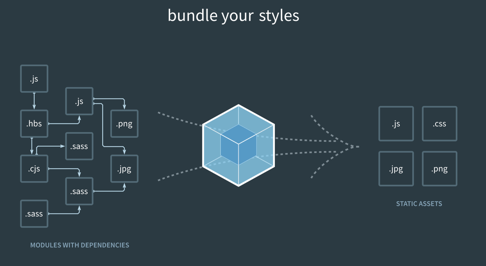
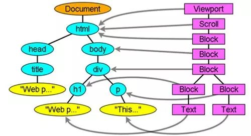

<div style="color:#16b0ff;font-size:50px;font-weight: 900;text-shadow: 5px 5px 10px var(--theme-color);font-family: 'Comic Sans MS';">前端</div>

<span style="color:#16b0ff;font-size:20px;font-weight: 900;font-family: 'Comic Sans MS';">Introduction</span>：收纳技术相关的 前端相关技术和 总结！

[TOC]

# Javascript

## 基础

### this 关键字

面向对象语言中 this 表示当前对象的一个引用。

但在 JavaScript 中 this 不是固定不变的，它会随着执行环境的改变而改变。

- 在方法中，this 表示该方法所属的对象。
- 如果单独使用，this 表示全局对象。
- 在函数中，this 表示全局对象。
- 在函数中，在严格模式下，this 是未定义的(undefined)。
- 在事件中，this 表示接收事件的元素。
- 类似 call() 和 apply() 方法可以将 this 引用到任何对象。

**对象方法中**

在对象方法中， this 指向调用它所在方法的对象。

this 表示 person 对象。

fullName 方法所属的对象就是 person。

```
var person = {
  firstName: "John",
  lastName : "Doe",
  id       : 5566,
  fullName : function() {
    return this.firstName + " " + this.lastName;
  }
};
```

**单独使用 this**

单独使用 this，则它指向全局(Global)对象。

在浏览器中，window 就是该全局对象为 [**object Window**]:

var x = this;

严格模式下，如果单独使用，this 也是指向全局(Global)对象。
"use strict"; var x = this;

**函数中使用 this（默认）**

在函数中，函数的所属者默认绑定到 this 上。

在浏览器中，window 就是该全局对象为 [**object Window**]:

function myFunction() {  return this; }


函数中使用 this（严格模式）

严格模式下函数是没有绑定到 this 上，这时候 this 是 **undefined**。

"use strict"; 

function myFunction() {  return this; }

**事件中的 this**

在 HTML 事件句柄中，this 指向了接收事件的 HTML 元素：

```
<button onclick="this.style.display='none'"> 点我后我就消失了 </button>
```

**显式函数绑定**

```
var person = {
  fullName: function(city, country) {
    return this.firstName + " " + this.lastName + "," + city + "," + country;
  }
}
var person1 = {
  firstName:"John",
  lastName: "Doe"
}
person.fullName.call(person1);  // 返回 "John Doe"

person.fullName.apply(person1, ["Oslo", "Norway"]);
person.fullName.call(person1, "Oslo", "Norway");
```

call() 方法分别接受参数。

apply() 方法接受数组形式的参数。

bind 和 call/apply 用处是一样的，但是 `bind` 会**返回一个新函数！不会立即执行！**而`call/apply`改变函数的 this 并且立即执行.

**箭头函数**

与常规函数相比，箭头函数对 this 的处理也有所不同。

简而言之，使用箭头函数没有对 this 的绑定。

在常规函数中，关键字 this 表示调用该函数的对象，可以是窗口、文档、按钮或其他任何东西。

对于箭头函数，this 关键字始终表示定义箭头函数的对象。

```
// 常规函数：
hello = function() {
  document.getElementById("demo").innerHTML += this;
}

// window 对象调用该函数：
window.addEventListener("load", hello);

// button 对象调用该函数：
document.getElementById("btn").addEventListener("click", hello);//输出object HTMLButtonElement
```

```
// 箭头函数：
hello = () => {
  document.getElementById("demo").innerHTML += this;
}

// window 对象调用该函数：
window.addEventListener("load", hello);

// button 对象调用该函数：
document.getElementById("btn").addEventListener("click", hello);//输出object Window
```

### prototype

所有的 JavaScript 对象都会从一个 prototype（原型对象）中继承属性和方法。

所有 JavaScript 中的对象都是位于原型链顶端的 Object 的实例。

JavaScript 对象有一个指向一个原型对象的链。当试图访问一个对象的属性时，它不仅仅在该对象上搜寻，还会搜寻该对象的原型，以及该对象的原型的原型，依次层层向上搜索，直到找到一个名字匹配的属性或到达原型链的末尾。

当一个对象被创建时，这个构造函数 将会把它的属性prototype赋给新对象的内部属性__proto__。这个__proto__被这个对象用来查找它的属性.

使用 prototype的好处是不会额外产生内存，所有实例化后的对象都会从原型上继承这个方法。也就是需要一个子类拥有父类的某些特性（同种特性可以覆盖），又可以添加自己的特性，而不会影响父类时候使用prototype。

**添加属性和方法**

有的时候我们想要在所有已经存在的对象添加新的属性或方法。

另外，有时候我们想要在对象的构造函数中添加属性或方法。

使用 prototype 属性就可以给对象的构造函数添加新的属性：

```
function Person(first, last, age, eyecolor) {
  this.firstName = first;
  this.lastName = last;
  this.age = age;
  this.eyeColor = eyecolor;
}
 
Person.prototype.nationality = "English";
```

**对象方法与通过new创建对象的重要区别**

这个区别就是function定义的方法(对象方法)有一个prototype属性，使用new生成的对象就没有这个prototype属性。也就是prototype属性是对象方法或者构造方法的专有属性。 prototype属性又指向了一个prototype对象，注意prototype属性与prototype对象是两个不同的东西，要注意区别。在prototype对象中又有一个constructor属性，这个constructor属性同样指向一个constructor对象，而这个constructor对象恰恰就是这个function函数本身。如下所示：


```
function Person(name)  
{  
   this.name=name;  
   this.showMe=function()  
        {  
           alert(this.name);  
        }  
};    
var one=new Person('js');    
alert(one.prototype)//undefined  
alert(typeof Person.prototype);//object  
alert(Person.prototype.constructor);//function Person(name) {...};
```

函数运行时会先去本体的函数中去找，如果找到则运行，找不到则去prototype中寻找函数

```javascript
function baseClass(){
    this.showMsg = function(){
        alert("baseClass::showMsg");   
    }
}

function extendClass(){
    this.showMsg =function (){
        alert("extendClass::showMsg");
    }
}
extendClass.prototype = new baseClass();
var instance = new extendClass();

instance.showMsg();//显示extendClass::showMsg
//=======================================================
extendClass.prototype = new baseClass();
var instance = new extendClass();

var baseinstance = new baseClass();
baseinstance.showMsg.call(instance);//显示baseClass::showMsg
```

**prototype,_ _proto_ _,constructor关系**

```
function Foo() {...};
let f1 = new Foo();
```


### 闭包

**我们首先知道闭包有3个特性：
①函数嵌套函数
②函数内部可以引用函数外部的参数和变量
③参数和变量不会被垃圾回收机制回收**


闭包的内部细节，依赖于函数被调用过程所发生的一系列事件为基础，所以有必要先弄清楚以下几个概念：

**1. 执行环境和活动对象###**

> ** - 执行环境(execution context)**定义了变量或者函数有权访问的其他数据，每个执行环境都有一个与之关联的**变量对象(variable object)**，执行环境中定义的变量和函数就保存在这个变量对象中；
> 全局执行环境是最外围的一个执行环境，通常被认为是window对象
> 执行环境和变量对象在**运行函数**时生成
> 执行环境中的所有代码执行完以后，执行环境被销毁，保存在其中的变量和函数也随之销毁；(全局执行环境到应用退出时销毁)

**2. 作用域链###**

> 当代码在一个执行环境中执行时，会创建**变量对象**的一个**作用域链(scope chain)**，作用域链用来指定执行环境有权访问的所有变量和函数的**访问顺序**；
> 作用域链的最前端，始终是**当前代码执行环境的变量对象**，如果这个环境是函数，则其活动对象就是变量对象
> 作用域链的下一个变量对象，来自外部包含环境，再下一个变量对象，来自下一个外部包含环境，以此类推直到全局执行环境
> 在函数执行过程，根据当前执行环境的作用域链来**逐层向外**查找变量，并且进行标识符解析

**示例1**

```
<script>
    function A(){
        var funs=[];
        for(var i=0;i<10;i++){
           funs[i]=function(){
               return i;
           }
        }
        return funs; 
    }
    var funs = A();//定义funs[0]-funs[9]，10个函数
    console.log(funs[0]());//10
    console.log(funs[1]());//10
    console.log(funs[6]());//10
</script>
```

这个例子其实算是一个经典案例，在很多地方都有提到，执行完毕后 funs数组中，funs[0]-funs[9]存的其实都是一样的,都是一个返回i值的函数，**这个例子容易错误的地方其实在于，弄错了产生执行环境的时机**，还是看这句话：

> 执行环境和变量对象在**运行函数**时生成

所以，当执行`var funs = A();`时，只是**定义**函数，而没有**执行**，真正产生环境变量的时间是在`console.log(funs[0]());`这三句的时候，此时A的变量对象中i值是什么呢？很简单，**看它return的时候**，i的值，显然，i的值是10，所以，最后三句输出的都是10

**示例2**

```
<script>
    function A(){
        var x = 1;
        return function(){
            x++;
            console.log(x);
        }
    }
    var m1 = A();//第一次执行A函数
    m1();//2
    m1();//3
    var m2 = A();//第二次执行A函数
    m2();//2
    m1();//4
</script>
```

上面这个例子其实可以引出几个问题:
1.为什么连续执行m1的时候，x的值在递增?
2.定义函数m2的时候，为什么x的值重新从1开始了?
3.运行m2以后，为什么再运行m1，x还是按照之前m1的运行结果继续增长?（其实就是m1和m2里面的x为什么是相互独立，各自维持的？）

现在来回答上面的三个问题:
1.(为什么连续执行m1的时候，x的值在递增?)
**answer:因为m1在引用的活动对象A一直没有释放(想释放的话可以让m1=null)，所以x的值一直递增。**
2.定义函数m2的时候，为什么x的值重新从1开始了?
**answer:因为又一次运行了A函数，生成一个新的A的活动对象，所以m2的作用域链引用的是一个新的x值。**
3.m1和m2里面的x为什么是相互独立，各自维持的？
**answer:因为在定义m1和m2的时候，分别运行了A函数，生成了两个活动对象，所以,m1和m2的作用域链是指向不同的A的活动对象的。**

### 事件循环（event loop）


浏览器除了JS引擎（JS执行线程，后面我们只关注JS引擎中的执行栈）以外，还有Web APIs（浏览器提供的接口，这是在JS引擎以外的）线程、GUI渲染线程等（如下表）。JS引擎在执行过程中，如果遇到相关的事件（DOM操作、鼠标点击事件、滚轮事件、AJAX请求、setTimeout等），并不会因此阻塞，它会将这些事件移交给Web APIs线程处理，而自己则接着往下执行。Web APIs（这里其实有一个event table，用于记录各种事件）则会按照一定的规则将这些事件放入一个任务队列（callback queue，也叫 task queue，HTML标准定义中，任务队列的数据结构其实不是队列，而是Set（集合），比如，当前执行栈正在执行，即使有一个定时器回调已经在任务队列中等待，此时发生了一个鼠标点击事件，那么该点击事件回调也会添加到任务队列中，此后执行栈变为空，JS引擎是会先取鼠标点击事件的回调执行，而不是先添加到任务队列中的定时器回调。即任务队列中是由一个个集构成的，各个集的执行先后是确定好的，按集的优先级取回调执行，集內是同一类型的回调才是按照先进先出的队列模式）中，当JS执行栈中的代码执行完毕以后，它就会去任务队列中获取一个事件回调放入执行栈中执行，然后如此往复，这就是所谓的**事件循环机制**。

| 线程名               | 作用                                                         |
| -------------------- | ------------------------------------------------------------ |
| **JS引擎线程**       | 也称为JS内核，负责处理JavaScript脚本。（例如V8引擎）<br/>①JS引擎线程负责解析JS脚本，运行代码。<br/>②JS引擎一直等待着任务队列中的任务的到来，然后加以处理。<br/>③一个Tab页（renderer进程）中无论什么时候都**只有一个JS线程**运行JS程序。 |
| **事件触发线程**     | 归属于渲染进程而不是JS引擎，用来控制事件循环<br/>①当JS引擎执行代码块如setTimeout时（也可来自浏览器内核的其他线程，如鼠标点击、Ajax异步请求等），会将对应任务添加到事件线程中。<br/>②当对应的事件符合触发条件被触发时，该线程会把事件添加到待处理队列的队尾，等待JS引擎的处理。<br/>注意：由于JS的单线程关系，所以这些待处理队列中的事件都是排队等待JS引擎处理，JS引擎空闲时才会执行。 |
| **定时触发器线程**   | setInterval和setTimeout所在的线程<br/>①浏览器定时计数器并不是由JS引擎计数的。<br/>②JS引擎时单线程的，如果处于阻塞线程状态就会影响计时的准确，因此，通过单独的线程来计时并触发定时。<br/>③计时完毕后，添加到事件队列中，等待JS引擎空闲后执行。<br/>注意：W3C在HTML标准中规定，规定要求setTimeout中低于4ms的时间间隔算为4ms。<br/> |
| **异步http请求线程** | XMLHttpRequest在连接后通过浏览器新开一个线程请求<br/>将检测到状态变更时，如果设置有回调函数，异步线程就**产生状态变更事件**，将这个回调放入事件队列中，再由JS引擎执行 |
| **GUI渲染线程**      | 负责渲染浏览器界面，包括：<br/>①解析HTML、CSS，构建DOM树和RenderObject树，布局和绘制等。<br/>②重绘（Repaint）以及回流（Reflow）处理。 |


这里让我们对事件循环先来做个小总结：

1. JS线程负责处理JS代码，当遇到一些异步操作的时候，则将这些异步事件移交给Web APIs 处理，自己则继续往下执行。
2. Web APIs线程将接收到的事件按照一定规则按顺序添加到任务队列中（应该是添加到任务集合中的各个事件队列中）。
3. JS线程处理完当前的所有任务以后（执行栈为空），它会去查看任务队列中是否有等待被处理的事件，若有，则取出一个事件回调放入执行栈中执行。
4. 然后不断循环第3步。


其实以上的浏览器模型是ES5标准的，ES6+标准中的任务队列在此基础上新增了一种，变成了如下两种：

宏任务队列（大家称之为macrotask queue，即callback queue）：按HTML标准严格来说，其实没有macrotask queue这种说法，它也就是ES5中的事件队列，该队列存放的是：DOM事件、AJAX事件、setTimeout事件等的回调。可以通过setTimeout(func)即可将func函数添加到宏任务队列中（使用场景：将计算耗时长的任务切分成小块，以便于浏览器有空处理用户事件，以及显示耗时进度）。
微任务队列（microtask queue）：存放的是Promise事件、nextTick事件（Node.js）等。有一个特殊的函数queueMicrotask(func)可以将func函数添加到微任务队列中。
那么，现在的事件循环模型就变成了如下的样子


事件循环的处理流程变成了如下：

1. JS线程负责处理JS代码，当遇到一些异步操作的时候，则将这些异步事件移交给Web APIs 处理，自己则继续往下执行。
2. Web APIs线程将接收到的事件按照一定规则添加到任务队列中，宏事件（DOM事件、Ajax事件、setTimeout事件等）添加到宏任务队列中，微事件（Promise、nextTick）添加到微事件队列中。
3. JS线程处理完当前的所有任务以后（执行栈为空），它会先去微任务队列获取事件，并将微任务队列中的所有事件一件件执行完毕，直到微任务队列为空后再去宏任务队列中取出一个事件执行（每次取完一个宏任务队列中的事件执行完毕后，都先检查微任务队列）。
4. 然后不断循环第3步

### 事件机制

**1. on+'event'**

如：onclick、onmouseover等支持最广，但是要在一个元素上添加多次同一个事件，只以最后一次绑定的事件为准

**2. addEventListener**

W3C标准方法，支持添加多个事件

```
dom.addEventListener(type, method, useCapture)
	
obj.addEventListener('click', method1, false)
```

 **第三个参数作用**

第三个参数为boolean，定义事件 ‘在捕获阶段触发’ 还是 ‘在冒泡阶段触发’，默认为false（冒泡阶段）

```
<dom1>
    <dom2>
        <dom3></dom3>
    </dom2>
</dom1>
dom1.addEventListener('click', method1, false)
dom2.addEventListener('click', method2, false)
dom3.addEventListener('click', method3, false)
// 冒泡阶段触发，执行顺序3-2-1

dom1.addEventListener('click', method1, true)
dom2.addEventListener('click', method2, true)
dom3.addEventListener('click', method3, true)
// 捕获阶段触发，执行顺序1-2-3
```

**3. attachEvent**

IE的方法，其他浏览器不支持，支持绑定多个事件，同一个元素的多个事件与addEventListener()执行顺序相反，为3-2-1

#### 事件委托

那什么叫`事件委托`呢？它还有一个名字叫事件代理，`JavaScript`高级程序设计上讲：事件委托就是利用事件冒泡，只指定一个事件处理程序，就可以管理某一类型的所有事件

事件委托是利用事件的冒泡原理来实现的，何为事件冒泡呢？就是事件从最深的节点开始，然后逐步向上传播事件，举个例子：页面上有这么一个节点树，div>ul>li>a;比如给最里面的a加一个click点击事件，那么这个事件就会一层一层的往外执行，执行顺序a>li>ul>div，有这样一个机制，那么我们给最外面的div加点击事件，那么里面的ul，li，a做点击事件的时候，都会冒泡到最外层的div上，所以都会触发，这就是事件委托，委托它们父级代为执行事件。

#### 事件触发三个阶段

**1. 捕获阶段**

事件从根节点流向目标节点，途中流经各个DOM节点，在各个节点触发捕获事件，直到到达目标节点


**2. 目标阶段**

事件到达目标节点时，就到了目标阶段，事件在目标节点上被触发

**3. 冒泡阶段**

事件在目标节点上触发后不会终止，一层层向上冒泡，回溯到根节点


```
冒泡阶段可以人为干预，事件到当前节点后阻止事件向上冒泡，而另外两个阶段不能人为干预
```

## ES5/6

| 版本 | 官方名称                                                     | 描述                                                         |
| :--- | :----------------------------------------------------------- | :----------------------------------------------------------- |
| 1    | ECMAScript 1 (1997)                                          | 第一版。                                                     |
| 2    | ECMAScript 2 (1998)                                          | 只改变编辑方式。                                             |
| 3    | ECMAScript 3 (1999)                                          | 添加了正则表达式。添加了 try/catch。                         |
| 4    | ECMAScript 4                                                 | 从未发布过。                                                 |
| 5    | ECMAScript 5 (2009)[阅读更多：JS ES5](https://www.w3school.com.cn/js/js_es5.asp) | 添加了“严格模式”。添加了 JSON 支持。添加了 String.trim()。添加了 Array.isArray()。添加了数组迭代方法。 |
| 5.1  | ECMAScript 5.1 (2011)                                        | 编辑改变。                                                   |
| 6    | ECMAScript 2015[阅读更多：JS ES6](https://www.w3school.com.cn/js/js_es6.asp) | 添加了 let 和 const添加了默认参数值添加了 Array.find()添加了 Array.findIndex() |
| 7    | ECMAScript 2016                                              | 添加了指数运算符（**）。添加了 Array.prototype.includes。    |
| 8    | ECMAScript 2017                                              | 添加了字符串填充。添加了新的 Object 属性。添加了异步功能。添加了共享内存。 |
| 9    | ECMAScript 2018                                              | 添加了 rest / spread 属性。添加了异步迭代。添加了 Promise.finally()。增加 RegExp。 |

## TypeScript


TypeScript 是 JavaScript 的一个超集，支持 ECMAScript 6 标准。

TypeScript 由微软开发的自由和开源的编程语言。

TypeScript 设计目标是开发大型应用，它可以编译成纯 JavaScript，编译出来的 JavaScript 可以运行在任何浏览器上。

**JavaScript 与 TypeScript 的区别**

TypeScript 是 JavaScript 的超集，扩展了 JavaScript 的语法，因此现有的 JavaScript 代码可与 TypeScript 一起工作无需任何修改，TypeScript 通过类型注解提供编译时的静态类型检查。

TypeScript 可处理已有的 JavaScript 代码，并只对其中的 TypeScript 代码进行编译。


## Vue


Vue.js（读音 /vjuː/, 类似于 view） 是一套构建用户界面的渐进式框架。

Vue 只关注视图层， 采用自底向上增量开发的设计。

Vue 的目标是通过尽可能简单的 API 实现响应的数据绑定和组合的视图组件。


### 基础

#### 安装

**独立版本**

我们可以在 Vue.js 的官网上直接下载最新版本, 并用 **<script>** 标签引入https://unpkg.com/vue@next。


**使用 CDN 方法**

- **Staticfile CDN（国内）** : https://cdn.staticfile.org/vue/3.0.5/vue.global.js
- **unpkg**：https://unpkg.com/vue@next, 会保持和 npm 发布的最新的版本一致。
- **cdnjs** : https://cdnjs.cloudflare.com/ajax/libs/vue/3.0.5/vue.global.js


**NPM 方法**

```
# 全局安装 vue-cli
yarn global add @vue/cli
# 或
cnpm install -g @vue/cli

#查看版本
$ vue --version

#创建项目
vue init webpack runoob-vue3-test

#运行项目
$ cnpm run dev

#打包项目
cnpm run build
```


### 语法

```
Vue.createApp(HelloVueApp).mount('#hello-vue')
```

```html
<!DOCTYPE html>
<html>
<head>
<meta charset="utf-8">
<title>Vue 测试实例 - 菜鸟教程(runoob.com)</title>
<script src="https://unpkg.com/vue@next"></script>
</head>
<body>
<div id="hello-vue" class="demo">
  {{ message }}
</div>

<script>
const HelloVueApp = {
  data() {
    return {
      message: 'Hello Vue!!'
    }
  }
}

Vue.createApp(HelloVueApp).mount('#hello-vue')
</script>
</body>
</html>
```

**mount('#hello-vue')** 将 Vue 应用 HelloVueApp 挂载到 **<div id="hello-vue"></div>** 中。

**{{ }}** 用于输出对象属性和函数返回值。

**{{ message }}** 对应应用中 **message** 的值。

#### data 选项

**data 选项**是一个函数。Vue 在创建新组件实例的过程中调用此函数。它应该返回一个对象，然后 Vue 会通过响应性系统将其包裹起来，并以 $data 的形式存储在组件实例中。

```html
<!DOCTYPE html>
<html>
<head>
<meta charset="utf-8">
<title>Vue 测试实例 - 菜鸟教程(runoob.com)</title>
<script src="https://unpkg.com/vue@next"></script>
</head>
<body>
<div id="app" class="demo"></div>

<script>
const app = Vue.createApp({
  data() {
    return { count: 4 }
  }
})

const vm = app.mount('#app')

document.write(vm.$data.count) // => 4
document.write("<br>")
document.write(vm.count)       // => 4
document.write("<br>")
// 修改 vm.count 的值也会更新 $data.count
vm.count = 5
document.write(vm.$data.count) // => 5
document.write("<br>")
// 反之亦然
vm.$data.count = 6
document.write(vm.count) // => 6
</script>
</body>
</html>
```

#### 方法

我们可以在组件中添加方法，使用 **methods** 选项，该选项包含了所需方法的对象。

以下实例我们添加了 methods 选项，选项中包含了 **increment()** 方法：

```html
<!DOCTYPE html>
<html>
<head>
<meta charset="utf-8">
<title>Vue 测试实例 - 菜鸟教程(runoob.com)</title>
<script src="https://unpkg.com/vue@next"></script>
</head>
<body>
<div id="app" class="demo"></div>

<script>
const app = Vue.createApp({
  data() {
    return { count: 4 }
  },
  methods: {
    increment() {
      // `this` 指向该组件实例
      this.count++
    }
  }
})

const vm = app.mount('#app')

document.write(vm.count) // => 4
document.write("<br>")
vm.increment()

document.write(vm.count) // => 5
</script>
</body>
</html>
```

#### **Vue3 模板**

##### **插值**

**文本**: 数据绑定最常见的形式就是使用 **{{...}}**（双大括号）的文本插值：<p>{{ message }}</p>

**Html**:使用 v-html 指令用于输出 html 代码：

```html
<div id="example1" class="demo">
    <p>使用双大括号的文本插值: {{ rawHtml }}</p>
    <p>使用 v-html 指令: <span v-html="rawHtml"></span></p>
</div>

<script>
const RenderHtmlApp = {
  data() {
    return {
      rawHtml: '<span style="color: red">这里会显示红色！</span>'
    }
  }
}

Vue.createApp(RenderHtmlApp).mount('#example1')
</script>
```

**属性**:HTML 属性中的值应使用 v-bind 指令。

```
<button v-bind:disabled="isButtonDisabled">按钮</button>
```

**表达式**:Vue.js 都提供了完全的 JavaScript 表达式支持。

```
<div v-bind:id="'list-' + id">expr</div>
```

##### 指令

指令是带有 v- 前缀的特殊属性。

指令用于在表达式的值改变时，将某些行为应用到 DOM 上。如下例子：

```html
<div id="app">
    <p v-if="seen">现在你看到我了</p>
</div>
    
<script>
const app = {
  data() {
    return {
      seen: true /* 改为false，信息就无法显示 */
    }
  }
}
 
Vue.createApp(app).mount('#app')
</script>
```

 v-if 指令将根据表达式 seen 的值( true 或 false )来决定是否插入 p 元素。

```
    <li v-for="site in sites">
      {{ site.text }}
    </li>
```

v-for用于循环数组

**参数**

参数在指令后以冒号指明。例如， v-bind 指令被用来响应地更新 HTML 属性：

```
<div id="app">
    <p><a v-bind:href="url">test</a></p>
</div>
```

 v-on 指令，它用于监听 DOM 事件

```html
<!-- 完整语法 -->
<a v-on:click="doSomething"> ... </a>

<!-- 缩写 -->
<a @click="doSomething"> ... </a>

<!-- 动态参数的缩写 (2.6.0+) -->
<a @[event]="doSomething"> ... </a>
```

**修饰符**

修饰符是以半角句号 **.** 指明的特殊后缀，用于指出一个指令应该以特殊方式绑定。例如，**.prevent** 修饰符告诉 **v-on** 指令对于触发的事件调用 **event.preventDefault()**：

```
<form v-on:submit.prevent="onSubmit"></form>
```

##### 用户输入

在 input 输入框中我们可以使用 v-model 指令来实现双向数据绑定：

```
<input v-model="message">
```

##### 缩写

v-bind 缩写
Vue.js 为两个最为常用的指令提供了特别的缩写：

```html
<!-- 完整语法 -->
<a v-bind:href="url"></a>
<!-- 缩写 -->
<a :href="url"></a>
```

v-on 缩写

```html
<!-- 完整语法 -->
<a v-on:click="doSomething"></a>
<!-- 缩写 -->
<a @click="doSomething"></a>
```

#### v-else-if

```html
<div v-if="type === 'A'">
     A
</div>
<div v-else-if="type === 'B'">
  B
</div>
<div v-else-if="type === 'C'">
  C
</div>
<div v-else>
  Not A/B/C
</div>
```

#### v-for

```html
    <li v-for="site in sites">
      {{ site.text }}
    </li>
```

### Vue3组件

每个 Vue 应用都是通过用 createApp 函数创建的，传递给 createApp 的选项用于配置根组件。当我们挂载应用时，该组件被用作渲染的起点。

一个应用需要被挂载到一个 DOM 元素中。

```javascript
const RootComponent = { /* 选项 */ }
const app = Vue.createApp(RootComponent)
const vm = app.mount('#app')
```

#### 全局组件

```javascript
//注册一个全局组件语法格式如下：
const app = Vue.createApp({...})

app.component('my-component-name', {
  /* ... */
})

//使用组件
<my-component-name></my-component-name>
```

#### 局部组件

全局注册往往是不够理想的。比如，如果你使用一个像 webpack 这样的构建系统，全局注册所有的组件意味着即便你已经不再使用一个组件了，它仍然会被包含在你最终的构建结果中。这造成了用户下载的 JavaScript 的无谓的增加。

在这些情况下，你可以通过一个普通的 JavaScript 对象来定义组件：

```javascript
const ComponentA = {
  /* ... */
}
const ComponentB = {
  /* ... */
}
const ComponentC = {
  /* ... */
}

//使用局部组件
const app = Vue.createApp({
  components: {
    'component-a': ComponentA,
    'component-b': ComponentB
  }
})
```

#### Prop

prop 是子组件用来接受父组件传递过来的数据的一个自定义属性。

父组件的数据需要通过 props 把数据传给子组件，子组件需要显式地用 props 选项声明 "prop"：

```html
<div id="app">
  <site-name title="Google"></site-namet>
  <site-name title="Runoob"></site-namet>
  <site-name title="Taobao"></site-name>
</div>
 
<script>
const app = Vue.createApp({})
 
app.component('site-name', {
  props: ['title'],
  template: `<h4>{{ title }}</h4>`
})
 
app.mount('#app')
</script>
```

#### 动态 Prop

```html
<div id="app">
  <site-info
    v-for="site in sites"
    :id="site.id"
    :title="site.title"
  ></site-info>
</div>
 
<script>
const Site = {
  data() {
    return {
      sites: [
        { id: 1, title: 'Google' },
        { id: 2, title: 'Runoob' },
        { id: 3, title: 'Taobao' }
      ]
    }
  }
}
 
const app = Vue.createApp(Site)
 
app.component('site-info', {
  props: ['id','title'],
  template: `<h4>{{ id }} - {{ title }}</h4>`
})
 
app.mount('#app')
</script>
```

#### Prop 验证

组件可以为 props 指定验证要求。

为了定制 prop 的验证方式，你可以为 props 中的值提供一个带有验证需求的对象，而不是一个字符串数组。例如：

```javascript
Vue.component('my-component', {
  props: {
    // 基础的类型检查 (`null` 和 `undefined` 会通过任何类型验证)
    propA: Number,
    // 多个可能的类型
    propB: [String, Number],
    // 必填的字符串
    propC: {
      type: String,
      required: true
    },
    // 带有默认值的数字
    propD: {
      type: Number,
      default: 100
    },
    // 带有默认值的对象
    propE: {
      type: Object,
      // 对象或数组默认值必须从一个工厂函数获取
      default: function () {
        return { message: 'hello' }
      }
    },
    // 自定义验证函数
    propF: {
      validator: function (value) {
        // 这个值必须匹配下列字符串中的一个
        return ['success', 'warning', 'danger'].indexOf(value) !== -1
      }
    }
  }
})
```

### Vue3 计算属性

```javascript
var vm = new Vue({
  el: '#app',
  data: {
    name: 'Google',
    url: 'http://www.google.com'
  },
  computed: {
    site: {
      // getter
      get: function () {
        return this.name + ' ' + this.url
      },
      // setter
      set: function (newValue) {
        var names = newValue.split(' ')
        this.name = names[0]
        this.url = names[names.length - 1]
      }
    }
  }
})
// 调用 setter， vm.name 和 vm.url 也会被对应更新
vm.site = '菜鸟教程 http://www.runoob.com';
document.write('name: ' + vm.name);
document.write('<br>');
document.write('url: ' + vm.url);
```

### Vue3 监听属性

```html
<head>
<meta charset="utf-8">
<title>Vue 测试实例 - 菜鸟教程(runoob.com)</title>
<script src="https://unpkg.com/vue@next"></script>
</head>
<body>
<div id = "app">
    千米 : <input type = "text" v-model = "kilometers">
    米 : <input type = "text" v-model = "meters">
</div>
<p id="info"></p>    
<script>
const app = {
  data() {
    return {
      kilometers : 0,
      meters:0
    }
  },
  watch : {
      kilometers:function(val) {
          this.kilometers = val;
          this.meters = this.kilometers * 1000
      },
      meters : function (val) {
          this.kilometers = val/ 1000;
          this.meters = val;
      }
  }
}
vm = Vue.createApp(app).mount('#app')
vm.$watch('kilometers', function (newValue, oldValue) {
    // 这个回调将在 vm.kilometers 改变后调用
    document.getElementById ("info").innerHTML = "修改前值为: " + oldValue + "，修改后值为: " + newValue;
})
</script>
```

**异步watch**

```javascript
<script src="https://cdn.jsdelivr.net/npm/axios@0.12.0/dist/axios.min.js"></script>
<script>
  const watchExampleVM = Vue.createApp({
    data() {
      return {
        question: '',
        answer: '每个问题结尾需要输入 ? 号。'
      }
    },
    watch: {
      // 每当问题改变时，此功能将运行，以 ? 号结尾
      question(newQuestion, oldQuestion) {
        if (newQuestion.indexOf('?') > -1) {
          this.getAnswer()
        }
      }
    },
    methods: {
      getAnswer() {
        this.answer = '加载中...'
        axios
          .get('https://yesno.wtf/api')
          .then(response => {
            this.answer = response.data.answer
          })
          .catch(error => {
            this.answer = '错误! 无法访问 API。 ' + error
          })
      }
    }
  }).mount('#watch-example')
</script>
```

### 样式绑定

#### class 属性绑定

```
<div :class="{ 'active': isActive }"></div>
//or
<div class="static" :class="[activeClass, errorClass]"></div>
```

#### Vue.js style(内联样式)

```
<div id="app">
    <div :style="{ color: activeColor, fontSize: fontSize + 'px' }">菜鸟教程</div>
</div>
```

### Vue3 事件处理

#### v-on

```
v-on:click="methodName"
或
@click="methodName"
```

#### 事件修饰符

Vue.js 为 v-on 提供了事件修饰符来处理 DOM 事件细节，如：event.preventDefault() 或 event.stopPropagation()。

Vue.js 通过由点 **.** 表示的指令后缀来调用修饰符。

- `.stop` - 阻止冒泡
- `.prevent` - 阻止默认事件
- `.capture` - 阻止捕获
- `.self` - 只监听触发该元素的事件
- `.once` - 只触发一次
- `.left` - 左键事件
- `.right` - 右键事件
- `.middle` - 中间滚轮事件

```html
<!-- 阻止单击事件冒泡 -->
<a v-on:click.stop="doThis"></a>
<!-- 提交事件不再重载页面 -->
<form v-on:submit.prevent="onSubmit"></form>
<!-- 修饰符可以串联  -->
<a v-on:click.stop.prevent="doThat"></a>
<!-- 只有修饰符 -->
<form v-on:submit.prevent></form>
<!-- 添加事件侦听器时使用事件捕获模式 -->
<div v-on:click.capture="doThis">...</div>
<!-- 只当事件在该元素本身（而不是子元素）触发时触发回调 -->
<div v-on:click.self="doThat">...</div>

<!-- click 事件只能点击一次，2.1.4版本新增 -->
<a v-on:click.once="doThis"></a>
```

#### 按键修饰符

```
<!-- 只有在 keyCode 是 13 时调用 vm.submit() -->
<input v-on:keyup.13="submit">
```

记住所有的 keyCode 比较困难，所以 Vue 为最常用的按键提供了别名：

```
<!-- 同上 -->
<input v-on:keyup.enter="submit">
<!-- 缩写语法 -->
<input @keyup.enter="submit">
```

全部的按键别名：

- `.enter`
- `.tab`
- `.delete` (捕获 "删除" 和 "退格" 键)
- `.esc`
- `.space`
- `.up`
- `.down`
- `.left`
- `.right`

系统修饰键：

- `.ctrl`
- `.alt`
- `.shift`
- `.meta`

鼠标按钮修饰符:

- `.left`
- `.right`
- `.middle`

### Vue3 自定义指令

#### 全局指令 

```javascript
<div id="app">
    <p>页面载入时，input 元素自动获取焦点：</p>
    <input v-focus>
</div>
 
<script>
const app = Vue.createApp({})
// 注册一个全局自定义指令 `v-focus`
app.directive('focus', {
  // 当被绑定的元素挂载到 DOM 中时……
  mounted(el) {
    // 聚焦元素
    el.focus()
  }
})
app.mount('#app')
</script>
```

#### 局部指令

```javascript
<div id="app">
    <p>页面载入时，input 元素自动获取焦点：</p>
    <input v-focus>
</div>
 
<script>
const app = {
   data() {
      return {
      }
   },
   directives: {
      focus: {
         // 指令的定义
         mounted(el) {
            el.focus()
         }
      }
   }
}
 
Vue.createApp(app).mount('#app')
```

#### 钩子

**钩子函数**

指令定义函数提供了几个钩子函数（可选）：

- `created `: 在绑定元素的属性或事件监听器被应用之前调用。
- `beforeMount `: 指令第一次绑定到元素并且在挂载父组件之前调用。。
- `mounted `: 在绑定元素的父组件被挂载后调用。。
- `beforeUpdate`: 在更新包含组件的 VNode 之前调用。。
- `updated`: 在包含组件的 VNode 及其子组件的 VNode 更新后调用。
- `beforeUnmount`: 当指令与在绑定元素父组件卸载之前时，只调用一次。
- `unmounted`: 当指令与元素解除绑定且父组件已卸载时，只调用一次。


**钩子函数参数**

钩子函数的参数有：

**el**

**el** 指令绑定到的元素。这可用于直接操作 DOM。

**binding**

binding 是一个对象，包含以下属性：

- `instance`：使用指令的组件实例。
- `value`：传递给指令的值。例如，在 `v-my-directive="1 + 1"` 中，该值为 `2`。
- `oldValue`：先前的值，仅在 `beforeUpdate` 和 `updated` 中可用。值是否已更改都可用。
- `arg`：参数传递给指令 (如果有)。例如在 `v-my-directive:foo` 中，arg 为 `"foo"`。
- `modifiers`：包含修饰符 (如果有) 的对象。例如在 `v-my-directive.foo.bar` 中，修饰符对象为 `{foo: true，bar: true}`。
- `dir`：一个对象，在注册指令时作为参数传递。例如，在以下指令中：

**vnode**

作为 el 参数收到的真实 DOM 元素的蓝图。

**prevNode**

上一个虚拟节点，仅在 beforeUpdate 和 updated 钩子中可用。

```html
<div id="app">
   <div v-runoob="{ name: '菜鸟教程', url: 'www.runoob.com' }"></div>
</div>
​
<script>
const app = Vue.createApp({})
app.directive('runoob', (el, binding, vnode) => {
console.log(binding.value.name) // => "菜鸟教程"
console.log(binding.value.url) // => "www.runoob.com"
var s = JSON.stringify
el.innerHTML = s(binding.value)
})
app.mount('#app')
</script>
```

### Vue3 路由

#### 安装

**1、直接下载 / CDN**

```
https://unpkg.com/vue-router@4
```

**NPM**

推荐使用淘宝镜像：

```
npm install -g cnpm --registry=https://registry.npmmirror.com
cnpm install vue-router@4
```

#### 路由

```javascript
// 1. 定义路由组件.
// 也可以从其他文件导入
const Home = { template: '<div>Home</div>' }
const About = { template: '<div>About</div>' }
 
// 2. 定义一些路由
// 每个路由都需要映射到一个组件。
// 我们后面再讨论嵌套路由。
const routes = [
  { path: '/', component: Home },
  { path: '/about', component: About },
]
 
// 3. 创建路由实例并传递 `routes` 配置
// 你可以在这里输入更多的配置，但我们在这里
// 暂时保持简单
const router = VueRouter.createRouter({
  // 4. 内部提供了 history 模式的实现。为了简单起见，我们在这里使用 hash 模式。
  history: VueRouter.createWebHashHistory(),
  routes, // `routes: routes` 的缩写
})
 
// 5. 创建并挂载根实例
const app = Vue.createApp({})
//确保 _use_ 路由实例使
//整个应用支持路由。
app.use(router)
 
app.mount('#app')
 
// 现在，应用已经启动了！
```

to **参数的几种写法**

```javascript
<!-- 字符串 -->
<router-link to="home">Home</router-link>
<!-- 渲染结果 -->
<a href="home">Home</a>

<!-- 使用 v-bind 的 JS 表达式 -->
<router-link v-bind:to="'home'">Home</router-link>

<!-- 不写 v-bind 也可以，就像绑定别的属性一样 -->
<router-link :to="'home'">Home</router-link>

<!-- 同上 -->
<router-link :to="{ path: 'home' }">Home</router-link>

<!-- 命名的路由 -->
<router-link :to="{ name: 'user', params: { userId: 123 }}">User</router-link>

<!-- 带查询参数，下面的结果为 /register?plan=private -->
<router-link :to="{ path: 'register', query: { plan: 'private' }}">Register</router-link>
```

## React


React 是一个用于构建用户界面的 JAVASCRIPT 库。

React 主要用于构建 UI，很多人认为 React 是 MVC 中的 V（视图）。

React 起源于 Facebook 的内部项目，用来架设 Instagram 的网站，并于 2013 年 5 月开源。

React 拥有较高的性能，代码逻辑非常简单，越来越多的人已开始关注和使用它。

**React 特点**

- **1.声明式设计** −React采用声明范式，可以轻松描述应用。
- **2.高效** −React通过对DOM的模拟，最大限度地减少与DOM的交互。
- **3.灵活** −React可以与已知的库或框架很好地配合。
- **4.JSX** − JSX 是 JavaScript 语法的扩展。React 开发不一定使用 JSX ，但我们建议使用它。
- **5.组件** − 通过 React 构建组件，使得代码更加容易得到复用，能够很好的应用在大项目的开发中。
- **6.单向响应的数据流** − React 实现了单向响应的数据流，从而减少了重复代码，这也是它为什么比传统数据绑定更简单。

### React 安装

你也可以直接使用 Staticfile CDN 的 React CDN 库，地址如下：

```
<script src="https://cdn.staticfile.org/react/16.4.0/umd/react.development.js"></script> <script src="https://cdn.staticfile.org/react-dom/16.4.0/umd/react-dom.development.js"></script> 
<!-- 生产环境中不建议使用 --> 
<script src="https://cdn.staticfile.org/babel-standalone/6.26.0/babel.min.js"></script>
```

官方提供的 CDN 地址：

```
<script src="https://unpkg.com/react@16/umd/react.development.js"></script> <script src="https://unpkg.com/react-dom@16/umd/react-dom.development.js"></script> 
<!-- 生产环境中不建议使用 --> 
<script src="https://unpkg.com/babel-standalone@6.15.0/babel.min.js"></script>
```

#### create-react-app

```
$ cnpm install -g create-react-app
$ create-react-app my-app
$ cd my-app/
$ npm start
```

### React JSX

```
ReactDOM.render(
    <div>
    <h1>菜鸟教程</h1>
    <h2>欢迎学习 React</h2>
    <p data-myattribute = "somevalue">这是一个很不错的 JavaScript 库!</p>
    </div>
    ,
    document.getElementById('example')
);
```

**独立文件**

```
<body>
  <div id="example"></div>
<script type="text/babel" src="helloworld_react.js"></script>
</body>
```

**JavaScript 表达式**

```
ReactDOM.render(
    <div>
      <h1>{1+1}</h1>
      {/*注释...*/}
    </div>
    ,
    document.getElementById('example')
);
```

**样式**

```
var myStyle = {
    fontSize: 100,
    color: '#FF0000'
};
ReactDOM.render(
    <h1 style = {myStyle}>菜鸟教程</h1>,
    document.getElementById('example')
);
```

**数组**

```
var arr = [
  <h1>菜鸟教程</h1>,
  <h2>学的不仅是技术，更是梦想！</h2>,
];
ReactDOM.render(
  <div>{arr}</div>,
  document.getElementById('example')
);
```

### React 组件

```javascript
class Welcome extends React.Component {
  render() {
    return <h1>Hello World!</h1>;
  }
}
 
function HelloMessage(props) {
    return <h1>Hello {props.name}!</h1>;
}
 
const element = <HelloMessage name="Runoob"/>;
 
ReactDOM.render(
    element,
    document.getElementById('example')
);
```

**复合组件**

```javascript
function Name(props) {
    return <h1>网站名称：{props.name}</h1>;
}
function Url(props) {
    return <h1>网站地址：{props.url}</h1>;
}
function Nickname(props) {
    return <h1>网站小名：{props.nickname}</h1>;
}
function App() {
    return (
    <div>
        <Name name="菜鸟教程" />
        <Url url="http://www.runoob.com" />
        <Nickname nickname="Runoob" />
    </div>
    );
}
 
ReactDOM.render(
     <App />,
    document.getElementById('example')
);
```

### React State(状态)

React 把组件看成是一个状态机（State Machines）。通过与用户的交互，实现不同状态，然后渲染 UI，让用户界面和数据保持一致。

React 里，只需更新组件的 state，然后根据新的 state 重新渲染用户界面（不要操作 DOM）。

```javascript
function FormattedDate(props) {
  return <h2>现在是 {props.date.toLocaleTimeString()}.</h2>;
}
 
class Clock extends React.Component {
  constructor(props) {
    super(props);
    this.state = {date: new Date()};
  }
 
  componentDidMount() {
    this.timerID = setInterval(
      () => this.tick(),
      1000
    );
  }
 
  componentWillUnmount() {
    clearInterval(this.timerID);
  }
 
  tick() {
    this.setState({
      date: new Date()
    });
  }
 
  render() {
    return (
      <div>
        <h1>Hello, world!</h1>
        <FormattedDate date={this.state.date} />
      </div>
    );
  }
}
 
function App() {
  return (
    <div>
      <Clock />
      <Clock />
      <Clock />
    </div>
  );
}
 
ReactDOM.render(<App />, document.getElementById('example'));
```

### React Props

state 和 props 主要的区别在于 **props** 是不可变的，而 state 可以根据与用户交互来改变。这就是为什么有些容器组件需要定义 state 来更新和修改数据。 而子组件只能通过 props 来传递数据。

```
function HelloMessage(props) {
    return <h1>Hello {props.name}!</h1>;
}
 
const element = <HelloMessage name="Runoob"/>;
 
ReactDOM.render(
    element,
    document.getElementById('example')
);
```

或者

```
class HelloMessage extends React.Component {
  render() {
    return (
      <h1>Hello, {this.props.name}</h1>
    );
  }
}
 
HelloMessage.defaultProps = {
  name: 'Runoob'
};
//props验证
HelloMessage.propTypes = {
  name: PropTypes.string
};
 
const element = <HelloMessage/>;
 
ReactDOM.render(
  element,
  document.getElementById('example')
);
```

Props **验证**

```javascript
MyComponent.propTypes = {
    // 可以声明 prop 为指定的 JS 基本数据类型，默认情况，这些数据是可选的
   optionalArray: React.PropTypes.array,
    optionalBool: React.PropTypes.bool,
    optionalFunc: React.PropTypes.func,
    optionalNumber: React.PropTypes.number,
    optionalObject: React.PropTypes.object,
    optionalString: React.PropTypes.string,
 
    // 可以被渲染的对象 numbers, strings, elements 或 array
    optionalNode: React.PropTypes.node,
 
    //  React 元素
    optionalElement: React.PropTypes.element,
 
    // 用 JS 的 instanceof 操作符声明 prop 为类的实例。
    optionalMessage: React.PropTypes.instanceOf(Message),
 
    // 用 enum 来限制 prop 只接受指定的值。
    optionalEnum: React.PropTypes.oneOf(['News', 'Photos']),
 
    // 可以是多个对象类型中的一个
    optionalUnion: React.PropTypes.oneOfType([
      React.PropTypes.string,
      React.PropTypes.number,
      React.PropTypes.instanceOf(Message)
    ]),
 
    // 指定类型组成的数组
    optionalArrayOf: React.PropTypes.arrayOf(React.PropTypes.number),
 
    // 指定类型的属性构成的对象
    optionalObjectOf: React.PropTypes.objectOf(React.PropTypes.number),
 
    // 特定 shape 参数的对象
    optionalObjectWithShape: React.PropTypes.shape({
      color: React.PropTypes.string,
      fontSize: React.PropTypes.number
    }),
 
    // 任意类型加上 `isRequired` 来使 prop 不可空。
    requiredFunc: React.PropTypes.func.isRequired,
 
    // 不可空的任意类型
    requiredAny: React.PropTypes.any.isRequired,
 
    // 自定义验证器。如果验证失败需要返回一个 Error 对象。不要直接使用 `console.warn` 或抛异常，因为这样 `oneOfType` 会失效。
    customProp: function(props, propName, componentName) {
      if (!/matchme/.test(props[propName])) {
        return new Error('Validation failed!');
      }
    }
  }
}
```

### React 事件处理

React 元素的事件处理和 DOM 元素类似。但是有一点语法上的不同:

- React 事件绑定属性的命名采用驼峰式写法，而不是小写。
- 如果采用 JSX 的语法你需要传入一个函数作为事件处理函数，而不是一个字符串(DOM 元素的写法)

HTML 通常写法是：

```
<a href="#" onclick="console.log('点击链接'); return false">
  点我
</a>
```

React 中写法为：

```
function ActionLink() {
  function handleClick(e) {
    e.preventDefault();
    console.log('链接被点击');
  }
 
  return (
    <a href="#" onClick={handleClick}>
      点我
    </a>
  );
}
```

**向事件处理程序传递参数**

```javascript
class Popper extends React.Component{
    constructor(){
        super();
        this.state = {name:'Hello world!'};
    }
    
    preventPop(name, e){    //事件对象e要放在最后
        e.preventDefault();
        alert(name);
    }
    
    render(){
        return (
            <div>
                <p>hello</p>
                {/* 通过 bind() 方法传递参数。 */}
                <a href="https://reactjs.org" onClick={this.preventPop.bind(this,this.state.name)}>Click</a>
            </div>
        );
    }
}
```

### React 条件渲染

```javascript
function UserGreeting(props) {
  return <h1>欢迎回来!</h1>;
}

function GuestGreeting(props) {
  return <h1>请先注册。</h1>;
}

function Greeting(props) {
  const isLoggedIn = props.isLoggedIn;
  if (isLoggedIn) {
    return <UserGreeting />;
  }
  return <GuestGreeting />;
}
 
ReactDOM.render(
  // 尝试修改 isLoggedIn={true}:
  <Greeting isLoggedIn={false} />,
  document.getElementById('example')
);
```

**元素变量**

你可以使用变量来储存元素。它可以帮助你有条件的渲染组件的一部分，而输出的其他部分不会更改。

在下面的例子中，我们将要创建一个名为 LoginControl 的有状态的组件。

它会根据当前的状态来渲染 **<LoginButton />** 或 **<LogoutButton />**，它也将渲染前面例子中的 **<Greeting />**。

```javascript
class LoginControl extends React.Component {
  constructor(props) {
    super(props);
    this.handleLoginClick = this.handleLoginClick.bind(this);
    this.handleLogoutClick = this.handleLogoutClick.bind(this);
    this.state = {isLoggedIn: false};
  }
 
  handleLoginClick() {
    this.setState({isLoggedIn: true});
  }
 
  handleLogoutClick() {
    this.setState({isLoggedIn: false});
  }
 
  render() {
    const isLoggedIn = this.state.isLoggedIn;
 
    let button = null;
    if (isLoggedIn) {
      button = <LogoutButton onClick={this.handleLogoutClick} />;
    } else {
      button = <LoginButton onClick={this.handleLoginClick} />;
    }
 
    return (
      <div>
        <Greeting isLoggedIn={isLoggedIn} />
        {button}
      </div>
    );
  }
}
 
ReactDOM.render(
  <LoginControl />,
  document.getElementById('example')
);
```

### React 组件 API

在本节中我们将讨论 React 组件 API。我们将讲解以下7个方法:

- 设置状态：setState
- 替换状态：replaceState
- 设置属性：setProps
- 替换属性：replaceProps
- 强制更新：forceUpdate
- 获取DOM节点：findDOMNode
- 判断组件挂载状态：isMounted

```javascript
class Counter extends React.Component{
  constructor(props) {
      super(props);
      this.state = {clickCount: 0};
      this.handleClick = this.handleClick.bind(this);
  }
  
  handleClick() {
    this.setState(function(state) {
      return {clickCount: state.clickCount + 1};
    });
  }
  render () {
    return (<h2 onClick={this.handleClick}>点我！点击次数为: {this.state.clickCount}</h2>);
  }
}
ReactDOM.render(
  <Counter />,
  document.getElementById('example')
);
```

### React 组件生命周期

组件的生命周期可分成三个状态：

- Mounting(挂载)：已插入真实 DOM
- Updating(更新)：正在被重新渲染
- Unmounting(卸载)：已移出真实 DOM


```javascript
class Button extends React.Component {
  constructor(props) {
      super(props);
      this.state = {data: 0};
      this.setNewNumber = this.setNewNumber.bind(this);
  }
  
  setNewNumber() {
    this.setState({data: this.state.data + 1})
  }
  render() {
      return (
         <div>
            <button onClick = {this.setNewNumber}>INCREMENT</button>
            <Content myNumber = {this.state.data}></Content>
         </div>
      );
    }
}
 
 
class Content extends React.Component {
  componentWillMount() {
      console.log('Component WILL MOUNT!')
  }
  componentDidMount() {
       console.log('Component DID MOUNT!')
  }
  componentWillReceiveProps(newProps) {
        console.log('Component WILL RECEIVE PROPS!')
  }
  shouldComponentUpdate(newProps, newState) {
        return true;
  }
  componentWillUpdate(nextProps, nextState) {
        console.log('Component WILL UPDATE!');
  }
  componentDidUpdate(prevProps, prevState) {
        console.log('Component DID UPDATE!')
  }
  componentWillUnmount() {
         console.log('Component WILL UNMOUNT!')
  }
 
    render() {
      return (
        <div>
          <h3>{this.props.myNumber}</h3>
        </div>
      );
    }
}
ReactDOM.render(
   <div>
      <Button />
   </div>,
  document.getElementById('example')
);
```

### React AJAX

```javascript
class UserGist extends React.Component {
  constructor(props) {
      super(props);
      this.state = {username: '', lastGistUrl: ''};
  }
 
 
  componentDidMount() {
    this.serverRequest = $.get(this.props.source, function (result) {
      var lastGist = result[0];
      this.setState({
        username: lastGist.owner.login,
        lastGistUrl: lastGist.html_url
      });
    }.bind(this));
  }
 
  componentWillUnmount() {
    this.serverRequest.abort();
  }
 
  render() {
    return (
      <div>
        {this.state.username} 用户最新的 Gist 共享地址：
        <a href={this.state.lastGistUrl}>{this.state.lastGistUrl}</a>
      </div>
    );
  }
}
 
ReactDOM.render(
  <UserGist source="https://api.github.com/users/octocat/gists" />,
  document.getElementById('example')
);
```

### React Refs

React 支持一种非常特殊的属性 **Ref** ，你可以用来绑定到 render() 输出的任何组件上。

这个特殊的属性允许你引用 render() 返回的相应的支撑实例（ backing instance ）。这样就可以确保在任何时间总是拿到正确的实例。

```javascript
class MyComponent extends React.Component {
  handleClick() {
    // 使用原生的 DOM API 获取焦点
    this.refs.myInput.focus();
  }
  render() {
    //  当组件插入到 DOM 后，ref 属性添加一个组件的引用于到 this.refs
    return (
      <div>
        <input type="text" ref="myInput" />
        <input
          type="button"
          value="点我输入框获取焦点"
          onClick={this.handleClick.bind(this)}
        />
      </div>
    );
  }
}
 
ReactDOM.render(
  <MyComponent />,
  document.getElementById('example')
);
```

### react-router

安装：`npm i -S react-router-dom`

```javascript
import React from 'react';
import logo from './logo.svg';
import './App.css';

import { BrowserRouter as Router, Routes, Route } from 'react-router-dom';

function About() {
  /*...*/
  return (
    <div>
      <h1>About</h1>
    </div>
  );
}
..................
function App() {
  return (
    <Router>
    <Routes >
    <Route path="/" element={<Home />} />
      <Route path="/about" element={<About/>}/>
      <Route path="/users" element={<Users/>}/>
    </Routes>
  </Router>
  );
}

export default App;
```


## Vue&React Diff

通过网络搜索发现Vue和React都有diff算法，原理基本相同，参考下图。


## 打包编译工具

### webpack

Webpack 是一个前端资源加载/打包工具。它将根据模块的依赖关系进行静态分析，然后将这些模块按照指定的规则生成对应的静态资源。



安装 cnpm install webpack -g

 webpack 命令来打包 webpack runoob1.js bundle.js


webpack 根据模块的依赖关系进行静态分析，这些文件(模块)会被包含到 bundle.js 文件中。Webpack 会给每个模块分配一个唯一的 id 并通过这个 id 索引和访问模块。 在页面启动时，会先执行 runoob1.js 中的代码，其它模块会在运行 require 的时候再执行。

**LOADER**

Webpack 本身只能处理 JavaScript 模块，如果要处理其他类型的文件，就需要使用 loader 进行转换。

所以如果我们需要在应用中添加 css 文件，就需要使用到 css-loader 和 style-loader，他们做两件不同的事情，css-loader 会遍历 CSS 文件，然后找到 url() 表达式然后处理他们，style-loader 会把原来的 CSS 代码插入页面中的一个 style 标签中。

接下来我们使用以下命令来安装 css-loader 和 style-loader(全局安装需要参数 -g)。

cnpm install css-loader style-loader

**配置文件**

```
module.exports = {
    entry: "./runoob1.js",
    output: {
        path: __dirname,
        filename: "bundle.js"
    },
    module: {
        loaders: [
            { test: /\.css$/, loader: "style-loader!css-loader" }
        ]
    }
};
```

**插件**

插件在 webpack 的配置信息 plugins 选项中指定，用于完成一些 loader 不能完成的工。

webpack 自带一些插件，你可以通过 cnpm 安装一些插件。

使用内置插件需要通过以下命令来安装：

cnpm install webpack --save-dev

比如我们可以安装内置的 BannerPlugin 插件，用于在文件头部输出一些注释信息。

修改 webpack.config.js，代码如下：

**app/webpack.config.js 文件**

```
var webpack=require('webpack');
 
module.exports = {
    entry: "./runoob1.js",
    output: {
        path: __dirname,
        filename: "bundle.js"
    },
    module: {
        loaders: [
            { test: /\.css$/, loader: "style-loader!css-loader" }
        ]
    },
    plugins:[
    new webpack.BannerPlugin('菜鸟教程 webpack 实例')
    ]
};
```

### Babel

简单来说把 JavaScript 中 es2015/2016/2017/2046 的新语法转化为 es5，让低端运行环境(如浏览器和 node )能够认识并执行。本文以 babel 6.x 为基准进行讨论。最近 babel 出了 7.x，放在最后聊。

严格来说，babel 也可以转化为更低的规范。但以目前情况来说，es5 规范已经足以覆盖绝大部分浏览器，因此常规来说转到 es5 是一个安全且流行的做法。

**使用方法**

总共存在三种方式：

1. 使用[单体文件](https://www.zhihu.com/search?q=单体文件&search_source=Entity&hybrid_search_source=Entity&hybrid_search_extra={"sourceType"%3A"article"%2C"sourceId"%3A43249121}) (standalone script)
2. 命令行 (cli)
3. 构建工具的插件 (webpack 的 babel-loader, rollup 的 rollup-plugin-babel)

**运行方式和插件**

babel 总共分为三个阶段：解析，转换，生成。

babel 本身不具有任何转化功能，它把转化的功能都分解到一个个 plugin 里面。因此当我们不配置任何插件时，经过 babel 的代码和输入是相同的。

插件总共分为两种：

- 当我们添加 **语法插件** 之后，在解析这一步就使得 babel 能够解析更多的语法。(顺带一提，babel 内部使用的解析类库叫做 babylon，并非 babel 自行开发)
- 当我们添加 **转译插件** 之后，在转换这一步把源码转换并输出。这也是我们使用 babel 最本质的需求。

**配置文件**

既然插件是 babel 的根本，那如何使用呢？总共分为 2 个步骤：

1. 将插件的名字增加到配置文件中 (根目录下创建 .babelrc 或者 package.json 的 `babel` 里面，格式相同)
2. 使用 `npm install babel-plugin-xxx` 进行安装

**执行顺序**

很简单的几条原则：

- Plugin 会运行在 Preset 之前。
- Plugin 会从前到后顺序执行。
- Preset 的顺序则 **刚好相反**(从后向前)。

preset 的逆向顺序主要是为了保证向后兼容，因为大多数用户的编写顺序是 `['es2015', 'stage-0']`。这样必须先执行 `stage-0` 才能确保 babel 不报错。因此我们编排 preset 的时候，也要注意顺序，**其实只要按照规范的时间顺序列出即可。**

**env (重点)**

因为 env 最为常用也最重要，所以我们有必要重点关注。

env 的核心目的是通过配置得知目标环境的特点，然后只做必要的转换。例如目标浏览器支持 es2015，那么 es2015 这个 preset 其实是不需要的，于是代码就可以小一点(一般转化后的代码总是更长)，构建时间也可以缩短一些。

如果不写任何配置项，env 等价于 latest，也等价于 es2015 + es2016 + es2017 三个相加(不包含 stage-x 中的插件)。env 包含的插件列表维护在[这里](https://link.zhihu.com/?target=https%3A//github.com/babel/babel-preset-env/blob/master/data/plugin-features.js)

```
{
  "presets": [
    ["env", {
      "targets": {
        "browsers": ["last 2 versions", "safari >= 7"]
      }
    }]
  ]
}
```

```
{
  "presets": [
    ["env", {
      "targets": {
        "node": "6.10"
      }
    }]
  ]
}
```

**babel-loader**

前面提过 babel 的三种使用方法，并且已经介绍过了 `babel-cli`。但一些大型的项目都会有构建工具 (如 webpack 或 rollup) 来进行代码构建和压缩 (uglify)。理论上来说，我们也可以对压缩后的代码进行 babel 处理，但那会非常慢。因此如果在 uglify 之前就加入 babel 处理，岂不完美？

所以就有了 babel 插入到构建工具内部这样的需求。以(我还算熟悉的) webpack 为例，webpack 有 loader 的概念，因此就出现了 `babel-loader`。

### Jest

**安装**

yarn add --dev jest

npm install --save-dev jest

**单元测试**

```
//被测试函数
function sum(a, b) {
  return a + b;
}
module.exports = sum;
```

```
//测试代码
const sum = require('./sum');

test('adds 1 + 2 to equal 3', () => {
  expect(sum(1, 2)).toBe(3);
});
```

jest my-test --notify --config=config.json //运行测试

**断言**

```
test('object assignment', () => {
  const data = {one: 1};
  data['two'] = 2;
  expect(data).toEqual({one: 1, two: 2});
});
```

**异步测试**

```
test('the data is peanut butter', async () => {
  const data = await fetchData();
  expect(data).toBe('peanut butter');
});

test('the fetch fails with an error', async () => {
  expect.assertions(1);
  try {
    await fetchData();
  } catch (e) {
    expect(e).toMatch('error');
  }
});
```

**初始化和善后**

```
beforeAll(() => console.log('1 - beforeAll'));
afterAll(() => console.log('1 - afterAll'));
beforeEach(() => console.log('1 - beforeEach'));
afterEach(() => console.log('1 - afterEach'));
test('', () => console.log('1 - test'));
describe('Scoped / Nested block', () => {
  beforeAll(() => console.log('2 - beforeAll'));
  afterAll(() => console.log('2 - afterAll'));
  beforeEach(() => console.log('2 - beforeEach'));
  afterEach(() => console.log('2 - afterEach'));
  test('', () => console.log('2 - test'));
});
```

**Mock**

```
const mockCallback = jest.fn(x => 42 + x);
forEach([0, 1], mockCallback);

// The mock function is called twice
expect(mockCallback.mock.calls.length).toBe(2);

// The first argument of the first call to the function was 0
expect(mockCallback.mock.calls[0][0]).toBe(0);

// The first argument of the second call to the function was 1
expect(mockCallback.mock.calls[1][0]).toBe(1);

// The return value of the first call to the function was 42
expect(mockCallback.mock.results[0].value).toBe(42);

//mock return value
myMock.mockReturnValueOnce(10).mockReturnValueOnce('x').mockReturnValue(true);

//mock modules
jest.mock('axios');
const resp = {data: users};
axios.get.mockResolvedValue(resp);

//mock implementation
const myMockFn = jest.fn(cb => cb(null, true));
myMockFn((err, val) => console.log(val));
```

# 浏览器

### 

## 渲染引擎

- `渲染引擎` - 能够能够将HTML/CSS/JavaScript文本及相应的`资源文件`转换成`图像`结果.
- `作用` - 将`资源文件`转化为`用户可见`的结果。
- 渲染引擎的种类 - `Tridend`(IE)、`Gecko(FF)`,`WebKit`(Safari,Chrome,Andriod浏览器)等.

### webkit

- `介绍` - `WebKit`是由苹果2005年发起的一个开源项目，引起了众多公司的重视，几年间被很多公司所采用，在移动端更占据了垄断地位。更有甚者，开发出了基于WebKit的支持HTML5的web操作系统(如：Chrome OS、Web OS)。


介绍：

- 图中的实线框，虚线框代表什么：
  - `实线框` - 模块是所有移植的`共有部分`。
  - `虚线框` - 不同的厂商可以`自己实现`。
- `操作系统` - 是`管理`和`控制计算机硬件`与`软件资源`的`计算机程序`，是直接运行在“裸机”上的最基本的`系统软件`，`任何其他软件都必须在操作系统的支持下才能运行`。`WebKit也是在操作系统上工作的`。
- `第三方库` - 为了WebKit提供支持，如图形库、网络库、视频库等。
- `WebCore` - 是各个`浏览器使用的共享部分`,包括HTML解析器、CSS解析器、DOM和SVG等。
  - `JavaScriptCore` - 是WebKit的`默认引擎`，在谷歌系列产品中被替换为V8引擎。
  - `WebKit Ports` - 是WebKit中的`非共享部分`，由于`平台差异`、`第三方库`和`需求的不同`等原因，不同的移植导致了WebKit`不同版本`行为不一致，它是不同浏览器性能和功能差异的关键部分。
- `WebKit嵌入式编程接口 -`供浏览器调用`，与移植密切相关，不同的移植有不同的接口规范。

### 网页渲染流程

上面介绍了渲染引擎的各个模块，那么一张网页，要经历怎样的过程，才能展示给用户。


`过程` - 首先是网页内容，输入到HTML解析器，HTML解析器解析，然后构建DOM树，在这期间如果遇到JavaScript代码则交给JavaScript引擎处理；如果来自CSS解析器的样式信息，构建一个内部绘图模型。该模型由布局模块计算模型内部各个元素的位置和大小信息，最后由绘图模块完成从该模型到图像的绘制。在网页渲染的过程中，大致可分为下面3个阶段：

- 1.`从输入URL到生成DOM树`
  - 1.1 地址栏`输入URL`，WebKit`调用资源`加载器加载相应资源；
  - 1.2 加载器依赖网络模块建立连接，发送请求并接收答复；
  - 1.3 WebKit接收各种网页或者资源数据，其中某些资源可能同步或异步获取；
  - 1.4 网页`交给HTML解析器`转变为`词语`；
  - 1.5 解释器根据`词语`构建节点，形成DOM树；
  - 1.6 如果节点是`JavaScript代码`，`调用JavaScript引擎解释并执行`；
  - 1.7 JavaScript代码可能会修改DOM树结构；
  - 1.8 如果节点依赖其他资源，如图片\css、视频等，调用资源加载器加载它们，但这些是异步加载的，不会阻碍当前DOM树继续创建；如果是JavaScript资源URL（没有标记异步方式），则需要停止当前DOM树创建，直到JavaScript加载并被JavaScript引擎执行后才继续DOM树的创建
- 2.`从DOM树到构建WebKit绘图上下文`
  - 2.1 CSS文件被CSS解释器解释成内部表示；
  - 2.2 CSS解释器完成工作后，在DOM树上附加样式信息，生成RenderObject树；
  - 2.3 RenderObject节点在创建的同时，WebKit会根据网页层次结构构建RenderLayer树，同时构建一个`虚拟绘图上下文`。
- 3.`绘图上下文到最终图像呈现`
  - 3.1 绘图上下文是一个与平台无关的抽象类，它将每个绘图操作桥接到不同的具体实现类，也就是绘图具体实现类；
  - 3.2 绘图实现类也可能有简单的实现，也可能有复杂的实现，软件渲染、硬件渲染、合成渲染等；
  - 3.3 绘图实现类将2D图形库或者3D图形库绘制结果保存，交给浏览器界面进行展示。

上述是一个完整的渲染过程，现代网页很多都是动态的，随着网页与用户的交互，浏览器需要不断的重复渲染过程。

#### 渲染细节

**1. 生成DOM树**

DOM树的构建过程是一个深度遍历过程：当前节点的所有子节点都构建好后才会去构建当前节点的下一个兄弟节点。DOM树的根节点就是document对象。

DOM树的生成过程中可能会被CSS和JS的加载执行阻塞，具体可以参见下一章。当HTML文档解析过程完毕后，浏览器继续进行标记为deferred模式的脚本加载，然后就是整个解析过程的实际结束触发DOMContentLoaded事件，并在async文档文档执行完之后触发load事件。

**2. 生成Render树**

生成DOM树的同时会生成样式结构体CSSOM（CSS Object Model）Tree，再根据CSSOM和DOM树构造渲染树Render Tree，渲染树包含带有颜色，尺寸等显示属性的矩形，这些矩形的顺序与显示顺序基本一致。从MVC的角度来说，可以将Render树看成是V，DOM树与CSSOM树看成是M，C则是具体的调度者，比HTMLDocumentParser等。

可以这么说，没有DOM树就没有Render树，但是它们之间不是简单的一对一的关系。Render树是用于显示，那不可见的元素当然不会在这棵树中出现了，譬如 `<head>`。除此之外，display等于none的也不会被显示在这棵树里头，但是visibility等于hidden的元素是会显示在这棵树里头的。

**3. DOM树与Render树**

DOM对象类型很丰富，什么head、title、div，而Render树相对来说就比较单一了，毕竟它的职责就是为了以后的显示渲染用嘛。Render树的每一个节点我们叫它渲染器renderer。

一棵Render树大概是酱紫，左边是DOM树，右边是Render树：



从上图我们可以看出，renderer与DOM元素是相对应的，但并不是一一对应，有些DOM元素没有对应的renderer，而有些DOM元素却对应了好几个renderer，对应多个renderer的情况是普遍存在的，就是为了解决一个renderer描述不清楚如何显示出来的问题，譬如有下拉列表的select元素，我们就需要三个renderer：一个用于显示区域，一个用于下拉列表框，还有一个用于按钮。

另外，renderer与DOM元素的位置也可能是不一样的。那些添加了 `float`或者 `position:absolute`的元素，因为它们脱离了正常的文档流，构造Render树的时候会针对它们实际的位置进行构造。

**4. 布局与绘制**

上面确定了renderer的样式规则后，然后就是重要的显示元素布局了。当renderer构造出来并添加到Render树上之后，它并没有位置跟大小信息，为它确定这些信息的过程，接下来是**布局**(layout)。

浏览器进行页面布局基本过程是以浏览器可见区域为画布，左上角为 `(0,0)`基础坐标，从左到右，从上到下从DOM的根节点开始画，首先确定显示元素的大小跟位置，此过程是通过浏览器计算出来的，用户CSS中定义的量未必就是浏览器实际采用的量。如果显示元素有子元素得先去确定子元素的显示信息。

布局阶段输出的结果称为box盒模型（width,height,margin,padding,border,left,top,…），盒模型精确表示了每一个元素的位置和大小，并且所有相对度量单位此时都转化为了绝对单位。

在**绘制**(painting)阶段，渲染引擎会遍历Render树，并调用renderer的 paint() 方法，将renderer的内容显示在屏幕上。绘制工作是使用UI后端组件完成的。

**5. 回流与重绘**

**回流**(reflow)：当浏览器发现某个部分发生了点变化影响了布局，需要倒回去重新渲染。reflow 会从 `<html>`这个 `root frame` 开始递归往下，依次计算所有的结点几何尺寸和位置。reflow 几乎是无法避免的。现在界面上流行的一些效果，比如树状目录的折叠、展开（实质上是元素的显示与隐藏）等，都将引起浏览器的 reflow。鼠标滑过、点击……只要这些行为引起了页面上某些元素的占位面积、定位方式、边距等属性的变化，都会引起它内部、周围甚至整个页面的重新渲染。通常我们都无法预估浏览器到底会 reflow 哪一部分的代码，它们都彼此相互影响着。

**重绘**(repaint)：改变某个元素的背景色、文字颜色、边框颜色等等不影响它周围或内部布局的属性时，屏幕的一部分要重画，但是元素的几何尺寸没有变。

每次Reflow，Repaint后浏览器还需要合并渲染层并输出到屏幕上。所有的这些都会是动画卡顿的原因。Reflow 的成本比 Repaint 的成本高得多的多。一个结点的 Reflow 很有可能导致子结点，甚至父点以及同级结点的 Reflow 。在一些高性能的电脑上也许还没什么，但是如果 Reflow 发生在手机上，那么这个过程是延慢加载和耗电的。可以在csstrigger上查找某个css属性会触发什么事件。

**reflow与repaint的时机**：

1. `display:none` 会触发 reflow，而 `visibility:hidden` 只会触发 repaint，因为没有发生位置变化。
2. 有些情况下，比如修改了元素的样式，浏览器并不会立刻 reflow 或 repaint 一次，而是会把这样的操作积攒一批，然后做一次 reflow，这又叫异步 reflow 或增量异步 reflow。
3. 有些情况下，比如 resize 窗口，改变了页面默认的字体等。对于这些操作，浏览器会马上进行 reflow。

####  关键渲染路径与阻塞渲染

在浏览器拿到HTML、CSS、JS等外部资源到渲染出页面的过程，有一个重要的概念**关键渲染路径**（Critical Rendering Path）。例如为了保障首屏内容的最快速显示，通常会提到一个渐进式页面渲染，但是为了渐进式页面渲染，就需要做资源的拆分，那么以什么粒度拆分、要不要拆分，不同页面、不同场景策略不同。具体方案的确定既要考虑体验问题，也要考虑工程问题。了解原理可以让我们更好的优化关键渲染路径，从而获得更好的用户体验。

现代浏览器总是并行加载资源，例如，当 HTML 解析器（HTML Parser）被脚本阻塞时，解析器虽然会停止构建 DOM，但仍会识别该脚本后面的资源，并进行预加载。

同时，由于下面两点：

1. CSS 被视为**渲染 阻塞资源** (包括JS) ，这意味着浏览器将不会渲染任何已处理的内容，直至 CSSOM 构建完毕，才会进行下一阶段。
2. JavaScript 被认为是**解释器阻塞资源**，HTML解析会被JS阻塞，它不仅可以读取和修改 DOM 属性，还可以读取和修改 CSSOM 属性。

存在阻塞的 CSS 资源时，浏览器会延迟 JavaScript 的执行和 DOM 构建。另外：

1. 当浏览器遇到一个 script 标记时，DOM 构建将暂停，直至脚本完成执行。
2. JavaScript 可以查询和修改 DOM 与 CSSOM。
3. CSSOM 构建时，JavaScript 执行将暂停，直至 CSSOM 就绪。

所以，script 标签的位置很重要。实际使用时，可以遵循下面两个原则：

1. CSS 优先：引入顺序上，CSS 资源先于 JavaScript 资源。
2. JavaScript 应尽量少影响 DOM 的构建。

下面来看看 CSS 与 JavaScript 是具体如何阻塞资源的。

**CSS**

```javascript
<style> p { color: red; }</style>
<link rel="stylesheet" href="index.css">
```

这样的 link 标签（无论是否 inline）会被视为阻塞渲染的资源，浏览器会优先处理这些 CSS 资源，直至 CSSOM 构建完毕。

渲染树（Render-Tree）的关键渲染路径中，要求同时具有 DOM 和 CSSOM，之后才会构建渲染树。即，HTML 和 CSS 都是阻塞渲染的资源。HTML 显然是必需的，因为包括我们希望显示的文本在内的内容，都在 DOM 中存放，那么可以从 CSS 上想办法。

最容易想到的当然是精简 CSS 并尽快提供它。除此之外，还可以用媒体类型（media type）和媒体查询（media query）来解除对渲染的阻塞。

```javascript
<link href="index.css" rel="stylesheet">
<link href="print.css" rel="stylesheet" media="print">
<link href="other.css" rel="stylesheet" media="(min-width: 30em) and (orientation: landscape)">
```

第一个资源会加载并阻塞。第二个资源设置了媒体类型，会加载但不会阻塞，print 声明只在打印网页时使用。第三个资源提供了媒体查询，会在符合条件时阻塞渲染。

关于CSS加载的阻塞情况：

1. css加载不会阻塞DOM树的解析
2. css加载会阻塞DOM树的渲染
3. css加载会阻塞后面js语句的执行

没有js的理想情况下，html与css会并行解析，分别生成DOM与CSSOM，然后合并成Render Tree，进入Rendering Pipeline；但如果有js，css加载会阻塞后面js语句的执行，而（同步）js脚本执行会阻塞其后的DOM解析（所以通常会把css放在头部，js放在body尾）

**JavaScript**

JavaScript 的情况比 CSS 要更复杂一些。如果没有 defer 或 async，浏览器会立即加载并执行指定的脚本，“立即”指的是在渲染该 script 标签之下的HTML元素之前，也就是说不等待后续载入的HTML元素，读到就加载并执行。观察下面的代码：

```javascript
<p>Do not go gentle into that good night,</p>
<script>console.log("inline1")</script>
<p>Old age should burn and rave at close of day;</p>
<script src="app.js"></script>
<p>Rage, rage against the dying of the light.</p>
<script src="app.js"></script>
<p>Old age should burn and rave at close of day;</p>
<script>console.log("inline2")</script>
<p>Rage, rage against the dying of the light.</p>
```

这里的 script 标签会阻塞 HTML 解析，无论是不是 inline-script。上面的 P 标签会从上到下解析，这个过程会被两段 JavaScript 分别打断一次（加载、执行）。

解析过程中无论遇到的JavaScript是内联还是外链，只要浏览器遇到 script 标记，唤醒 `JavaScript`解析器，就会进行暂停 (blocked )浏览器解析HTML，并等到 CSSOM 构建完毕，才去执行js脚本。因为脚本中可能会操作DOM元素，而如果在加载执行脚本的时候DOM元素并没有被解析，脚本就会因为DOM元素没有生成取不到响应元素，所以实际工程中，我们常常将资源放到文档底部。

**改变脚本加载次序defer与async**

`defer` 与 `async` 可以改变之前的那些阻塞情形，这两个属性都会使 script 异步加载，然而执行的时机是不一样的。注意 async 与 defer 属性对于 inline-script 都是无效的，所以下面这个示例中三个 script 标签的代码会从上到下依次执行。

```javascript
<script async>console.log("1")</script>
<script defer>console.log("2")</script>
<script>console.log("3")</script>
```

上面脚本会按需输出 1 2 3，故，下面两节讨论的内容都是针对设置了 src 属性的 script 标签。

**defer**

```javascript
<script src="app1.js" defer></script>
<script src="app2.js" defer></script>
<script src="app3.js" defer></script>
```

defer 属性表示延迟执行引入 JavaScript，即 JavaScript 加载时 HTML 并未停止解析，这两个过程是并行的。整个 document 解析完毕且 defer-script 也加载完成之后（这两件事情的顺序无关），会执行所有由 defer-script 加载的 JavaScript 代码，再触发 `DOMContentLoaded`(初始的 HTML 文档被完全加载和解析完成之后触发，无需等待样式表图像和子框架的完成加载) 事件 。

defer 不会改变 script 中代码的执行顺序，示例代码会按照 1、2、3 的顺序执行。所以，defer 与相比普通 script，有两点区别：载入 JavaScript 文件时不阻塞 HTML 的解析，执行阶段被放到 HTML 标签解析完成之后。

**async**

async 属性表示异步执行引入的 JavaScript，与 defer 的区别在于，如果已经加载好，就会开始执行，无论此刻是 HTML 解析阶段还是 DOMContentLoaded 触发(HTML解析完成事件)之后。需要注意的是，这种方式加载的 JavaScript 依然会阻塞 load 事件。换句话说，async-script 可能在 DOMContentLoaded 触发之前或之后执行，但一定在 load 触发之前执行。

从上一段也能推出，多个 async-script 的执行顺序是不确定的，谁先加载完谁执行。值得注意的是，向 document 动态添加 script 标签时，async 属性默认是 true。

**document.createElement**

使用 document.createElement 创建的 script 默认是异步的，示例如下。

```javascript
console.log(document.createElement("script").async); // true
```

所以，通过动态添加 script 标签引入 JavaScript 文件默认是不会阻塞页面的。如果想同步执行，需要将 async 属性人为设置为 false。

如果使用 document.createElement 创建 link 标签会怎样呢？

```javascript
const style = document.createElement("link");
style.rel = "stylesheet";
style.href = "index.css";
document.head.appendChild(style); // 阻塞？
```

其实这只能通过试验确定，已知的是，Chrome 中已经不会阻塞渲染，Firefox、IE 在以前是阻塞的，现在会怎样目前不太清楚。

## javascript引擎

JavaScript本质上是一种`解释型语言`，与编译型语言不同的是它需要`一遍执行一边解析`，而编译型语言在执行时已经完成编译，可直接执行，有更快的执行速度(如上图所示)。JavaScript代码是在浏览器端解析和执行的，如果需要时间太长，会影响用户体验。那么`提高JavaScript的解析速度就是当务之急`。JavaScript引擎和渲染引擎的关系如下图所示：


JavaScript语言是解释型语言，为了`提高性能`，`引入`了`Java虚拟机`和`C++编译器`中的众多技术。现在JavaScript引擎的执行过程大致是:

`源代码`-→`抽象语法树`-→`字节码`-→`JIT`-→`本地代码`(V8引擎没有中间字节码)。一段代码的抽象语法树示例如下：

```js
function demo(name) {
    console.log(name);
}
123
```

`抽象语法树`如下：


V8更加直接的将抽象语法树通过JIT技术转换成本地代码，放弃了在字节码阶段可以进行的一些性能优化，但保证了执行速度。在V8生成本地代码后，也会通过Profiler采集一些信息，来优化本地代码。虽然，少了生成字节码这一阶段的性能优化，但极大减少了转换时间

### V8

详见[V8](refs/V8.md)

# HTML


# CSS

## 文档流

网页是一个多层结构，设置样式也是一层一层设置的，最终我们看到的是最上面的那一层，文档流就是网页最底部。我们创建的元素默认都是在文档流中创建的

元素分为两种状态：在文档流 脱离文档流

元素在文档流的特点

**块元素**

1.独占一行

2.宽是父元素的100%

3.高被内容撑开

**行内元素**

1.不会独占一行

2.宽高被内容撑开，不能定义宽高


如果元素脱离文档流后，就不再区分块元素，行内元素，行内块元素

那么元素该如何脱离文档流呢？

我们可以采用浮动、绝对定位、flex布局 等等方法来操作


## 盒子模型

### 1.什么是盒子模型

CSS盒子模型（Box model）就是在网页设计中经常用到的CSS技术所使用的一种思维模型。网页中所有元素都具备以下四个属性

首先一个盒模型包含了padding（内边距）margin（外边距）border（边框）内容（content）也就是元素本身的width,height


### 2.盒模型能够给我们解决什么问题：

盒子模型主要是针对页面布局的时候来使用，他规范了我们页面的所有所有元素的一个布局规范是由外向内进行布局。

盒模型由外向内：margin（外边距）border（边框）padding（内边距）content（元素）

上面所说的盒模型是w3c的标准的盒子模型，在大多数浏览器上都适用，而还有一种怪异盒子模型，这种怪异模式主要表现在IE内核的浏览器。

### 3.标准盒子模型和怪异盒子模型（IE的盒模型）

在标准的盒模型中一个盒子的宽度是：margin(左右外边距)+padding(左右内边距)+border(左右边框)+内容的(width).


 而在怪异盒模型中：一个快的宽度=内容的(width)+margin(左右)（这里的内容width包含了padding(左右内边距)+border(左右边框)）。

### 4.两种模式的转换（通过box-sizing的方法）

box-sizing中比较常用的两个属性值为 content-box 和 border-box ，它可以改变盒子模型的解析计算模式。

    当设置box-sizing:content-box时，采用标准模式进行计算，默认就是这种模式；
    当设置box-sizing:border-box时，采用怪异模式进行计算；

# 微前端

https://blog.csdn.net/woyebuzhidao321/article/details/123778928

微前端将微服务理念扩展到前端开发，一般来讲一个微服务架构中会有多个后端团队开发不同的业务服务，而前端通常只有一个团队，集中维护一个 SPA 单页应用，随着时间累加，前端团队维护的 SPA 会随着业务增长越来越大，变得难以维护（项目启动耗时、CI\CD 耗时等）;


　　微前端可以帮助我们像后端一样将 SPA 应用按照业务拆分为多个可独立维护部署的应用，这样一方面我们可以实现，哪个业务改变就近更新哪个业务的前端；又可以帮助搭建从前端到后端单一业务领域的团队。


● 跨框架。在一个页面上运行，可以同时使用多个前端框架。
● 应用拆分。将一个复杂的应用拆解为多个微小的应用，类似于微服务。
● 遗留系统迁移。让旧的前端框架，可以直接嵌入现有的应用运行。

整个微前端体系的完善，这其中就包括：

● 基座应用和微应用的自动部署能力。
● 微应用的配置管理能力。
● 本地开发调试能力。
● 线上监控和统计能力等等。

　　可以理解为微前端是一种将多个可独立交付的小型前端应用聚合为一个整体的架构风格。

　　那么什么样的产品适合微前端呢：（1）大型前端项目；（2）多个项目间跨应用模块共享；（3）有拆分出多个独立的子系统，独立部署维护的需求。

**如何实现微前端**
从技术实践上，微前端架构可以采用以下几种方式进行：

（1）路由分发式。通过 HTTP 服务器的反向代理功能，将请求路由到对应的应用上。

（2）前端微服务化。在不同的框架之上设计通信和加载机制，以在一个页面内加载对应的应用。

（3）微应用。通过软件工程的方式，在部署构建环境中，把多个独立的应用组合成一个单体应用。

（4）微件化。开发一个新的构建系统，将部分业务功能构建成一个独立的 chunk 代码，使用时只需要远程加载即可。

（5）前端容器化。将 iframe 作为容器来容纳其他前端应用。

（6）应用组件化。借助于 Web Components 技术，来构建跨框架的前端应用。

实施的方式虽然多，但都是依据场景而采用的。在有些场景下，可能没有合适的方式；在有些场景下，则可以同时使用多种方案。

**微前端架构模式**
从微前端应用间的关系来看分为两种：基座模式（管理式）、自组织式，分别对应两种不同的架构模式：

● 基座模式。通过一个主应用来管理其他应用。设计难度小、方便实践，但是通用度低。
● 自组织模式。应用之间是平等的，不存在相互管理的模式。设计难度大，不方便实施，但是通用度高。

就当前而言，基座模式实施起来比较方便，方案上也是蛮多的。

不论哪种方式，都需要提供一个查找应用的机制，在微前端中称为服务的注册表模式。和微服务架构相似，不论哪种微前端方式，都需要有一个应用注册表的服务，它可以是一个固定值的配置文件，如JSON文件，或者是一个可动态更新的配置，又或者是一种动态的服务。

它主要做以下一些事情：

● 应用发现。让主应用可以寻找到其他应用。
● 应用注册。即提供新的微前端应用，向应用注册表注册的功能。
● 第三方应用注册。即让第三方应用接入系统中。
● 访问权限等相关配置。

应用在部署的时候，可以在注册表服务中注册。如果基于注册表来管理应用，那么使用基座模式来开发就比较方便。

**中心化：基座模式**

在这种模式的微前端架构中，基座承担了微前端应用的基础与技术核心。基座模式，是由一个主应用和一系列业务子应用构成的系统，并由这个主应用来管理其他子应用，包括从子应用的生命周期管理到应用间的通信机制。

基座模式中的主应用，类似于 API Gateway 的概念，它作为系统的统一入口，负责将对应的请求指向对应的服务。子应用，则是负责各个子模块的业务实现，其架构如图所示。


这个主应用，既可以只带有单纯的基座功能，也可以带有业务功能。它所处理的业务功能指的是核心部分的业务功能，如：

● 用户的登录、注册管理。
● 系统的统一鉴权管理。
● 导航菜单管理。
● 路由管理。
● 数据管理。
● 通信代理。
● ……

作为应用的基础核心，它还需要：

● 维护应用注册表。在应用注册表上表明系统有多少个服务、能否找到对应的应用等。
● 管理其他子应用。如在何时加载应用、何时卸载应用等。

要实现这种模式的微前端架构，只需要设计好对应的应用加载机制即可，因此在实施的时候也比较方便。

**去中心化：自组织模式**

去中心化自组织模式指的是，系统内部各子系统之间能自行按照某种规则形成一定的结构或功能。采用这种模式可以使系统内的各种前端应用，都各自拥有一个小型的基座管理功能，也相当于每个应用都可以是基座。

在采用基座模式时，用户要想访问A应用需要先加载主应用，然后才能加载A应用。采用自组织模式时，用户想要访问A应用则只访问A应用，不需要加载主应用，这也因此使它拥有了更高的自主性。

不过多数时候，我们并不需要自组织模式的微前端架构，因为它设计起来复杂、拥有大量的重复代码。

**微前端框架方案**
目前业界已经有不少框架来帮助开发者轻松的集成微前端架构，其中比较主流的有：

● Single-Spa：最早的微前端框架（2018年），兼容多种前端技术栈，核心只做路由劫持和应用加载。
○ 本身没有处理样式隔离、JavaScript 执行隔离
● Qiankun：诞生于2019年，基于 Single-Spa，阿里系开源微前端框架。
○ single-spa + sandbox + import-html-entry
○ 本身解决了样式隔离、JavaScript 执行隔离
○ 接入简单
● 2020年 webpack5 模块联邦
● 2020 年 EMP 基于 Module Federation（模块联邦），接入成本低，解决第三方依赖包的问题
● Icestark：阿里飞冰微前端框架，兼容多种前端技术栈。

　　实现微前端落地方案常见的有以下三种形式：（1）自组织模式 - 主要通过 Nginx 路由分发；（2）容器模式 - 主要通过 qiankun 模式；（3）模块加载模式


## 自组织模式 

主要通过 Nginx 路由分发

## 容器模式

主要通过 qiankun 模式

## 模块加载模式

webpack 5 module federation

参考实现https://blog.csdn.net/tc1124692/article/details/120413803

# Web assembly