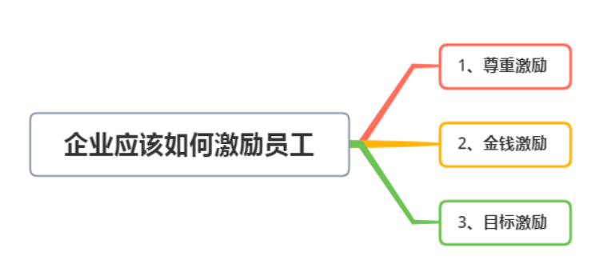
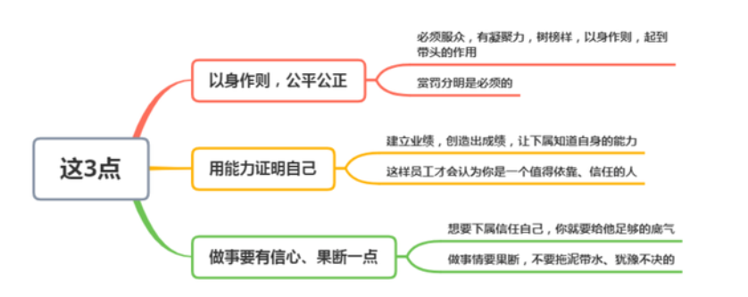

Management

Introduction：收纳管理相关的总结！

[TOC]

# 管理的三大任务

德鲁克认为管理有三个主要的任务：

## 第一，完成组织特定的目的和使命；

## 第二，使工作富有成效，员工有成就感；

## 第三，处理对社会的影响，承担社会责任。

https://www.xiaolincoding.com/redis/data_struct/data_struct.html#%E9%94%AE%E5%80%BC%E5%AF%B9%E6%95%B0%E6%8D%AE%E5%BA%93%E6%98%AF%E6%80%8E%E4%B9%88%E5%AE%9E%E7%8E%B0%E7%9A%84

# 管理者的四大职能：

第一设定目标，第二组织，第三激励与沟通，第四评估绩效，第五培养人才（包括培养管理者自己）。

## 1、计划职能：

计划职能要求管理者拟订组织愿景和使命、分析内外环境、确定组织目标等等，具体来说，就是要求管理者能够根据组织目标，提出组织前进的方向和方法，能够根据现有的资源，抓住外部的机会和规避外部的风险，最终的表现为拟定一套中长期的工作方案和预案。

## 2、组织职能：

组织职能要求管理者根据目标搭建组织框架、分配任务资源、明确权利义务等等，具体表现为，管理者要根据目标将计划分配落实到人，决定好由哪些人负责完成哪部分计划，他们之间的关系是什么？权利义务有哪些？如果相互协调和配合等问题。

## 3、领导职能：

领导职能要求管理者指引目标方向、激励员工士气、打造企业文化等等，具体表现为，管理者要协调前面组织之间的矛盾和关系，协调计划于实际之间的矛盾，协调上级和下属之间的关系，还要指导组织成员开展工作，不断激励和鼓励员工等等。

## 4、控制职能：

控制职能要求管理者纠偏组织行为、控制内外风险、收集信息反馈等等，具体表现为，管理者在拟定计划的同时，要建立一套控制机制，定期考察计划的落实情况，及时纠正错误行为。同时也要根据不断的收集信息，确保计划仍然有效，比如现在的环境是否和制定计划时一样，如果环境变了，计划本身是不是也需要改变等问题。

# 管理者的七项基本能力

**管理者首先是自我管理，然后才是管理他人，也就是说只有一个能够充分做好自我管理的人，才有可能成为一名好的管理者。**但事实上，做好自我管理就是一件非常难的事情，在此基础上再去精进各项管理技能，更是不容易。

根据我的个人经验，以及在HR工作中观察到的各级管理者的管理行为和表现，总结出管理者的七项基本能力，如果能够将这些事情都做好，绝对是一个事业成功的优秀管理者。

我说的事业成功的优秀管理者，不仅仅指能够去到更大的公司、做到更高岗位拿到更高工资，还意味着，每一个被这类管理者带过的员工，无论将来去到哪里，回忆起自己的职业生涯时，都会庆幸遇到过这样一位领导，我觉得这才是一名管理者最大的财富和成就。

## 01 专业能力

对一名管理者的专业能力的要求，并不体现在需要他们直接上手执行很多具体专业工作任务上，也正因如此，有非常多的观点认为管理者的专业能力不是最重要的。

这其实是一个大的误解。**事实上，对管理者的专业能力要求是体现在判断决策能力上的，也就是说，管理者对专业的理解仅停留在知道怎么做的层面是不够的，还要能够做到对一件事这么做会产生什么样的后果和影响有提前的预测和判断。**

## 02 向上管理能力

如果说做员工的时候，一个人还可以坚信只要自己把领导布置的工作踏踏实实完成就能够成为优秀员工，但做到管理层，必须改变也必须学会的基本能力之一就是向上管理。

因为当你成为管理层之后，直接上司和汇报对象不可能用基层管理者管理员工的方法来做管理：自己把所有要做的工作梳理好分配给下属完成，而只会盯一下大致方向，到时间直接找你要成绩要结果。

因此，**作为管理者，最基本的向上管理能力就是要经常主动找上级汇报工作进度、对工作的一些想法听取领导建议，否则，可能就意味着整个部门要经常做无用功和返工，这种错误一多，将是非常致命的。**

## 03 沟通协调能力

从员工到管理者、甚至到部门负责人，其中有一个很大的变化，就是要代表自己部门所承担的相关职能与其它部门的协作，比如，你是财务部门的一个主管或经理，如果其它部门有任何事项需要涉及到财务部门协助的，首先会找作为管理者的经理或主管。

同理，如果自己部门的工作，如果涉及到跨部门协作的，通常也需要管理者出面沟通协调，**同级之间、跨部门的沟通协作特别考验管理者的沟通协调能力。**

## 04 目标管理能力

通常来说，公司的整体战略都是确定好之后逐级往下层层分解的。

**作为一名管理者，理解公司和大部门的整体战略目标，并在此基础上分解自己部门或小组的工作目标，并在目标实施过程中进行跟进、纠偏、调整，直到最终完成目标，对齐公司和部门的整体目标，是其业务能力和管理能力的最集中体现。**

## 05 识人能力

作为管理者，组建自己的团队并让团队里的每一个人都能够到自己最擅长的领域工作，是一项保障团队业绩和目标达成的最重要工作。

而要做好这项工作，基本的识人能力不可少。**识人能力决定了能不能招聘到每个岗位上最适合的人选，还能够跟团队有比较好的配合；识人能力也决定了能不能发现团队里每个人的独特优势，并创造机会让他们发挥所长。**

## 06 辅导下属的能力

谁都希望自己的下属个个能力很强，交代下去一个任务就能够漂亮地完成并主动汇报，不让管理者费心。

但事实上，即便有这样的员工，要么他要求的薪水你给不起、要么他要求的岗位你给不起，真正靠谱的，还得管理者自己下功夫培养。

**培养员工是一项系统工程，其中的辅导下属的能力，就是一个需要管理者练习和提升的最基本管理技能。**

## 07 激励下属的能力

人都是需要激励的，所不同的是，通常能够被很快就提拔为管理者的人，擅长自我激励，但绝大多数员工，尤其是工作了多年的老员工，是需要来自上级的激励才能够更好地完成工作的。

因此，激励下属的能力也是管理者的重要基本管理技能之一。很多管理者觉得只要公司能够给员工更高的工资或奖金提成就能够激励员工，但公司又不肯，因此自己毫无办法。

事实上，远不是如此，无数的研究已经证明了，工资到一定的程度后，加薪完全激励不了员工，而**重塑工作的意义感和价值感、打造团队积极向上的部门文化等，才是激励下属更应该考虑的方面。**

# 管理的七条原则

第一条，管理是关于人的

第二条，因为管理涉及到人们在共同事业中的整合问题，所以管理是深深地植根于文化之中的。

第三条，每一个企业都有责任坚定不移地树立一个共同的目标和统一的价值观。如果没有这种责任，企业就会是一盘散沙。

第四条，管理必须要根据需要和机会的变化而变化，并且由此来促进企业和企业的成员能够得到更好的发展。

第五条，企业必须建立在沟通和个人责任之上。

第六条，我们评估一个企业的状况和业绩，不能用一个简单的标准，就好像评估一个人的健康，需要各种不同的标准一样。

第七条，对所有的企业来讲，我们都应该记住的最重要的一点就是——结果存在于企业的外部。

**CTO分内事**

**产品和技术规划（看方向）**

- 产品路线：技术产品规划
- 技术路线：技术选型、工程节奏等

**团队搭建和文化建设（带团队）**

- 根据产品和技术路线，组建团队。团队角色除了技术以外，还可能有产品、设计师、运营等。

> 经过两年发展，我组建的团队包含了产品经理、UI/UX设计师、前端、后端、[客户端](https://www.zhihu.com/search?q=客户端&search_source=Entity&hybrid_search_source=Entity&hybrid_search_extra={"sourceType"%3A"answer"%2C"sourceId"%3A2367888854})、Unity、QA等角色。

- 知道什么样的团队是好的团队。鼓励好的，批评不好的，招入好的，开掉不好的，最终形成了你的团队的梯队和文化。

> 奈飞公司关于团队文化说过类似的话：一个团队招什么人，开什么人，最终就形成了这个团队的文化。

**攻坚克难（解决难题）**

- 不同公司业务不同，面对的难题常常不同。有的难题是并发处理量跟不上业务量；有的难题是算法效果达不到业务要求；有的难题是产品技术必须快速响应来跟上业务的快速变化。

> 前几年有人争论CTO要不要写代码，其实每个公司发展阶段不同、业务不同，需要CTO解决的难题不同，就看要解决的难题是不是需要CTO自己写代码了。

做好这三个分内事儿，可难可易。说它难，是因为每一项，想做好都不容易，每个里面都有很多坑。说它不难，是因为大家过往经历中，或多或少都有些积累，谁也不是从0一下子就去做CTO了。

**如果职业目标定位为CTO，那你可以从这三个角度，刻意积累经验：看方向，带团队，解决难题。**

**还有三个重要的事儿**

**1. 与其他决策者充分沟通。**

比如要跟CEO等其他公司决策者，解释清楚，为什么他们想象的那个做不了，实际能够做什么，应该怎么做。这类事儿非常重要，需要花精力做好。

**2. 不能只看自己一亩三分地，要主动去盯其他部门的目标。**

CTO要决定公司在技术和技术产品上，投入多少资源，达到什么效果。而效果不是产品技术一条腿可以支撑的，市场销售运营等，作为另一条腿，目标规划要同步进行。**要关注公司各个部门的测算是否可以保证整体目标，积极同步信息和数据。避免任何一个团队成为背锅侠。**除非公司的商业模式只有产品和技术，或公司帐上现金充裕，不需要考虑商业模式——这样的情况极为罕见。

**3. CTO要时刻准备成为CEO的热备份。**

公司CEO需要集中精力忙外部事物时，CTO可能需要成为内部大总管。CTO在产品技术团队形成梯队后，就可以抽出精力，尽快在其他领域补充知识经验，尤其是财务、人力角度。我司在紧锣密鼓融资时，CEO天天在外面跑，公司所有部门Leader会双线汇报给CEO和我，日常决策差不多到我这就完事了。那段时间，我像是开启了另一条成长曲线，成长飞快。提前做些准备，在遇到这样的情境时，就能接得住。长远看，对CTO下一步的职业生涯或许也有益处。
