<div style="color:#16b0ff;font-size:50px;font-weight: 900;text-shadow: 5px 5px 10px var(--theme-color);font-family: 'Comic Sans MS';">Network</div>

<span style="color:#16b0ff;font-size:20px;font-weight: 900;font-family: 'Comic Sans MS';">Introduction</span>：收纳网络知识 总结！

[TOC]

# TCP

## 滑动窗口介绍

 在进行数据传输时，如果传输的数据比较大，就需要拆分为多个数据包进行发送。TCP 协议需要对数据进行确认后，才可以发送下一个数据包。发送端每发送一个数据包，都需要得到接收端的确认应答以后，才可以发送下一个数据包。这种一发一收的方式大大浪费了时间。为了避免这种情况，TCP引入了窗口概念，其可以一次发送多条数据，并接收多条应答。


>
> 窗口大小指的是不需要等待确认应答包而可以继续发送数据包的最大值，上图的窗口大小就是4000个字节(四个字段)
>
> 发送前四个字段的时候, 不需要等待任何ACK, 直接发送;
>
> 收到第一个ACK后, 滑动窗口向后移动, 继续发送第五个段的数据; 依次类推;
>
> 操作系统内核为了维护这个滑动窗口, 需要开辟 发送缓冲区 来记录当前还有哪些数据没有应答; 只有确认
>
> 应答过的数据, 才能从缓冲区删掉;
>
> 窗口越大, 则网络的吞吐率就越高;
>

 窗口大小指的是可以发送数据包的最大数量。在实际使用中，它可以分为两部分。第一部分表示数据包已经发送，但未得到确认应答包；第二部分表示允许发送，但未发送的数据包。在进行数据包发送时，当发送了最大数量的数据包（窗口大小数据包），有时不会同时收到这些数据包的确认应答包，而是收到部分确认应答包。

 那么，此时窗口就通过滑动的方式，向后移动，确保下一次发送仍然可以发送窗口大小的数据包。这样的发送方式被称为滑动窗口机制。设置窗口大小为 3，滑动窗口机制原理如图所示。

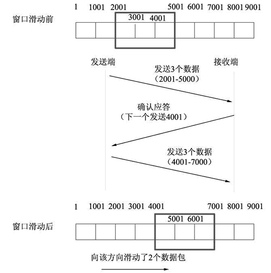

上图中，每 1000 个字节表示一个数据包。发送端同时发送了 3 个数据包（2001-5000），接收端响应的确认应答包为“下一个发送4001”，表示接收端成功响应了前两个数据包，没有响应最后一个数据包。此时，最后一个数据包要保留在窗口中。

由于窗口大小为 3，发送端除了最后一个包以外，还可以继续发送下两个数据包（5001-6000 和 6001-7000）。窗口滑动到 7001 处。

## 数据重发

在进行数据包传输时，难免会出现数据丢失情况。这种情况一般分为两种。

### 确认应答包(ACK)丢了

1. 发送端发送数据包(窗口大小为3)：同时发送 3 个数据包 1-1000、1001-2000 和 2001-3000。

2. 接收端返回确认应答包：接收端接收到这些数据，并给出确认应答包。数据包 1-1000 和数据包 2001-3000 的确认应答包没有丢失，但是数据包 1001-2000 的确认应答包丢失了。
3. 发送端第 2 次发送数据包：发送端收到接收端发来的确认应答包，虽然没有收到数据包 1001-2000 的确认应答包，但是收到了数据包 2001-3000 的确认应答包**(下一个是3001)**，于是判断第一次发送的 3 个数据包都成功到达了接收端。再次发送 3 个数据包 3001-4000、4001-5000 和 5001-6000。
4. 接收端返回确认应答包：接收端接收到这些数据，并给出确认应答包。数据包 3001-4000 和数据包 4001-5000 的确认应答包丢失了，但是数据包 5001-6000 没有丢失。
5. 发送端第 3 次发送数据包：发送端收到接收端发来的确认应答包，查看到数据包 5001-6000 收到了确认应答包**(下一个是6001)**。于是判断第 2 次发送的 3 个数据包都成功到达了接收端。
6.  由于序号是有序的，如果接收到后面数据的ACK，说明前面的数据已经被接收，只是发送的ACK丢包了。这种情况就表示前面的数据包已经成功被接收端接收了，发送端也就不需要重新发送前面的数据包了。

### 发送数据包丢失

1. 发送端发送数据包(窗口大小为3)：同时发送 3个数据包，分别为 1-1000、1001-2000 和 2001-3000。

2. 接收端返回确认应答包：接收端接收到这些数据，并给出确认应答包。接收端收到了数据包 1-1000，返回了确认应答包；但是数据包 1001-2000，在发送过程中丢失了，没有成功到达接收端。数据包 2001-3000 没有丢失，成功到达了接收端，但是该数据包不是接收端应该接收的数据包，数据包 1001-2000 才是真正应该接收的数据包。因此收到数据包 2001-3000 以后，接收端第一次返回下一个是 1001 的确认应答包。
3. 发送端发送数据包：发送端仍然继续向接收端发送 3个数据包，分别为 3001-4000、4001-5000 和 5001-6000。
4. 接收端返回确认应答包：接收端接收到这些数据，并给出确认应答包。当接收端收到数据包 3001-4000 时，发现不是自己应该接收的数据包 1001-2000，第二次返回下一个是 1001 的确认应答包。当接收端收到数据包 4001-5000 时，仍然发现不是自己应该接收的数据包 1001-2000，第三次返回**下一个是1001 的确认应答包。以此类推直到接收完所有数据包，接收端都返回下一个是1001 **的确认应答包。
5. 发送端重发数据包：发送端连续 3 次收到接收端发来的**下一个是1001 **的确认应答包，认为数据包 1001-2000 丢失了，就进行重发该数据包。
6. 接收端收到重发数据包：接收端收到重发数据包以后，查看这次是自己应该接收的数据包 1001-2000，并返回确认应答包，告诉发送端，下一个该接收 6001 的数据包了。
7. 发送端发送数据包：发送端收到确认应答包后，继续发送窗口大小为 3的数据包，分别为 6001-7000、7001-8000 和8001-9000。

***对于步骤6、7：由于之前2001-6000的数据接收端其实之前就已经收到了, 被放到了接收端操作系统内核的接收缓冲区中，所以直接发送6001开始的数据即可。***

## 流量控制

在使用滑动窗口机制进行数据传输时，发送方根据实际情况发送数据包，接收端接收数据包。但是，接收端处理数据包的能力是不同的，因此可能出现下面两种现象

- 如果窗口过小，发送端发送少量的数据包，接收端很快就处理了，并且还能处理更多的数据包。这样，当传输比较大的数据时需要不停地等待发送方，造成很大的延迟。

- 如果窗口过大，发送端发送大量的数据包，而接收端处理不了这么多的数据包，这样，就会堵塞链路。如果丢弃这些本应该接收的数据包，又会触发重发机制。


为了避免这种现象的发生，TCP 提供了流量控制。所谓的流量控制就是动态调节窗口大小发送数据包。发送端第一次以窗口大小**（第一次的窗口大小是根据链路带宽的大小来决定的）**发送数据包，接收端接收这些数据包，并返回确认应答包，告诉发送端自己下次希望收到的数据包是多少（新的窗口大小），发送端收到确认应答包以后，将以该窗口大小进行发送数据包。

- 首先发送端根据当前链路带宽大小决定发送数据包的窗口大小。假设初始窗口大小为3,因此发送端发送了 3 个数据包，分别为 1-1000、1001-2000 和 2001-3000。

- 接收端接收这些数据包，但是缓冲区只能处理 2 个数据包，第 3 个数据包 2001-3000 没有被处理。因此只返回前两个的确认应答包，并设置窗口大小为 2000，告诉发送端自己现在只能处理 2 个数据包，下一次请发送 2 个数据包。
- 发送端接收到确认应答包，查看到接收端返回窗口大小为 2000，知道接收端只处理了 2 个数据包。发过去的第 3 个数据包 2001-3000 没有被处理。这说明此时接收端只能处理 2 个数据包，第 3 个数据包还需要重新发送。
- 因此发送端发送 2 个数据包 2001-3000 和 3001-4000。接收端收到这两个数据包并进行了处理。此时，还是只能处理 2 个窗口，继续向发送端发送确认应答包，设置窗口为 2，告诉发送端，下一个应该接收 4001 的数据包。

### 窗口探测

但是，如果在接收端返回的确认应答包中，窗口设置为 0，则表示现在不能接收任何数据。这时，发送端将不会再发送数据包，只有等待接收端发送窗口更新通知才可以继续发送数据包。

如果这个更新通知在传输中丢失了，那么就可能导致无法继续通信。为了避免这样的情况发生，发送端会时不时地发送窗口探测包，该包仅有1个字节，用来获取最新的窗口大小的信息。

1. 发送端发送数据。发送端以窗口大小为 2000，发送了 2 个数据包，分别为 4001-5000 和 5001-6000。接收端接收到这些数据以后，缓冲区满了，无法再处理数据，于是向发送端返回确认应答包，告诉它下一个接收 6001 的数据，但是现在处理不了数据，先暂停发送数据，设置窗口大小为 0。
2. 发送端暂停发送数据。发送端收到确认应答包，查看到下一次发送的是 6001 的数据，但窗口大小为 0，得知接收端此时无法处理数据。此时，不进行发送数据，进入等待状态。
3. 接收端发送窗口大小更新包。当接收端处理完发送端之前发来的数据包以后，将会给发送端发送一个窗口大小更新包，告诉它，此时可以发送的数据包的数量。这里设置窗口大小为 2000，表示此时可以处理 2 个数据包，但是该数据包丢失了，没有发送到发送端。
4. 发送端发送窗口探测包。由于窗口大小更新包丢失，发送端的等待时间超过了重发超时时间。此时，发送端向接收端发送一个窗口探测包，大小为 1 字节，这里是 6001。
5. 接收端再次发送窗口大小更新包。接收端收到发送端发来的探测包，再次发送窗口大小更新包，窗口大小为 2000。
6. 发送端发送数据。发送端接收到窗口大小更新包，查看到应该发的是 6001 的数据包，窗口大小为2000，可以发送 2个数据包。因此发送了数据包，分别为 6001-7000和 7001-8000。

## 拥塞控制

虽然TCP有了滑动窗口这个大杀器, 能够高效可靠的发送大量的数据. 但是如果在刚开始阶段就发送大量的数据, 仍然可能引发问题.因为网络上有很多的计算机, 可能当前的网络状态就已经比较拥堵. 在不清楚当前网络状态下, 贸然发送大量的数据, 是很有可能引起雪上加霜的. 于是，TCP引入 慢启动 机制, 先发少量的数据, 探探路, 摸清当前的网络拥堵状态, 再决定按照多大的速度传输数据。

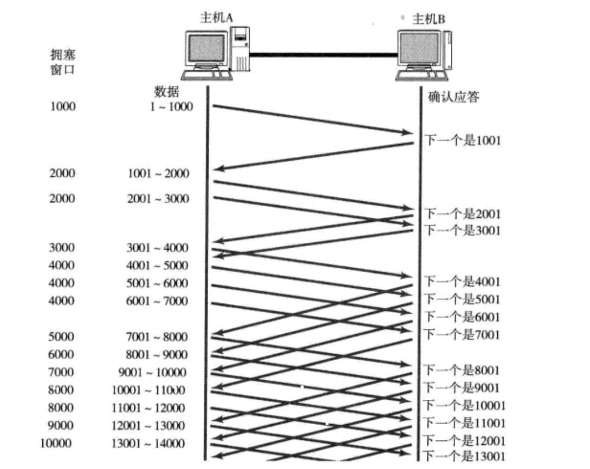

如上图所示

- 发送开始的时候, 定义拥塞窗口大小为1;

- 每次收到一个ACK应答, 拥塞窗口加1;
- 每次发送数据包的时候, 将拥塞窗口和接收端主机反馈的窗口大小做比较, 取较小的值作为实际发送的窗口;

**线增积减(和式增加，积式减少)**
像上面这样的拥塞窗口增长速度, 是指数级别的. “慢启动” 只是指初使时慢, 但是增长速度非常快，具体的增长如下所示

 刚开始的时候从1指数增长，到达阈值后开始线性增长，如果出现网络阻塞，直接减小到初始值，然后再次指数增长到达新的阈值(新阈值为上次阻塞窗口大小的一半)，再次线性增长直到网络阻塞，一直这样动态变换循环。

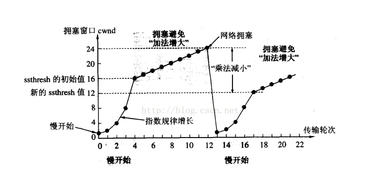

## 延迟应答

在之前的问题中我们提到，如果发送端发送数据后，接收数据的主机需要返回ACK应答, 但这时候如果立刻返回的话，窗口可能比较小(缓冲区的数据只处理了一部分)，所以TCP中采用了延迟应答机制，举个例子

>  现在有一个超市，里面卖泡面，假设库房最多存储100箱，隔段时间就有人来补货。有一天早上，超市还有50箱泡面时，补货的人来询问，现在需要补多少箱泡面，这时最多补货50箱(已经有50箱，库房只能装100箱)，但是白天肯定会卖出去一部分，如果这时候补货，第二天又要再次补货，就太麻烦。
>
>  所以老板给补货的人说，我晚上给你打电话，告诉你我要多少箱。那天白天卖出去了30箱，所以库房只剩20箱，于是老板晚上给补货的人打电话说，你明天给我补货80箱~
>

上述例子中，老板晚上告诉补货员的方式就相当于延迟应答。

那么所有的包都可以延迟应答么? 肯定也不是

> 数量限制: 每隔N个包就应答一次。(N一般为2)
>
> 时间限制: 超过最大延迟时间就应答一次。(时间一般为200 ms，必须小于超时重传时间，不然就重传了)
>

## 捎带应答

根据应用层协议，发送出去的消息到达对端，对端进行处理之后，会返回一个回执。即在很多情况下，客户端服务器在应用层也是“一发一收”的，意味着客户端给服务器说了“How are you”，服务器再给客户端返回ACK后，接着会给客户端回一个“Fine，thank you”，在延时应答的基础上，让ACK等待一段时间(不能超过超时重发时间)后和“Fine，thank you”通过一个包同时发送。

 另外接受数据以后如果立刻返回数据，就无法实现捎带应答，所以是在延迟应答的基础上，才能进行的捎带应答。延迟确认应该是能够提高网络利用率从而降低计算机处理负荷的一种较优的处理机制。

就像之前提到的问题：四次挥手可以只挥手三次吗？

> **四次挥手和“三次挥手”**
> **1、第一种情况**
>
> 从抓包来看是很正常的三次握手和四次挥断
>
> 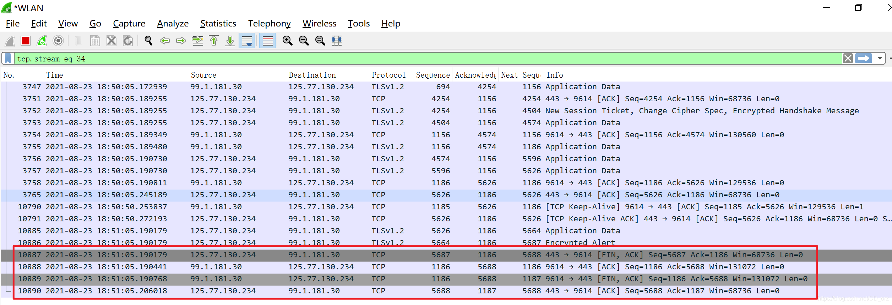
>
> 1.服务端FIN ：Seq = a , Ack = b #我想断开连接
> 2.客户端ACK：Seq = b, Ack = a+1 #收到，断开吧
> 3.客户端FIN ：Seq = b, Ack = a+1 #我也想断开连接
> 4.服务端ACK：Seq = a+1, Ack = b+1 #收到，断开吧
>
> **2、第二种情况**
>
> 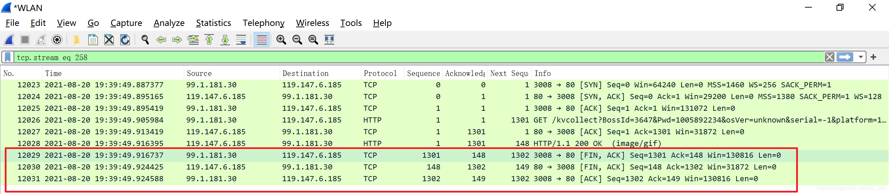
>
> 分别是:
>
> 1.客户端FIN ：Seq = a , Ack = b #我想断开连接
> 2.服务端FIN ：Seq = b, Ack = a+1 #收到，断开吧。我也想断开连接（case1的2,3步骤合并，ack delay了）
> 3.客户端ACK：Seq = a+1, Ack = b+1 #收到，断开吧
>
> **3、三次握手**（补充三次握手）
>
> 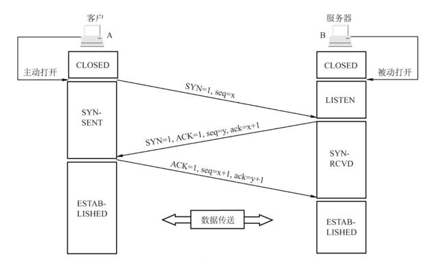

## 粘包问题

TCP粘包是指发送方发送的若干包数据到接收方接收时粘成一包，从接收缓冲区看，后一包数据的头紧接着前一包数据的尾。出现粘包现象的原因是多方面的，它既可能由发送方造成，也可能由接收方造成。

如果双方建立连接，需要在连接后一段时间内发送不同结构数据，如连接后，有好几种结构：

“你好不好”
“我很好”

那这样的话，如果发送方连续发送这个两个包出去，接收方一次接收可能会是"你好不好我很好"这样对方可能就傻了，到底是好还是不好？

不知道，因为协议没有规定这么诡异的字符串，所以要处理把它分包，怎么分也需要双方组织一个比较好的包结构

如何处理粘包问题？

**方式1:在头加一个数据长度之类的包**
比如，上述例子改为 “4你好不好3我很好”

 这样就知道了，4就表示后面的数据内容应该是4个，3也类似，之前讲过的TCP服务器的Content-length字段就是这个作用

**方式2：使用特殊标记来区分消息间隔**

比如，上述例子改为 “你好不好；我很好”

用**；当做两个包的分隔符，之前讲到的TCP服务器中，响应头和响应体中间的响应空行**就是这个作用

## 保活机制

TCP协议中有长连接和短连接之分。短连接环境下，数据交互完毕后，主动释放连接；

双方建立交互的连接，但是并不是一直存在数据交互，有些连接会在数据交互完毕后，主动释放连接，而有些不会，那么在长时间无数据交互的时间段内，交互双方都有可能出现掉电、死机、异常重启，还是中间路由网络无故断开、NAT超时等各种意外。

当这些意外发生之后，这些TCP连接并未来得及正常释放，那么，连接的另一方并不知道对端的情况，它会一直维护这个连接，长时间的积累会导致非常多的半打开连接，造成端系统资源的消耗和浪费，为了解决这个问题，在传输层可以利用TCP的保活报文来实现，这就有了TCP的Keep-alive（保活探测）机制。

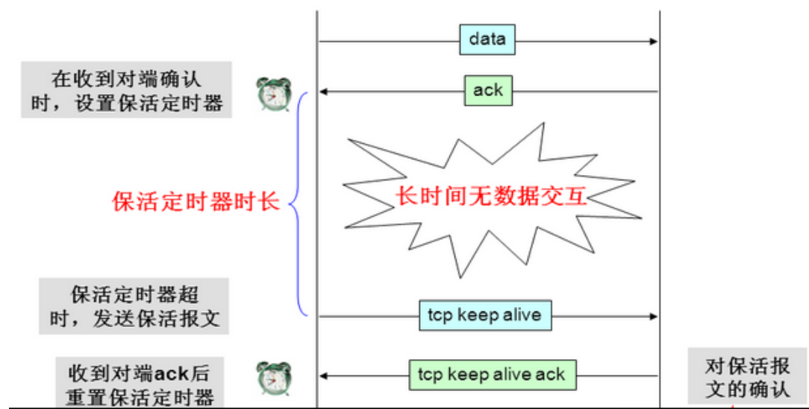


## Nagle算法

- 为了尽可能的利用网络带宽，TCP总是希望尽可能的发送足够大的数据。（一个连接会设置 MSS(单个报文的最大报文段长度) 参数，因此，TCP/IP希望每次都能够以MSS尺寸的数据块来发送数据）。Nagle算法就是为了尽可能发送大块数据，避免网络中充斥着许多小数据块。

- Nagle算法的基本定义是任意时刻，最多只能有一个未被确认的小段。
  所谓“小段”，指的是小于MSS尺寸的数据块，所谓“未被确认”，是指一个数据块发送出去后，没有收到对方发送的ACK确认该数据已收到。
- Nagle算法的规则（可参考tcp_output.c文件里tcp_nagle_check函数注释）：


> （1）如果包长度达到MSS ，则允许发送； #即达到单个包最大值，此刻立即发出数据包
> （2）如果该包含有FIN，则允许发送；
> （3）设置了TCP_NODELAY选项，则允许发送；#打开TCP_NODELAY选项，则意味着无论数据包是多么的小，都立即发送(不考虑拥塞窗口)
> （4）未设置TCP_CORK选项时，若所有发出去的小数据包（包长度小于MSS）均被确认，则允许发送；#当TCP_CORK选项被设置时，TCP链接不会发送任何的小包，即只有当数据量达到MSS时，才会被发送
> （5）上述条件都未满足，但发生了超时（一般为200ms），则立即发送。


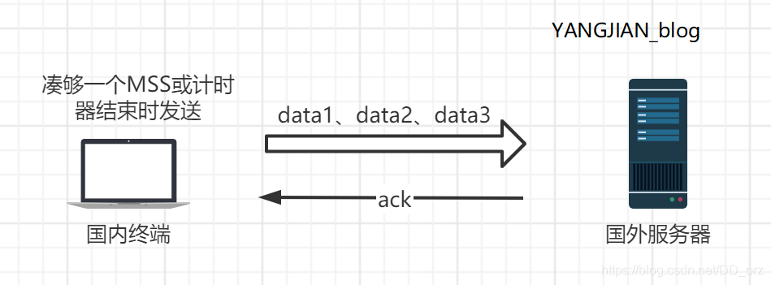同样Nagle算法也有其弊端，即不适用于所有场景，像上图的这个例子，远程终端无法实时显示输入的字符，也无法通过TAB键来实时补全指令，因为它要收集齐一个MSS或者等超时后才发送给服务器。另在一些敏感业务和对实时数据要求高的场景，比如CSGO下，你看到敌人要偷袭你的队友，恰好你黄雀在后，准备老六，结果点了鼠标没反应，因为点击一次产生的数据没到一个MSS(单个报文的最大报文段长度)，点击鼠标的指令没有发送给服务器，那你就等着被队友抽。

# vxlan


# Linux network

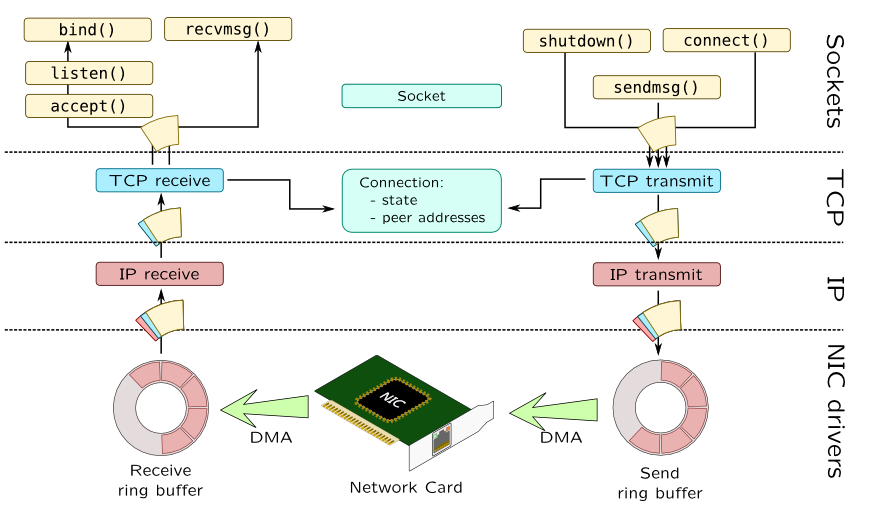

## Tap/Tun,Veth, Network Namespace

## Iptables/netfilter

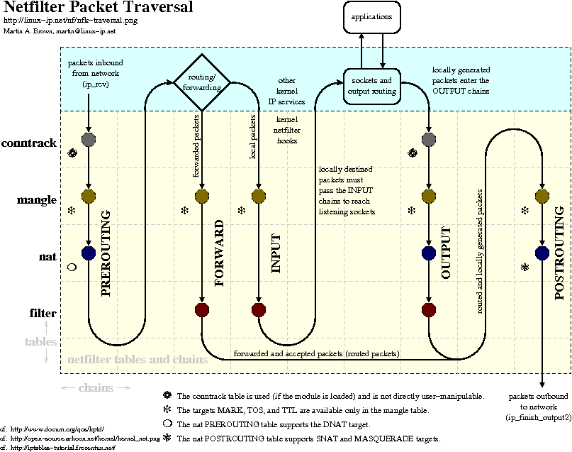

## Openvswitch/OVN

## eBPF

### **e****BPF的历史**

BPF 是 Linux 内核中高度灵活和高效的类似虚拟机的技术，允许以安全的方式在各个挂钩点执行字节码。它用于许多 Linux 内核子系统，最突出的是网络、跟踪和安全（例如沙箱）。

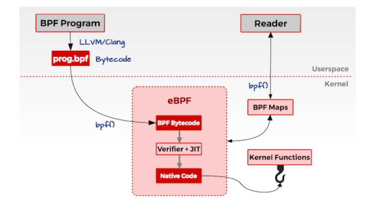

**BPF架构**

BPF 是一个通用目的 RISC 指令集，其最初的设计目标是：用 C 语言的一个子集编 写程序，然后用一个编译器后端（例如 LLVM）将其编译成 BPF 指令，稍后内核再通 过一个位于内核中的（in-kernel）即时编译器（JIT Compiler）将 BPF 指令映射成处理器的原生指令（opcode ），以取得在内核中的最佳执行性能。

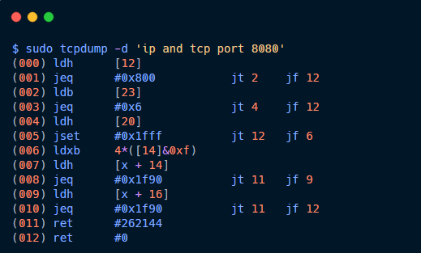

**BPF指令**

尽管 BPF 自 1992 年就存在，扩展的 Berkeley Packet Filter (eBPF) 版本首次出现在 Kernel3.18中，如今被称为“经典”BPF (cBPF) 的版本已过时。许多人都知道 cBPF是tcpdump使用的数据包过滤语言。现在Linux内核只运行 eBPF，并且加载的 cBPF 字节码在程序执行之前被透明地转换为内核中的eBPF表示。除非指出 eBPF 和 cBPF 之间的明确区别，一般现在说的BPF就是指eBPF。

### **e****BPF总体设计**

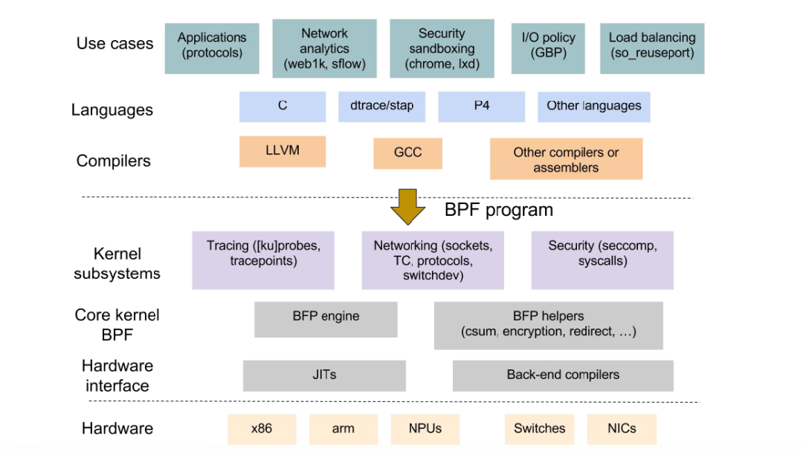

  

- BPF 不仅通过提供其指令集来定义自己，而且还通过提供围绕它的进一步基础设施，例如充当高效键/值存储的映射、与内核功能交互并利用内核功能的辅助函数、调用其他 BPF 程序的尾调用、安全加固原语、用于固定对象（地图、程序）的伪文件系统，以及允许将 BPF 卸载到网卡的基础设施。
- LLVM 提供了一个 BPF后端，因此可以使用像 clang 这样的工具将 C 编译成 BPF 目标文件，然后可以将其加载到内核中。BPF与Linux 内核紧密相连，允许在不牺牲本机内核性能的情况下实现完全可编程。

eBPF总体设计包括以下几个部分：

**eBPF Runtime**

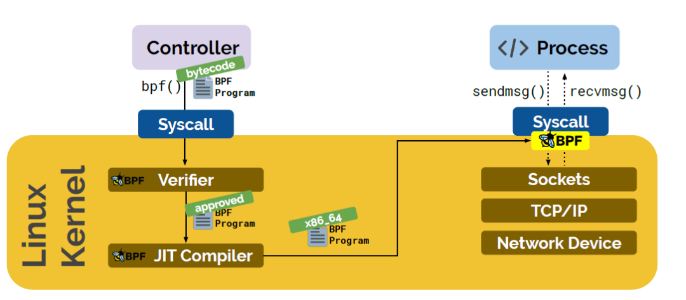


- 安全保障 ： eBPF的verifier 将拒绝任何不安全的程序并提供沙箱运行环境
- 持续交付： 程序可以更新在不中断工作负载的情况下
- 高性能：JIT编译器可以保证运行性能

**eBPF Hooks**

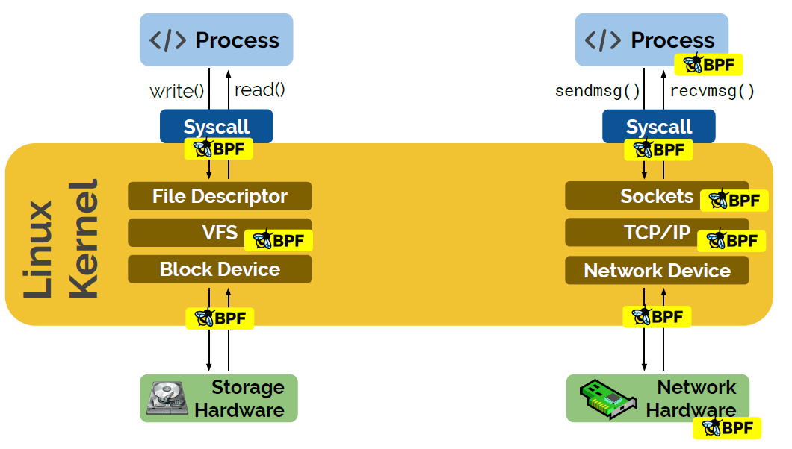

- 内核函数 (kprobes)、用户空间函数 (uprobes)、系统调用、fentry/fexit、跟踪点、网络设备 (tc/xdp)、网络路由、TCP 拥塞算法、套接字（数据面）

**eBPF Maps**

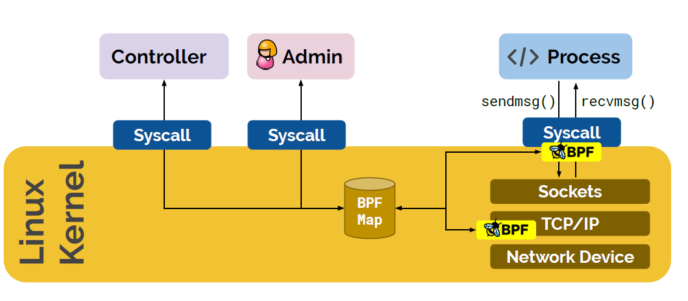

Map 类型

\- Hash tables, Arrays

\- LRU (Least Recently Used)

\- Ring Buffer

\- Stack Trace

\- LPM (Longest Prefix match)

作用

- 程序状态
- 程序配置
- 程序间共享数据
- 和用户空间共享状态、指标和统计

**eBPF Helpers**

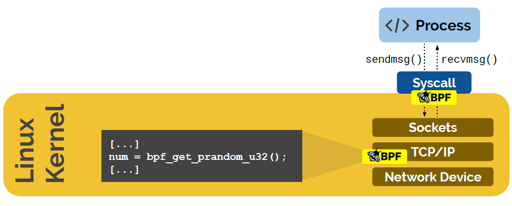


有哪些Helpers？

- 随机数
- 获取当前时间
- map访问
- 获取进程/cgroup 上下文
- 处理网络数据包和转发
- 访问套接字数据
- 执行尾调用
- 访问进程栈
- 访问系统调用参数
- ...

**eBPF Tail and Function Calls**


尾调用有什么用？

● 将程序链接在一起

● 将程序拆分为独立的逻辑组件

● 使 BPF 程序可组合

函数调用有什么用？

● 重用内部的功能程序

● 减少程序大小（避免内联）

**eBPF JIT Compiler**

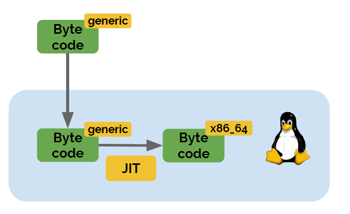

- 确保本地执行性能而不需要了解CPU
- 将 BPF字节码编译到CPU架构特定指令集

### **eBPF可以做什么？**

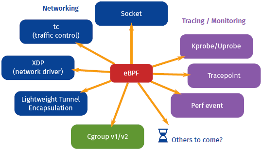


**eBPF 开源 Projects**

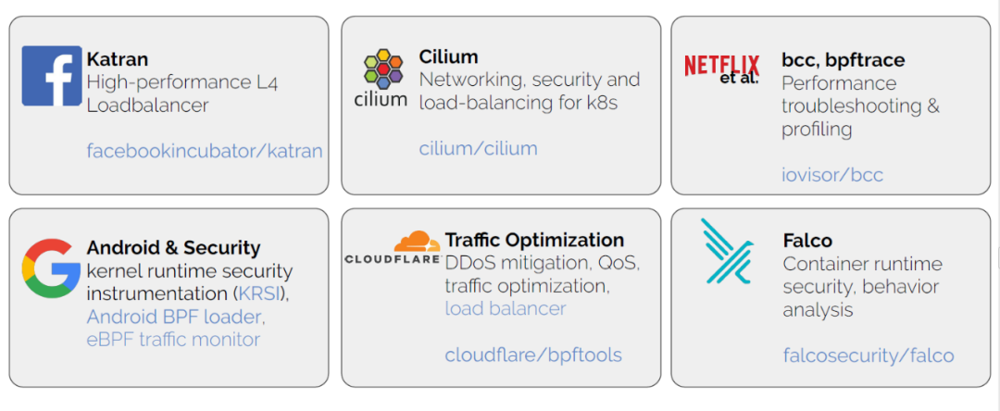

**Cilium**

- Cilium 是开源软件，用于Linux容器管理平台（如 Docker 和 Kubernetes）部署的服务之间的透明通信和提供安全隔离保护。
- Cilium基于微服务的应用，使用HTTP、gRPC、Kafka等轻量级协议API相互通信。
- Cilium 是位于 Linux kernel 与容器编排系统的中间层。向上可以为容器配置网络，向下可以向 Linux 内核生成 BPF 程序来控制容器的安全性和转发行为。
- 利用 Linux BPF，Cilium 保留了透明地插入安全可视性 + 强制执行的能力，但这种方式基于服务 /pod/ 容器标识（与传统系统中的 IP 地址识别相反），并且可以根据应用层进行过滤 （例如 HTTP）。因此，通过将安全性与寻址分离，Cilium 不仅可以在高度动态的环境中应用安全策略，而且除了提供传统的第 3 层和第 4 层分割之外，还可以通过在 HTTP 层运行来提供更强的安全隔离。
- BPF 的使用使得 Cilium 能够以高度可扩展的方式实现以上功能，即使对于大规模环境也不例外。

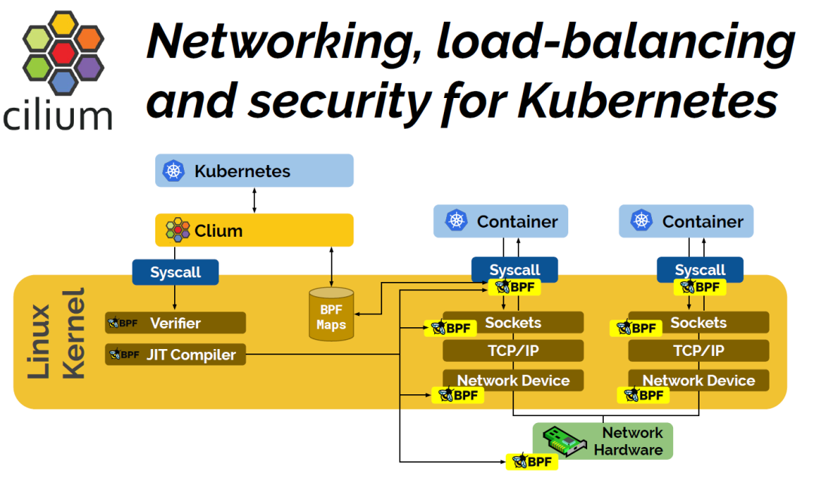

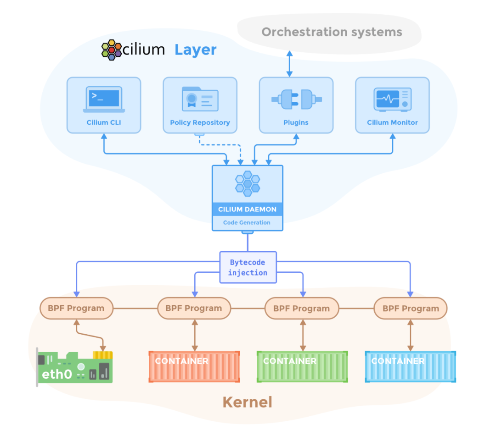

对比传统容器网络（采用iptables/netfilter）：

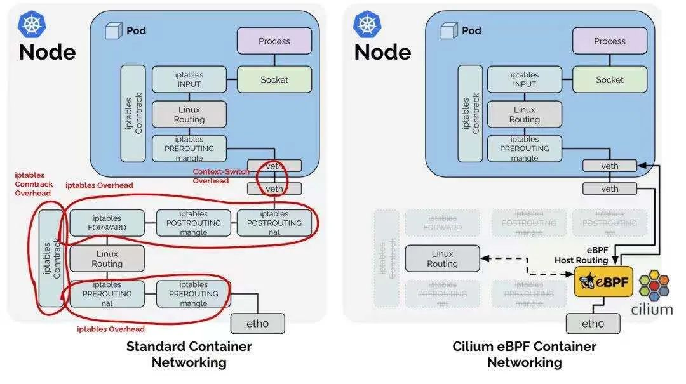

- eBPF主机路由允许绕过主机命名空间中所有的 iptables 和上层网络栈，以及穿过Veth对时的一些上下文切换，以节省资源开销。网络数据包到达网络接口设备时就被尽早捕获，并直接传送到Kubernetes Pod的网络命名空间中。在流量出口侧，数据包同样穿过Veth对，被eBPF捕获后，直接被传送到外部网络接口上。eBPF直接查询路由表，因此这种优化完全透明。
- 基于eBPF中的kube-proxy网络技术正在替换基于iptables的kube-proxy技术，与Kubernetes中的原始kube-proxy相比，eBPF中的kuber-proxy替代方案具有一系列重要优势，例如更出色的性能、可靠性以及可调试性等等。

**BCC(BPF Compiler Collection)**

BCC 是一个框架，它使用户能够编写嵌入其中的 eBPF 程序的 Python 程序。该框架主要针对涉及应用程序和系统分析/跟踪的用例，其中 eBPF 程序用于收集统计信息或生成事件，用户空间中的对应部分收集数据并以人类可读的形式显示。运行 python 程序将生成 eBPF 字节码并将其加载到内核中。

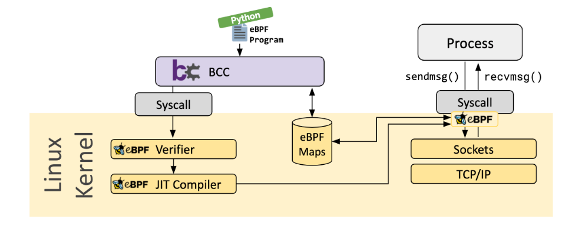

bpftrace

bpftrace 是一种用于 Linux eBPF 的高级跟踪语言，可在最近的 Linux 内核 (4.x) 中使用。bpftrace 使用 LLVM 作为后端将脚本编译为 eBPF 字节码，并利用 BCC 与 Linux eBPF 子系统以及现有的 Linux 跟踪功能进行交互：内核动态跟踪 (kprobes)、用户级动态跟踪 (uprobes) 和跟踪点. bpftrace 语言的灵感来自 awk、C 和前身跟踪器，例如 DTrace 和 SystemTap。

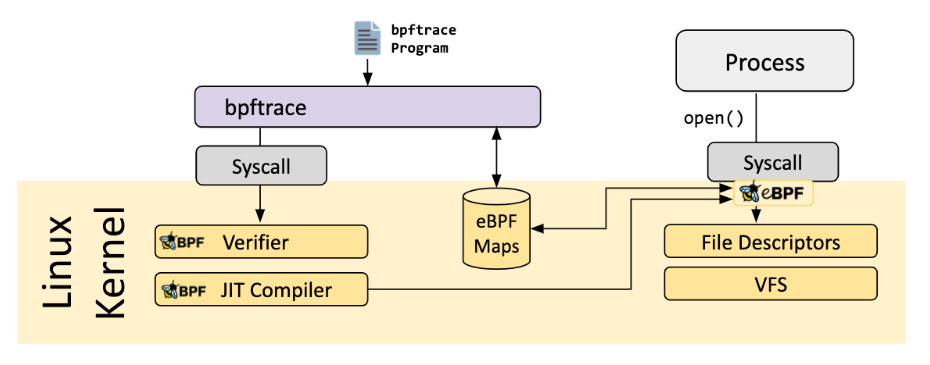

eBPF Go 库

eBPF Go 库提供了一个通用的 eBPF 库，它将获取 eBPF 字节码的过程与 eBPF 程序的加载和管理解耦。eBPF 程序通常是通过编写高级语言创建的，然后使用 clang/LLVM 编译器编译为 eBPF 字节码。

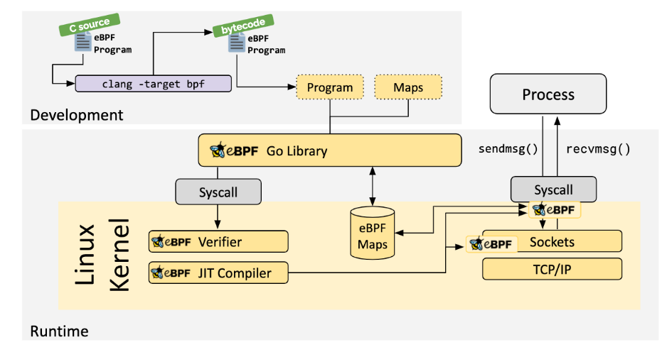

libbpf C/C++ 库

libbpf 库是一个基于 C/C++ 的通用 eBPF 库，它有助于解耦从 clang/LLVM 编译器生成的 eBPF 目标文件加载到内核中，并通过提供易于使用的库 API 来抽象与 BPF 系统调用的交互应用程序。

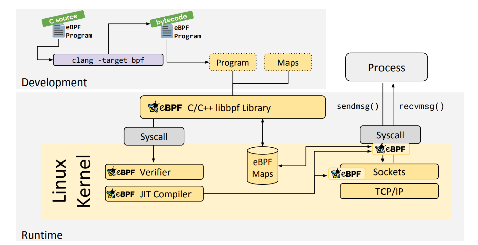

## XDP

XDP的全称是： **eXpress Data Path**

XDP 是Linux 内核中提供高性能、可编程的网络数据包处理框架。

**XDP整体框架**

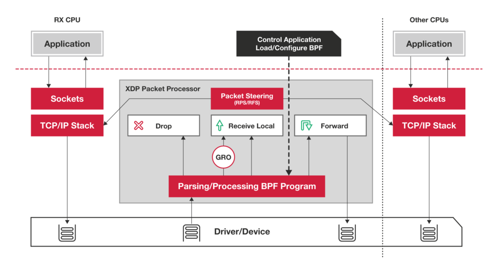

- 直接接管网卡的RX数据包（类似DPDK用户态驱动）处理；
- 通过运行BPF指令快速处理报文；
- 和Linux协议栈无缝对接；

### **XDP总体设计**

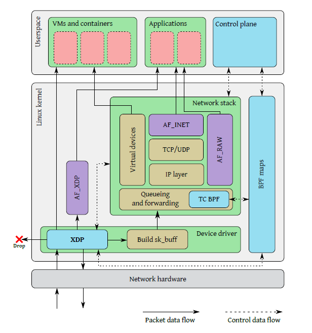

XDP总体设计包括以下几个部分：

**XDP驱动**

网卡驱动中XDP程序的一个挂载点，每当网卡接收到一个数据包就会执行这个XDP程序；XDP程序可以对数据包进行逐层解析、按规则进行过滤，或者对数据包进行封装或者解封装，修改字段对数据包进行转发等；

**BPF虚拟机**

并没有在图里画出来，一个XDP程序首先是由用户编写用受限制的C语言编写的，然后通过clang前端编译生成BPF字节码，字节码加载到内核之后运行在eBPF虚拟机上，虚拟机通过即时编译将XDP字节码编译成底层二进制指令；eBPF虚拟机支持XDP程序的动态加载和卸载；

**BPF maps**

存储键值对，作为用户态程序和内核态XDP程序、内核态XDP程序之间的通信媒介，类似于进程间通信的共享内存访问；用户态程序可以在BPF映射中预定义规则，XDP程序匹配映射中的规则对数据包进行过滤等；XDP程序将数据包统计信息存入BPF映射，用户态程序可访问BPF映射获取数据包统计信息；

**BPF程序校验器**

XDP程序肯定是我们自己编写的，那么如何确保XDP程序加载到内核之后不会导致内核崩溃或者带来其他的安全问题呢？程序校验器就是在将XDP字节码加载到内核之前对字节码进行安全检查，比如判断是否有循环，程序长度是否超过限制，程序内存访问是否越界，程序是否包含不可达的指令；

### **XDP Action**

XDP用于报文的处理，支持如下action：

```crystal
enum xdp_action {
    XDP_ABORTED = 0,
    XDP_DROP,
    XDP_PASS,
    XDP_TX,
    XDP_REDIRECT,
};
```

- XDP_DROP：在驱动层丢弃报文，通常用于实现DDos或防火墙
- XDP_PASS：允许报文上送到内核网络栈，同时处理该报文的CPU会分配并填充一个skb，将其传递到GRO引擎。之后的处理与没有XDP程序的过程相同。
- XDP_TX：从当前网卡发送出去。
- XDP_REDIRECT：从其他网卡发送出去。
- XDP_ABORTED：表示程序产生了异常，其行为和 XDP_DROP相同，但 XDP_ABORTED 会经过 trace_xdp_exception tracepoint，因此可以通过 tracing 工具来监控这种非正常行为。

### **AF_XDP**

AF_XDP 是为高性能数据包处理而优化的地址族，AF_XDP 套接字使 XDP 程序可以将帧重定向到用户空间应用程序中的内存缓冲区。

**XDP设计原则**

- XDP 专为高性能而设计。它使用已知技术并应用选择性约束来实现性能目标
- XDP 还具有可编程性。无需修改内核即可即时实现新功能
- XDP 不是内核旁路。它是内核协议栈的快速路径
- XDP 不替代TCP/IP 协议栈。与协议栈协同工作
- XDP 不需要任何专门的硬件。它支持网络硬件的少即是多原则

**XDP技术优势**

**及时处理**

- 在网络协议栈前处理，由于 XDP 位于整个 Linux 内核网络软件栈的底部，能够非常早地识别并丢弃攻击报文，具有很高的性能。可以改善 iptables 协议栈丢包的性能瓶颈
- DDIO
- Packeting steering
- 轮询式

**高性能优化**

- 无锁设计
- 批量I/O操作
- 不需要分配skbuff
- 支持网络卸载
- 支持网卡RSS

**指令虚机**

- 规则优化，编译成精简指令，快速执行
- 支持热更新，可以动态扩展内核功能
- 易编程-高级语言也可以间接在内核运行
- 安全可靠，BPF程序先校验后执行，XDP程序没有循环

**可扩展模型**

- 支持应用处理（如应用层协议GRO）
- 支持将BPF程序卸载到网卡
- BPF程序可以移植到用户空间或其他操作系统

**可编程性**

- 包检测，BPF程序发现的动作
- 灵活（无循环）协议头解析
- 可能由于流查找而有状态
- 简单的包字段重写（encap/decap）

### **XDP 工作模式**

XDP 有三种工作模式，默认是 `native`（原生）模式，当讨论 XDP 时通常隐含的都是指这 种模式。

- Native XDP

  默认模式，在这种模式中，XDP BPF 程序直接运行在网络驱动的早期接收路径上（ early receive path）。

- Offloaded XDP

  在这种模式中，XDP BPF程序直接 offload 到网卡。

- Generic XDP

  对于还没有实现 native 或 offloaded XDP 的驱动，内核提供了一个 generic XDP 选 项，这种设置主要面向的是用内核的 XDP API 来编写和测试程序的开发者，对于在生产环境使用XDP，推荐要么选择native要么选择offloaded模式。

### **XDP vs DPDK**

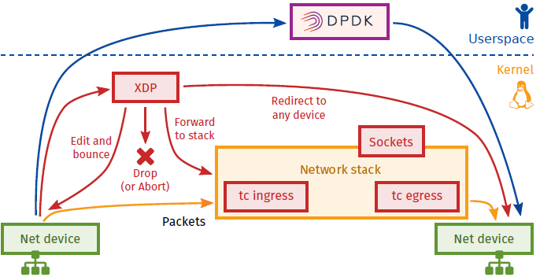


相对于DPDK，XDP：

**优点**

- 无需第三方代码库和许可
- 同时支持轮询式和中断式网络
- 无需分配大页
- 无需专用的CPU
- 无需定义新的安全网络模型

**缺点**

注意XDP的性能提升是有代价的，它牺牲了通用型和公平性

- XDP不提供缓存队列（qdisc），TX设备太慢时直接丢包，因而不要在RX比TX快的设备上使用XDP
- XDP程序是专用的，不具备网络协议栈的通用性

**如何选择？**

- 内核延伸项目，不想bypass内核的下一代高性能方案；
- 想直接重用内核代码；
- 不支持DPDK程序环境；

**XDP适合场景**

- DDoS防御
- 防火墙
- 基于XDP_TX的负载均衡
- 网络统计
- 流量监控
- 栈前过滤/处理
- ...

**XDP例子**

下面是一个最小的完整 XDP 程序，实现丢弃包的功能（`xdp-example.c`）：

```cpp
#include <linux/bpf.h>
 
#ifndef __section
# define __section(NAME)                  \
   __attribute__((section(NAME), used))
#endif
 
__section("prog")
int xdp_drop(struct xdp_md *ctx)
{
    return XDP_DROP;
}
 
char __license[] __section("license") = "GPL";
```

用下面的命令编译并加载到内核：

```crystal
$ clang -O2 -Wall -target bpf -c xdp-example.c -o xdp-example.o

$ ip link set dev em1 xdp obj xdp-example.o
```

> 以上命令将一个 XDP 程序 attach 到一个网络设备，需要是 Linux 4.11 内核中支持 XDP 的设备，或者 4.12+ 版本的内核。

## DPDK

## VPP