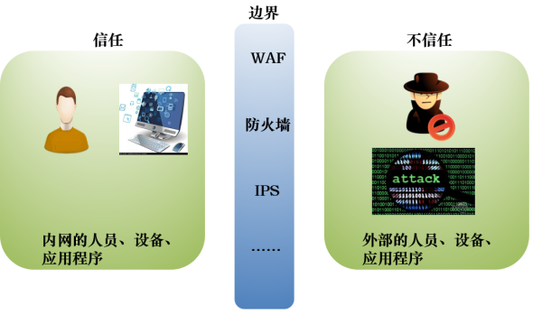
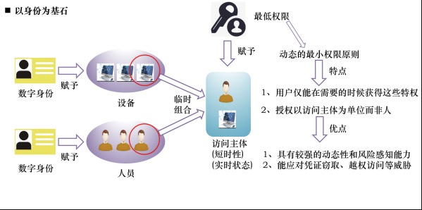
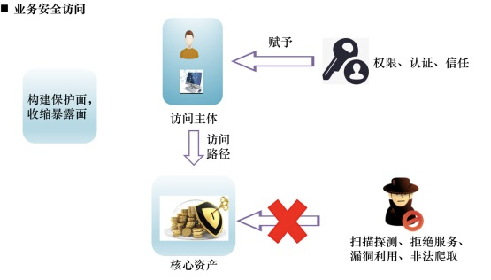
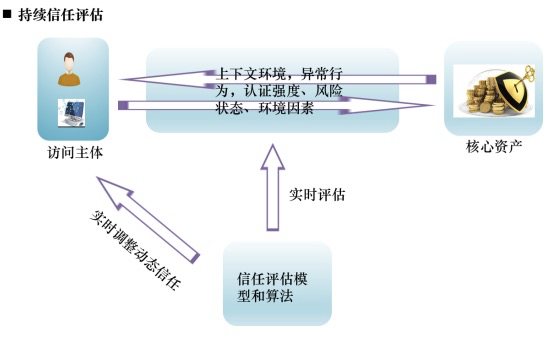
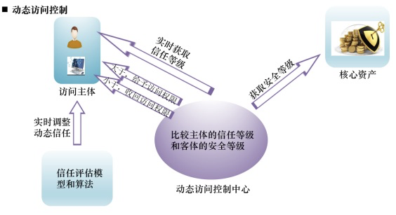

安全

Introduction：收纳安全相关的技术等总结！

[TOC]

# 安全理论

## 零信任架构

企业的网络基础设施日益复杂，安全边界逐渐模糊。一方面，云计算、移动互联等技术的采用让企业的人和业务、数据“走”出了企业的边界；另一方面，大数据、物联网等新业务的开放协同需求导致了外部人员、平台和服务“跨”过了企业的数字护城河。

企业的安全边界正在逐渐瓦解，传统的基于边界的网络安全架构和解决方案难以适应现代企业网络基础设施，亟需新的网络安全架构应对现代复杂的企业网络基础设施，应对日益严峻的网络威胁形势，零信任架构在这种背景下应运而生，学术界和产业界投入了大量精力进行研究。

图 1 基于边界的传统网络安全架构

### 一、零信任的诞生

零信任的最早雏形源于2004年成立的耶利哥论坛(Jericho Forum )，其成立的使命正是为了定义无边界趋势下的网络安全问题并寻求解决方案。

2010年，零信任这个术语正式出现，并指出所有的网络流量都是不可信的，这个时期专注于通过微隔离对网络进行细粒度的访问控制以便限制攻击者的横向移动。

以身份为基石的架构体系逐渐得到业界主流的认可。

2014年，Google基于内部项目BeyondCorp的研究成果，构建零信任架构。

2017年，Gartner将其自适应安全架构优化为持续自适应风险与信任评估构架。

### 二、零信任的定义

零信任本质是以身份为基石的动态可信访问控制。它需要满足五个准则：

- 网络无时无刻不处于危险的环境中;
- 网络中自始至终存在外部或内部威胁;
- 网络的位置不足以决定网络的可信程度;
- 所有的设备、用户和网络流量都应当经过认证和授权;
- 安全策略必须是动态的，并基于尽可能多的数据源计算而来。

根据零信任的定义和准则，可以提取、凝练出四个要素：分别是

(1)身份为基石，

(2)业务安全访问，

(3)持续信任评估，

(4)动态访问控制。

### 三、零信任架构模型

(一)以身份为基石

基于身份而非网络位置来构建访问控制体系，首先需要为网络中的人和设备赋予数字身份，将身份化的人和设备进行运行时组合构建访问主体，并为访问主体设定其所需的最小权限。

图 2 以身份为基石

(二)业务安全访问

零信任架构关注业务保护面的构建，通过业务保护面实现对资源的保护，在零信任架构中，应用、服务、接口、数据都可以视作业务资源。通过构建保护面实现对暴露面的收缩，要求所有业务默认隐藏，根据授权结果进行最小限度的开放，所有的业务访问请求都应该进行全流量加密和强制授权，业务安全访问相关机制需要尽可能工作在应用协议层。

图 3业务安全访问

(三)持续信任评估

持续信任评估是零信任架构从零开始构建信任的关键手段，通过信任评估模型和算法，实现基于身份的信任评估能力，同时需要对访问的上下文环境进行风险判定，对访问请求进行异常行为识别并对信任评估结果进行调整。

图 4 持续信任评估

(四)动态访问控制

动态访问控制是零信任架构的安全闭环能力的重要体现。建议通过RBAC和ABAC的组合授权实现灵活的访问控制基线，基于信任等级实现分级的业务访问，同时，当访问上下文和环境存在风险时，需要对访问权限进行实时干预并评估是否对访问主体的信任进行降级。

图 5 动态访问控制

### 四、零信任架构组件

基于零信任模型架构，以搭建面向实际应用的零信任系统为目标，需要依赖于四个核心组件—

(1)可信代理，

(2)动态访问控制引擎，

(3)信任评估引擎，

(4)身份安全基础设施。

(一)可信代理

可信代理是零信任架构的数据平面组件，是确保业务安全访问的第一道关口，是动态访问控制能力的策略执行点。

可信代理拦截访问请求后，通过动态访问控制引擎对访问主体进行认证，对访问主体的权限进行动态判定。只有认证通过、并且具有访问权限的访问请求才予以放行。

(二)动态访问控制引擎

动态访问控制引擎和可信代理联动，对所有访问请求进行认证和动态授权，是零信任架构控制平面的策略判定点。

动态访问控制引擎对所有的访问请求进行权限判定，权限判定不再基于简单的静态规则，而是基于上下文属性、信任等级和安全策略进行动态判定。

(三)信任评估引擎

信任评估引擎是是零信任架构中实现持续信任评估能力的核心组件，和动态访问控制引擎联动，为其提供信任等级评估作为授权判定依据。

信任评估引擎持续接收可信代理、动态访问控制引擎的日志信息，结合身份库、权限库数据，对身份进行持续画像，对访问行为进行持续分析，对信任进行持续评估，为动态访问控制引擎提供决策依据。

另外，信任评估引擎也可以接收外部安全分析平台的分析结果，这些外部风险源可以很好的补充身份分析所需的场景数据，丰富上下文，从而进行更精准的风险识别和信任评估。

(四)身份安全基础设施

身份基础设施是是实现零信任架构以身份为基石能力的关键支撑组件。

身份基础设施至少包含身份管理和权限管理功能组件，通过身份管理实现各种实体的身份化及身份生命周期管理，通过权限管理，对授权策略进行细粒度的管理和跟踪分析。

### 五 、思考与总结

通过从零信任的发展、定义、模型架构、模型组件等角度纵深剖析零信任架构，我们最终进行了如下总结与思考。

零信任架构目前只是应用于企业网络系统的防御，实际应用到公共服务中目前还存在着一些的困难。具体原因包括：

- 零信任的原则是以身份为基石，为每个参与到网络之中的角色分配一个具体的数字身份，而真正的公共服务中角色数量过于庞大，为每个角色分配数字身份进行权限控制会导致网络负载过大的问题。
- 零信任架构存在着一个权限控制中心，这个控制中心必须位于绝对安全的位置，如企业内网的防护中心，而公共服务较难做到这一点。