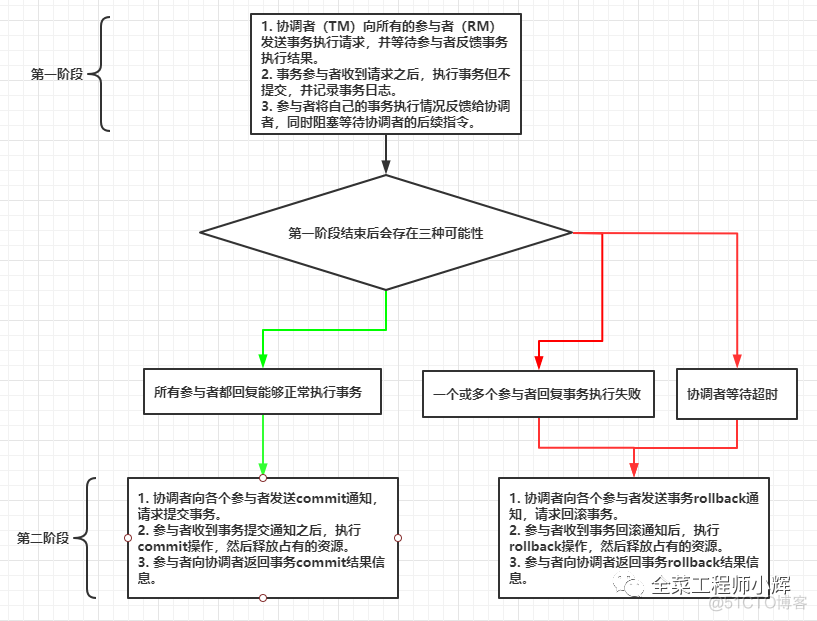

# 一文理解分布式事务的解决方案

单体数据库不涉及网络交互，所以在多表之间实现事务是比较简单的，这种事务称之为本地事务。

但是单体数据库的性能达到瓶颈的时候，就需要分库，就会出现跨库(数据库实例)的事务需求；随着企业应用的规模越来越大，企业会进一步进行服务化改造，以满足业务增长的需求；当前微服务架构越来越流行，跨服务的事务场景也会越来越多。

这些都属于分布式事务。分布式事务是指是指事务的发起者、参与者、数据资源服务器以及事务管理器分别位于分布式系统的不同节点之上。

概括起来，分布式事务有三种场景：

1. 跨数据库分布式事务

2. 跨服务分布式事务

3. 混合式分布式事务


本文将介绍分布式事务常见的解决方案：

1. 2PC

2. 3PC

3. TCC

4. Saga事务

5. 基于本地消息表机制

6. 基于事务消息机制

7. 最大努力通知机制


常见解决方案
分布式事务是由多个本地事务组成的，分布式事务跨越了多设备，之间又经历的复杂的网络，可想而知想要实现严格的事务道路阻且长。

## 2PC

二阶段提交(Two-phase Commit，简称2PC)，是指为了使基于分布式系统架构下的所有节点在进行事务提交时保持一致性而设计的一种算法(Algorithm)。

整体分为两个阶段，如图所示。



**2PC的优缺点**
2PC的优点是能利用参与者（RM）自身的功能进行本地事务的提交和回滚，对业务逻辑零侵入（相对TCC解决方案）。

但2PC也存在三大缺点：同步阻塞、单点故障和数据不一致问题。

1. 同步阻塞

   由于参与者（RM）在执行操作时都是同步阻塞的，所以在2PC过程中其他节点访问加锁资源不得不处于阻塞状态。

2. 单点故障

   协调者（TM）是单点，一旦协调者发生故障，参与者会一直阻塞。如果是某个热点资源阻塞，可能会导致整个系统的雪崩。

3. 数据不一致问题

   在第二阶段中，因为网络原因导致部分参与者（RM）没有接收到协调者（TM）的信息，或者部分参与者进行提交/回滚操作时，发生异常。这都会导致数据的不一致性问题。

**2PC的优化**
Percolator是Google的上一代分布式事务解决方案，构建在BigTable之上，在Google内部用于网页索引更新的业务.

TiDB的事务模型沿用了Percolator的事务模型

## 3PC

3PC相对2PC增加了三阶段模式以及超时机制。

超时机制：第三阶段中，当参与者长时间没有得到协调者的响应，在默认情况下，参与者会自动将超时的事务进行提交（即使是协调者发送的可能是rollback命令，这里就造成了数据的不一致）。解决2PC同步阻塞的情况.

同时3PC增加的第一阶段的询问通知，降低2PC中的数据不一致问题的概率。

但2PC中的单点故障问题，3PC并没有解决。

3PC的三个阶段，如图所示：

1. 第一阶段，CanCommit

2. 第二阶段，PreCommit

3. 第三阶段，DoCommit


**总结**
2PC还是3PC都是协议，是一种指导思想，与项目中真正的落地方案还是有差别的。

但2PC和3PC对于大型分布式系统很少会使用，因为在事务处理过程中，协调者需要同时连接多个数据库（RM）。

通常微服务都是连接各自领域的数据库，微服务想要修改另一个领域的数据，都是要通过RPC接口来实现的，并不会多数据源访问。如果存在过多协调者进行多数据源的链接，势必会增加服务治理的难度并可能导致数据的错乱。

## TCC

不管是2PC还是3PC都是依赖于数据库的事务提交和回滚。

但有时一些业务不仅仅涉及到数据库，例如发送一条短信、上传一张图片等业务层的逻辑。

所以事务的提交和回滚就得提升到业务层面而不是数据库层面了，而TCC就是一种业务层面的两阶段提交。

TCC (Try、Commit、Cancel) 是一种补偿型事务。该模型要求应用的每个服务提供try、confirm、cancel三个接口，核心思想是首先对资源的进行预留评估，如果事务可以提交，则完成对预留资源的确认；如果事务要回滚，则释放预留的资源。

TCC其本质是一个应用层面上的2PC，同样分为两个阶段，如下图所示：


比如：一个扣款服务使用TCC的话，需要写Try方法，用来扣款资金；还需要一个Confirm方法来执行真正的扣款；最后还需要提供Cancel方法用于进行扣款操作的回滚。

可以看到原本的一个方法，需要膨胀成三个方法，所以说TCC对业务有很大的侵入。

虽说对业务有侵入，但是TCC没有资源的阻塞，每一个方法都是直接提交事务的，如果出错是通过业务层面的Cancel来进行补偿，所以TCC属于补偿型事务。

对于2PC中出现单点故障问题或超时问题，TCC的解决方案是不停重试：不停地重试没有收到响应的Confirm/Cancel接口直到成功为止，如果重试策略失败就通过记录和报警进行人工介入。

但这种重试机制，造成了TCC的幂等问题与空回滚问题。

**TCC需要注意的问题**

1. 幂等问题

   由于有重调机制，因此对于Try、Confirm、Cancel三个方法都需要幂等实现，避免重复执行产生错误。

2. 空回滚问题

   参与者（RM）的Try接口响应由于网络问题没有让协调者（TM）成功接收到，此时协调者（TM）就会发出Cancel命令。那么Cancel接口就需要在未执行Try的情况下能正常的Cancel。

3. 悬挂问题

   事务协调器在调用TCC服务的一阶段Try操作时，可能会出现因网络拥堵而导致的超时，此时事务协调器会触发二阶段回滚，调用TCC服务的Cancel操作，Cancel调用未超时；在此之后，拥堵在网络上的一阶段Try数据包被TCC服务收到，出现了二阶段Cancel请求比一阶段Try请求先执行的情况，此TCC服务在执行晚到的Try之后，将永远不会再收到二阶段的Confirm或者Cancel，造成TCC服务悬挂。

所以在实现TCC服务时，要允许空回滚，但也要拒绝执行空回滚之后Try请求，要避免出现悬挂。

**补偿型TCC**
上面讲解的是通用型TCC，它需要对分布式事务相关的所有业务有掌控权。但有时候（例如调用的是别的公司的接口），通用型TCC行不通。

因此存在补偿型TCC，可以理解为没有Try的TCC形式。由于未提供Try接口，可以认为是Saga机制的另一种形式。

比如坐飞机需要换乘，换乘的飞机又是不同的航空公司，比如从A飞到B，再从B飞到C，只有A-B和B-C都买到票了才有意义。

这时候就直接接调用航空公司的买票操作，当两个航空公司都买成功了那就直接成功了，如果某个公司买失败了，那就需要调用取消订票接口。

相当于直接执行TCC的第二阶段，需要重点关注回滚操作。如果回滚失败得有记录报警和人工介入等。

**总结**
TCC事务将分布式事务从资源层提到业务层来实现，可以让业务灵活选择资源的锁定粒度，并且全局事务执行过程中不会一直持有锁，所以系统的吞吐量比2PC模式要高很多。

由于TCC事务的带来的工程复杂度、网络延迟和服务治理难度的提高，所以除非是与支付交易相关的核心业务场景（对一致性要求很高），其他业务场景不要使用TCC事务。

## Saga事务

Saga事务，也是一种补偿事务。同补偿型TCC一样，没有Try阶段，而是把分布式事务看作一组本地事务构成的事务链。

Saga事务基本协议如下：

- 每个Saga事务由一系列幂等的有序子事务(sub-transaction，担任参与者的身份) Ti 组成。

- 每个Ti 都有对应的幂等补偿动作Ci，补偿动作用于撤销Ti造成的结果。


```
事务链中如果包含有业务顺序的逻辑，一定要合理安排事务链的顺序（以项目利益为优先，如果出现纰漏可以人工补齐的原则，例如先扣款后发货；先退货再退款）
```

由于Saga模型中没有Prepare阶段，因此事务间不能保证隔离性，当多个Saga事务操作同一资源时，就会产生更新丢失、脏数据读取等问题，这时需要在业务层控制并发，例如：在应用层面加锁，或者应用层面预先冻结资源。

下面以下单流程为例，整个操作包括：扣减库存（库存服务）、创建订单（订单服务）、支付（支付服务）等等。

事务正常执行完成T1, T2, T3, ...,Tn，例如：扣减库存(T1)，创建订单(T2)，支付(T3)，依次有序进行，但支付服务出现报错，此时Saga有两种策略可以使用。

**Saga事务的恢复策略**
Saga定义了两种恢复策略。

**向前恢复(forward recovery)**


适用于必须要成功的场景，发生失败进行重试，执行顺序是类似于这样的：T1, T2, ..., Tj(失败), Tj(重试),..., Tn，其中j是发生错误的子事务(sub-transaction)。

显然，向前恢复没有必要提供补偿事务，如果业务中子事务（最终）会成功，或补偿事务难以定义或不可能，向前恢复更符合需求。

```
过度积极的重试策略（例如间隔太短或重试次数过多）会对下游服务造成不利影响，所以需要使用一个比较合理的重试机制。
```

**向后恢复(backward recovery)**


这种做法的效果是撤销掉之前所有成功的子事务，使得整个Saga的执行结果撤销。

下面讲解的示例均为向后恢复策略。

**Saga事务协调模式**
Saga执行事务的顺序称为Saga的协调逻辑。这种协调逻辑有两种模式，协调(Orchestration)和事件编排(Event Choreography)分别如下：

- **协调(Orchestration)**：Saga提供一个控制类，方便子事务的协调工作。事务执行的命令从控制类发起，按照逻辑顺序请求Saga的子事务，从子事务那里接受到反馈以后，控制类再发起向其他子事务的调用。所有Saga的子事务都围绕这个控制类进行沟通和协调工作。


以电商订单的例子为例：

1. 事务发起方的主业务逻辑请求控制类开启订单事务

2. 控制类向库存服务请求扣减库存，库存服务回复处理结果。

3. 控制类向订单服务请求创建订单，订单服务回复创建结果。

4. 控制类向支付服务请求支付，支付服务回复处理结果。

5. 主业务逻辑接收并处理事务处理结果回复。


控制类必须事先知道执行整个订单事务所需的流程。如果有任何失败，它负责通过向每个子事务发送命令来撤销之前的操作来协调分布式的回滚。基于控制类协调一切时，回滚要容易得多，因为控制类默认是执行正向流程，回滚时只要执行反向流程即可。


- **事件编排(Event Choreography)**：子事务之间的调用、分配、决策和排序，通过交换事件进行进行。是一种去中心化的模式，子事务之间通过消息机制进行沟通，通过监听器的方式监听其他子事务发出的消息，从而执行后续的逻辑处理。由于没有中间协调点，靠子事务进行相互协调。


以电商订单的例子为例：

1. 事务发起方的主业务逻辑发布开始订单事件

2. 库存服务监听开始订单事件，扣减库存，并发布库存已扣减事件

3. 订单服务监听库存已扣减事件，创建订单，并发布订单已创建事件

4. 支付服务监听订单已创建事件，进行支付，并发布订单已支付事件

5. 主业务逻辑监听订单已支付事件并处理。

**实现方式对比**
**基于协调的Saga的优点如下：**

1. 服务之间关系简单，避免子事务之间的循环依赖关系，因为Saga控制类会调用Saga子事务，但子事务不会调用控制类。

2. 程序开发简单，子事务只需要完成自身的任务，不用考虑处理消息的方式，降低子事务接入的复杂性。

3. 易维护扩展，如果事务需要添加新步骤，只需修改控制类，保持事务复杂性保持线性，回滚更容易管理。

4. 容易测试，测试工作集中在集中在控制类上，其他服务单独测试功能即可。


**基于协调的Saga的缺点如下：**

1. 控制类集中太多逻辑的风险，导致难以维护。

2. 控制类存在单点故障风险。


**基于事件编排的Saga的优点如下：**

1. 避免控制类单点故障风险。

2. 子事务之间通过订阅时间沟通，组合会更灵活。


**基于事件编排的Saga的缺点如下：**

1. 服务之间存在循环依赖的风险。

2. 当涉及的步骤较多，服务间关系混乱。如果没有完善的文档支撑，了解整个事务的执行过程只能通过阅读代码完成。增加开发人员理解和维护代码的难度。

## 基于本地消息表机制

本地消息表机制会在数据库中存放一个本地事务消息表，在进行本地事务操作的同时将操作状态插入到本地事务消息表。消息插入成功后再调用其他服务，如果调用成功就修改这条本地消息的状态；如果调用失败则不停重试，下游接口需要保证幂等性。

本地消息表机制是一种最大努力通知思想。

这里以支付服务和会计服务为例展开介绍本地消息表方案。大概流程：用户在支付服务完成了支付订单支付成功后，此时会调用会计服务的接口生成一条原始的会计凭证到数据库中。整体流程如图：


完整流程：

1. 在支付库中加入一张消息表来记录支付消息，即用户支付成功后往这张消息表插入一条支付成功的消息，状态为“发送中”。这里要保证了本地事务的强一致性（支付逻辑和插入消息表的消息组成了一个强一致性的事务，要么同时成功，要么同时失败）。

2. 完成第1步的逻辑后，再向mq的PAY_QUEUE队列中投递一条支付消息，这条支付消息的内容跟保存在支付库消息表的消息内容一致。

3. 会计服务监听到这条消息了，会计服务处理消费逻辑开始生成会计凭证。

4. 会计凭证生成后，再反向向mq投递一条消费成功的消息到ACC_QUEUE队列。

5. 支付服务监听到会计服务消费成功的消息，将本地消息表的消息状态改为“已发送”。

6. 消息恢复系统每隔一段时间去本地消息表中捞取状态为“发送中”的消息，然后重新投递到mq的PAY_QUEUE队列中。


如果消息恢复系统重新投递同一条消息达到一定阈值，则记录报警和通知人工处理。

**总结**
本地消息表机制的优点是建设成本比较低，但也存在两个缺点：

1. 本地消息表与业务耦合在一起，很难实现通用性，无法单独运维管理。

2. 本地消息表是基于数据库来做的，在高并发下是有性能瓶颈的。

## 基于事务消息机制

无论是2PC&3PC还是TCC、本地消息事务，基本都遵守XA协议的思想。即这些方案本质上都是事务协调者协调各个事务参与者的本地事务的进度，使所有本地事务共同提交或回滚，最终达成全局已执行的特性。在协调的过程中，协调者需要收集各个本地事务的当前状态，并根据这些状态发出下一阶段的操作指令。

但这些全局事务方案由于操作繁琐、时间跨度大，或者在全局事务期间会排他地锁住相关资源，使得整个分布式系统的全局事务的并发度不会太高。这很难满足电商等高并发场景对事务吞吐量的要求，因此互联网服务提供商探索出了很多与XA协议背道而驰的分布式事务解决方案。其中利用消息中间件实现的最终一致性全局事务（事务消息事务）就是一个经典方案。

**基于事务消息机制**
普通消息是无法解决本地事务执行和消息发送的一致性问题的。因为消息发送是一个网络通信的过程，发送消息的过程就有可能出现发送失败、或者超时的情况。超时有可能发送成功了，有可能发送失败了，消息的发送方是无法确定的，所以此时消息发送方无论是提交事务还是回滚事务，都有可能不一致性出现。

解决这个问题，需要引入事务消息，事务消息和普通消息的区别在于事务消息发送成功后，处于prepared状态，不能被订阅者消费，等到事务消息的状态更改为可消费状态后，下游订阅者才可以监听到次消息。


事务消息的发送处理流程如下：

1. 事务发起者预先发送一个事务消息。MQ系统收到事务消息后，将消息持久化，消息的状态是“待发送”，并给发送者一个ACK消息。

2. 事务发起者如果没有收到ACK消息，则取消本地事务的执行；如果收到了ACK消息，则执行本地事务。

3. 执行本地事务后，根据结果发送给MQ系统提交或回滚请求。


```
本地事务执行完毕后，发给MQ的通知消息有可能丢失。所以支持事务消息的MQ系统有一个定时扫描逻辑，扫描出状态仍然是“待发送”状态的消息，并向消息的发送方发起询问，询问这条事务消息的最终状态如何并根据结果更新事务消息的状态。因此事务的发起方需要给MQ系统提供一个事务消息状态查询接口。
```

MQ系统收到消息通知后，如果提交请求，则将消息更改为“可消费”供订阅者消费；如果事务执行回滚，则删除该事务消息。

```
如果事务消息的状态是“可发送”，则MQ系统向下游参与者推送消息，推送失败会不停重试。
```

下游参与者收到消息后，执行本地事务，本地事务如果执行成功，则给MQ系统发送ACK消息；如果执行失败或给MQ发送ACK的消息丢失，则MQ系统会持续推送给消息。

**总结**
基于事务消息机制实现了最终一致性，适用于异步更新的场景，并且对数据实时性要求不高的地方。

对比本地消息表实现方案，不需要创建本地消息表，也不需要依赖本地数据库事务了，所以这种方案更适用于高并发的场景。

```
RocketMQ可以直接支持生产环境使用基于事务消息机制，其他消息中间件（例如Kafka，RabbitMQ等）需要自研封装一个可靠消息服务。
```

```
RocketMQ事务消息解决的是本地事务的执行和发消息这两个动作满足事务的约束。Kafka事务消息则是用在一次事务中需要发送多个消息的情况，保证多个消息之间的事务约束，即多条消息要么都发送成功，要么都发送失败。
```

## 最大努力通知机制

最大努力通知机制本质是通过引入定期校验机制来对最终一致性做兜底，对业务侵入性较低、对MQ系统要求较低，实现比较简单，适合于对最终一致性敏感度比较低、业务链路较短的场景，比如跨平台、跨企业的系统间的业务交互。

**适用场景**
小明通过联通网上营业厅为手机充话费。整个操作的流程如下：

1. 小明选择充值金额“50元”，支付方式“支付宝”。

2. 联通网上营业厅创建一个充值订单，状态为“支付中”，并跳转到支付宝的支付页面。

3. 支付宝验明确认小明的支付后，从小明的账户中扣除50元，并向联通的账户中增加50元。执行完毕后向MQ系统发送一条消息，消息的内容标识支付是否成功，消息发送允许失败。

4. 如果消息发送成功，那么支付宝的通知服务会订阅到该消息，并调用联通的接口通知本次支付的结果。如果此时联通的服务挂掉了，导致通知失败了，则会按照5min、10min、30min、1h、...、24h等递增的时间间隔，间隔性重复调用联通的接口，直到调用成功或者达到预定的时间窗口上限后，则不再通知。这就是最大努力通知的含义。

5. 如果联通服务恢复正常，收到了支付宝的通知，给账户充值（联通的充值接口需要保证幂等性）

6. 如果联通服务故障时间很久，恢复正常后，已超出支付宝通知服务的时间窗口，则联通扫描“支付中”的订单，主动向支付宝发起请求，核验订单的支付结果。


## 技术选型

**2PC&3PC**
2PC&3PC强依赖数据库，能够很好的提供强一致性和强事务性，但相对来说延迟比较高，比较适合传统的单体应用，在同一个方法中存在跨库操作的情况，不适合大型分布式、高并发和高性能要求的场景。

**TCC**
TCC适用于执行时间确定且较短，实时性要求高，对数据一致性要求高，比如互联网金融企业最核心的三个服务：交易、支付、账务。

**Saga事务**
Saga事务适用于业务流程长、业务流程多的业务且并发操作同一资源较少的情况。在银行业金融机构使用广泛，比如互联网微贷、渠道整合场景、金融机构对接系统(需要对接外部系统)等

**基于本地消息表机制&基于事务消息机制**
两者都适用于事务中参与方支持操作幂等，对一致性要求不高，业务上能容忍数据不一致，直到兜底机制完成最终一致性。事务涉及的参与方、参与环节较少，业务上有对账/校验系统兜底。

**最大努力通知机制**
最大努力通知机制适合于对最终一致性敏感度比较低、业务链路较短的场景。

**前置知识**
对于文中提到名词的补充解释。

**DTP模型**
DTP(Distributed Transaction Process)是一个分布式事务模型。在这个模型里面，有三个角色：

1. AP: Application，事务的发起者，也就是业务层。哪些操作属于一个事务，就是AP定义的。

2. TM: Transaction Manager，事务管理器，也称协调者。接收AP的事务请求，对全局事务进行管理，管理事务分支状态，协调RM的处理，通知RM哪些操作属于哪些全局事务以及事务分支等等。是整个事务调度模型的核心部分。

3. RM：Resource Manager，资源管理器，也称参与者。一般是数据库，也可以是其他的资源管理器，如消息队列(如JMS数据源)，文件系统等。


DTP模型上定义了三个角色，但实际实现上可以由一个角色同时担当两个功能。比如：AP和TM合并，TM没必要单独部署组件。

**XA协议(XA Specification)**
XA是一种分布式事务处理规范。XA规范了TM与RM之间的通信接口（如下图所示的函数），在TM与多个RM之间形成一个双向通信桥梁，从而在多个数据库资源下保证强一致性。目前知名的数据库，如Oracle、DB2、MySQL等，都是实现了XA接口的，都可以作为RM。

在整个事务处理过程中，数据一直处于锁住状态，即从prepare到commit、rollback的整个过程中，TM一直持有数据库的锁，如果有其他事务要修改数据库的该条数据，就必须等待锁的释放。

