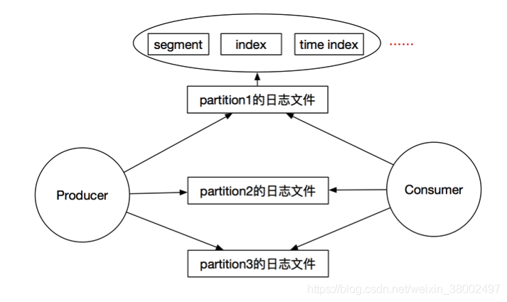
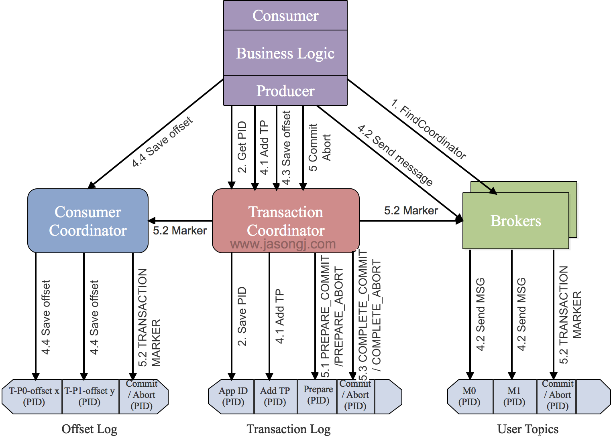

# Kafka, Rocketmq, Rabbitmq对比

# 一、Kafka简介

Producer： 生产者，向Kafka集群（Broker）中发送消息
Consumer： 消费者，从Kafka集群中（Broker）消费消息
Zookeeper： Zookeeper集群，用来管理kafka集群，主要是保存broker、consumer的注册消息、broker leader的选举等
Broker： 已发布的消息保存在一组服务器中，称之为Kafka集群。集群中的每一个服务器都是一个代理(Broker)，是一个物理上的概念。
消费者可以订阅一个或多个主题（topic），并从Broker拉数据，从而消费这些已发布的消息。
Topic : 每一个消息都属于一个Topic，是逻辑概念，每个Topic都有一个多个分区（Parition，物理概念）

# 二、Rabbit简介

Producer： 数据的发送方，一个Message有两个部分：payload（有效载荷）和label（标签）。payload顾名思义就是传输的数据。label是exchange的名字或者说是一个tag，它描述了payload，而且RabbitMQ也是通过这个label来决定把这个Message发给哪个Consumer。AMQP仅仅描述了label，而RabbitMQ决定了如何使用这个label的规则。
Consumer: 也叫Consumer，数据的接收方。把queue比作是一个有名字的邮箱。当有Message到达某个邮箱后，RabbitMQ把它发送给它的某个订阅者即Consumer。当然可能会把同一个Message发送给很多的Consumer。在这个Message中，只有payload，label已经被删掉了。对于Consumer来说，它是不知道谁发送的这个信息的,就是协议本身不支持。当然了,如果Producer发送的payload包含了Producer的信息就另当别论了。
Queue: 消息队列，提供了FIFO的处理机制，具有缓存消息的能力。rabbitmq中，队列消息可以设置为持久化，临时或者自动删除。
设置为持久化的队列，queue中的消息会在server本地硬盘存储一份，防止系统crash，数据丢失
设置为临时队列，queue中的数据在系统重启之后就会丢失 设置为自动删除的队列，当不存在用户连接到server，队列中的数据会被自动删除
Exchange: Exchange类似于数据通信网络中的交换机，提供消息路由策略。rabbitmq中，producer不是通过信道直接将消息发送给queue，而是先发送给Exchange。一个Exchange可以和多个Queue进行绑定，producer在传递消息的时候，会传递一个ROUTING_KEY，Exchange会根据这个ROUTING_KEY按照特定的路由算法，将消息路由给指定的queue。和Queue一样，Exchange也可设置为持久化，临时或者自动删除。
Binding： 绑定，它的作用就是把exchange和queue按照路由规则绑定起来
Routing Key： 路由关键字，exchange根据这个关键字进行消息投递
VHost： 虚拟主机，一个broker里可以开设多个vhost，用作不同用户的权限分离
Channel： 消息通道，在客户端的每个连接里，可建立多个channel，每个channel代表一个会话任务

# 三、RocketMQ简介

Producer:消息生产者，生产者的作用就是将消息发送到 MQ，生产者本身既可以产生消息，如读取文本信息等。也可以对外提供接口，由外部应用来调用接口，再由生产者将收到的消息发送到 MQ。

Consumer:消息消费者，消息消费者，简单来说，消费 MQ 上的消息的应用程序就是消费者，至于消息是否进行逻辑处理，还是直接存储到数据库等取决于业务需要。

NameServer服务：提供了轻量级的服务发现和路由。每个NameServer服务记录完整的路由信息，提供一致的读写服务，支持快速存储扩展。

Broker：通过提供轻量级主题和队列机制来处理消息存储。它们支持Push和Pull模型，包含容错机制(2个副本或3个副本)，提供了极强的峰值处理里能力和按照时间顺序存储数以百万记的消息存储能力，此外，代理提供了灾难恢复、丰富的度量统计和警报机制，这些都是在传统的消息传递系统中缺乏的

CommitLog：消息存储持久化咋commitLog中，一个broker只有一个commitLog，采用append的方式写入消息，为顺序写

ConsumerQueue：消费者队列，并没有全量消息，存储的是在CommitLog中的偏移量延迟队列

# 四、三个消息中间件的区别

1. ## 优先级队列

  优先级高的消息具备优先被消费的特权，这样可以为下游提供不同消息级别的保证。不过这个优先级也是需要有一个前提的：如果消费者的消费速度大于生产者的速度，并且消息中间件服务器（一般简单的称之为Broker）中没有消息堆积，那么对于发送的消息设置优先级也就没有什么实质性的意义了，因为生产者刚发送完一条消息就被消费者消费了，那么就相当于Broker中至多只有一条消息，对于单条消息来说优先级是没有什么意义的。

- Kafka：不支持优先级队列
- RocketMQ：支持相对意义上的优先级队列，RocketMQ是通过建立不同的队列，每个队列有不同的优先级，当producer根据message的消息优先级发送到对于的队列
- RabbitMQ:支持优先级队列，实现原理同上

2. ## 延迟队列

  延迟队列存储的是对应的延迟消息，所谓“延迟消息”是指当消息被发送以后，并不想让消费者立刻拿到消息，而是等待特定时间后，消费者才能拿到这个消息进行消费。延迟队列一般分为两种：

基于消息的延迟和基于队列的延迟：基于消息的延迟是指为每条消息设置不同的延迟时间，那么每当队列中有新消息进入的时候就会重新根据延迟时间排序，当然这也会对性能造成极大的影响。
基于队列的延迟：设置不同延迟级别的队列，比如 5s、10s、30s、1min、5mins、10mins 等，每个队列中消息的延迟时间都是相同的，这样免去了延迟排序所要承受的性能之苦，通过一定的扫描策略（比如定时）即可投递超时的消息。
其中Kafka不支持延迟队列，RabbitMQ和RocketMQ都是采用的基于队列的延迟。

3. ## 死信队列

  由于某些原因消息无法被正确的投递，为了确保消息不会被无故的丢弃，一般将其置于一个特殊角色的队列，这个队列一般称之为死信队列。

Kafka没有死信队列，RocketMQ和RabbitMQ支持死信队列。

4. ## 重试队列

  是一种回退队列，指消费端消费失败时，为防止消息无故丢失而将消息回滚到brocker中。 重试队列一般分多个等级，每个重试等级也会设置重新投递延时，重新投递次数越多，延时越大。 为此需要设置一个上限，超过投递次数就加入死信队列。

Kakfa不支持重试队列，RocketMQ和RabbitMQ支持重试队列。

## 5.消费模式

消费模式分为推（push）模式和拉（pull）模式。push模式是broker端推送消息到consumer端，实时性高，但是需要进行流量控制以防止consumer端被压垮；pull模式是broker端去broker拉取消息，实时性较推模式差，但是可以根据自身的处理能力而控制拉取的消息量。

Kafka：kafka是pull模式。
RocketMQ:Rocketmq消费分为push和pull两种方式，push为被动消费类型，pull为主动消费类型，push方式最终还是会从broker中pull消息。不同于pull的是，push首先要注册消费监听器，当监听器处触发后才开始消费消息，所以被称为“被动”消费。
RabbitMQ：支持pull模式和push模式。

## 6.广播模式

消息一般有两种传递模式：点对点（P2P，Point-to-Point）模式和发布 / 订阅（Pub/Sub）模式。对于点对点的模式而言，消息被消费以后，队列中不会再存储，所以消息消费者不可能消费到已经被消费的消息。虽然队列可以支持多个消费者，但是一条消息只会被一个消费者消费。发布订阅模式定义了如何向一个内容节点发布和订阅消息，这个内容节点称为主题（topic），主题可以认为是消息传递的中介，消息发布者将消息发布到某个主题，而消息订阅者则从主题中订阅消息。主题使得消息的订阅者与消息的发布者互相保持独立，不需要进行接触即可保证消息的传递，发布 / 订阅模式在消息的一对多广播时采用。

RabbitMQ 是一种典型的点对点模式，而 Kafka和RocketMQ 是一种典型的发布订阅模式。但是 RabbitMQ 中可以通过设置交换器类型来实现发布订阅模式而达到广播消费的效果，Kafka 中也能以点对点的形式消费，你完全可以把其消费组（consumer group）的概念看成是队列的概念。不过对比来说，Kafka 中因为有了消息回溯功能的存在，对于广播消费的力度支持比 RabbitMQ 的要强。

## 7.消息回溯

一般消息在消费完成之后就被处理了，之后再也不能消费到该条消息。消息回溯正好相反，是指消息在消费完成之后，还能消费到之前被消费掉的消息。对于消息而言，经常面临的问题是“消息丢失”，至于是真正由于消息中间件的缺陷丢失还是由于使用方的误用而丢失一般很难追查，如果消息中间件本身具备消息回溯功能的话，可以通过回溯消费复现“丢失的”消息进而查出问题的源头之所在。消息回溯的作用远不止与此，比如还有索引恢复、本地缓存重建，有些业务补偿方案也可以采用回溯的方式来实现。

kafka支持消息回溯，可以按照offset和timestamp两种维度进行消息回溯。

RocketMQ支持按照时间来回溯消息，精度毫秒

RabbitMQ不支持消息回溯。RabbitMQ中消息一旦被确认消费就会被标记删除。

## 8.消息堆积+持久化

流量削峰是消息中间件的一个非常重要的功能，而这个功能其实得益于其消息堆积能力。从某种意义上来讲，如果一个消息中间件不具备消息堆积的能力，那么就不能把它看做是一个合格的消息中间件。消息堆积分内存式堆积和磁盘式堆积。RabbitMQ 是典型的内存式堆积，但这并非绝对，在某些条件触发后会有换页动作来将内存中的消息换页到磁盘（换页动作会影响吞吐），或者直接使用惰性队列来将消息直接持久化至磁盘中。Kafka 是一种典型的磁盘式堆积，所有的消息都存储在磁盘中。一般来说，磁盘的容量会比内存的容量要大得多，对于磁盘式的堆积其堆积能力就是整个磁盘的大小。从另外一个角度讲，消息堆积也为消息中间件提供了冗余存储的功能。

Kafka:如下图所示，Kafka中每个partition对应一个或者多个segment file，每个segment有一个index file(索引文件)和time index file(时间索引文件，需要先到index中查询得到索引，再去segment中获取消息)，当前只能有一个segment是活跃的，消息以追加的方式写入segment。Kafka的这种存储方式，对于每个文件来说是顺序读写，但是当并发读写多个partition的时候，对于多个文件的读写，在文件系统的层面上还是随机读写，所以当topic或者partition的数目过多时，kafka性能急剧下降。

RocketMQ：如下图所示，RocketMQ中存储有CommitLog，MappedFileQueue和MappedFile，ConsumerQueue的概念。

 其中CommitLog : MappedFileQueue：MappedFile = 1：1：N；

 ConsumerQueue: MappedFileQueue：MappedFile = 1：1：N；

一台机器上的所有Topic的所有queue的消息都存放到一个commitLog中，然后由后台异步线程同步到consumerqueue中，再由consumer进行消费。这里commitLog中存放有真正的消息，是物理地址，在consumerqueue中存储的是消息在commitLog中的offset，是一个逻辑地址。这样对于consumeeQueue是可以完全的进行顺序读写的，但是对于commitLog虽然是顺序写，但是是随机读的。commitLog利用mappedFileQueue和mappedFie来解决随机读问题，先定位到mappedFileQueue中的mappedFile,再在mappedFileQueue中进行读写。

RabbitMQ：RabbitMQ持久化分为Exchange、Queue、Message的持久化，具体还待研究。

## 9.消息追踪

对于分布式架构系统中的链路追踪（trace）而言，大家一定不会陌生。对于消息中间件而言，消息的链路追踪（以下简称消息追踪）同样重要。对于消息追踪最通俗的理解就是要知道消息从哪来，存在哪里以及发往哪里去。基于此功能下，我们可以对发送或者消费完的消息进行链路追踪服务，进而可以进行问题的快速定位与排查。

## 10.消息过滤

消息过滤是指按照既定的过滤规则为下游用户提供指定类别的消息。就以 kafka 而言，完全可以将不同类别的消息发送至不同的 topic 中，由此可以实现某种意义的消息过滤，或者 Kafka 还可以根据分区对同一个 topic 中的消息进行分类。不过更加严格意义上的消息过滤应该是对既定的消息采取一定的方式按照一定的过滤规则进行过滤。

Kakfa不支持Broker端的过滤，但是可以通过客户端提供的 ConsumerInterceptor 接口或者 Kafka Stream 的 filter 功能进行消息过滤。
RocketMQ支持两种Broker端消息过滤方式
根据Message Tag来过滤，相当于子topic概念,向服务器上传一段Java代码，可以对消息做任意形式的过滤，甚至可以做Message Body的过滤拆分。
RabbitMQ:不支持消息过滤。但是可以通过简单的二次封装来达到消息过滤的效果。

## 11.多租户

也可以称为多重租赁技术，是一种软件架构技术，主要用来实现多用户的环境下公用相同的系统或程序组件，并且仍可以确保各用户间数据的隔离性。RabbitMQ 就能够支持多租户技术，每一个租户表示为一个 vhost，其本质上是一个独立的小型 RabbitMQ 服务器，又有自己独立的队列、交换器及绑定关系等，并且它拥有自己独立的权限。vhost 就像是物理机中的虚拟机一样，它们在各个实例间提供逻辑上的分离，为不同程序安全保密地允许数据，它既能将同一个 RabbitMQ 中的众多客户区分开，又可以避免队列和交换器等命名冲突。Kafka和RocketMQ不支持。

## 12.多协议支持

消息是信息的载体，为了让生产者和消费者都能理解所承载的信息（生产者需要知道如何构造消息，消费者需要知道如何解析消息），它们就需要按照一种统一的格式描述消息，这种统一的格式称之为消息协议。有效的消息一定具有某种格式，而没有格式的消息是没有意义的。一般消息层面的协议有 AMQP、MQTT、STOMP、XMPP 等（消息领域中的 JMS 更多的是一个规范而不是一个协议），支持的协议越多其应用范围就会越广，通用性越强，比如 RabbitMQ 能够支持 MQTT 协议就让其在物联网应用中获得一席之地。还有的消息中间件是基于其本身的私有协议运转的，典型的如 Kafka。

## 13.流量控制

流量控制（flow control）针对的是发送方和接收方速度不匹配的问题，提供一种速度匹配服务抑制发送速率使接收方应用程序的读取速率与之相适应。通常的流控方法有 Stop-and-wait、滑动窗口以及令牌桶等。

Kafka：支持client和user级别，通过主动设置可将流控作用于生产者或消费者 。
RocketMQ：支持多种维度的流量控制。
RabbitMQ：流量控制基于credit-base算法，是内部被动触发的保护机制，作用于生产者层面 。

## 14.顺序性消息

顾名思义，消息顺序性是指保证消息有序。这个功能有个很常见的应用场景就是 CDC（Change Data Chapture），以 MySQL 为例，如果其传输的 binlog 的顺序出错，比如原本是先对一条数据加 1，然后再乘以 2，发送错序之后就变成了先乘以 2 后加 1 了，造成了数据不一致。这里讲一下RocketMQ顺序消息的实现原理：
（1）Consumer 在严格顺序消费时，通过 三 把锁保证严格顺序消费。
（2）Broker 消息队列锁（分布式锁） ：

集群模式下，Consumer 从 Broker 获得该锁后，才能进行消息拉取、消费。
广播模式下，Consumer 无需该锁。
（3）Consumer 消息队列锁（本地锁） ：Consumer 获得该锁才能操作消息队列。
（4）Consumer 消息处理队列消费锁（本地锁） ：Consumer 获得该锁才能消费消息队列。

## 15.幂等性

对于确保消息在生产者和消费者之间进行传输而言一般有三种传输保障（delivery guarantee）：At most once，至多一次，消息可能丢失，但绝不会重复传输；At least once，至少一次，消息绝不会丢，但是可能会重复；Exactly once，精确一次，每条消息肯定会被传输一次且仅一次。对于大多数消息中间件而言，一般只提供 At most once 和 At least once 两种传输保障，对于第三种一般很难做到，由此消息幂等性也很难保证。

Kafka ：自 0.11 版本开始引入了幂等性和事务，Kafka 的幂等性是指单个生产者对于单分区单会话的幂等，而事务可以保证原子性地写入到多个分区，即写入到多个分区的消息要么全部成功，要么全部回滚，这两个功能加起来可以让 Kafka 具备 EOS（Exactly Once Semantic）的能力。
不过如果要考虑全局的幂等，还需要与从上下游方面综合考虑，即关联业务层面，幂等处理本身也是业务层面所需要考虑的重要议题。以下游消费者层面为例，有可能消费者消费完一条消息之后没有来得及确认消息就发生异常，等到恢复之后又得重新消费原来消费过的那条消息，那么这种类型的消息幂等是无法有消息中间件层面来保证的。如果要保证全局的幂等，需要引入更多的外部资源来保证，比如以订单号作为唯一性标识，并且在下游设置一个去重表。

RocketMQ：RocketMQ不保证消息不重复，如果你的业务需要保证严格的不重复消息，需要你自己在业务端去重。

RabbitMQ：不支持消息幂等。

## 16.事务性消息

事务本身是一个并不陌生的词汇，事务是由事务开始（Begin Transaction）和事务结束（End Transaction）之间执行的全体操作组成。支持事务的消息中间件并不在少数，Kafka 和 RabbitMQ 都支持，不过此两者的事务是指生产者发生消息的事务，要么发送成功，要么发送失败。消息中间件可以作为用来实现分布式事务的一种手段，但其本身并不提供全局分布式事务的功能。

Kafka事务实现原理：具体实现原理参考Kafka设计解析（八）- Exactly Once语义与事务机制原理

RocketMQ/Notify事务实现，是一个消息二阶段提交的过程，详见分布式消息队列- RocketMQ–事务消息–解决分布式事务的最佳实践

RabbitMQ:RabbitMQ通过AMQP事务机制实现，这也是从AMQP协议层面提供的解决方案。详情参考深入学习RabbitMQ(二)：AMQP事务机制

## 17.性能

一般 RabbitMQ 的单机 QPS 在万级别之内，RocketMQ单机写入TPS单实例约7万条/秒，而 Kafka 的单机 QPS 可以维持在十万级别，甚至可以达到百万级。

Kafka
Kafka比RocketMQ的性能高。主要是因为Kafka的在producer端将多个小消息合并，批量发送到broker中。当然Kafka的高性能还有以下原因：

（1）宏观架构层面
利用partition实现并行处理，最大并发度等于partition的数量
ISR选举机制实现可用性与数据一致性的动态平衡，由于Leader可移除不能及时与之同步的Follower，故与同步复制相比可避免最慢的Follower拖慢整体速度，也即ISR提高了系统可用性。

（2） 具体实现层面
高效的使用磁盘：主要包含顺序写磁盘、充分利用page cache、支持多Disk Drive
零拷贝：Linux 内核通过sendfile系统调用，提供了零拷贝。数据通过DMA拷贝到内核态Buffer后，直接通过DMA拷贝到NIC Buffer，无需CPU拷贝。这也是零拷贝这一说法的来源。除了减少数据拷贝外，因为整个读文件-网络发送由一个sendfile调用完成，整个过程只有两次上下文切换，因此大大提高了性能。
减少网络开销：(1)批处理 （2）数据压缩 （3）高效的序列化方

RocketMQ
RocketMQ为什么没有按照kafka（在producer端将多个小消息合并）这么做？

Producer通常使用Java语言，缓存过多消息，GC是个很严重的问题；
Producer调用发送消息接口，消息未发送到Broker，向业务返回成功，此时Producer宕机，会导致消息丢失，业务出错；
Producer通常为分布式系统，且每台机器都是多线程发送，我们认为线上的系统单个Producer每秒产生的数据量有限，不可能上万；
缓存的功能完全可以由上层业务完成。

## 18.高可用和容错

消息丢失是使用消息中间件时所不得不面对的一个同点，其背后消息可靠性也是衡量消息中间件好坏的一个关键因素。尤其是在金融支付领域，消息可靠性尤为重要。

Kafka：

Kafka中Broker是一个物理上的概念，一台物理机就对应一个Broker，一个Broker同时是 Leader和Follower。zookeeper维护每个partition的副本之间的关系，并维护一个isr集群，当partition的leader挂掉之后，从isr中随机选取一个作为leader；当isr全挂掉时，可以有两种方式：(1)等待leader复活，但是会有一段时间不可用 （2）从剩下的副本中选取一个最接近leader的副本作为leader，但是可能会造成数据丢失，影响可靠性。

RocketMQ:

RocketMQ中Broker是一个逻辑上的概念，同时包含一个Master和多个Slave，一台机器要么只能是Master,要么只能是Slave。这里的queue和Kafka中的partition含义一致。Master和Slave是通过Broker Name进行配对的具有相同Broker Name的Master和Slave属于同一个Broker.

RabbitMQ
RabbitMQ可以通过三种方法来部署分布式集群系统来实现高可用，分别是：cluster(集群)，federation(联盟)，shovel

## 19.定时消息

Kafka不支持定时消息
RabbitMQ、RocketMQ支持定时消息

## 20.负载均衡

负载均衡（Load balance）是一种计算机网络技术，用于在多个计算机（计算机集群）、网络连接、CPU、磁盘驱动器或其他资源中分配负载，以达到最佳资源使用、最大化吞吐率、最小响应时间以及避免过载的目的。使用带有负载均衡的多个服务器组件，取代单一的组件，可以通过冗余提高可靠性。负载均衡通常分为软件负载均衡和硬件负载均衡两种。Kafka、RocketMQ、RabbitMQ都是软负载均衡。这里主要讲一下它们的消费者负载均衡。Kafka和RocketMQ的消费者负载均衡都是在consumer端做的，也都是将consumer和topic、partition/queue的订阅关系放在broker中的。至于为什么要将消费者负载均衡放在客户端做，其中一个重要原因是为了灵活性：如果让server分配，一旦需要新的分配策略，server集群要重新部署，这对于已经上线运行的集群来说，代价很大；而让client分配，server集群就不需要重新部署了。

Kafka：首先每个消费者组都有指定一个broker为coordinator，消费者通过向被指派的群组协调器(coordinator)的broker发送心跳来维持他们和群组的从属关系以及他们对分区的从属关系。当消费者要加入消费者group时，它会向coordinator发送一个JoinGroup请求。第一个加入group的被称为“群主”。群主从coordinator那里获得group的成员列表，并负责给每一个消费分配分区。分配完毕之后群主把分配情况列表发送给coordinator，coordinator再把这些信息发送给所有消费者。每个消费者只能看到自己的分配信息，只有群主知道group里所有消费者的分配信息。这个过程会在每次再均衡时重复发生。
RocketMQ：RocketMQ的消费者负载均衡省去了coordinator，而是所有的consumer都能得到consumer的订阅表，每个consumer自己做负载均衡 。
RabbitMQ：RocketMQ如果有多个消费者同时订阅同一个Queue中的消息，Queue中的消息会被平摊给多个消费者。但是如果每个消息的处理时间不同，就有可能会导致某些消费者一直在忙，而另外一些消费者很快就处理完手头工作并一直空闲的情况。我们可以通过设置Prefetch count来限制Queue每次发送给每个消费者的消息数，比如我们设置prefetchCount=1，则Queue每次给每个消费者发送一条消息；消费者处理完这条消息后Queue会再给该消费者发送一条消息。

## 21.刷盘策略

kafka:缺省Kafka是异步刷盘，每3s钟，调用1次fsync。但Kafka支持同步刷盘，也就是说，你可以每写入1条消息，就刷盘1次。
RocketMQ：RocketMQ支持三种刷盘策略：
线程服务 场景 插入性能
CommitRealTimeService 异步刷盘 && 开启内存字节缓冲区 第一
FLushRealTimeService 异步刷盘 && 关闭内存字节缓冲区 第二
GroupCommitService 同步刷盘 第三
RabbitMQ:RabbitMQ在两种情况下需要写入磁盘进行持久化存储：(1)消息本身在publish的时候就要求消息写入磁盘；（2）内存紧张，需要将部分内存中的消息转移到磁盘。在三种情况下会进行刷盘：
1、写入文件前会有一个Buffer，大小为1M（1048576），数据在写入文件时，首先会写入到这个Buffer，如果Buffer已满，则会将Buffer写入到文件（未必刷到磁盘）；
2、有个固定的刷盘时间：25ms，也就是不管Buffer满不满，每隔25ms，Buffer里的数据及未刷新到磁盘的文件内容必定会刷到磁盘；
3、每次消息写入后，如果没有后续写入请求，则会直接将已写入的消息刷到磁盘：使用Erlang的receive x after 0来实现，只要进程的信箱里没有消息，则产生一个timeout消息，而timeout会触发刷盘操作。