# Openstack

OpenStack 是当今最具影响力的[云计算](http://c.biancheng.net/cloud_computing/)管理工具——通过命令或者基于 Web 的可视化控制面板来管理 IaaS 云端的资源池（服务器、存储和网络）。它最先由美国国家航空航天局（NASA）和 Rackspace 在 2010 年合作研发，现在参与的人员和组织汇集了来自 100 多个国家的超过 9500 名的个人和 850 多个世界上赫赫有名的企业，如 NASA、谷歌、惠普、Intel、IBM、微软等。

OpenStack 系统或其演变版本目前被广泛应用在各行各业，包括自建私有云、公共云、租赁私有云及公私混合云，用户包括思科、贝宝（Paypal）、英特尔、IBM、99Cloud、希捷等，具体名请参考网站 [http：//www.openstack.org/user-stories](http://www.openstack.org/user-stories)。

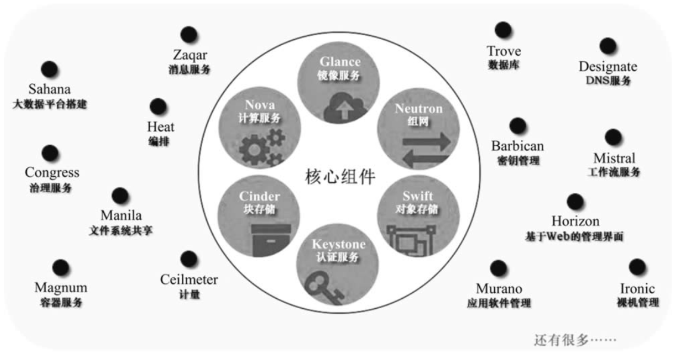

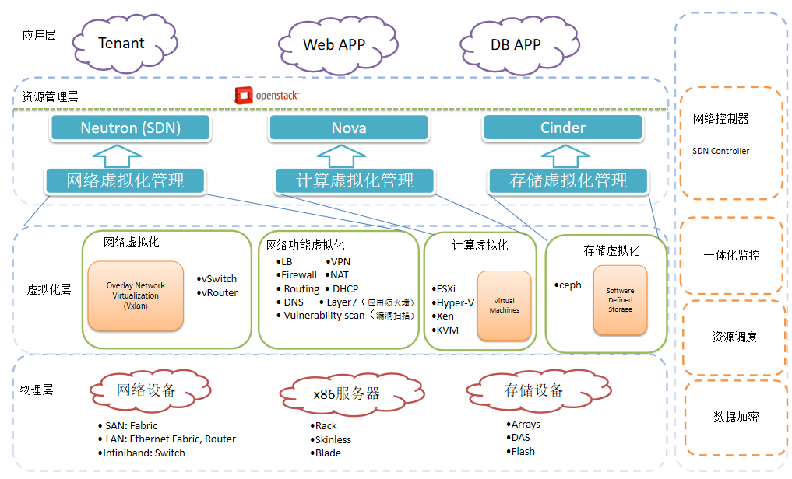

## 计算

nova

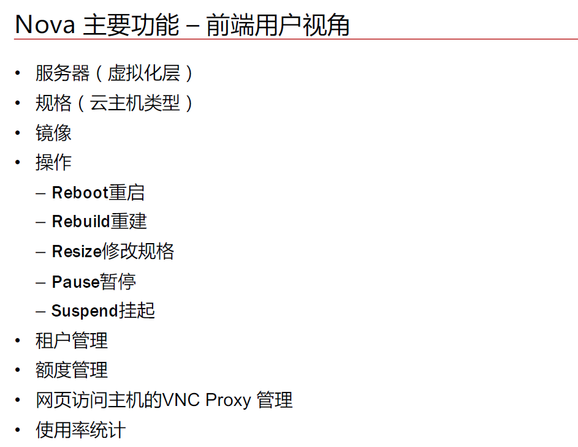

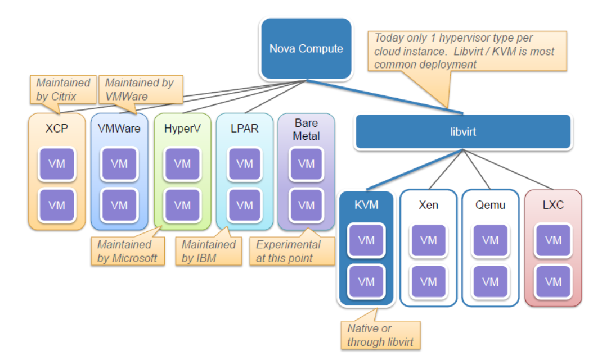

插件化方式可以支持各种集成各种不同的虚拟化平台，如PowerVM等

## 网络

neutron

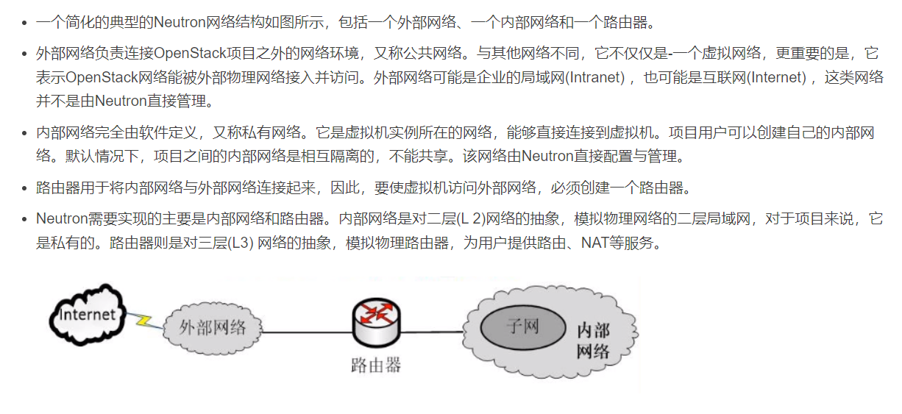

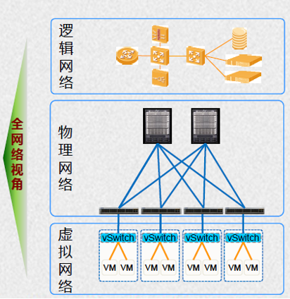

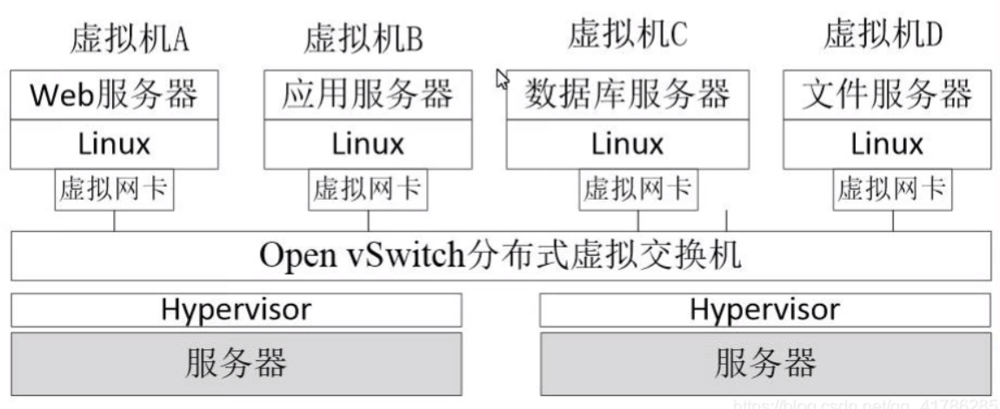

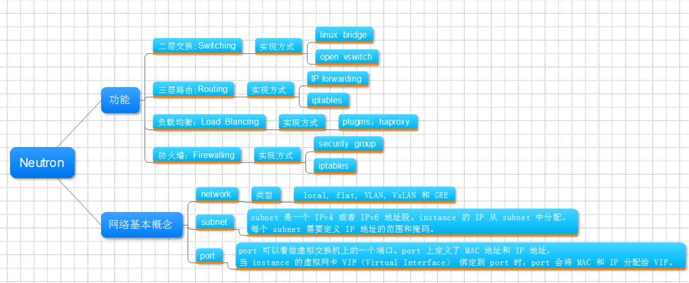

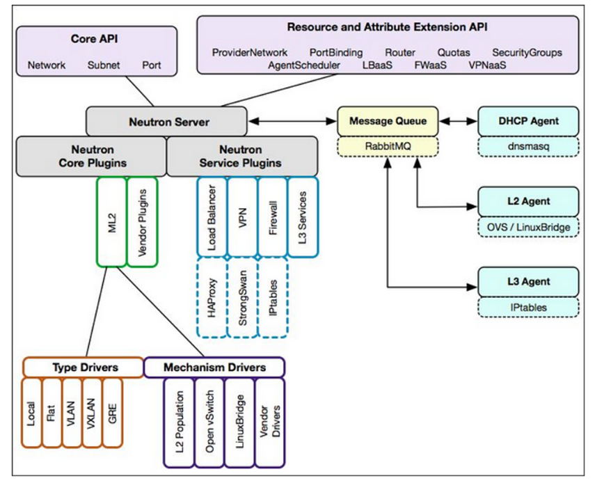

## 存储

cinder

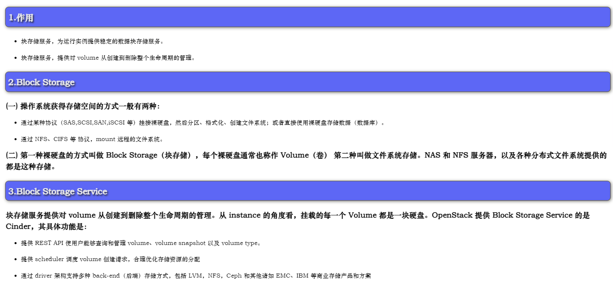

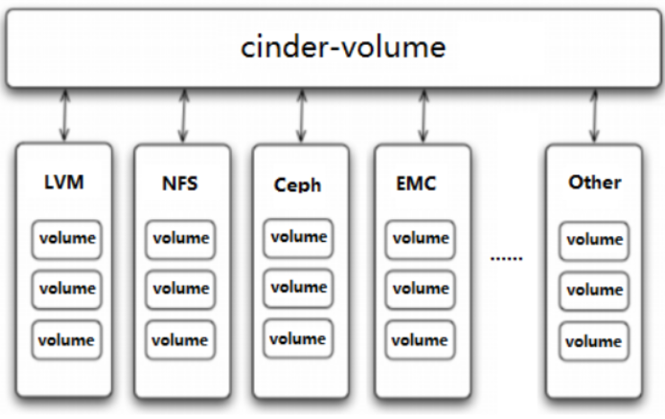

## Openstack开发

https://openstack.org/

http://docs.openstack.org/

http://github.com/openstack

https://gerrit.opnfv.org/gerrit/q/status:open+-is:wip

https://launchpad.net/nova

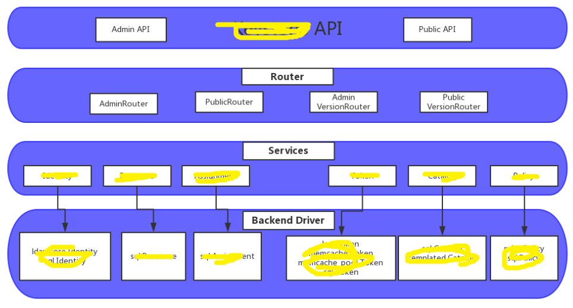

Nova API(wsgi,pcan)--->nova conductor--->nova scheduler--->nova compute--->drivers--->libvirt--->qemu+kvm

Cinder API--->Cinder scheduler--->Cinder Volume--->drivers--->lvm/ceph/iscsi->物理存储

