本篇文章总结了操作系统的进程调度算法，以及优缺点分析，包括 FIFO 算法、最短任务优先算法、轮转算法、多级反馈队列算法、彩票调度算法，以及多处理器的调度算法。只总结了各算法的原理，而没有介绍 Linux 调度算法的具体实现，知其然总要先知其所以然。

## 调度指标

在看进程调度算法前，先来看看进程调度算法都遵循哪些指标。目前只考虑周转时间和响应时间。

周转时间：任务完成时间减去任务到达系统的时间。
响应时间：从任务到达系统到首次运行的时间。

性能和公平在调度系统往往是矛盾的，例如，调度程序可以优化性能，但代价是以阻止一些任务运行，这就降低了公平。

## FIFO

FIFO 就是先到先出调度 (First In First Out, FIFO)，有时也叫先到先服务调度 (First Come First Served, FCFS)。

优点：很简单，易于实现。
缺点：当先到达的任务耗时较长时，FIFO 调度算法的平均周转时间会很长。

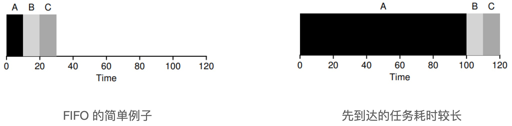

## 最短任务优先 (SJF)

最短任务优先 (Shortest Job First, SJF) 算法的策略：先运行最短的任务，然后是次短的任务，如此下去。

在所有任务同时到达的假设下，SJF 确实是最优调度算法。但任务有先有后的时候，SJF 就不理想了，如下图所示。

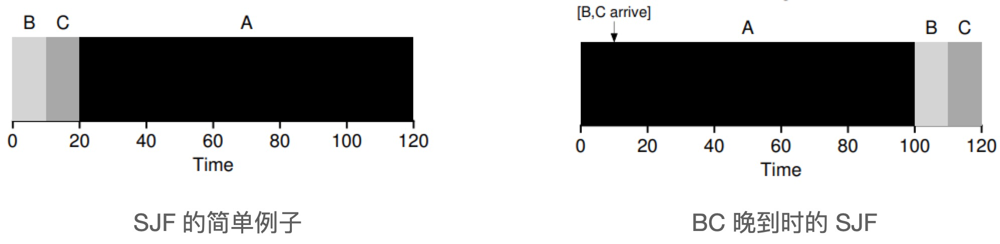

## 最短完成时间优先 (STCF)

为了解决 SJF 的问题，引入了最短完成时间优先 (Shortest Time-to-Completion First, STFT) 算法，前提是操作系统需要允许任务抢占。

STCF 算法在 SJF 的基础上添加抢占，又称抢占式最短作业优先 (Preemptive Shortest Job First, PSJF)。每当新工作进入系统时，就会确定剩余工作和新工作中，谁的剩余时间最少，然后调度该工作。

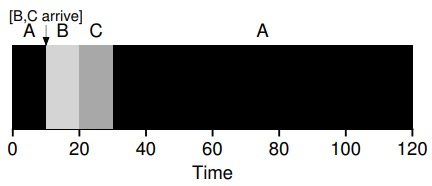

在知道任务长度，且任务只使用 CPU，而衡量指标只有周转时间时，STCF 是一个很好的策略。但考虑到响应时间，STCF 算法表现的相当糟糕，比如说你在终端前输入，不得不等待 10s 才能看到系统的回应，只是因为其他一些工作已经在这之前被调度。

## 轮转算法

为了解决 STCF 算法响应时间长的问题，引入了轮转调度 (Round-Robin, RR)。

轮转调度的思想：RR 在一个时间片 (time slice，有时称为调度因子，scheduling quantum) 内运行一个工作，然后切换到运行队列中的下一个任务，而不是运行一个任务直到结束。RR 有时被称为时间切片，时间片长度必须是时钟中断周期的倍数。

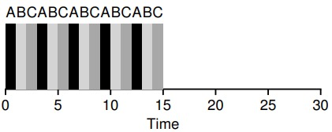

时间片长度对于 RR 是至关重要的。时间片越短，RR 在响应时间上表现越好。然而，时间片太短是有问题的：突然上下文切换的成本将影响整体性能。因此，系统设计者需要权衡时间片的长度，使其足够长，以便摊销上下文切换成本，而又不会使系统不及时响应。

注：上下文切换的成本不仅仅来自保存和恢复少量寄存器的操作系统操作。程序运行时，它们在 CPU 高速缓存、TLB、分支预测器和其他片上硬件中建立了大量的状态。切换到另一个工作会导致此状态被刷新，且与当前运行的作业相关的新状态被引入，可能导致显著的性能成本。

### 结合 I/O

当运行的程序在进行 I/O 操作的时候，在 I/O 期间不会使用 CPU，但它被阻塞等待 I/O 完成，这时调度程序应该在 CPU 上安排另一项工作。

而在 I/O 完成时，会产生中断，操作系统运行并将发出 I/O 的进程从阻塞状态移回就绪状态。当然，它甚至可以决定在那个时候运行该项工作。操作系统应该如何处理每项工作？

假设有两项工作 A 和 B，每项工作需要 50ms 的CPU时间。但是A先运行10ms，然后发出I/O请求（假设 I/O 每个都需要 10ms），而B只是使用CPU 50ms，不执行I/O。调度程序先运行A，然后运行B。

左图所示的调度是非常糟糕的。常见的方法是将 A 的每个 10ms 的子工作视为一项独立的工作。因此，当系统启动时，它的选择是调度 10ms 的 A，还是 50ms 的 B。STCF 会选择较短的 A。然后，A 的工作已完成，只剩下 B，并开始运行。然后提交 A 的一个新子工作，它抢占 B 并运行 10ms。这样做可以实现重叠，一个进程在等待另一个进程的 I/O 完成时使用 CPU，系统因此得到更好的利用。

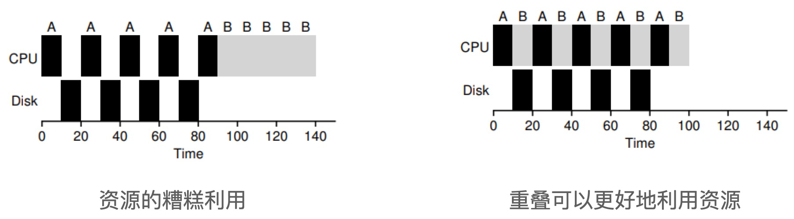

## 多级反馈队列

操作系统常常不知道工作要运行多久，而这又是 SJF 等算法所必需的；而轮转调度虽然降低了响应时间，周转时间却很差。因此引入了多级反馈队列（Multi-level Feedback Queue，简称MLFQ）。MLFQ 需要解决两方面的问题：首先它要优化周转时间，这可以通过优先执行较短的工作来实现；其次，MLFQ 希望给用户提供较好的交互体验，因此需要降低响应时间。

MLFQ 中有许多独立的队列，每个队列有不同的优先级。任何时刻，一个工作只能存在于一个队列中。MLFQ 总是优先执行较高优先级的工作（即那些在较高级队列中的工作）。每个队列中可能会有多个工作，它们具有同样的优先级。在这种情况下，我们就对这些工作采用轮转调度。

### 基本规则

多级反馈队列由几个基本规则：

**规则1**：如果 A 的优先级大于 B 的优先级，运行 A 不运行 B。
**规则2**：如果 A 的优先级等于 B 的优先级，轮转运行 A 和 B。
**规则3**：工作进入系统时，放在最高优先级（最上层）队列。这一规则使得多级反馈队列算法类似 SJF，保证了良好的响应时间。
**规则4**：一旦工作用完了其在某一层中的时间配额（无论中间主动放弃了多少次 CPU），就降低其优先级（移入低一级队列）。这一规则防止进程主动放弃 CPU，从而造成其他进程饥饿。
**规则5**：每经过一段时间，就将系统中所有工作重新加入最高优先级队列。这一规则解决了两个问题：一是防止长进程饥饿，二是如果一个 CPU 密集型工作变成了交互型，当它优先级提升时，调度程序会正确对待它。

## 比例份额

比例份额（proportional-share）调度程序，有时也称为公平份额（fair-share）调度程序。比例份额算法认为，调度程序的最终目标是确保每个工作获得一定比例的 CPU 时间，而不是优化周转时间和响应时间。它的基本思想很简单：每隔一段时间，都会举行一次彩票抽奖，以确定接下来应该运行哪个进程。越是应该频繁运行的进程，越是应该拥有更多地赢得彩票的机会。

### 彩票数表示份额

在彩票调度中，彩票数代表了进程占有某个资源的份额。一个进程拥有的彩票数占总彩票数的百分比，就是它占有资源的份额。

假设有两个进程A和B，A拥有75张彩票，B拥有25张。因此我们希望A占用75%的CPU时间，而B占用25%。

通过不断且定时地抽取彩票，彩票调度从概率上获得这种份额比例。抽取彩票的过程很简单：调度程序知道总共的彩票数（在我们的例子中，有100张）。调度程序抽取中奖彩票，这是从0和99之间的一个数，拥有这个数对应的彩票的进程中奖。假设进程A拥有0到74共75张彩票，进程B拥有75到99的25张，中奖的彩票就决定了运行A或B。调度程序然后加载中奖进程的状态，并运行它。彩票调度利用了随机性，这导致了从概率上满足期望的比例。随着这两个工作运行得时间越长，它们得到的CPU时间比例就会越接近期望。

### 实现

彩票调度实现起来非常简单，只需要一个随机数生成器来选择中奖彩票和一个记录系统中所有进程的数据结构，以及所有彩票的总数。假设我们使用列表记录进程，下面的例子中有A、B和C这3个进程，每个进程有一定数量的彩票。

### 步长调度

虽然随机方式可以使得调度程序的实现简单，但偶尔并不能产生正确的比例，尤其在工作运行时间很短的情况下。由于这个原因，Waldspurger 提出了步长调度。

系统中的每个工作都有自己的步长，这个值与票数值成反比。A、B、C这3个工作的票数分别是100、50和250，我们通过用一个大数分别除以他们的票数来获得每个进程的步长。比如用10000除以这些票数值，得到了3个进程的步长分别为100、200和40。我们称这个值为每个进程的步长（stride）。每次进程运行后，我们会让它的计数器（称为行程值）增加它的步长，记录它的总体进展。

基本思路：当需要进行调度时，选择目前拥有最小行程值的进程，并且在运行后将该进程的行程值增加一个步长。

伪代码：

```javascript
current = remove_min(queue);       // pick client with minimum pass
schedule(current);                 // use resource for quantum
current->pass += current->stride;  // compute next pass using stride
insert(queue, current);            // put back into the queue
```

相比于步长调度，彩票调度的优势是不需要全局状态。假如一个新的进程在步长调度执行过程中加入系统，应该怎么设置它的行程值呢？设置成0吗？这样的话，它就独占CPU了。而彩票调度算法不需要对每个进程记录全局状态，只需要用新进程的票数更新全局的总票数就可以了。因此彩票调度算法能够更合理地处理新加入的进程。

## 多处理器调度

以上调度算法都是单处理器的调度，而当操作系统采用多核 CPU 的时候，必须考虑多处理器调度问题。

### 多处理器架构

多处理器与单 CPU 之间的基本区别，核心在于对硬件缓存的使用，以及多处理器之间共享数据的方式。

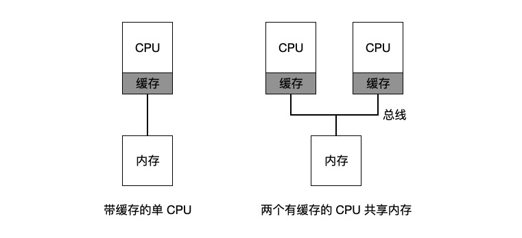

在单 CPU 系统中，存在所及的硬件缓存，一般来说会让处理器更快地执行程序。缓存是很小但很快的存储设备，通常拥有内存中最热的数据的备份。相比之下，内存很大且拥有所有的数据，但访问速度很慢。通过将频繁访问的数据放在缓存中，系统似乎拥有又大又快的内存。

而当多 CPU 的情况下，会存在缓存一致性问题。硬件提供了这个问题的基本解决方案：通过监控内存访问，硬件可以保证获得正确的数据，并保证共享内存的唯一性。

多处理器调度还需要考虑的一个问题：缓存亲和度。一个进程在某个 CPU 上运行时，会在该 CPU 的缓存中维护许多状态，所以，多处理器调度应该考虑到这种缓存亲和性，并尽可能将进程保持在同一个 CPU 上。

### 单队列调度

一个多处理器系统的调度程序，最基本的方式是简单地复用单处理器调度的基本架构，将所有需要调度的工作放入一个单独的队列中，这种方式称之为单队列多处理器调度 (Single Queue Multiprocessor Scheduling, SQMS)。

SQMS 的缺陷：

1. 缺乏可扩展性。为了保证在多 CPU 上正常运行，调度程序需要在代码中通过加锁的方式来保证原子性，而锁可能带来巨大的性能损失；
2. 缓存亲和性问题。比如，队列里有 A、B、C、D、E 5 个工作和 4 个处理器，一段时间后假设每个工作一次执行一个时间片，然后选择另一个工作，下面是 CPU 可能的调度序列：

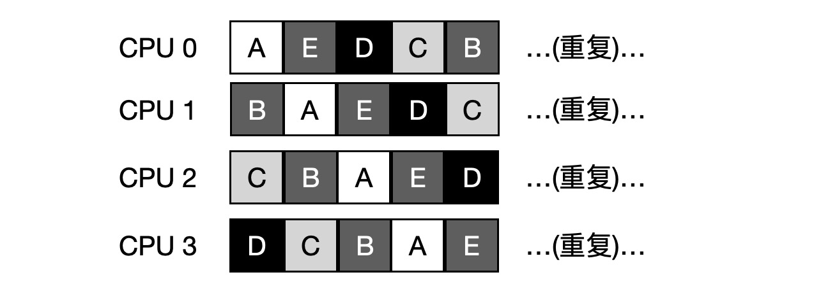

为了解决这个问题，大多数 SQMS 调度程序都引入了一些亲和机制，尽可能让进城在同一个 CPU 上运行。例如，针对同样 5 个工作的调度如下，A、B、C、D 4个工作都保持在同一个 CPU 上，只有 E 不断的来回迁移。

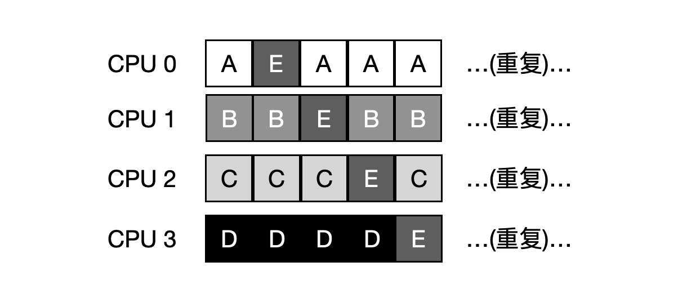

### 多队列调度

正是由于单队列调度的这些问题，有些系统使用了多队列的方案，比如每个 CPU 一个队列，我们称之为多队列多处理器调度 (Multi-Queue Multiprocessor Scheduling, MQMS)。

在 MQMS 中，基本调度框架包含多个调度队列，每个队列可以使用不同的调度规则。当工作进入系统后，系统会依照一些启发性规则将其放入某个调度队列。每个 CPU 调度之间相互独立，就避免了单队列的方式中由于数据共享及同步带来的问题。

例如，假设系统中有两个 CPU，工作 A、B、C、D 进入系统，每个 CPU 都有自己的调度队列，操作系统觉得每个工作放入哪个队列，比如：


根据不同队列的调度策略，每个 CPU 从两个工作中选择，决定谁将运行，比如利用轮转，调度结果可能如下所示：

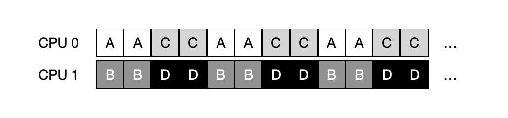

但这样势必会存在**负载不均**的问题。

比如说工作 C 这时执行完毕，现在调度队列如下：


而轮转调度结果如下：

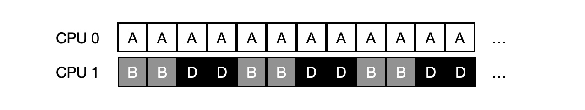

更糟的是，假如 A 和 C 都执行完毕，系统只有 B 和 D，调度队列看起来如下：


因此 CPU 时间线看起来令人难过：


而此时，解决这种负载不均问题的解法，是**迁移** (migration)。通过工作的跨 CPU 迁移，可以真正实现负载均衡。

上面那个例子中，将 B 或 D 迁移到 CPU 0 中，即可实现负载均衡。但在较早的例子中，A 独自留在 CPU 0 上，B 和 D 在 CPU 1 上交替运行。这种情况下，单次迁移不能解决问题，应该不断地迁移一个或多个工作。一种可能的解决方案时不断切换工作，如下面的时间线所示。可以看到，开始的时候，A 独享 CPU 0，B 和 D 在 CPU 1 上，一段时间片后，B 迁移到 CPU 0 和 A 竞争，D 则独享 CPU 1 一段时间。这样就实现了负载均衡。

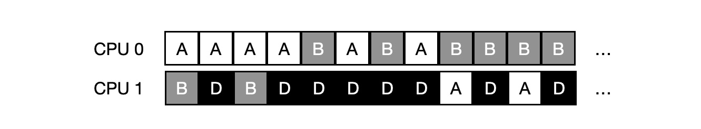

实现任务迁移的一个最基本的方法是**工作窃取** (work stealing)。通过这种方法，工作量较少的队列不定期的 ”偷看“ 其他队列是不是比自己的工作多。如果目标队列比源队列更满，就从目标队列 ”窃取” 一个或多个工作，实现负载均衡。

### Linux 多处理器调度

在构建多处理器调度程序方面，Linux 社区一直没有达成共识。一直以来存在 3 种不同的调度程序：O(1) 调度程序、完全公平调度程序 (CFS) 以及 BF 调度程序 (BFS) 。

O(1) 、CFS 采用多队列，而 BFS 采用单队列；而 O(1) 调度程序是基于优先级的 (类似于 MLFQ) ，随着时间推移改变进程的优先级，然后调度最高优先级进程，来实现各种调度目标；CFS 是确定的比例调度方法 (类似于步长调度)；BFS 也是基于比例调度，但采用了更复杂的防范，称之为最早最合适虚拟截止时间优先算法 (EEVEF)。