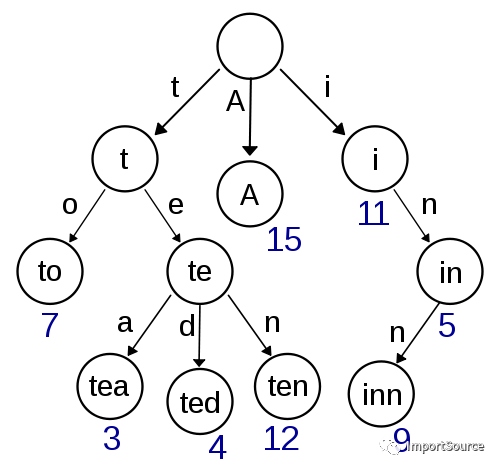
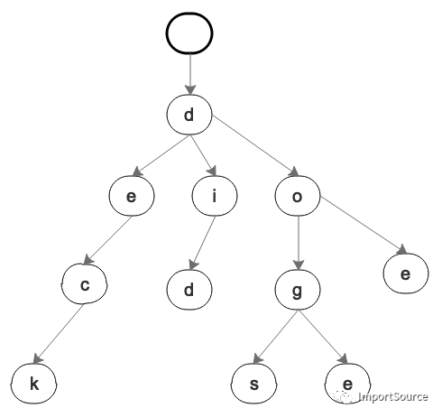
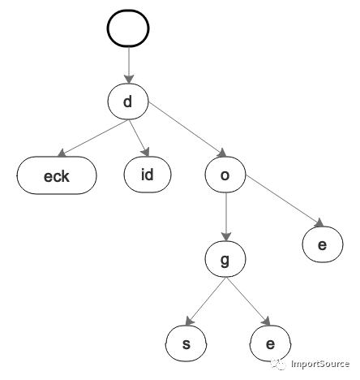
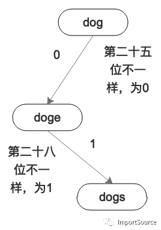
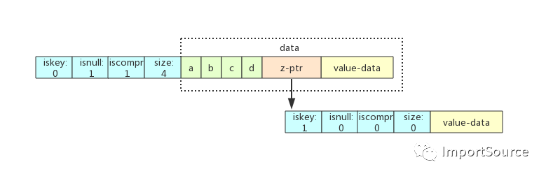
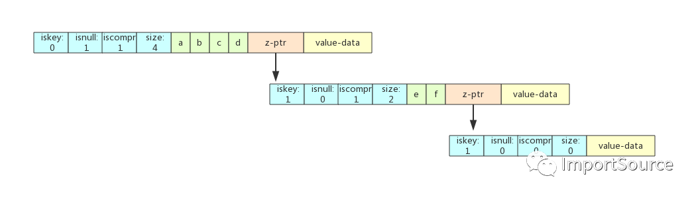
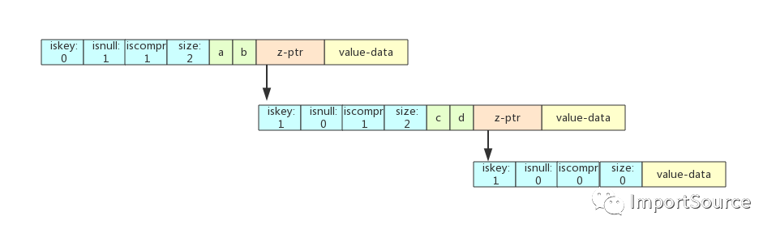
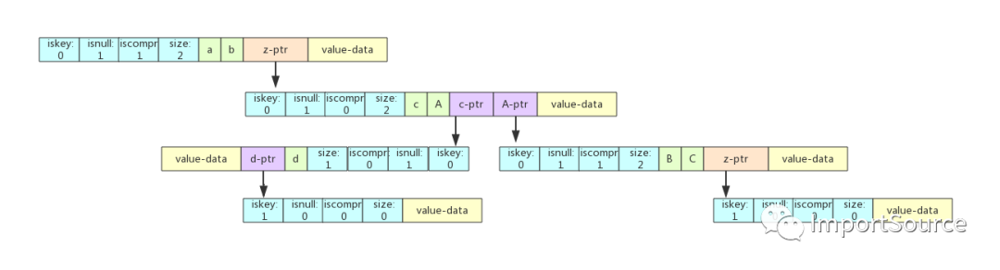

图解Redis中的Radix树

2020-03-11阅读 2.7K0

在[Redis](https://cloud.tencent.com/product/crs?from=10680)里，有好几个地方都用到了Radix树。比如阿里的Redis的每个slot槽里存储的key就是使用了Radix树。还有Redis 5.0发布的一个新功能Stream也有用到Radix来存储key。

你也许会想通过key查找value，为什么不通过hash map之类的，java的小伙伴肯定知道hash对于大量的key的hash后最后还是要落到链表（现在变成了红黑树）。hash这个被认为只适合少量的数据存储查找，多了遭不住，而且还要rehash之类的，肯定不能用这个来搞定redis的key存储。这会你也许想过使用红黑树这样的平衡树来存储redis的key。这确实是个不错的方案，但红黑树也被认为是有一些性能问题，而且在Redis key检索的场景下，也许会有更适合的算法来hold住。

为此Redis的大佬们决定使用Radix树来解决问题。Radix树是从哪里来的呢？是从Trie树来的。我们先来简单的了解一下Trie长啥样。

**Trie树**

Trie Tree，字典树。Trie Tree的原理是将每个key拆分成每个单位长度字符，然后对应到每个分支上，分支所在的节点对应为从根节点到当前节点的拼接出的key的值。它的结构图如下所示：

大体就长这样，可以看出Trie树已经很厉害了。Trie树把很多的公共前缀独立出来共享了。这样避免了很多重复的存储。想想字典集的方式，一个个的key被单独的存储，即使他们都有公共的前缀也要单独存储。相比字典集的方式，Trie树显然节省更多的空间。

Trie树其实依然比较浪费空间，有人曾经反馈他们在实际的项目发现，随着key的数量的增加，发现Trie树会占用大量的内存和空间。

现在我们就演绎下Trie树是如何浪费内存和空间的。比如下面的一组数据：

{  "deck": someValue,  "did": someValue,  "doe": someValue,  "dog": someValue,  "doge": someValue,  "dogs": someValue }

我用Trie树的画法把上面的key value画出来如下：

**Radix树：压缩后的Trie树**

也许你已经发现了一些问题。比如"deck"这一个分支，有没有必要一直往下来拆分吗？还是"did"，有必要d，然后i，然后d吗?像这样的不可分叉的单支分支，其实完全可以合并，也就是压缩。像下面这样：

这样看起来是不是要更节省一点空间呢？这只是6个单词的样子，数据越多，空间节省的效果越明显。而且这样压缩后，不可分叉的分支高度也变矮了。我们叫这样的Trie树为压缩Trie树（Compressed Trie Tree）。

 压缩Trie树也就是今天的主角Radix树，只不过他有多个名字，有人叫压缩Trie树，有人叫Radix树。

Redis中就用到了Radix树。

**计算机是怎么处理Radix树的呢?**

现在还没完，因为计算机可不会像人类一样可以通过英文像上面的图一样来构建树，计算机只认识0和1。所以为了真正的了解Radix树，我们需要知道机器是怎么读取Radix树的。计算机对于Radix树的处理是以bit（或二进制数字）来读取的。一次被对比r个bit，2的r次方是radix树的基数。这也是基数树的这个名字的由来。

现在我们把上面的三个单词变成二进制的样子，然后一位一位的看：

dog:   01100100 01101111 01100111 

doge: 01100100 01101111 01100111 **0**1100101 

dogs: 01100100 01101111 01100111 011**1**0011

按照字符串的比对，你会发现dog是dogs和doge的子串。

但我们现在比对二进制，一位一位的比对，你会发现dog和doge是在第二十五位的时候不一样的。dogs和doge是在第二十八位不一样的。按照位的比对的结果，你会发现doge居然是dogs二进制子串。秀不秀？

这就是计算机的方式。

到此，我们其实已经基本了解Radix了。

现在看看它在Redis内部是怎么布局的。

**Redis是如何实现Radix树的呢？**

以下内容摘自http://mysql.taobao.org/monthly/2019/04/03/

raxNode是radix tree的核心数据结构，其结构体如下所示：

typedef struct raxNode {    

   uint32_t iskey:1;          //是否包含key,

   uint32_t isnull:1;         //是否有存储value值，比如存储元数据就只有key，没有value值。value值也是存储在data中

   uint32_t iscompr:1;        //是否做了前缀压缩

   uint32_t size:29;          //该节点存储的字符个数

   unsigned char data[];  //存储子节点的信息

} raxNode;

下面我们就以插入场景为例，挨个插入几个字符串。假设j是遍历已有节点的游标，i是遍历新增节点的游标。

#### 场景一：只插入abcd

z-ptr指向的叶子节点iskey=1，使用了压缩前缀。

#### 场景二：在abcd之后插入abcdef

从abcd父节点的每个压缩前缀字符比较，遍历完所有abcd节点后指向了其空子节点，j = 0， i < len(abcded)。 查找到abcd的空子节点，直接将ef赋值到子节点上，成为abcd的子节点。ef节点被标记为iskey=1，用来标识abcd这个key。ef节点下再创建一个空子节点，iskey=1来表示abcdef这个key。

#### 场景三：在abcd之后插入ab

ab在abcd能找到前两位的前缀，也就是i=len(ab)，j < len(abcd)。 将abcd分割成ab和cd两个子节点，cd也是一个压缩前缀节点，cd同时被标记为iskey=1，来表示ab这个key。 cd下挂着一个空子节点，来标记abcd这个key。

#### 场景四：在abcd之后插入abABC

abcABC在abcd中只找到了ab这个前缀，即i < len(abcABC)，j < len(abcd)。这个步骤有点复杂，分解一下：

- step 1：将abcd从ab之后拆分，拆分成ab、c、d 三个节点。
- step 2：c节点是一个非压缩的节点，c挂在ab子节点上。
- step 3：d节点只有一个字符，所以也是一个非压缩节点，挂在c子节点上。
- step 4：将ABC 拆分成了A和BC， A挂在ab子节点上，和c节点属于同一个节点，这样A就和c同属于父节点ab。
- step 5：将BC作为一个压缩前缀的节点，挂在A子节点下。
- step 6：d节点和BC节点都挂一个空子节点分别标识abcd和abcABC这两个key。

**总结**

1、Redis用到了Radix树来存储key，Redis Stream中的key也用到了Radix树。

2、Radix树是压缩版的Trie树。

3、计算机处理Radix树是比较二进制位，和我们的直觉会有所偏差。

4、Radix和Trie树对于字符串的检索，特别是有公共前缀的场景。如当输入一个网址，可以自动搜索出可能的选择。当没有完全匹配的搜索结果，可以返回前缀最相似的可能。总之对于字符串的检索，Trie类树都比较适合，比如本文中的Redis的key这样的场景就非常适合。