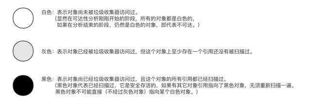
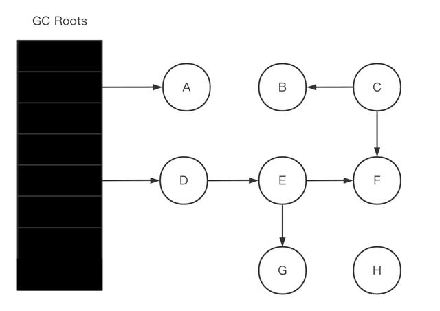
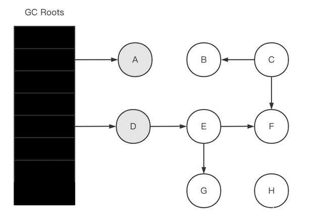
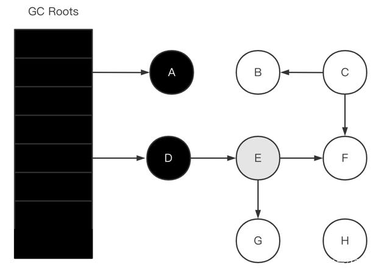
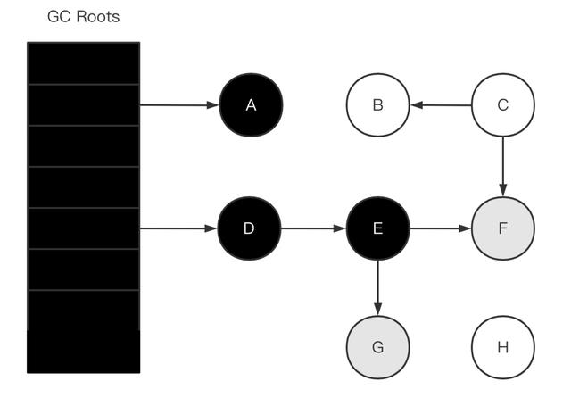
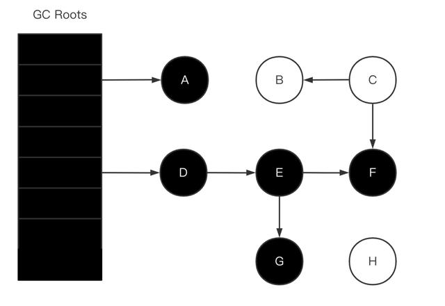
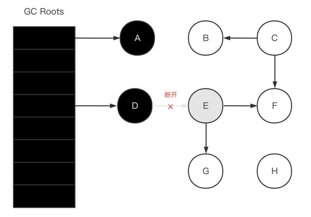
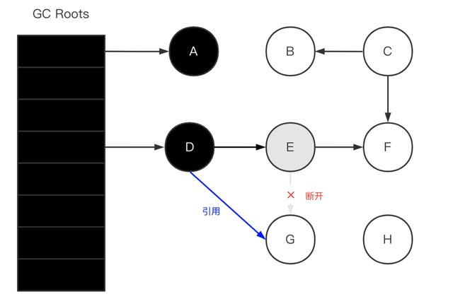

### 一、前言


不得不说阿里的面试还是挺有质量的，这个问题直接问到了 JVM 的底层算法实现。在说 JVM 的三色标记算法之前，我们先来说下 JVM 对于常见对象存活判定算法与垃圾收集算法。常见对象存活判定算法有引用计数算法和可达性分析算法。 引用计数法会产生循环引用问题，JVM 默认是通过可达性分析算法来判断对象是否存活的。而那些垃圾收集算法：标记-清除、标记-复制、标记-整理算法以及在此基础上的分代收集算法（新生代/老年代），每代采取不同的回收算法，以提高整体的分配和回收效率。


这些垃圾收集算法首先做的都是通过可达性分析算法来判定对象是否存活，首先肯定是先进行标记，这个也是理所当然的，你不先标记找到垃圾，怎么进行垃圾回收？可达性分析算法是通过一系列的 “GC roots” 对象作为根节点搜索，如果在 “GC roots” 和一个对象之间没有可达路径，则称该对象是不可达的。


迄今为止，所有垃圾收集器在根节点枚举这一步骤时都是必须暂停用户线程的，因此毫无疑问会面临 ”Stop The World“ 的困扰。啊？啥是 ”Stop The World“，也就是我们平时说的 STW，其实就是根节点枚举过程中必须在一个能保障一致性的快照中进行，说白了就相当于持久化的快照一样，在某个时间点这个过程像被冻结了。如果根节点枚举过程中整个根节点集合对象引用关系还在变化，那垃圾回收分析的结果也不会准确，所以这就导致垃圾收集过程中必须停顿所有用户线程。


想要解决或者降低用户线程的停顿，三色标记算法就登场了。为了让大家了解为啥要有三色标记算法的存在，老周在前言这里铺了很多，希望对你看下面的内容会有所帮助，那接下来我们就进入我们的正题了。


### 二、 三色标记算法


**2.1 基本算法**


事先约定：





根据可达性分析算法，从 GC Roots 开始进行遍历访问。


- 初始状态，所有的对象都是白色的，只有 GC Roots 是黑色的。





- 初始标记阶段，GC Roots 标记直接关联对象置为灰色。





- 并发标记阶段，扫描整个引用链。

- - 没有子节点的话，将本节点变为黑色。
  - 有子节点的话，则当前节点变为黑色，子节点变为灰色。





- 重复并发标记阶段，直至灰色对象没有其它子节点引用时结束。







- 扫描完成

  此时黑色对象就是存活的对象，白色对象就是已消亡可回收的对象。

  即（A、D、E、F、G）可达也就是存活对象，（B、C、H）不可达可回收的对象。


**2.2 三色标记算法缺陷**


不知道你是否还记得我们前言说的，所有垃圾收集器在根节点枚举这一步骤时都是必须暂停用户线程的，产生STW，这对实时性要求高的系统来说，这种需要长时间挂起用户线程是不可接受的。想要解决或者降低用户线程的停顿的问题，我们才引入了三色标记算法。


三色标记算法也存在缺陷，在并发标记阶段的时候，因为用户线程与 GC 线程同时运行，有可能会产生多标或者漏标。


**2.3 多标**


假设已经遍历到 E（变为灰色了），此时应用执行了 objD.fieldE = null (D > E 的引用断开)





D > E 的引用断开之后，E、F、G 三个对象不可达，应该要被回收的。然而因为 E 已经变为灰色了，其仍会被当作存活对象继续遍历下去。最终的结果是：这部分对象仍会被标记为存活，即本轮 GC 不会回收这部分内存。


这部分本应该回收但是没有回收到的内存，被称之为`浮动垃圾`。浮动垃圾并不会影响应用程序的正确性，只是需要等到下一轮垃圾回收中才被清除。


另外，针对并发标记开始后的新对象，通常的做法是直接全部当成黑色，本轮不会进行清除。这部分对象期间可能会变为垃圾，这也算是浮动垃圾的一部分。


**2.4 漏标**


假设 GC 线程已经遍历到 E（变为灰色了），此时应用线程先执行了：


```
var G = objE.fieldG; objE.fieldG = null; // 灰色E 断开引用 白色G objD.fieldG = G; // 黑色D 引用 白色G
```





此时切回到 GC 线程，因为 E 已经没有对 G 的引用了，所以不会将 G 置为灰色；尽管因为 D 重新引用了 G，但因为 D 已经是黑色了，不会再重新做遍历处理。


最终导致的结果是：G 会一直是白色，最后被当作垃圾进行清除。这直接影响到了应用程序的正确性，是不可接受的。


不难分析，漏标只有同时满足以下两个条件时才会发生：


- 一个或者多个黑色对象重新引用了白色对象；即黑色对象成员变量增加了新的引用。
- 灰色对象断开了白色对象的引用（直接或间接的引用）；即灰色对象原来成员变量的引用发生了变化。


如下代码：


```
var G = objE.fieldG; // 1.读objE.fieldG = null; // 2.写objD.fieldG = G; // 3.写
```


我们只需在上面三个步骤中任意一个中，将对象 G 记录起来，然后作为灰色对象再进行遍历即可。比如放到一个特定的集合，等初始的 GC Roots 遍历完（并发标记），该集合的对象遍历即可（重新标记）。


重新标记是需要 STW 的，因为应用程序一直在跑的话，该集合可能会一直增加新的对象，导致永远都跑不完。当然，并发标记期间也可以将该集合中的大部分先跑了，从而缩短重新标记 STW 的时间，这个是优化问题了。看到了没？三色标记算法也并不能完全解决 STW 的问题，只能尽可能缩短 STW 的时间，尽可能达到停顿时间最少。


### 三、读屏障与写屏障


针对于漏标问题，JVM 团队采用了读屏障与写屏障的方案。


读屏障是拦截第一步；而写屏障用于拦截第二和第三步。


它们拦截的目的很简单：就是在读写前后，将对象 G 给记录下来。


**3.1 读屏障**


```
oop oop_field_load(oop* field) { pre_load_barrier(field); // 读屏障-读取前操作 return *field;}
```


读屏障是直接针对第一步：`var G = objE.fieldG;`，当读取成员变量之前，先记录下来。


```
void pre_load_barrier(oop* field, oop old_value) { if ($gc_phase == GC_CONCURRENT_MARK && !isMarkd(field)) { oopold_value = *field; remark_set.add(old_value); // 记录读取到的对象 }}
```


这种做法是保守的，但也是安全的。因为条件一中【一个或者多个黑色对象重新引用了白色对象】，重新引用的前提是：得获取到该白色对象，此时已经读屏障就发挥作用了。


**3.2 写屏障**


我们再来看下第二、三步的写操作，给某个对象的成员变量赋值时，底层代码：


```
/*** @param field 某对象的成员变量，如 E.fieldG* @param new_value 新值，如 null*/void oop_field_store(oop* field, oopnew_value) { *field = new_value; // 赋值操作}
```


所谓的写屏障，其实就是指给某个对象的成员变量赋值操作前后，加入一些处理（类似 Spring AOP 的概念）。


```
void oop_field_store(oop* field, oop new_value) { pre_write_barrier(field); // 写屏障-写前操作 *field = new_value; post_write_barrier(field, value); // 写屏障-写后操作}
```


### 四、增量更新（Incremental Update）与原始快照（Snapshot At The Beginning，SATB）


**4.1 增量更新**


当对象 D 的成员变量的引用发生变化时（`objD.fieldG = G;`），我们可以利用写屏障，将 D 新的成员变量引用对象 G 记录下来：


```
void post_write_barrier(oop* field, oop new_value) { if ($gc_phase == GC_CONCURRENT_MARK && !isMarkd(field)) { remark_set.add(new_value); // 记录新引用的对象 }}
```


这种做法的思路是：不要求保留原始快照，而是针对新增的引用，将其记录下来等待遍历，即`增量更新（Incremental Update）`。


增量更新破坏了漏标的条件一：【 一个或者多个黑色对象重新引用了白色对象】，从而保证了不会漏标。


**4.2 原始快照**


当对象 E 的成员变量的引用发生变化时（`objE.fieldG = null;`），我们可以利用写屏障，将 E 原来成员变量的引用对象 G 记录下来：


```
void pre_write_barrier(oop* field) { oop old_value = *field; // 获取旧值 remark_set.add(old_value); // 记录 原来的引用对象}
```


当原来成员变量的引用发生变化之前，记录下原来的引用对象。


### 五、总结


基于可达性分析的 GC 算法，标记过程几乎都借鉴了三色标记的算法思想，尽管实现的方式不尽相同，比如标记的方式有栈、队列、多色指针等。


对于读写屏障，以 Java HotSpot VM 为例，其并发标记时对漏标的处理方案如下：


- `CMS`：写屏障 + 增量更新
- `G1、Shenandoah`：写屏障 + 原始快照
- `ZGC`：读屏障


上面的的方案为啥是这样的，你有想过为什么吗？


- 原始快照相对增量更新来说效率更高（当然原始快照可能造成更多的浮动垃圾），因为不需要在重新标记阶段再次深度扫描被删除引用对象。
- 而 CMS 对增量引用的根对象会做深度扫描，G1 因为很多对象都位于不同的 region，CMS 就一块老年代区域，重新深度扫描对象的话 G1 的代价会比 CMS 高，所以 G1 选择原始快照不深度扫描对象，只是简单标记，等到下一轮 GC 再深度扫描。
- 而 ZGC 有一个标志性的设计是它采用的染色指针技术，染色指针可以大幅减少在垃圾收集过程中内存屏障的使用数量，设置内存屏障，尤其是写屏障的目的通常是为了记录对象引用的变动情况，如果讲这些信息直接维护在指针中，显然可以省去一些专门的记录操作。而 ZGC 没有使用写屏障，只使用了读屏障，显然对性能大有裨益的。